# 丹尼的晚餐:探索 SQL

> 原文：<https://medium.com/geekculture/dannys-diner-exploring-sql-c853b8ffd3f7?source=collection_archive---------16----------------------->

*这是 Danny ma 为期 8 周的 SQL 挑战的一部分。*

如果，你很好奇，想自己解决。你可以自己解决[这里](https://8weeksqlchallenge.com/case-study-1/)。

这真的很有挑战性，我真的很喜欢解决这些问题。让我们马上开始吧。

## **信息**

丹尼正试图开一家小餐馆，经营他最喜欢的三种食物:寿司、咖喱、拉面(我都流口水了！).餐馆收集了一些非常基本的数据，但不知道如何使用这些数据来帮助他们经营业务。

## 问题陈述

丹尼有兴趣回答顾客的一些基本问题，例如:

*   顾客参观了多少次？
*   他们在餐馆总共花了多少钱？
*   顾客最喜欢的菜单项目是什么？

Danny 希望为他的忠诚客户创造个性化的体验，以便他可以决定是否应该扩大客户忠诚度计划的现有成员。

他还想生成一些基本的数据集，这样他的团队就可以在不使用 SQL 的情况下轻松检查数据。

## 实体关系图(ERD)

它包括 3 个数据集:销售，菜单，会员。

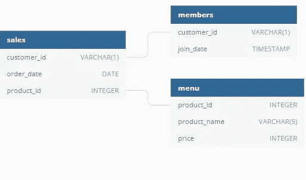

Image from Danny ma [challenge](https://8weeksqlchallenge.com/case-study-1/)

1.  销售数据集:它包含每个客户(customer_id)和他们订购的时间(order_date)以及他们订购的内容(product_id)
2.  菜单:它包含产品详细信息，如名称(产品名称)、单价(价格)和唯一标识(产品标识)
3.  Members:它包含忠诚度计划中的客户(customer_id)的详细信息以及他们加入忠诚度计划的时间(join_date)。

*以上给出的所有细节和后面的问题在这里* *已经详细解释过了* [*。我已经按照我理解方式写了。*](https://8weeksqlchallenge.com/case-study-1/)


Lets Start Slurpping! Image from [alamy](https://www.alamy.com/stock-photo-ramen-and-sushi-kawaii-cartoon-175830809.html)

## 数据集探索

1.  销售数据集

这是这家餐馆的总销售额。

```
SELECT * FROM dannys_diner.sales;
```

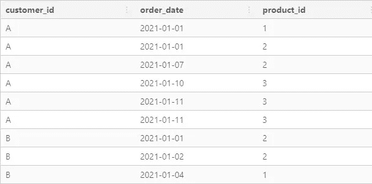

Snnipet of the result

我们可以看到，销售数据集由访问过的客户、他们订购了什么以及他们订购的时间组成。

2.菜单数据集

因为菜单上只有三个项目。该数据集包含商品价格及其详细信息。

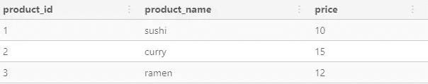

3.成员数据集

我们将看到忠诚计划中的会员/客户。

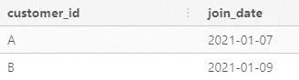

挑战已经包括了需要解决的问题，所以让我们详细看看每个问题。

## 案例研究问题

1.  每位顾客在餐厅消费的总额是多少？
2.  每位顾客光顾餐厅有多少天了？
3.  每位顾客从菜单上购买的第一个项目是什么？
4.  菜单上购买最多的项目是什么？所有顾客购买了多少次？
5.  每位顾客最喜欢的商品是什么？
6.  顾客成为会员后最先购买的物品是什么？
7.  顾客在成为会员之前购买了哪件商品？
8.  每位会员在成为会员前的总物品和消费金额是多少？
9.  如果每消费 1 美元相当于 10 个积分，寿司有 2 倍的积分乘数——每个顾客会有多少个积分？
10.  在客户加入计划后的第一周(包括他们的加入日期),他们在所有项目上都获得了 2x 积分，不仅仅是寿司——客户 A 和 B 在 1 月底获得了多少积分？

让我们帮助丹尼更好地了解他的顾客。这将是令人兴奋的。


Let’s get coding!

*代码是用 Postgre SQL 写的。*

1.  每位顾客的消费总额是多少？

从这个问题中，很明显每个顾客一共花了多少钱。从 ERD 图可以看出，产品的价格在菜单基表中给出，而客户在销售表中。我们需要连接这两个表，以便我们可以按每个客户分组，并给出他们购买商品的总和。

现在，在进入解决方案之前，看到每个问题我都需要一次又一次地加入表格可能会很累。如果我有一个已经连接的表怎么办？然后，我可以从连接的表中聚合所需的数据。

因此，在回答每个问题之前，让我们连接所需的表，以便提取本案例研究的数据输出。

## 连接表(实现)

我们有 3 个基础表，我们将创建 2 个单独的表。为什么？因为观察这些问题，我们可以发现 2 类/一组问题。

1.  一组集中于购买的物品和购买者。这将需要连接销售和菜单表以获得以下各列:

*   客户标识
*   订单日期
*   产品标识
*   产品名称
*   价格

2.类似地，这些问题涉及检查他们的忠诚顾客购买的物品、经常购买的物品等。我们需要连接所有 3 个表。这将导致获得以下列:

*   客户标识
*   订单日期
*   加入日期
*   产品标识
*   产品名称
*   价格

现在，一旦我们决定了要连接哪些表，我就知道决定哪种类型的表连接起着至关重要的作用！为了不重复，我将详细解释如何连接两个表(第一类连接)，同样的过程也用于第二类。

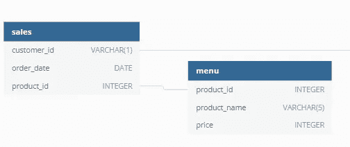

Joining these 2 tables.

在决定使用哪种类型的表连接之前，我们需要回答 3 个重要问题。

1.  连接这两个表的目的是什么？

为了知道每个客户购买了什么产品，我们需要将销售中的 product_id 与菜单中的 product_id 进行匹配。

2.外键在每个表中的分布是怎样的？

*要了解什么是外键和其他键请看这里的*[](https://towardsdatascience.com/the-difference-between-primary-and-foreign-keys-accbfb7815d3)**。**

*我们需要了解外键在每个表中的分布，因为这有助于决定要使用的表连接的类型。*

> *a.sales 表中每个 product_id 是否有多条记录？*

```
*WITH product_base AS(
SELECT 
 product_id,
 COUNT(product_id) AS product_counts
FROM dannys_diner.sales
GROUP BY product_id
)SELECT 
 product_counts,
 COUNT(DISTINCT product_id) AS unique_product_id
FROM product_base
GROUP BY product_counts
ORDER BY product_counts;*
```

*第一个查询是对 sales 表中的每个 product_id 及其订购次数进行分组。然后查看每个 product_id 有多少个 product_counts。*

**

*sales 表中每个 product_id 值有多行。*

> *b.很明显，每个 product_id 都有唯一的一行，如果有任何重复的值(一对一的关系)就没有任何意义了*

*为了验证这一点，我们按照上面菜单表中的相同步骤。*

```
*WITH product_base AS(
SELECT 
 product_id,
 COUNT(product_id) AS product_counts
FROM dannys_diner.menu
GROUP BY product_id
)SELECT 
 product_counts,
 COUNT(DISTINCT product_id) AS unique_product_id
FROM product_base
GROUP BY product_counts
ORDER BY product_counts;*
```

*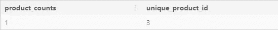*

*我们发现，在菜单表中，有 3 个唯一的 product_id 值具有单行，或者 product_id 存在一对一的关系。*

*3.两个表之间有多少重叠和缺失的唯一外键值？*

*我们需要找出在销售中是否有任何唯一的 product_id 值是菜单表中没有的。我们将使用反连接来检查它。*

```
*SELECT
 COUNT(product_id)
FROM dannys_diner.sales
WHERE NOT EXISTS (SELECT product_id
                  FROM dannys_diner.menu
                  WHERE menu.product_id = sales.product_id);*
```

*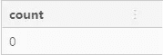*

*没有唯一的值。*

*现在换一种方式，检查菜单中是否有任何唯一的 product_id 值是 sales 表中没有的。*

```
*SELECT
 COUNT(product_id)
FROM dannys_diner.menu
WHERE NOT EXISTS (SELECT product_id
                  FROM dannys_diner.sales
                  WHERE menu.product_id = sales.product_id);*
```

**

*没有唯一值或缺少值。*

*由此可见，我们可以使用 inner 或 left join，但是最好用一个证明来结束。*

***左连接还是内连接？***

```
*DROP TABLE IF EXISTS inner_join_table;
CREATE TEMP TABLE inner_join_table AS (
SELECT
 sales.customer_id,
 sales.order_date,
 sales.product_id,
 menu.product_name,
 menu.price
FROM dannys_diner.sales
JOIN dannys_diner.menu
ON sales.product_id =menu.product_id
);DROP TABLE IF EXISTS left_join_table;
CREATE TEMP TABLE left_join_table AS (
SELECT
 sales.customer_id,
 sales.order_date,
 sales.product_id,
 menu.product_name,
 menu.price
FROM dannys_diner.sales
LEFT JOIN dannys_diner.menu
ON sales.product_id =menu.product_id
);(
SELECT
 'left_join' AS join_type,
 COUNT(*) as row_count,
 COUNT(DISTINCT product_id) AS unique_product_id
FROM left_join_table
)
UNION 
(
SELECT
 'inner_join' AS join_type,
 COUNT(*) as row_count,
 COUNT(DISTINCT product_id) AS unique_product_id
FROM inner_join_table
);*
```

*这里，我们首先创建单独连接的表，然后计算每个表中的行数进行比较。*

*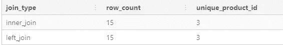*

*因此，我们可以看到，对于这两个表，使用哪种类型的连接都没有关系。*

*总结一下，*

*   *我们首先想了解连接这两个表的目的。*
*   *然后我们了解了外键(product_id)在每个表中的分布。*
*   *然后我们检查这两个表中是否有任何唯一的外键值。*
*   *最后，我们比较了两种连接类型，并决定我们可以使用任何一种连接类型。*

> *这个过程可能很乏味，但我认为，使用大数据会很有用。*

*所以连接这两个表的结果是:*

```
*DROP TABLE IF EXISTS customer_menu_table;
CREATE TEMP TABLE customer_menu_table AS (
SELECT
 sales.customer_id,
 sales.order_date,
 sales.product_id,
 menu.product_name,
 menu.price
FROM dannys_diner.sales
INNER JOIN dannys_diner.menu
ON sales.product_id =menu.product_id
);SELECT * FROM customer_menu_table;*
```

*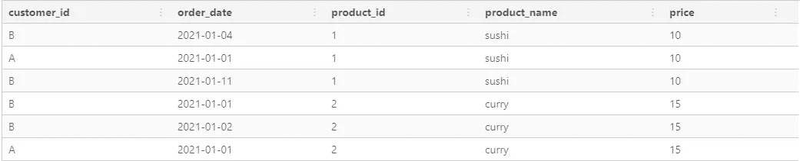*

*类似地，按照上述过程连接所有 3 个表。它可以分为两部分。*

*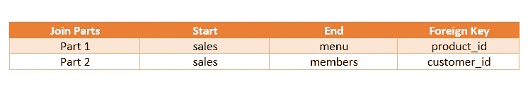*

*上面已经解释了第一部分，第二部分也类似。*

*连接 3 个表，我们得到*

```
*DROP TABLE IF EXISTS member_menu_table;
CREATE TEMP TABLE member_menu_table AS (
SELECT
 sales.customer_id,
 sales.order_date,
 sales.product_id,
 menu.product_name,
 menu.price,
 members.join_date
FROM dannys_diner.sales
INNER JOIN dannys_diner.menu
ON sales.product_id =menu.product_id
LEFT JOIN dannys_diner.members
ON sales.customer_id = members.customer_id
);SELECT * FROM member_menu_table;*
```

*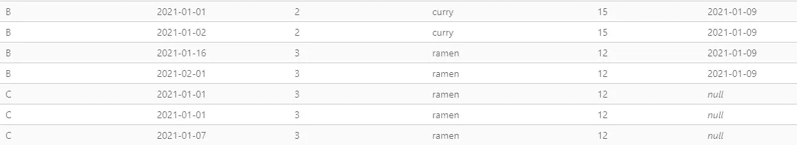*

*现在，回到案例研究问题。有了上面获得的表格，我们就可以开始帮助 danny 了。*

**

*Let’s Start [Serving](https://www.dreamstime.com/stock-photo-cook-sushi-japanese-land-restaurant-image33475180)!*

1.  ***每位顾客的消费总额是多少？***

*从 customer_menu 表中，我们可以按 customer_id 分组，以获得每位客户在餐馆总共消费了多少钱。*

```
*SELECT 
 customer_id,
 SUM(price) AS Total_amount
FROM customer_menu_table
GROUP BY customer_id
ORDER BY customer_id;*
```

*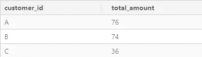*

*甲花了 76，乙花了 74，丙一共花了 36。*

***2。** **每位顾客光顾餐厅多少天了？***

*我们可以通过统计 order_date 来统计他/她点餐的次数来得到。*

```
*SELECT
 customer_id,
 COUNT(DISTINCT order_date) as Visited_total
FROM dannys_diner.sales 
GROUP BY customer_id;*
```

*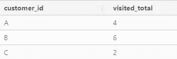*

*a 去过丹尼餐馆 4 次，B 去过 6 次，C 去过 2 次。*

***3。** **每位顾客购买的菜单上的第一个项目是什么？***

*很明显我们必须使用 customer_menu_table。*

*   *首先，我们必须根据 order_date 找到每个客户的第一个商品。*
*   *我们需要根据 order_date 对它们进行排名，然后提取排名为 1 的数据。*

```
*WITH ranking As (
SELECT
 customer_id,
 product_name,
 order_date,
 DENSE_RANK() OVER (PARTITION BY customer_id
                    ORDER BY order_date)
                    AS dense_ranking
FROM customer_menu_table
)SELECT 
 customer_id,
 product_name
FROM ranking
WHERE dense_ranking = 1
GROUP BY customer_id, product_name;*
```

*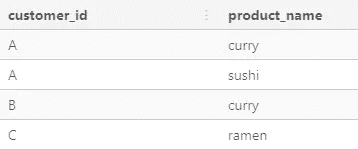*

*a 点了咖喱和寿司，B 点了咖喱，C 点了拉面作为他们的第一道菜。*

***4。** **菜单上购买最多的菜是什么，所有顾客购买了多少次？***

*这有两个问题，即*

*   *所有顾客购买最多的商品*
*   *这一著名项目被所有客户*

*这可以从 customer_menu 表中获得。通过对表中的每个 product_id 进行计数，我们可以找到 product_name 以及它被购买的总次数。*

```
*SELECT
 product_name,
 COUNT(product_id) as total
FROM customer_menu_table
GROUP BY product_id, product_name
ORDER BY total DESC
LIMIT 1;*
```

*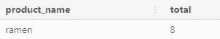*

*看来拉面在丹尼餐馆很受欢迎。(好奇，拉面味道怎么样？)*

***5。每位顾客最喜欢的商品是什么？***

*这可以通过每个窗口函数获得。*

*   *首先统计每位顾客购买每件产品的次数*
*   *然后根据每个客户对他们进行排名*
*   *提取我们想要的。*

```
*WITH ranking AS(
SELECT
 customer_id,
 product_name,
 COUNT(product_id) AS times,
 DENSE_RANK() OVER (PARTITION BY customer_id
                    ORDER BY COUNT(product_id) DESC)
                    AS ranks
FROM customer_menu_table 
GROUP BY customer_id, product_name
)SELECT 
 customer_id,
 times,
 product_name
FROM ranking 
WHERE ranks  = 1;*
```

*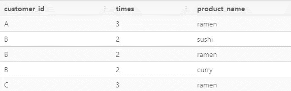*

*A & C 经常点拉面，而 B 经常点菜单上的所有项目。看起来 B 真的很喜欢丹尼餐馆。*

***6。顾客成为会员后最先购买的物品是什么？***

*这种洞察力可以从 member_menu 表中获得。*

*   *首先，我们必须将加入日期与订单日期进行比较，并提取忠诚计划每个成员加入日期之后的所有日期。*
*   *然后根据订购日期对它们进行排序，并提取每位顾客购买的第一件商品。*

```
*WITH ranking AS (
SELECT
 customer_id,
 order_date,
 join_date,
 product_name,
 DENSE_RANK() OVER(PARTITION BY customer_id
                   ORDER BY order_date) AS ranks
FROM member_menu_table
WHERE order_date >= join_date
)SELECT 
 customer_id,
 product_name
FROM ranking
WHERE ranks = 1;*
```

*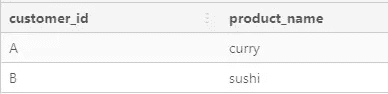*

*在成为丹尼餐馆的会员之前，a 点了咖喱，B 点了寿司。*

***7。顾客在成为会员之前购买了哪件商品？***

*和上面一样，只有几处改动。*

```
*WITH ranking AS (
SELECT
 customer_id,
 order_date,
 join_date,
 product_name,
 DENSE_RANK() OVER(PARTITION BY customer_id
                   ORDER BY order_date DESC) AS ranks
FROM member_menu_table
WHERE order_date < join_date
)SELECT 
 customer_id,
 product_name
FROM ranking
WHERE ranks = 1;*
```

*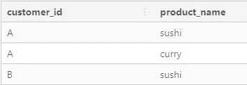*

*a 点了寿司和咖喱，而 B 在成为会员前点了寿司。*

***8。每位会员在成为会员前的总物品和消费金额是多少？***

*从 members_menu_table 中，我们可以对在成为会员之前订购的客户进行分组。*

*   *过滤 order_date < join_date*
*   *Group By customers*
*   *Count unique items*
*   *Total the price.*

```
*SELECT
 customer_id,
 COUNT( DISTINCT product_name) AS total_items,
 SUM(price) AS total_amount
FROM member_menu_table
WHERE order_date < join_date
GROUP BY customer_id;*
```

*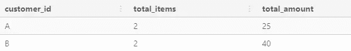*

*A has spent 25 £ on 2 unique items and B has spent 40£ on 2 unique items on the menu from danny’s diner.*

***9 的数据。如果每消费 1 英镑相当于 10 个积分，寿司有一个 2 *积分乘数-每个顾客会有多少个积分？***

*问题很清楚*

*   *对于每个顾客来说，他们花的钱就是他们的积分*
*   *如果他们点了寿司，那么他们的分数会因为寿司的价格而翻倍。*

```
*SELECT 
 customer_id,
 SUM(CASE when product_name = 'sushi' THEN 2*10*price ELSE 10*price END) AS total_points
FROM customer_menu_table
GROUP BY customer_id
ORDER BY customer_id;*
```

*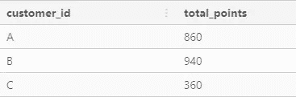*

*客户 A 会有 860 分，B 会有 940 分，C 会有 360 分。*

***10。在客户加入计划后的第一周(包括他们的加入日期),他们在所有项目上都获得了 2x 积分，不仅仅是寿司——客户 A 和 B 在 1 月底获得了多少积分？***

*   *按客户分组和排序*
*   *筛选数据，使其仅包含不晚于 01–02–2021 的日期。*
*   *根据问题中解释的条件选择总和*

```
*SELECT
 customer_id,
 SUM (
  CASE 
   WHEN order_date BETWEEN join_date AND ((join_date + INTERVAL '6 DAYS')::DATE)
   THEN 2*10*price
   WHEN product_name = 'sushi'
   THEN 2*10*price 
   ELSE 10*price
  END
  ) AS total_points
FROM member_menu_table
WHERE order_date < '2021-02-01'
GROUP BY customer_id
ORDER BY customer_id;*
```

*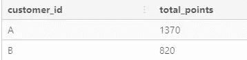*

*截止到一月份的入学考试，a 有 1370 分，B 有 820 分。*

*现在，最后一个问题是生成一些 basuc 数据集，以便团队可以获得洞察力。*

***11。使用可用数据重新创建下表:***

*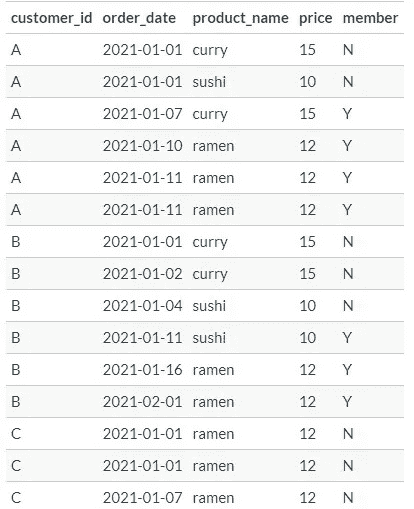*

```
*SELECT 
 customer_id,
 order_date,
 product_name,
 price,
 (CASE WHEN order_date >= join_date THEN 'Y'
  ELSE 'N' END) AS member
FROM member_menu_table
ORDER BY customer_id,order_date;*
```

*   *因此，当我们根据 order_date 在 join_date 之后的时间对数据进行分组时，它们就会成为成员。*

***12。Danny 还需要关于客户产品排名的进一步信息，但是他故意不需要非会员购买的排名，因此他希望当客户还不是忠诚度计划的一部分时记录的排名值为空***

*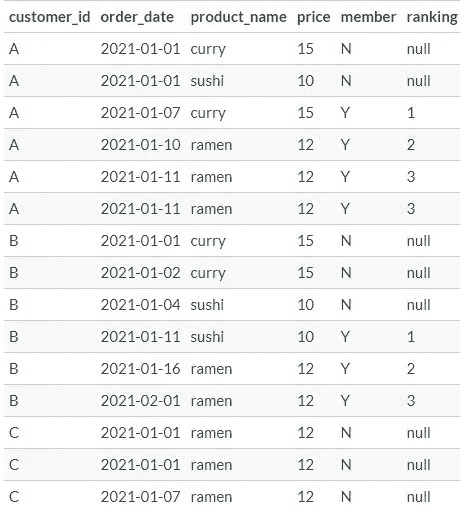*

```
*WITH members_list AS (
SELECT 
 customer_id,
 order_date,
 product_name,
 price,
 CASE WHEN order_date >= join_date THEN 'Y'
  ELSE 'N' END AS member
FROM member_menu_table
ORDER BY customer_id,order_date; 
)SELECT *, 
CASE
 WHEN member = 'Y' THEN DENSE_RANK () OVER(PARTITION BY customer_id, member ORDER BY order_date) 
 ELSE NULL
 END AS ranking
FROM members_list;*
```

*这是前面的延续，danny 想对成员进行排序，所以我们可以根据 order_date 对成员进行排序。*

*对我来说，这真是一个有趣的项目，整个旅途都很愉快。如果你有任何反馈，一定要让我知道，因为这将非常有帮助。*

*每天学习和探索新事物。*