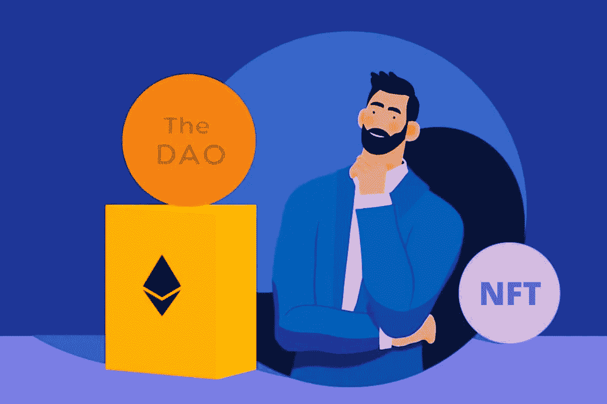
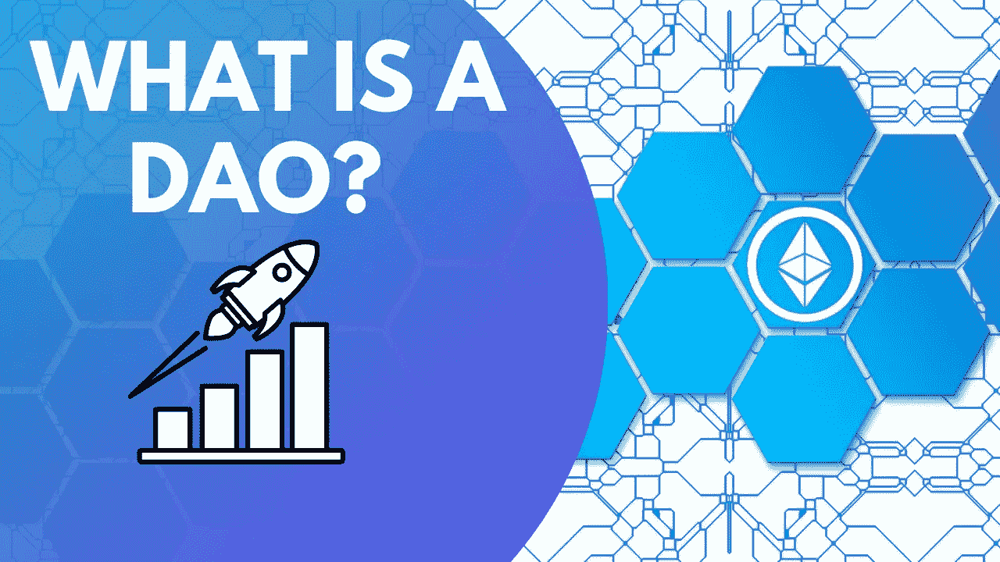
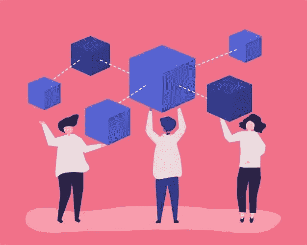

# DAO 支持的 NFT 平台:如何在您的 NFT 市场开发中实现 DAO？

> 原文：<https://medium.com/geekculture/dao-enabled-nft-platform-how-to-implement-dao-in-your-nft-marketplace-development-db9338c17b63?source=collection_archive---------6----------------------->

近日来，NFT 市场的增长为企业家们提供了竞争 NFT 业务的空间。想象一下一个视频或 Gif 被卖了几百万。在这个利润丰厚的市场投资难道不值得吗？根据一份统计报告，NFT 市场预计到 2022 年将达到 800 亿美元。随着收入的增加，NFT 市场正在飞速发展。同时发生的情况为像你这样的初露头角的企业家提供了进入 NFT 领域的机会。NFT 空间见证了几项进步，使他们在市场上走得更远。

当你开发你的 NFT 平台时，确保你采用不同的东西，让用户和创建者感兴趣。在你的 [**NFT 市场开发**](https://www.appdupe.com/nft-marketplace-development) 中处理治理和社区处理怎么样？这篇博客将通过解释开发一个有竞争力的 NFT 平台来带你走下去。

# 道的概念-解释得好！

当我们谈论数字货币时，它们是分散的，这意味着它们没有任何权威机构来管理交易。数字货币的流动不受任何机构的控制，比如政府和央行。它们分布在不同的计算机、网络和节点上。数字货币利用去中心化来确保个人的隐私和安全。这启发了开发人员提出为一组社区创建一个分散网络的概念。

DAO 或分散自治组织是一个为开发人员提供自动化决策和促进加密货币交易的组织。该组织的发展是为了实现自动化和分散化。它是一种风险资本，作用于开源代码，可以在没有任何典型的管理结构或董事会的情况下运行。在 DAO 中，社区将参与集体决策，为组织的未来投票。有几个 NFT 项目与道类似，一群代币持有者聚集在一个社区中分享奖励。

# 为什么如此强调将 DAO 与 NFT 平台相结合？

人们只是质疑区块链科技对道的炒作吗？这是在区块链掀起一场革命，还是仅仅是炒作？在开始开发 NFT 市场之前，必须解决这些问题。

DAOs 将成为应对加密货币挑战的新兴解决方案。在传统的组织结构中，决策是通过层级方法做出的，并且决策将只关注集团中的一部分人。但是在分散的设置中，决策不是局部的，而决策在方法上是中性的。在 DAO 中，社区将有一个透明的投票系统，在那里他们可以在一大群观众中分享他们的观点和价值观。通过道，每一个参与者都有机会表达自己的心声。

Dao 是区块链技术领域发生的下一件大事。协调和民主是通过这个道达到的两个重要方面。

## 和刀之间有什么故事？

NFT 是数字资产，而 Dao 是管理资源的方式。现在你可能想知道将道与你的 NFT 市场发展联系起来的案例是什么。这两者都允许对资产的所有权。众所周知，创作者可以使用区块链网络将他们的资产令牌化为 NFT。通过这一点，创作者将获得资产的可验证性和安全性。然而，买方将获得所有权。Dao 将帮助管理非功能性测试。

当道和走到一起时，它在市场上创造了一种新形式的分散渠道和投资来源。NFT 平台开发中的 DAO 通过分布式决策系统确保透明度。它将自动管理 NFT 市场，用户将参与决定市场的未来。道在消除决策机关的障碍方面发挥了重要作用。作为回报，他们将获得投票选举董事会和其他重要机构的权力。

# 道的好处使市场平台

一个普通的 NFT 平台和一个启用了 [**DAO 的 NFT 市场平台**](https://www.appdupe.com/nft-marketplace-development) 有很多不同之处。了解推出具有 DAO 功能的 NFT 平台的好处，

## 所有权详细信息

当你启动一个去中心化的 NFT 市场时，DAOs 将使用户能够获得审查关于内容、政策、资产和拍卖的政策的权利。他们拥有智能合约和数字收藏品，带来了自主权，从而消除了 NFT 平台中的领导概念。用户将有机会在 DApp 中下注他们的 NFT 和本地代币来产生奖励。DAOs 将使机构群体能够就重要活动(如拍卖、发布和合同政策修改)提出决策并进行投票。

## 投票权

说到特性，支持 DAO 的 NFT 平台提供了与普通 NFT 平台相同的特性。但是 DAO 驱动的 NFT 平台支持治理模型，而其他正常的 NFT 市场将专注于所有权模型。他们从社区获得的选票将用于改变 NFT 平台的现有规则和政策。

## 收入和奖励

道将使用户能够提出这样的机会，如 NFT 打桩。NFT 赌注将帮助 NFT 持有者赚取他们的收入。此外，这将有助于他们将其非金融交易和 NFT 代币释放到流动性池中，而无需将其非金融交易的所有权转让给他人。该平台还将在用户的整个生命周期中为其提供被动收入。

# 支持 DAO 的 NFT 平台有哪些使用案例？

支持 DAO 的 NFT 平台以类似于其他 NFT 平台的方式运行，它们的用例也很普遍。看看他们关注的领域，

*   NFT 数码收藏品
*   体育 NFT 平台
*   NFT 博彩
*   交易市场
*   不动产
*   资产周期管理

# 包裹

当你开始在 NFT 创业时，让自己适应市场上流行的趋势是很重要的。Dao 是最近的进展，在市场上广受好评。在接触著名的 NFT 市场开发公司**之前，了解关于 DAO 平台的每一个细微差别。**