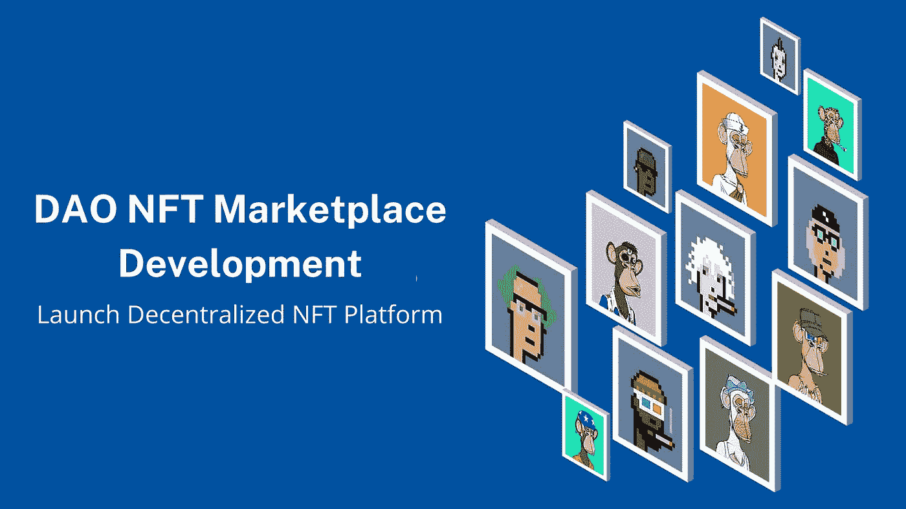

# 道市场开发:推出分散式平台

> 原文：<https://medium.com/geekculture/dao-nft-marketplace-development-launch-decentralized-nft-platform-93bb1d937fe1?source=collection_archive---------6----------------------->

NFT 的空间与日俱增。市场正在见证一个伟大的开端，这将为个人展现创业机会。但是创新起着重要的作用，因为每天，人们都会遇到一些新的和创新的东西。要跟上市场的步伐，你需要采纳能在市场上创造新火花的最佳创意。只有那些具有开创性想法的企业才能在市场上取得成功。在这个利润丰厚的市场中，创新的想法会让你进步。支持 DAO 的 NFT 市场是 NFT 市场发展的下一阶段。

去中心化的自治组织不与中央权威打交道，它在 NFT 市场的踪迹无处不在。这篇博客将指导你为你的 NFT 事业采用 [**【道】市场开发**](https://www.appdupe.com/nft-marketplace-development) 。

# **道是什么？**

DAO 代表分散的自治组织。"一体行动"的核心功能是在没有任何中央机构的情况下运作。顾名思义，在这里，系统保持自治和分散。这个分散的组织将作为一种基于开源代码的风险投资基金。没有董事会，就没有适当的管理机构。你可能想知道为什么采用刀？开发人员开发 DAO 是为了消除人工干预，这是网络系统中主要问题的根源。DAO 将为令牌所有者提供对项目进行投票的权利。

道组织有内置的金库，只有得到其成员方的批准才能动用。最终决策是在特定时间段内根据提案和团体投票做出的。这个组织的运作没有层级管理，他们的运作背后有巨大的目的。投资者将通过自由职业者网络为项目投资，它的主要属性是使投资者能够匿名投资。他们的数据和记录保存在区块链网络中。此外，代币所有者将获得对即将到来的项目的投票权。

## **分散自治组织——你需要知道的主要类别！**

谈到 DAO，您需要理解为独特的规范而设计的各种类别。对 DAO 标记的不同标准有深刻的理解，

**操作系统—** 这是一个独立的平台，可以帮助企业创建和发布自己的 Dao。

**协议 DAOs** —这遵循一种投票机制来实现与协议变更相关的决策。

**服务 DAOs-** 它规范个人和企业的人才搜寻和获取操作。

**投资道** —这是为各种 DeFi 项目的资金汇集和投资运营提供支持。

**媒体导报**——这些分散的新闻聚合者为消费者的利益而工作。

**Social DAOs** —这支持社交网络和参与的分散平台。

## **道的意义**

DAO 遵循一种模式，在这种模式中，决策是由自下而上的成员集体做出的，成员集体拥有组织。参与道的最佳方式是通过拥有代币。它们在智能合约的支持下运行，智能合约是一组条件满足时自动执行的预定代码。DAO 的规则是在智能合约中建立的，拥有股份的 DAO 将获得投票权。这将通过决定创建新的治理提案来极大地影响组织的运营。

当 Dao 出现时，没有人敢改变现有的业务协议。Dao 使投资者了解他们的操作变得透明和动态。它们建立在开源的区块链上，因此任何人都可以查看业务代码。然而，金融交易记录在区块链网络中。

## **道给平台带来了什么？**

Dao 通过分布式决策机构支持透明性。这将实现 NFT 平台治理的自动化。在这里，用户将参与平台的决策活动。他们可以分享自己的观点，并为《NFT 纲要》的未来决策投票。在大多数情况下，决策与最高管理层密切相关，这将给组织带来各种挑战。

道没有说服投资者听从 CEO 和经理的话，而是把球踢向了投资者的球场。他们仍将是该平台未来的决策权威。 [**分散式 NFT 平台开发**](https://www.appdupe.com/nft-marketplace-development) 旨在为用户提供空间，使其成为管理机构的一员，参与未来决策。

## **基于 DAO 的 NFT 平台的优势**

道市场为个人提供各种优惠。下面列出了一些主要的好处，

**NFT 产量农业**

拥有 NFT 平台的 NFTs 和代币的用户可以参与产量农业。他们可以抵押他们有价值的数字资产，并将这些资产直接注入平台的流动性池。通过这个，他们也可以赢得令人兴奋的奖励。

**所有权利益**

DAO 是一种支持所有权契约的机制。用户可以查看关于内容、拍卖和资产的审核的策略。他们还将有机会在 Dapp 中下注 NFT 和本地令牌以从中获得奖励。用户将完全控制 NFT，即使是在将它们投入市场并提供给流动性池之后。社区将拥有投票权，并在制定 NFT 项目的政策时提出建议。

**投票权**

与通常的 NFT 平台相比，DAO 平台将具有类似的操作，但在管理模式上几乎没有变化。在这些道 NFT 市场中，所有权政策和治理会有所不同。用户可以投票并提交他们的建议。用户的投票将反映在平台制定的政策中。这将使用户意识到他们的声音在平台上被识别。决策保持透明，因此任何人都可以滚动浏览该平台来见证金融交易。

**收入奖励**

基于 NFT 的游戏平台正从人们那里获得巨大的赞誉，因为它们提升了个人的冒险和回报。道将在很大程度上帮助 NFT 平台的用户获得像 NFT 赌城这样的机会，因为它为用户提供了许多创收的途径。这将帮助他们解锁平台上的各种奖励和 NFT。

## **一刀 NFT 平台的尖端特性**

*   NFT 的互操作性将允许 NFT 在各种虚拟环境和市场中进行交易。然而，它将允许 NFT 代币所有者保留交易 NFT 的利益。
*   NFT 是不可分割的，这意味着如果有人想购买 NFT，他们只能作为一个单一的 NFT 代币购买。它不能被划分为不同的细分市场，用户只有一个选择，即作为单一产品购买。
*   智能联系人将帮助创建者创建稀缺的 NFT。NFT 的稀缺是一个真正的成功，因为它将在人们中间炒作市场对 NFT 的需求。NFT 的稀缺性将提高数字收藏品在市场上的知名度。

## **包装**

NFT 市场每天都在扩大。为了适应现有的竞争，你需要跟上最近的趋势。“道”是近年来赢得企业家心的分权体制。携手 [**最好的 NFT 市场开发公司**](https://www.appdupe.com/nft-marketplace-development) ，你可以推出 DAO 使能的 NFT 平台。