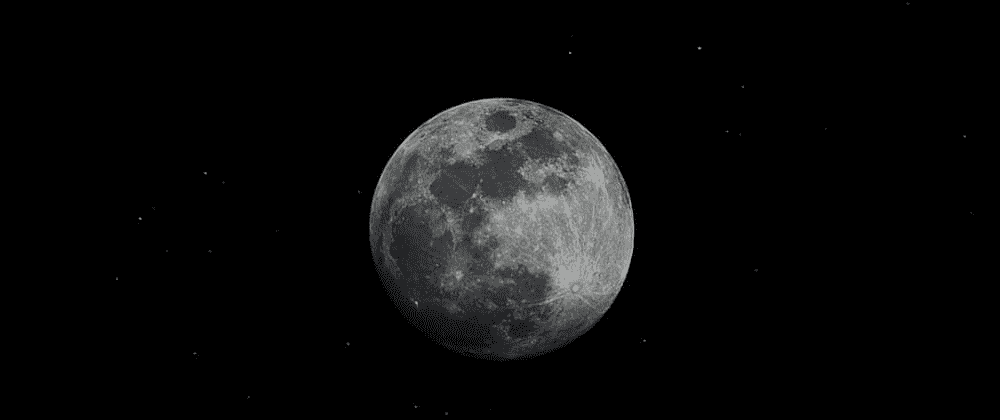
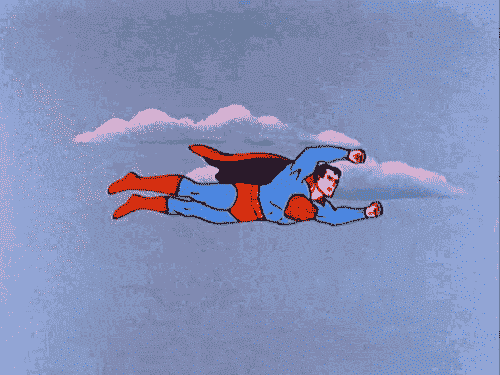
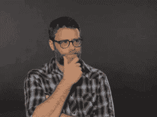
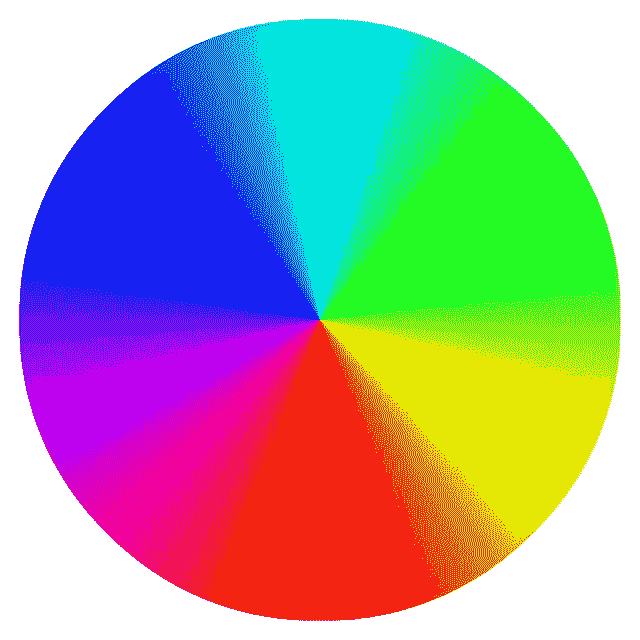

# 具有 1 行(或更少行)CSS 的黑暗模式🌓

> 原文：<https://medium.com/geekculture/dark-mode-with-1-or-few-line-of-css-664207bff223?source=collection_archive---------28----------------------->



本周我想在我的博客中加入黑暗模式(目前正在开发中)。所以我一直在寻找一个简单的解决方法。

我将介绍我自己的想法。但是后来我发现了同样的两篇文章。但是他们的解决方案有些不完整。

**是 CSS 过滤器**

[跳转到最终示例](https://dev.to/ksengine/dark-mode-with-1-line-of-css--4nkl#final-example)
[跳转到最终演示](https://dev.to/ksengine/dark-mode-with-1-line-of-css--4nkl#final-demo)

黑暗模式有太多的名字，

*   亮对暗
*   黑色模式
*   黑暗模式
*   黑暗主题
*   夜间模式

黑暗模式是 2018-2019 年的趋势。

有一个愚蠢的方法可以做到这一点。

```
.dark {
  background-color: black; /* from white to black */
  color: white; /* from black to white */
}
```

然后写你的 HTML。

```
...
<body class="dark">
  <h1>Hello World!</h1>
   ...
</body>
...
```

举例来说，这很好。在真实的网站中，有太多的样式项目，如按钮、提醒、模型等。当你把它们都设计成黑暗模式时，

```
body {
  background-color: ...;
  color: ...;
}
.btn {
  background-color: ...;
  color: ...;
}
.btn.primary {
  background-color: ...;
  color: ...;
}
...
...
.dark {
  background-color: ...;
  color: ...;
}
.dark .btn {
  background-color: ...;
  color: ...;
}
.dark .btn.primary {
  background-color: ...;
  color: ...;
}
...
...
```

然后你把你的 CSS 样式表翻倍。

减小样式表大小的解决方案是什么？？？
CSS 的超人来了。 **CSS 变量(CSS 自定义属性)！！！**



将主题颜色定义为 CSS 变量。

```
:root {
  --text-color: black; 
  --bg-color: white;
}
.dark {
  --text-color: white; 
  --bg-color: black;
}
```

然后使用变量来设置颜色

```
body, .dark {
  background-color: var(--bg-color);
  color: var(--text-color);
}.btn {
  background-color: var(--bg-color);
  color: var(--text-color);
}
.btn.primary {
  background-color: var(--bg-color);
  color: var(--text-color);
}
...
...
```

这工作得很好。

但我是开发者(作为爱好)。不是设计师。浅色主题和深色主题应该用哪些颜色？。

然后我找到了 [*Darkmode.js*](https://darkmodejs.learn.uno/) 。它使用 CSS `mix-blend-mode: difference;`来启用整个网页的黑暗模式。这很复杂，有一些问题。除了使用 JavaScript，任何人都可以在 CSS 中使用`mix-blend-mode`来启用黑暗主题。下面的例子解释了`mix-blend-mode: difference;`是如何工作的。

```
light-theme-color = rgb(x, y, z)
dark-theme-color = rgb(255-x, 255-y, 255-z)
```

它将链接的颜色从蓝色转换为奇怪的黄色。

```
light-theme-color = rgb(0, 0, 238) = blue
dark-theme-color = rgb(255-0, 255-0, 255-238) = rgb(255, 255, 17) = yellow
```

几天后，我有了一个想法… **CSS 过滤器**



使用反转滤镜启用黑暗模式。

```
.dark {
  filter: invert(100%);
}
```

然后将`.dark`类添加到`html`标签中。那是最完美的地方。

```
<html class="dark">
   ...
</html>
```

这个方法没有文字颜色和背景颜色就不行。并在`html`和`body`标签上设置`height`到`100%`为无内容页面中的整页暗主题。

```
html,
body {
  color: #222;
  background-color: #fff;
  height: 100%;
}
```

`invert(100%)`与`mix-blend-mode`相同。但是更简单。

```
light-theme-color = rgb(x, y, z)
dark-theme-color = rgb(255-x, 255-y, 255-z)
```

但是这种方法也有同样的问题。在黑暗模式下，链接是黄色的。为了解决这个问题，我们应该这样做

```
.dark {
  filter: invert(100%) hue-rotate(180deg);
}
```

`hue-rotate(180deg)`将色调盘上的颜色更改为色调盘上的相反颜色。这是色轮。



下面的例子解释了`filter: invert(100%) hue-rotate(180deg);`如何用于链接颜色。

```
light-theme-color = rgb(0, 0, 238) = blue
inverted-color = rgb(255-0, 255-0, 255-238) = rgb(255, 255, 17) = yellow = hsl(60, 100%, 53%)
hue-rotated-color = hsl(270, 100%, 53%) = light-blue
```

此滤镜也适用于图像。所以图像看起来很丑。要删除图像上的滤镜，请再次使用该滤镜。因此，同一个过滤器应用于图像两次。`inverse(100%) X inverse(100%) = inverse(0)`和`hue-rotate(180deg) X hue-rotate(180deg) = hue-rotate(0)`。

```
.dark,
.dark img {
  filter: invert(100%) hue-rotate(180deg);
}
```

对其他媒体元素做同样的事情。

```
.dark,
.dark img,
.dark picture,
.dark video,
.dark canvas {
  filter: invert(100%) hue-rotate(180deg);
}
```

创建一个名为`nofilter`的类，当你需要将黑色主题应用到媒体元素时使用。

```
.nofilter {
  filter: none !important;
}
```

然后在 HTML 中使用`nofilter`

```

```

带点`transition`看起来很流畅。

```
html,
img,
picture,
video,
canvas {
  transition: filter 0.3s ease-in-out;
}
```

我如何知道用户的偏好？？？。有一个 CSS 媒体查询可以做到这一点。

```
@media (prefers-color-scheme: dark) {
  html,
  img,
  picture,
  video,
  canvas {
    filter: invert(100%) hue-rotate(180deg);
  }
}
```

我想创建一个黑暗模式切换按钮，并存储用户偏好。+或自动检测用户偏好。`localstorage`非常适合商店偏好。并使用`window.matchMedia`检查 CSS 媒体查询是否与当前状态匹配。

```
if (
  localStorage.theme === "dark" ||
  (!("theme" in localStorage) &&
    window.matchMedia("(prefers-color-scheme: dark)").matches)
) {
  document.documentElement.classList.add("dark");
} else {
  document.documentElement.classList.remove("dark");
}
```

这是我的切换按钮，带有一个 SVG

```
<button onclick="toggleDark()">
  <svg aria-hidden="true" data-prefix="fas" data-icon="moon"  viewBox="0 0 512 512" style="height: 2rem; width: 2rem;" class="svg-inline--fa fa-moon">
    <path fill="currentColor" d="M32 256C32 132.2 132.3 32 255.8 32c11.36 0 29.7 1.668 40.9 3.746 9.616 1.777 11.75 14.63 3.279 19.44C245 86.5 211.2 144.6 211.2 207.8c0 109.7 99.71 193 208.3 172.3 9.561-1.805 16.28 9.324 10.11 16.95C387.9 448.6 324.8 480 255.8 480 132.1 480 32 379.6 32 256z"></path>
  </svg>
</button>
```

按钮是圆形和透明的。

```
button {
  background: transparent;
  border: transparent;
  border-radius: 50%;
  cursor: pointer;
}
```

有一个 JavaScript 函数来切换黑暗模式。

```
let toggleDark = () => {
  let result = document.documentElement.classList.toggle("dark");
  localStorage.theme = result ? "dark" : "light";
};
```

# 最后一个例子

然后，我将引入上述代码的最小子集作为棘手的一个内衬。这个代码对于很多网站来说已经足够了。

```
.dark, .dark img { filter: invert(100%) hue-rotate(180deg); }
```

# 最终演示

我想知道你的想法。也许我可以创建一个黑暗模式库。

享受这些文章。
关注我获取更多文章。谢谢💖💖💖