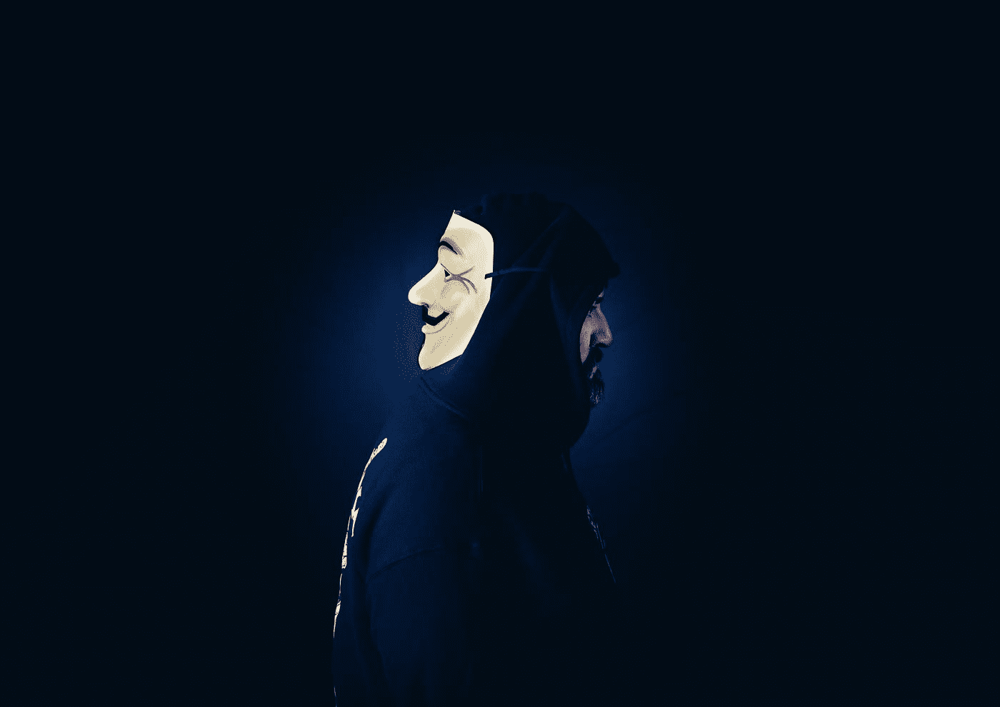

# 暗网-越过虚拟线

> 原文：<https://medium.com/geekculture/darknet-crossing-the-virtual-line-82fdaeaecf33?source=collection_archive---------11----------------------->

“暗网”这个词只是听起来有点不祥，因为它是不祥的。由 [anshul vyas](https://www.instagram.com/_ansh_vyas/) 撰写

Photo by [benjamin lehman](https://unsplash.com/@benjaminlehman?utm_source=medium&utm_medium=referral) on [Unsplash](https://unsplash.com?utm_source=medium&utm_medium=referral)

在万维网上交流变得很容易，臭名昭著的用户访问暗网与他们的人交流。暗网的使用既有好处也有坏处。众所周知，互联网是非常多层次的，存在的不仅仅是我们在互联网上看到的。

# 什么是暗网？

通俗地说“暗网”是一种加密网络，是万维网的一部分，需要特殊的软件才能访问，这种特殊的软件可能是唯一的、安全的浏览器，如 Tor 路由和交换服务使它成为可能。这些网络服务被有效地“隐藏”在那些安全的路由器后面，不能被搜索引擎索引，只有当网站的完整地址被使用
时才能被访问。

# 黑暗网络上发现的东西

## 非法销售

非法获得的账户，如银行账户、被黑的网飞和其他账户在黑暗网络上很常见。这些账户是销售完成的账户。可以获得登录凭证和其他信息。

## 非法物质

那里有许多非法物质，包括毒品、化学品和许多其他东西。

## 武器和其他物品

那里有很多东西出售，包括危险的武器和枪支。

## 危险服务

黑暗网络是一些极其危险的服务的发源地，包括雇佣谋杀、人口贩卖和儿童色情。

# 赞成-暗网的军事用途

尽管列出了暗网的各种误用，但不可否认的是，暗网可以在需要的时候派上用场。除了保护他们的部队，军事人员可以通过使用暗网随时跟踪他们的部队在哪里。他们周围发生的事情很容易被发现。军人也可以通过隐藏的聊天室进行交流，在计划有变的情况下与同龄人交流。因此，这将起到保护屏障的作用，并增强安全性。

# 黑暗网络的危险

黑暗网络不应该被轻易访问，它伴随着许多危险，包括人和隐藏的病毒，可以完全摧毁你的数据和隐私。危险可能如下:

1.  **病毒:**你千万不要从这些网站下载软件，因为它们会让你的电脑感染各种危险的病毒。从那里下载内容确实有风险。所以，只有当你知道你在做什么和它来自哪里的时候，才下载软件。
2.  黑客:黑暗网络充斥着许多黑客，他们愿意为你进行非法活动，但不要相信他们，因为他们总是会欺骗和攻击你。
3.  **网络摄像头劫持:**远程管理工具，也称为“rat”，经常被暗网网站使用。

# 结论

黑暗网络无法区分访问它的人是罪犯还是普通用户。这个问题需要由执法机构来解决，以便揭露罪犯，但普通用户的匿名身份保持不变。这不能通过在非法用户后面运行来实现，而是通过识别非法网站来实现。但是关闭这样的网站也不是一个选择。一个网站关闭可能会导致另一个网站的崛起，为此政府黑客需要想出一个办法来阻止非法活动。此外，如果对在暗网上从事非法交易的人征收重税，其他用户会害怕这样做，害怕被抓。

# 常见问题(常见问题)

1.  **暗网合法吗？**
    暗网是完全合法使用的。如果使用得当，暗网可以在很多方面发挥作用。用户匿名是黑暗网络的一个优势。
2.  **一个人能在黑暗网络上被追踪吗？不，如果你使用暗网，你就不会被追踪到。它适用于分层加密系统。**