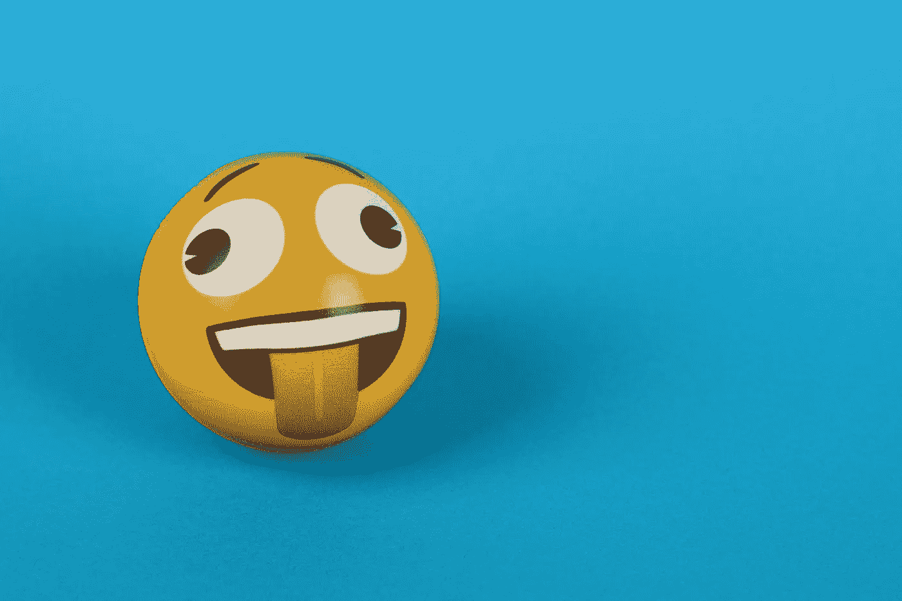

# 达尔莫克和贾拉德，烧字典

> 原文：<https://medium.com/geekculture/darmok-and-jalad-burning-a-dictionary-87b576c14ce2?source=collection_archive---------23----------------------->

沙加表情符号消失后，斯图亚特考虑了语言的未来。

Photo by [Ann H](https://www.pexels.com/@ann-h-45017?utm_content=attributionCopyText&utm_medium=referral&utm_source=pexels) from [Pexels](https://www.pexels.com/photo/a-yellow-ball-emoji-over-a-blue-surface-7313450/?utm_content=attributionCopyText&utm_medium=referral&utm_source=pexels)

表情符号、模因和语言的未来一言以蔽之——相当多的重点放在了[坚果](https://idioms.thefreedictionary.com/nut)(名词版本)上。

# 退出表情符号

我强烈反对世界上美丽的语言被无止境的、微小的、常常令人恼火的动画过度污染…