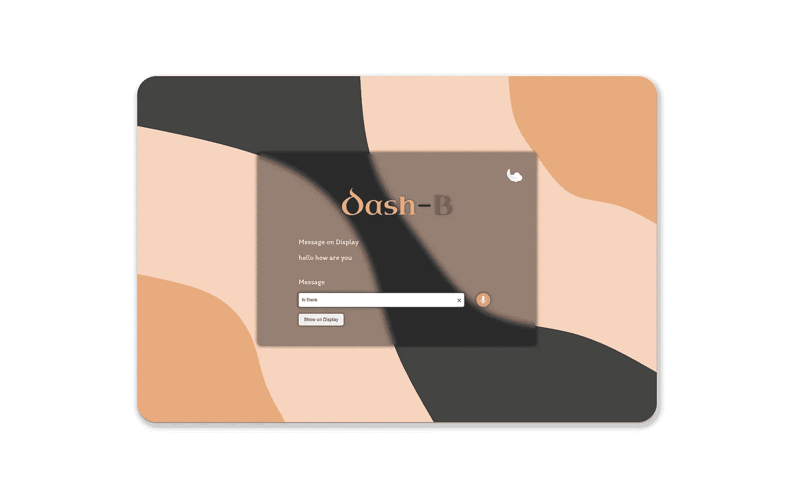
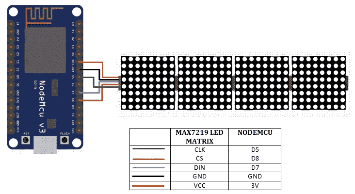
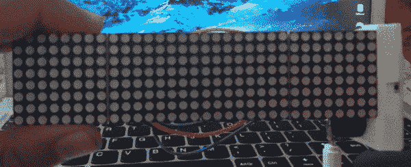
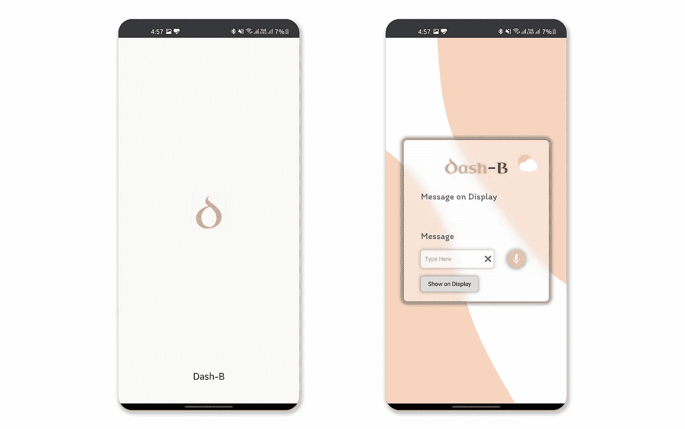
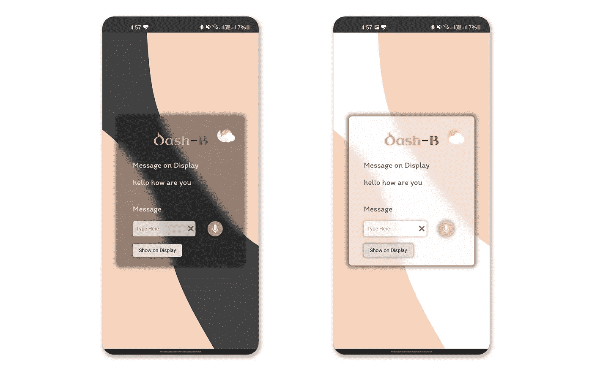
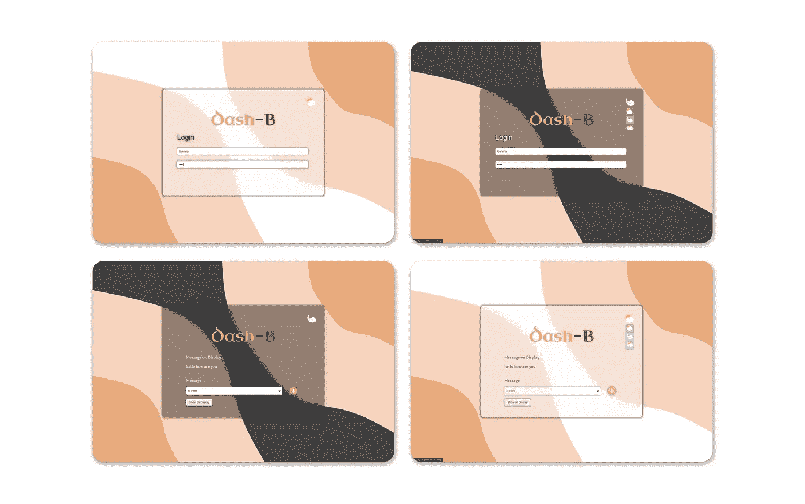

# Dash-B:无线物联网信息显示板，具有渐进式网络应用。

> 原文：<https://medium.com/geekculture/dash-b-wireless-iot-message-display-board-with-progressive-web-application-df94ddeb46c?source=collection_archive---------33----------------------->

嘿，大家好，我带着另一个快速的物联网项目回来了，这个项目是在周末完成的，可以通过应用程序轻松控制..，但由于我不喜欢在你的手机上安装完整的应用程序，老实说，这占用了太多空间，而且大多数情况下并不经常使用，但仍然安装在我们的手机上，所以像往常一样，我选择了制作一个渐进式网络应用程序。

在本文中，我将向您展示我如何创建 PWA 并使用它来控制物联网设备(在本例中，向无线显示器发送消息)。

# 概述:

因此，我们的想法是创建一个渐进式 Web 应用程序(PWA ),专门向显示器发送消息。并实时反映出屏幕上显示的内容。因为它是一个轻量级的应用程序，所以用户界面和 UX 是一个主要的焦点。因此，我将向您介绍我是如何创建外观漂亮、响应迅速、功能齐全的应用程序的，以及您也可以如何实现它。

让我们在更高的层面上讨论一下流程是如何工作的。

*   用户需要在 UI 和无线显示器上完成初始登录部分(如下所述)。
*   然后，用户在输入字段中输入消息，或者对着计算机说话(是的！！我用过语音识别)。
*   一旦用户点击发送按钮，信息就会显示在无线显示屏上。不是直接的，消息首先在数据库上更新，然后由 ESP8266 MCU 获取，然后显示在显示器上。(稍后解释)
*   当前消息也会实时更新。因此，如果你同时在电脑和手机上查看信息，并从其中任何一个进行更改，你将能够实时看到两个地方的更改。

> 最大的好处是应用程序的响应时间很快，因为没有使用任何库，也不涉及任何依赖。

***和往常一样，我们将文章分成两部分:***

1.  硬件及其编码:无线显示。
2.  软件:渐进式网络应用程序和后端脚本。

# 显示器:

该设备是一个 8×8 的 LED 矩阵显示器(4 个模块)，与一个 ESP8266 模块(节点 MCU)相连，该模块“碰巧躺在”我家里(因为它在我以前的项目中使用 [Notter:-跨平台笔记渐进式 Web 应用程序，带有硬件提醒显示](/nerd-for-tech/notter-cross-platform-note-taking-progressive-web-app-with-hardware-reminder-display-b087f3eb9052))。

上图显示了带节点 MCU 的矩阵显示器的接线示意图。

节点 MCU 被编程为使用用户名和密码连续向后端 PHP 脚本发出 HTTP GET 请求，该脚本从数据库中获取数据。

但在此之前，我们需要输入我们的凭证，最初，MCU 将在自身上启动一个本地服务器，并显示其上托管的登录页面的 IP 地址。用户需要使用他们的凭据登录。成功登录后，它将显示“登录身份”，后跟用户名。然后，无线显示器开始显示仪表板上设置的任何消息。显示屏持续滚动显示信息，直到信息从仪表板上被清除或更改(除非电源关闭)。

# 应用程序:

该应用程序是一个 PWA(渐进式 Web 应用程序)，它基本上是一个网站，只要你的浏览器支持(大多数现代浏览器都支持)，它就可以安装在你的任何设备上。它的工作原理是单独安装一个网站的浏览器实例，作为任何本机应用程序，并使用一个服务工作者脚本，该脚本缓存网站经常访问或使用的页面，供离线使用，以及一个清单文件，该文件通常包含有关应用程序的元数据，如主题颜色或图标等。更多信息可以在这里找到[。](https://web.dev/progressive-web-apps/)

所以 Dash-B 基本上是一个美观的仪表板，用户可以在上面输入信息，显示在无线显示屏上。

UI 设计是我一直喜欢的东西，但我从来没有真正把它用在刀刃上。制作这样的应用程序实际上有助于我进入其中并了解更多。因此，我决定在 UI 设计中使用一些最新的趋势，如“**”和“ [**黑暗模式**](https://en.wikipedia.org/wiki/Light-on-dark_color_scheme) ”此外，该应用程序支持*自动主题*这意味着主题颜色将根据您设备的主题而变化，无论是暗还是亮。**

**只需转到您设备的设置并寻找系统范围的黑暗主题模式，它可以在移动设备上的*主题*或*显示*选项下找到，您可能在快速设置或控制中心(iOS)中有它的快捷方式。此外，确保您的浏览器设置中的主题与系统主题相匹配，否则*自动主题*将无法工作，因为浏览器的设置会覆盖系统设置。**

****

**除了“视觉效果”，“T1”，“T2”，“可用性”是另一个在任何应用程序的整体功能中扮演重要角色的东西。因此，为了便于使用，还有一个选项是对应用程序说话，而不是打字。“*语音识别*”是我迷上的功能之一(由于虚拟助手)，因为一旦你掌握了它，就没有回头路了。所以我决定在我的应用程序中也加入类似的功能。幸运的是，我发现 JavaScript 中有一种本地方法可以实现这一点。它叫做"[***speecher recognition API***](https://developer.mozilla.org/en-US/docs/Web/API/SpeechRecognition)***"***，对一个名字来说就是这么多…😅。基本上，当你点击麦克风按钮时，应用程序会发出声音，这完全是用 JavaScript 创建的，并开始通过你的设备的麦克风监听(需要用户的许可才能访问麦克风)，当它听到一些东西时，它会转换成文本并在输入框中返回相同的内容。一旦它停止监听，它会再次播放声音，就像市场上的任何智能扬声器一样。**

> ***对于带键盘的设备，在 Windows 系统上按“Alt”键或“！”Macintosh 系统上的键触发语音识别功能。***

**消息输入最右边的小'✖'按钮删除最后一条消息并清空显示屏。**

**另外，我忘了说，用户在使用应用程序之前必须先登录，一旦登录，应用程序会将会话存储大约两天。因为这不是关于应用程序的关键数据，所以我选择本地存储来存储会话细节，而不是使用 cookie(这显然更好、更安全),但是对于任何关键数据特定的应用程序，应该始终使用良好的加密和 cookie 会话。**

****

# **后端脚本:**

**后端脚本是部署在服务器端的逻辑，用于更新数据库中的数据。它们有三个基本功能:**

1.  ****认证****
2.  ****获取数据****
3.  ****更新数据****

****认证:**每当用户登录到应用程序或显示器(如上所述)时，它对用户名和密码进行简单的认证，并返回凭证是否正确。**

****获取数据:**显示和应用连续触发 API 端点获取数据，如果有更新，更新显示和仪表板。因此，数据是实时更新的。**

**更新数据:这是最重要的功能，因为这会更新数据库中的数据。一旦通过语音命令或键入提交了输入字段，就通过 POST API 请求将消息发送到这个脚本，然后再在数据库上更新。如果你发送一个空消息，它会清除显示类似于'✖'按钮。**

# **就这样…**

**这就是我如何制作“ *Dash-B:无线物联网信息显示板和渐进式网络应用程序。”*希望这给了你足够的想法，并帮助你用 PWA 构建自己的物联网项目。我很想听听你在过去申请或曾经申请过的职位，请在评论中告诉我，或者在 LinkedIn 上联系我。此外，请随时询问任何问题，或者如果您需要关于此物联网项目或任何其他物联网项目的任何帮助。**

**此外，请分享您对该应用程序的看法，以及可以添加或改进的内容。我们随时欢迎您的反馈和/或建设性的批评。请随时在 [LinkedIn](https://www.linkedin.com/in/singhgunpreet82) 上与我联系。**

> **阅读 **LinkedIn** 上的文章**

** [## Dash-B:无线物联网信息显示板，具有渐进式网络应用。

### 大家好，我又带来了另一个快速的物联网项目，这个项目是在周末完成的，可以很容易地由一个…

www.linkedin.com](https://www.linkedin.com/pulse/dash-b-wireless-iot-message-display-board-progressive-gunpreet-singh) 

# 哦，如果你还在这里，谢谢你读这篇文章。😊

> ***结尾***

***作者* :** [***冈普雷特·辛格***](http://www.linkedin.com/in/singhgunpreet82)** 

***原载于【https://www.linkedin.com】**。*****