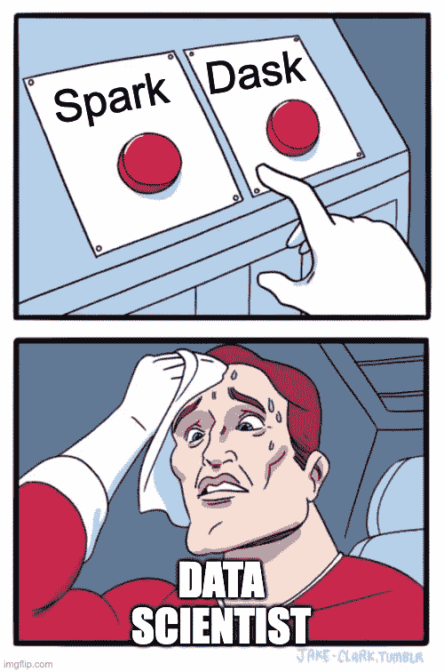
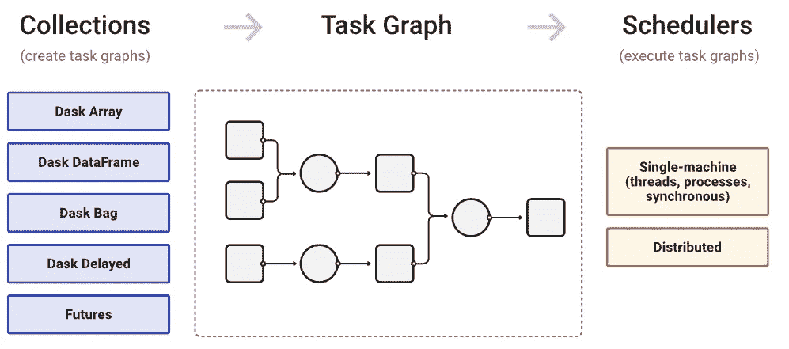
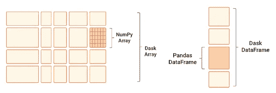
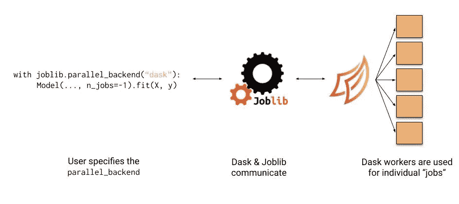
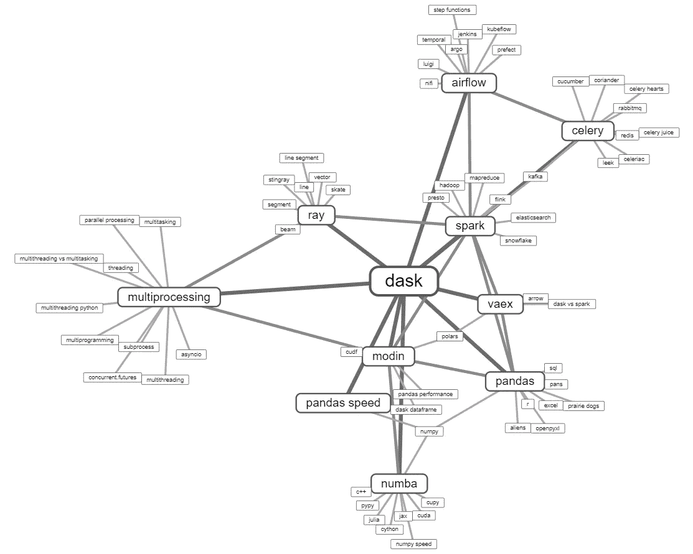

# Dask 还是 Spark？数据科学家的比较

> 原文：<https://medium.com/geekculture/dask-or-spark-a-comparison-for-data-scientists-d4cba8ba9ef7?source=collection_archive---------0----------------------->

## Dask 更适合数据科学项目的 3 个原因(以及何时不适合)

By [imgflip.com](https://imgflip.com/memegenerator)

# 简介:数据科学中的大数据

作为一名数据科学家，您可能会遇到数据不适合内存的项目。在这些情况下，流行的工具如[熊猫](https://pandas.pydata.org/)和 [NumPy](https://numpy.org/) 都无法支持你的操作，甚至优化后的。在使用大数据解决方案(如 [PySpark](https://spark.apache.org/docs/latest/api/python/) )之前，您应该问自己三个问题:

1.  **我为什么会有大数据？我真的需要所有的数据吗？有什么办法可以通过采样或者过滤来减小它的大小？**
2.  **怎么才能再变小？**我真的需要这种级别的聚合吗？我可以通过聚合或使用块来减小它的大小吗？
3.  **我的大数据需求是什么，有哪些工具支持它？**我的瓶颈在哪里？
    ？我是否在大数据方面进行培训或预测？
    我是在大型数据集上训练一个模型，还是在小型数据集上训练多个模型？

如果在回答了前两个问题后，您的数据仍然不适合内存，那么这篇文章的目的是介绍 [Dask](https://dask.org/) 相对于 [Apache Spark](https://spark.apache.org/docs/latest/api/python/) 的优势(和劣势),以满足您的数据科学需求，并建议何时选择哪一种。

# Dask 是什么？

> Dask 是一个纯 Python 大数据解决方案，集成了 Python 数据科学生态系统。

Dask 是一个 Python 模块和大数据工具，可以扩展 pandas 和 NumPy。像 Spark 一样，Dask 支持并行执行，并处理内存不足的数据帧和数组。但是，虽然 Spark 是用 Scala 编写的，并提供了 Python API (PySpark)，但 Dask 是一个纯粹的 Python 解决方案，是 Python 数据科学生态系统的一部分。

Dask 与 Spark 有许多共同的特点。和 Spark 一样，Dask 的执行力也很懒。这意味着当您在控制台中运行一个命令时，实际的操作并没有被执行，而是被附加到一个执行图中。当执行命令被调用时，Dask 将在执行它之前优化图形。你可以用`.compute()`和`.persist()`方法[管理 Dask 的执行图](http://distributed.dask.org/en/stable/manage-computation.html)。

High level collections are used to generate task graphs which can be executed by schedulers on a single machine or a cluster. Image taken with permission from [dask.org](https://docs.dask.org/en/latest/).

另一个相似之处是通过部署集群进行扩展的能力。像 Spark 一样， [Dask 调度器](https://docs.dask.org/en/stable/scheduler-overview.html)可以部署到使用各种技术的机器集群上。在这种情况下，您可以与许多 Dask 工作人员一起工作，他们的资源将由调度程序管理。不像 Spark，没有调度器也可以工作[；你可以去`import dask.dataframe as dd`然后开始工作。](https://docs.dask.org/en/stable/deploying.html)

# 选择 Dask 的 3 个理由

## I:与熊猫和 NumPy 的融合

pandas 和 NumPy 是任何数据科学家的面包和黄油，Dask 就是建立在这些库之上的。这一事实给我们带来了一些积极的结果。首先是通用 API 如果您很好地控制了 pandas 和 NumPy API，那么您已经成功迁移到 Dask 了，因为 Dask 继承了这些模块的大部分 API。

第二是在同一个项目中使用这些库的能力。由于熊猫数据帧是 Dask 数据帧的“构建模块”, Dask 知道如何处理它们。例如，如果我在项目中同时处理大数据帧和小数据帧，我可以使用 Dask 管理大数据帧，使用 pandas 管理小数据帧。我可以毫不费力地将它们连接和合并在一起。

Dask scales NumPy arrays and pandas dataframes. Images taken with permission from [dask.org](https://dask.org/).

然而，重要的是要记住**达斯克不是熊猫**。与 pandas 不同，Dask 对象是不可变的，并且不支持就地操作。这可能非常令人沮丧，例如，您不能使用`.loc`方法分配新值。然而，Dask 提供了`.map_partitions`方法来支持 pandas 在每个分区上的操作。

这些属性使您可以毫不费力地编写既适用于 Dask 又适用于 pandas 数据框架的项目。反过来，这使得开发和调试您的项目变得非常简单:您可以在 pandas 中进行开发，使用简单的调度程序进行调试，使用分布式调度程序进行部署。

## II:与 SciKit-Learn 和 JobLib 的集成

Dask 与 SciKit-Learn 紧密集成，并继承了它的常规 API 这是相对于 Spark 的一个巨大优势，因为`pyspark.ml`使用了我们需要学习的全新的非常规 API。

Dask 提供了一些内部预处理和机器学习算法，从线性模型和朴素贝叶斯到聚类、分解和 XG-Boost。尽管如此，Dask 支持大多数 SKLearn 模型的并行化，作为 JobLib 库的后端。

Image taken with permission from [github.com/dask](https://github.com/dask/dask/issues/4471)

最后，如果您需要在小数据集上训练您的模型并在大数据集上进行预测，Dask 提供了 SciKit-Learn 模型上的`ParallelPostFit`包装器。这个包装器允许任何 SKLearn 模型在其`.predict`方法中支持 Dask 数据帧和数组。

## III:纯 Python 解决方案

Dask 完全是用 Python 实现的，所以它没有前 Python 依赖。这对我们的数据科学家和支持我们运营的工程师都有影响。

对于我们数据科学家来说，这意味着开发和调试变得更加简单。为了在本地运行项目，不需要安装 Scala、Java 和 Spark 等非 pythonic 依赖项。如果您正在使用一个简单的调度程序，那么您不需要处理本地集群，并且项目依赖关系可以通过环境管理器(比如 Anaconda)轻松管理。这使得研究、开发和调试我们的项目变得更加简单。

对于数据工程师来说，这意味着部署项目变得更加简单。如果您的数据是中等大小的，并且您在项目中使用简单的调度程序，那么它可以部署在虚拟环境中，而不是构建 Spark 集群(例如，使用 YARN 调度程序)。

## Spark 相对于 Dask 的优势

虽然 Dask 更适合数据科学项目，并且集成在 Python 生态系统中，但 Spark 有许多主要优势，包括:

1.  *Spark 能够处理比 Dask 大得多的工作量。*如果你的数据量大于 1TB，Spark 可能是个不错的选择。
2.  *Dask 的 SQL 引擎早熟。*不像 Spark，你不能用 SQL 查询操作你的数据(现在是)。
3.  *Spark 是阿帕奇生态系统的一部分。*与 Dask 不同，它集成了 Hive 和 Iceberg 等其他 Apache 工具。

The Apache Eco-System. Image taken from [dzone.com](https://dzone.com/articles/example-of-etl-application-using-apache-spark-and).

# 摘要

> 你应该把大枪留给大战争 Spark 是真正的大枪。

请记住作为处理大数据的数据科学家，您需要问自己的 3 个问题:

1.  为什么我有大数据？
2.  怎么才能让它再变小？
3.  适合我的项目需求的大数据工具是什么？

在这篇博客文章中，我提出了 Dask 更适合数据科学项目的 3 个原因:它与 pandas 和 NumPy 集成，它与 SciKit-Learn 集成，它是一个纯 Python 解决方案——使我们数据科学家和支持我们的工程师的生活变得更加容易。虽然 Spark 打算成为一个一体化的解决方案，但 Dask 打算融入 Python 数据科学生态系统。

Dask, Modin, Vaex, Ray, and CuDF are often considered potential alternatives to each other. Image generated with [this tool](https://anvaka.github.io/vs/?query=Dask), cited also in [datarevenue.com](https://www.datarevenue.com/en-blog/pandas-vs-dask-vs-vaex-vs-modin-vs-rapids-vs-ray).

然而，Dask 也可能不是最适合您的项目的工具；在选择解决方案之前，想想你需要什么。大数据还有其他的 Pythonic 解决方案，比如[雷](https://www.ray.io/)和[摩丁](https://modin.readthedocs.io/en/stable/)、 [Vaex](https://vaex.io/) 和[激流](https://rapids.ai/)；各有各的[利弊](https://www.datarevenue.com/en-blog/pandas-vs-dask-vs-vaex-vs-modin-vs-rapids-vs-ray)。如果您有超过几 TB 的数据，Spark 仍然是一个不错的选择。

# 参考

1.  [对比火花](https://docs.dask.org/en/stable/spark.html)、*dask.org*
2.  [达斯克和阿帕奇火花](https://databricks.com/session/dask-and-apache-spark)，*databricks.com*
3.  [攀比熊猫:对比达斯克、雷、摩丁、瓦克斯、急流](https://www.datarevenue.com/en-blog/pandas-vs-dask-vs-vaex-vs-modin-vs-rapids-vs-ray)、*datarevenue.com*