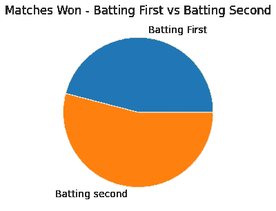
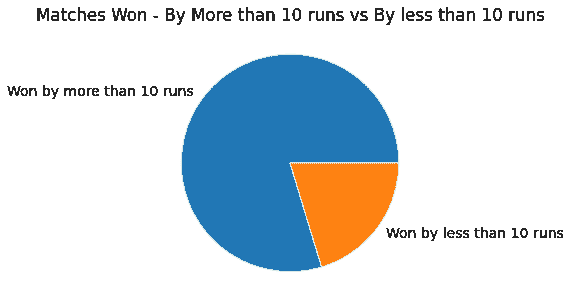
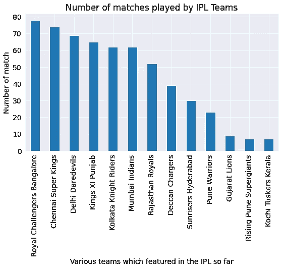
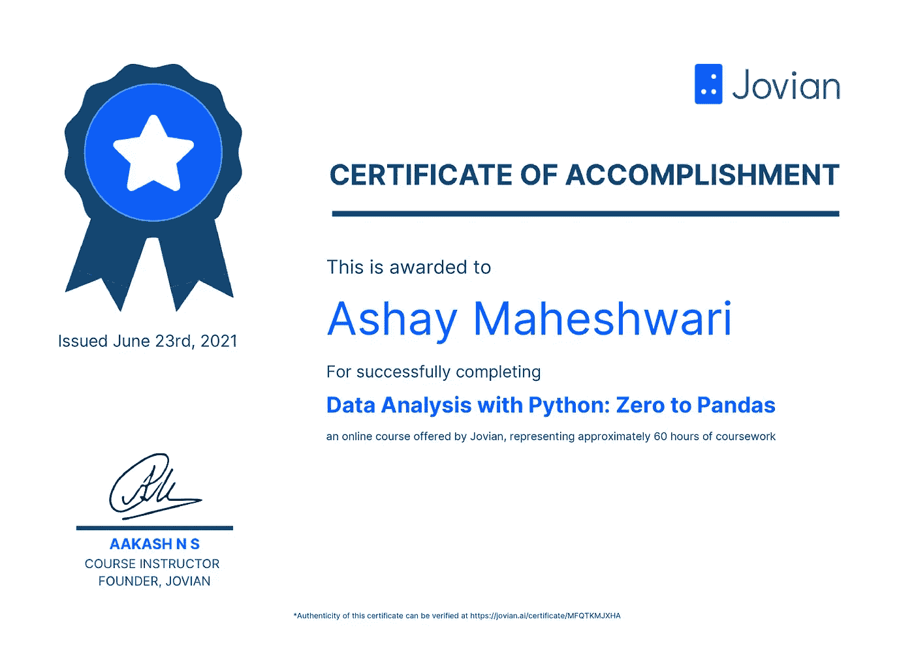

# 数据分析——只有 20 %的 IPL(印度超级联赛)比赛是惊险的

> 原文：<https://medium.com/geekculture/data-analysis-analyzing-ipl-indian-premier-league-dataset-using-python-pandas-and-matplotlib-6babd702f4f9?source=collection_archive---------22----------------------->

# 概观

科学是新的，但也越来越古老。随着时间的推移，这种技能越来越受欢迎，搜索引擎上有各种研究和报告支持这种说法。尽管如此，该技能是小众的，需求远远超过与数据相关的各种角色的供应，这些角色包括数据工程师、数据分析师、数据科学家等。

作为这篇文章的一部分，我们将使用在 [Kaggle 上可用的 IPL 比赛的开源数据集，这是一个机器学习和数据科学爱好者的优秀社区](https://www.kaggle.com/)。

# 谁应该阅读这篇文章？

他的职位可能会使以下个人受益-

*   对数据科学领域感兴趣并希望看到数据分析工作案例的个人
*   了解 Python 编程、Pandas 库并希望看到一些有趣案例的个人可以尝试做简单的数据分析活动
*   活跃读者阅读技术每时每刻
*   正在寻找使用 Python 和 Pandas 库学习数据科学基础知识的绝佳资源的个人

# 确认

我想感谢 [Jovian](https://medium.com/jovianml/about) 团队所做的出色工作，他们推出了一些有趣且互动的数据科学和机器学习课程，其中许多课程都是免费的，完成课程任务后您可以获得证书。我报名参加了一个名为[Python 数据分析:零到熊猫](https://jovian.ai/learn/data-analysis-with-python-zero-to-pandas)的免费课程，这是一个 60 小时的初学者课程，我推荐它。这个帖子有一个作业，也贴在我的 jovian 个人资料上，链接将在这个帖子的参考资料部分分享。

# 让我们想想我们需要回答什么

在我们尝试挑选数据集并开始分析之前，我们需要弄清楚**我们试图从分析中获得什么？，我们试图从分析中回答哪些问题**以及我们可能希望根据分析做出的许多其他业务关键决策。让我们列出一些我们需要答案的问题—

*   到目前为止，哪个城市举办了最多的 IPL 比赛？
*   到目前为止，哪支球队参加了最多的 IPL 比赛？
*   在所有比赛中，有多少场比赛打成平局，接下来的比赛打成平局的概率是多少？
*   在所有比赛中，有多少比赛被放弃？即将到来的比赛被放弃的可能性有多大？
*   与第二次击球相比，第一次击球赢了多少场比赛？
*   如果一场势均力敌的比赛可以被定义为一个队以少于 10 分的差距赢得一场比赛，那么获得这场势均力敌的比赛的概率是多少？

以上给出的问题只是基本问题，从数据中可以得出的结论当然没有限制。对于一些更现实的场景，人们可能希望预测球员在即将到来的 IPL 赛季中的表现或球队的表现，或者预测球队在给定场地和对手的情况下应该首先击球还是其次击球。我们不会达到那个水平，我们会保持简单。

让我们开始吧。在得到需要回答的问题列表后，让我们记下需要执行的步骤—

*   **下载数据** —我们可以从哪里获得数据，它如何成为可靠的来源？
*   **准备数据** —移除空的和不切实际的值、敏感的个人信息、空值、无用的列，并准备用于分析的数据。这一步通常占据整个端到端流程的一半以上
*   **开始分析**——选择你所选择的工具和技术，并投入其中。我将使用 Python3、Pandas、Numpy、Matplotlib、Seaborn 和 Google Colab(Jupyter 笔记本的在线托管版本)。
*   **可视化** —与需要根据您的分析做出决策的合格消费者分享可视化见解

上面给出的步骤在现实生活中并不那么简单，可能会有迭代、跳过和中断。

# 下载数据集

Kaggle 是数据科学和机器学习爱好者的最佳去处，你可以从这里下载你选择的任何数据集。此外，它不仅仅是一个数据集的存储库，人们可以学习、参加比赛、发布代码、与论坛交流等等。

[我们希望在练习中使用的 IPL 数据集在这里](https://www.kaggle.com/harsha547/indian-premier-league-csv-dataset?rvi=1)可用，并且可以使用“下载”按钮或使用专门开发的 [opendatasets 库](https://github.com/JovianML/opendatasets)从 Kaggle 下载，如下所示。您可以在此链接上找到详细说明[-](https://jovian.ai/aaryaashay1848/ipl-dataset-analysis)

```
import opendatasets as od
import osdataset_url = 'https://www.kaggle.com/harsha547/indian-premier-league-csv-dataset'
od.download(dataset_url)

*# Set your directory to the folder which has files download from kaggle* 
data_dir = './indian-premier-league-csv-dataset'*# List all the csv files available in the downloaded dataset* 
os.listdir(data_dir)
```

上面的代码将下载数据集，该数据集当前将下列文件列为输出。我们将在分析活动中使用 Match.csv 和 Team.csv。

```
['Team.csv',
 'Player.csv',
 'Player_Match.csv',
 'Season.csv',
 'Match.csv',
 'Ball_by_Ball.csv']
```

# 数据准备

现在我们有了数据集，我们需要首先查看样本数据、它的列和行，并决定删除无用的列、空值和 null 值，合并各种文件下载作为数据集的一部分，等等。

## 为什么我们需要准备和清理数据？

*   确保数据集没有缺失值
*   删除在分析过程中没有任何意义的列
*   删除可能是敏感信息的列和数据
*   删除可能错误地成为数据集一部分的无效数据-
*   创建可能有助于更好地分析数据的附加列
*   合并来自不同数据集的数据，形成可靠的有用数据

让我们将 csv 数据集文件加载到 pandas 中并执行操作。我们将导入以下 csv 文件

*   原始 IPL 团队数据集—该数据集是一个简单的表格，包含 IPL 团队信息，如团队名称、团队 id 和团队短代码。这将是一个辅助数据集，将用作分析的一部分
*   原始 IP 比赛数据集—该数据集包含不同球队之间所有比赛的信息。它有一场比赛的比赛细节，哪个队打了，什么时候打，谁赢了，多少次跑垒或三柱门，在哪里打，等等。

下面是这样做的源代码—

```
import pandas as pd
raw_ipl_team_df = pd.read_csv('./indian-premier-league-csv-dataset/Team.csv')
raw_ipl_match_df = pd.read_csv('./indian-premier-league-csv-dataset/Match.csv')
# Let's print the Teams dataset  
print(raw_ipl_team_df)
```

加载后，我们可以执行基本操作，比如使用 **info()** 获取数据帧的信息，使用 **describe()** 获取数据帧的基本统计数据，以及使用 **merge()合并两个或更多数据帧以获得一个组合的数据帧。** [细节在此环节](https://jovian.ai/aaryaashay1848/ipl-dataset-analysis/v/51#C15)有所涉及。

```
raw_ipl_team_df.info()
raw_ipl_match_df.info()raw_ipl_team_df.describe()
raw_ipl_match_df.describe()
```

# **开始分析并可视化**

我们现在可以开始真正的分析，并获得问题的答案，获得图形以可视化模式，所有这些都使用 python 编程库，如 pandas、matplotlib、numpy 和 seaborn。我准备的一些有趣的图表作为图片附在下面—



Interesting analysis I did on IPL Datasets

下面给出了使用的示例代码—

```
import seaborn as sns
import matplotlib
import matplotlib.pyplot as plt
%matplotlib inline

sns.set_style('darkgrid')
matplotlib.rcParams['font.size'] = 14
matplotlib.rcParams['figure.figsize'] = (9, 5)
matplotlib.rcParams['figure.facecolor'] = '#00000000'city_match_count = combined_ipl_df.City_Name.value_counts()

city_match_count.plot(kind = 'bar')
plt.xlabel("Number of matches hosted")
plt.ylabel("Name of Cities where IPL got hosted")
plt.title("IPL Matches hosted in various cities");
```

我的 [Jovian profile](https://jovian.ai/aaryaashay1848/ipl-dataset-analysis) 公开收藏了完整的源代码以及上面的可视化和分析。

# 其他分析结论

基于进一步的其他分析，我能够得到一些有趣的推论。请注意，您对数据集理解得越好，您的问题就越容易得到回答。

*   击球第二的队赢得比赛的机会更大。第二棒球队赢得了 100 场比赛中的 53 场，而第一棒球队赢得了 100 场比赛中的 47 场。(注意—让我们排除平局和没有结果的可能性)
*   比赛打成平局的几率只有 1%。这意味着 100 场比赛中只有 1 场打成平手
*   匹配没有结果的几率只有 0.5%。这意味着 200 场比赛中只有 1 场没有结果
*   在一场势均力敌的比赛中，首先击球的球队以少于 10 分的优势获胜的概率为 20%。这意味着在 100 场比赛中，一个队通过先击球获胜，其中 20 场将是惊险的。对我来说，惊悚片意味着一支球队以少于 10 分的优势获胜。

# 结束语

边做边学是最好的方法，像 Jovian team 提供的课程增加了学习的兴趣，你可以展示自己的成就。我会推荐像 Jovian 这样的资源来开始学习数据科学，你可以忽略我的建议，因为即使我是这个领域的新手。

请注意，这不是一个营销尝试，只是在认识到课程的价值后才写的。学习数据科学可能还有许多其他引人注目的强大资源，您可以随时了解和分享这些资源。

# 参考

*   [威风凛凛的链接](https://jovian.ai/)
*   [完整的 IPL 数据集分步分析源代码](https://jovian.ai/aaryaashay1848/collections/datascienceprojects)
*   [如果你是数据科学的初学者(但不是 Python 专家的中级水平)，你应该选择的课程](https://jovian.ai/learn/data-analysis-with-python-zero-to-pandas)
*   我参考的其他学习资源— [Dataquest](https://www.dataquest.io/subscribe/?utm_source=google&utm_medium=cpc&utm_campaign=brandsearch&utm_content=subscribe&utm_source=google&utm_medium=cpc&matchtype=e&device=c&utm_campaign=&campaignid=2083591861&adgroupid=75850930719&adid=512945039960&gclid=Cj0KCQjw2tCGBhCLARIsABJGmZ5kMedJ9GmxAIWNy8E0zSsulY4RXzGOuRPgyHQkgDnDe31I-Zu9c2gaAsneEALw_wcB) 、 [Pandas API 文档](https://jovian.ai/outlink?url=https%3A%2F%2Fpandas.pydata.org%2Fdocs%2F)、 [Pandas Geeks for Geeks 教程](https://jovian.ai/outlink?url=https%3A%2F%2Fwww.geeksforgeeks.org%2Fpandas-tutorial%2F)、 [Pandas 教程:Python 中的 data frames](https://jovian.ai/outlink?url=https%3A%2F%2Fwww.datacamp.com%2Fcommunity%2Ftutorials%2Fpandas-tutorial-dataframe-python)、[课程:Pandas 和 NumPy 基础知识](https://jovian.ai/outlink?url=https%3A%2F%2Fwww.dataquest.io%2Fcourse%2Fpandas-fundamentals%2F)
*   [数据分析:为您的组织进行数据分析的内容、方式和原因| Import.io](https://www.import.io/post/business-data-analysis-what-how-why/)

# 我的证书



Certificate after successful course and assignment completion