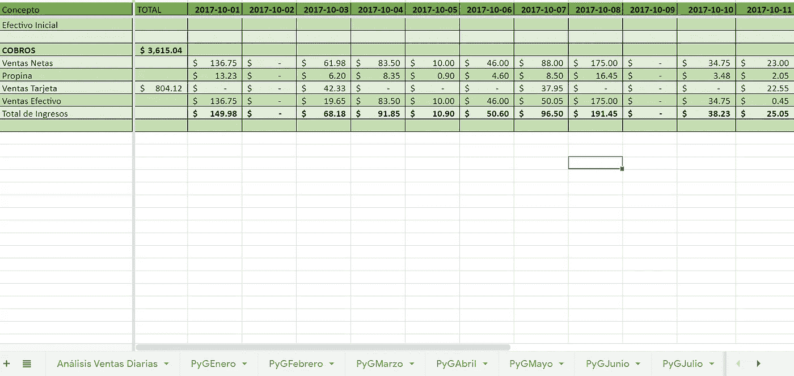
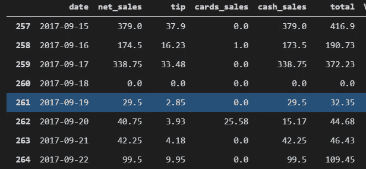
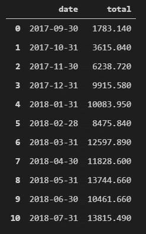
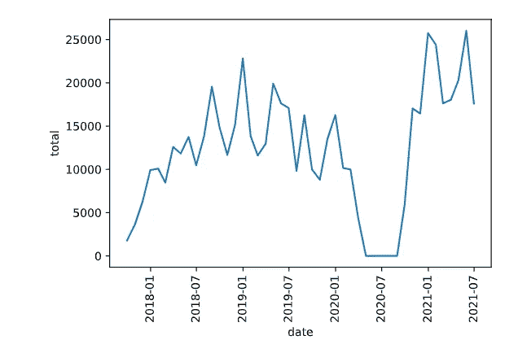
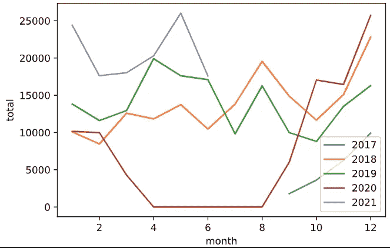
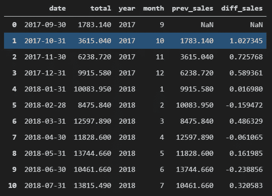
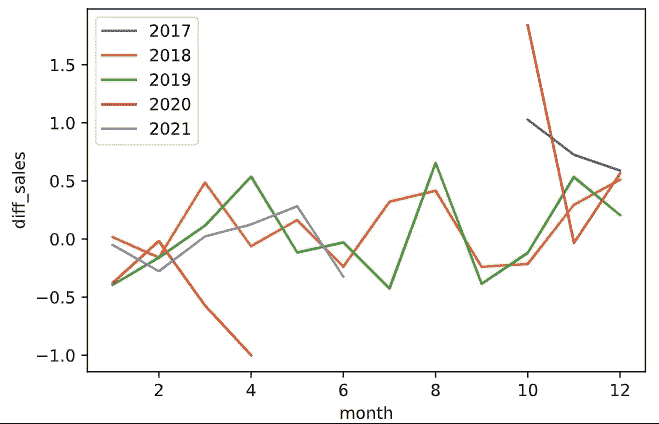

# 数据分析在商业中的应用

> 原文：<https://medium.com/geekculture/data-analysis-applied-on-business-ee151dd21710?source=collection_archive---------28----------------------->

# 介绍

这一系列文章旨在为**提供关于如何在不同业务中使用数据分析的第一手示例。**

每篇文章都将是一个 **ETLs** 过程的组合，使用不同的工具，如 **Python** 进行编程、 **SQL** 提取数据、**统计**、**工商管理、**甚至**机器学习**！

每篇文章将基于 2 种不同的商业模式:一家酒店和一家餐厅。此外，有些文章将是另一篇的延续，而有些则不是，但我会在文章开始时对此进行澄清。

此外，每篇文章都会有一些代码片段，我将在这些片段中编写我在 **Python** 上使用的代码，以及提取数据的**查询**，因此，如果你是初学者，我会建议你了解一些关于 **Python** 、**熊猫**和 **SQL** 的介绍，但我会尝试对代码的所有部分进行注释，以帮助你轻松理解。

如果你是新手，你可以安装 anaconda，它会为你安装 **Python** 和 **Jupyter Notebook** ，我个人更喜欢使用 **Jupyter 内核**的 **Visual Studio 代码**，但如果你也想这样使用它，那就看你自己了。

**注意**:我将展示的一些图像会有一些西班牙语文本，因为这是我们在这里使用的语言，但我会尝试翻译代码中的一些文本。

所以，介绍够了，开始吧！

## 了解你的业务

这听起来有点傻，但是请相信，不是的。在我们开始为我们的业务编程和创建一些机器学习模型之前，我们必须了解业务的所有领域，熟悉不同的流程，或者，如果我们没有机会，知道最重要的和每天完成的。只有在那之后，我们才能开始提问、解决问题和创建我们的模型。

让我们以一家餐馆为例。这家餐厅自 2011 年开始营业，最初是一家酒吧，从 2017 年到现在，它已经成为一家更具家庭特色的餐厅和咖啡馆。自从这家餐厅开业以来，我就一直和它一起工作，我开始是一名收银员，现在我是一名业务分析师，所以我非常确定我至少知道 95%的不同流程。

对于这篇文章，我将重点关注从 2017 年到现在这段时间，因为早些年，我们在不同的地点、不同的运营甚至不同的商业模式下工作。

这家餐厅从 2017 年到 2020 年一直使用一款名为 **Aldelo for Restaurants** 的 **POS 软件**，这款 **POS** 是一款基于 Visual Basic 开发的桌面软件，使用 **Microsoft Access** 作为他们的数据库。我们没有这一时期的所有数据，因为很难提取，数据库甚至被锁定，所以你不能自由访问数据，你只能从生成一些报告的软件中访问数据，即使这些报告是无结构的，所以从那个时期我有最相关的数据，即销售和成本，足以建立一些损益表。

从 2020 年到现在，我们一直使用另一个名为 **Amigo POS** 的 **POS 软件**，这个软件更容易访问，因为它使用的是在餐厅主计算机上运行的 **Microsoft SQL Server** ，我有自己的凭据，我用它来提取我工作的所有信息，我将在这篇文章中使用这些信息。

现在，我已经介绍了业务，让我们开始确定我们最重要的指标。

如果你去一家餐厅，你在购买食物、饮料、咖啡，也在为所有员工给予的关注买单，从问候你、为你服务、拍照上传到你的社交网络，甚至与你一起录制 Tik Toks(是的，这也会发生)，所以，餐厅最重要的指标之一显然是:**销售额。**让我们看看销售能告诉我们什么。

嗯，作为个人意见，销售是我对每个企业进行分析的三大指标之一，它可以让你很好地了解企业的经营状况，而且，你可以用它来预测未来。通过分析销售情况，您可以获得一些见解，例如餐厅销售最多的日子(特定日期或周一至周日的某一天)，检测季节性，预测下个月的销售情况，并根据特定日期的天气情况，以精确的方式确定销售不佳的产品。很酷，你不觉得吗？

## 销售

对于第一个指标，我将使用从我自 2017 年以来每天创建和填充的 **Gsheet** 文件中提取的数据，这些数据如下划分:首先，我每年都有一个工作表，这是因为我不想让一个工作表的天数过多，因为我有一些图形也在**g sheet**上向利益相关者展示。第二，每个工作表都有一个表，用于该年 12 个月中的每个月。最后，这些表将每个日期作为一列，将不同的属性作为行，让我向您展示其中一个表的样子:

Worksheet example

现在，你知道我是如何拥有我的主数据的，所以我有 5 个结构相同的工作表，我创建了一个脚本来将所有文件提取到 1 个 **Pandas Dataframe** 中。

现在让我们深入一些编码:首先，像往常一样，我导入我使用的库。如你所见，我将使用**熊猫**和其他 3 只熊猫来与**谷歌服务**互动。

google.oauth2 用于连接到您的 google 服务凭据。另外两个用于与工作表交互， **gspread** 用于打开我们的每个工作表， **gspread_dataframe** 将我们的工作表加载到众所周知的 **Pandas** 结构中，一个 **dataframe** 。我还将使用**matplot lib**y**seaborn**来做一些可视化，所以一定要安装它们。你可以在这里找到关于这些库的很好的教程。

在代码的下一部分，您将看到我如何使用我为 Google 创建的凭证连接到我的工作表。

这段代码的主要部分是关于我使用的的**。正如我所说的，我有一个自 2017 年以来每年的工作表文件，其中每个文件都有 12 个工作表，用于那一年的每个月，因此我创建了 2 个 bucles，第一个是 2017 年到 2022 年(range 函数在第二个参数上是唯一的)。第二次是几个月。因为我已经用月份的名称命名了我的工作表，所以我为每个名称创建了一个列表，然后我打开每个工作表，更改年份和月份。您还会看到我必须做的一些清理和转换，只是为了存储我将使用和分析的特定数据，您可以在下面的代码中看到每个步骤的注释。**

对于下一部分，我做了一些数据清理和**转换**来使数据符合我的需要，其中一些包括删除列、填充空值、过滤和转换数据类型。

现在，我们将从激动人心的部分开始，它会很短但很有趣。

为了直观显示我们的数据，我将再做一些转换，但首先，让我们问一些我们想了解的业务问题。

1.  就销售而言，生意做得好吗？
2.  **有没有季节性？**

为了回答第一个问题，我们将进行第一次可视化，我们将所有数据放在一个数据框架中，它看起来像这样:

Dataframe with all sales (pyg_data_transformed)

为了观察销售的变化，我建议从第一年到当前年度，每月**观察一次。**

首先，我将按月份对我们的**数据框架**进行**分组，这是将我们的日期列的数据类型更改为日期时间变得方便的地方，该转换将让我们使用**分组器**函数和按月份对我们的**数据框架**分组的**函数，并将**求和**函数应用于我们的**总计**列。****

现在，月度**数据框架**看起来会像这样:

Monthly Sales

通过这个小小的转变，我们现在能够可视化我们的数据，看看它能告诉我们什么。我将使用 seaborn 的一个简单的**线图**，使用日期和我们新创建的**数据框架**的总列。

Monthly sales from 2017 to 2021

这是一张餐馆经营多年的漂亮图表，我们现在可以开始回答一些问题了。

对于我们的第一个问题，我们必须定义术语**“井”**，但是让我们假设我们这样定义它:**如果业务逐月正增长**。使用这个新的定义，我们可以说，该业务在运营的整个时间内都经历了正增长，除了在 2020 年，我们可以清楚地看到销售额急剧下降，直到它达到 0，发生了什么？嗯，这有一个非常清楚，也许是显而易见的答案， **COVID 19** 攻击。在萨尔瓦多，2020 年 3 月 26 日，政府宣布进入紧急状态，这意味着所有餐厅不对公众开放，出售食物的唯一方式是使用送货服务，餐厅决定不提供送货服务，因为几乎所有的员工都住在病毒猛烈袭击的危险地区，所以所有董事会成员决定在疫情期间完全停止营业。紧急状态持续到 2020 年 9 月 28 日，餐馆重新开业。

为了在年和月之间进行比较，我们首先必须创建两个单独的列，从日期列中提取年和月，然后我们将能够传递在 seaborn 上使用的参数，以在单个图形上绘制 5 条不同的线。

该图看起来会像这样:

Year-month comparison

从图表中我们可以看到，在过去 5 年中，几乎所有月份都有显著增长，但在某些情况下情况并非如此，如果您看到 2019 年与 2018 年的对比，2018 年第二季度的表现比 2019 年更好，那么我们应该了解是否有一些变化可能会对此产生影响，事实上，确实有一些变化。

餐馆提供早餐促销，他们以 1 英镑的价格出售 2 份早餐，这是一个非常好的促销，但它不能永远持续下去。这部宣传片的主要目的是吸引人们到餐厅来获得并留住他们，这一目的非常有效，缺点是由于**的运营成本**也增加了，所以**的毛利润**和**的净利润率**都下降了，这是你不应该总是只相信销售指标的一个原因，销售确实相当不错，但这也影响了业务的运营和利润。

最后，为了回答关于季节性的问题，我们可以看到，事实上，是的，存在季节性。我们可以清楚地看到，在所有的图表和表格中，有些月份的销售额明显增加，原因很简单，这些月份有重要的庆祝活动或假期。例如，12 月是任何餐馆销售最多的月份，因为圣诞节假期，这些销售甚至持续到 1 月，这是因为萨尔瓦多是一个有很多移民的国家，这意味着许多萨尔瓦多人生活在其他国家(主要是美国)，他们经常在 12 月和 1 月回家。

五月也是一个非常好的月份，但这主要是因为 5 月 10 日这一天，我们庆祝我们的母亲！正如你所看到的，我们真的爱我们的妈妈，带他们和所有的家人去吃一顿大餐。

为了有另一个图表，我们可以找到我所说的季节性，我们可以计算每个月的销售额之间的差异，看看它们的比较是否显示我们在这些特定的月份中**增加**或**减少**。

为此，我将创建新的列和新的数据框架，它将是 monthly_sales 数据框架的副本，但带有一个 **prev_sales** 列和一个 **diff_sales** 列。

这是新数据帧的样子

Sales difference over months

为了绘制它，我使用了和以前一样的过程:

Sales difference over months graph

对于销售人员，这就是我要说的全部内容，我真的希望您会对此感兴趣，并能帮助您进行自己的分析，以做出数据驱动的决策。在接下来的文章中，我将致力于其他重要的指标，这些指标是你需要注意的，以创建更好的业务分析。

如果你认为我遗漏了什么或者有其他意见，请随时联系我并发表评论。

下一篇文章再见:)