# 使用 Python 进行数据分析(DA)

> 原文：<https://medium.com/geekculture/data-analysis-da-with-python-c570264edeab?source=collection_archive---------7----------------------->

概念工具编码

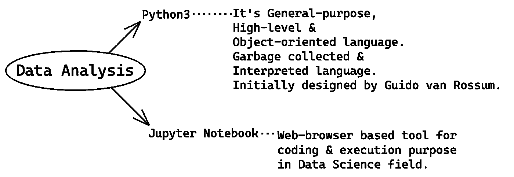

DA and its Tools

**Python3** 和 **Jupyter Notebook** :如果你是该领域的初学者/新手，请在上面的图片中进行高级定义，并确保在深入研究之前所有内容都在同一页面上。 **DA** 使用历史/现有数据通过**编程**或通过 **GUI 工具**执行。*了解你的数据的过程也被称为****EDA****(****E****xploratory****D****ATA****A****analysis)*。

> **DA** 的场景——用于商业、投资&研究目的以及构建预测模型(机器学习/深度学习)。

## **DA 类别:**

1.  **描述性分析**:根据历史数据，发生了什么。
2.  **诊断分析**:知道某事发生的原因。
3.  **预测分析**:分析知道接下来会发生什么。
4.  **规定性分析**:帮助下一步应该/可以做什么。

> 基本步骤:**数据争论**或**数据清理** -将数据的原始格式转换为另一种格式的过程，通过识别&处理缺失值、数据格式化、数据标准化、数据宁滨以及将分类值转换为数值变量(特别是为了构建预测模型)来准备分析和清理数据。这些步骤取决于数据集和场景(商业/研究/预测建模等)。

## **本文涵盖:**

*   环境和先决条件
*   收集和导入数据集
*   查看行/数据
*   使用方法理解数据:`df.shape()`、`df.columns`、`df.info()`或`df.dtypes`、`df.describe()`、`df.head()`、`df.tail()`、`df.sample()`
*   删除不需要的列
*   重命名列
*   格式化/转换数据类型
*   子集化数据帧
*   保存数据帧
*   数据可视化
*   回答问题

*基于场景，* ***DA*** *将使用任何 GUI 工具以编程方式执行。*

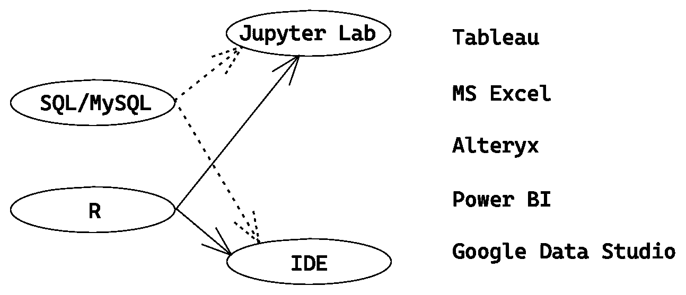

Other languages and GUI tools for DA - author’s image

> ***SQL*** 和 ***R*** 是 ***Python*** 的替代，通过***Jupyter**Lab****或****IDEs***(*py charm*、 *VS Code* 、 *Atom* 等)和 ***微软 Power BI***&***Google Data Studio***用于数据可视化(是 **DA** 的必备部分之一)。

*Jupyter 笔记本*的另一个味道是 **Jupyter Lab** 。仅供参考，**实验室**提供导航菜单并允许打开多个*。ipynb* *笔记本*在同一个窗口！

> **为 DA** 设置环境——在你的 PC 或 Mac OS 上安装 **Python3** 和 **Jupyter Notebook** 或 **Lab** 。通过终端/CMD 为*笔记本*或*实验室*运行这些命令:

```
# **on PC/Windows OS**:
> pip install jupyterlab 
# OR
> pip install notebook# **on Mac OS**:
$ pip3 install jupyterlab 
# OR
$ pip3 install notebook
```

**启动服务器**:如果安装了 **jupyterlab** ，运行***jupyter lab****命令*！

```
# Same command for Mac or PC:
$ **jupyter lab** 
# OR
$ **jupyter notebook**
```

它的主页将在您的笔记本电脑/机器的默认网络浏览器中打开，或者在您选择的浏览器中复制显示的(在终端中)**本地主机 URL** ！

或者，通过 *Anaconda* 或 *Miniconda* 安装它们。然而 Anaconda 安装了 Python、笔记本、Lab 和一些 ide。Miniconda 是小版本，两者都是开源的！

让我们开始 **DA 编码**-**-**数据集的链接可以在下面的截图或**资源**部分找到。

> **目的**:回答关于 Android mob 应用的问题。

*   ***先决条件:*** *Python 模块-* ***熊猫*** *，****Numpy****，****Matplotlib**&****Seaborn*****

```
# **To install via Jupyter Notebook**:
!pip install pandas
!pip install numpy
!pip install matplotlib
!pip install seaborn# **Note**: Don't include '!' if you install them via terminal/CMD, rest are same.
```

一旦在终端或笔记本的代码单元中执行，它们就会被安装到你的机器上！

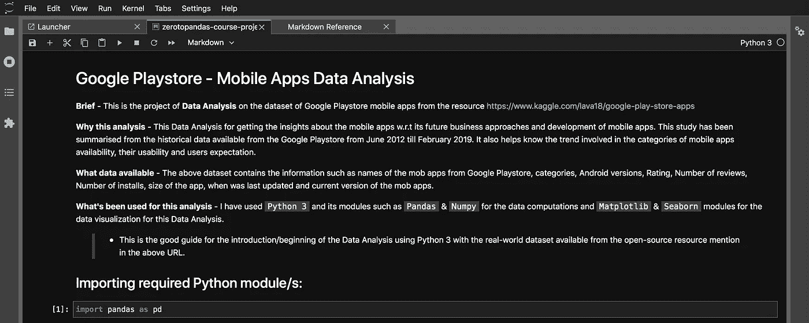

Import Pandas module, aliased as **pd**.

*   现在，在下载/收集所需数据集后，将数据集导入工作空间。

Jupyter 支持多种文件格式。用引号括起数据文件的完整位置路径。我已经将它保存在项目的根文件夹中，因此文件名就足够了。

```
# To read & store dataset in Pandas object(variable):
**playstore_df = pd.read_csv('googleplaystore.csv')**
```

**熊猫**会将缺失的值填充为 NaN(**N**ot**a**Nnumber)。如果该行/列不影响输出，则可以将其删除！

> 对象在这里被命名为 **playstore_df** 。可以据此命名！现在，找到它的行数&列。让我们开始吧:

```
# To get number of rows & columns:
**playstore_df.shape()**# Outputs it in tuple:
**(10841, 13)**# Number of rows:10841 & columns:13
```

*   要查看行:

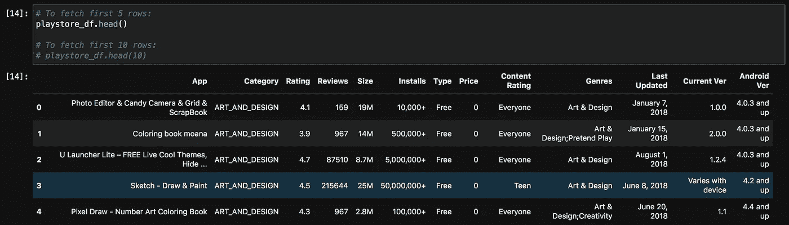

View the first 5 rows of dataset — **df.head()**

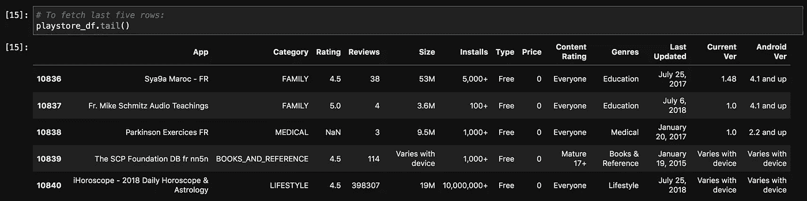

View the last 5 rows — **df.tail()**

确定我们需要哪些变量/列，以满足我们的分析目标。

*   了解数据的类型和描述性统计数据:

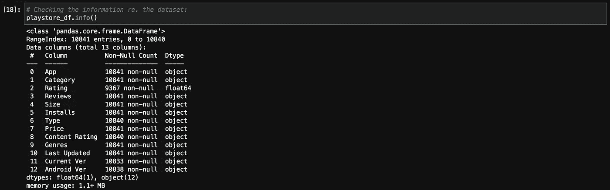

Displays **columns name**, **count of non-null values for each column** and their **data types**.

然后检查 **Pandas** 是否已经将所有变量转换成正确的数据类型，否则它们需要转换成各自的数据类型才能获得好的结果！

***熊猫默认将非数字列翻译为对象，*** *根据其版本* **1.1.3** : *执行* `**pd.__version__**` *就知道你得到的是哪个版本了！*

**执行**后的观察值`playstore_df.info()`:

1.  **价格**列到*浮动*和**最后更新**到*日期时间*类型可以转换。
2.  *等级*、*类型*、*内容等级*、*当前版本*、&、*安卓版本*列得到空值。

> 执行`df.dtypes`来获取列的数据类型。 **dtypes** 是属性不是方法！

`df.describe()`默认返回数值列的*描述性统计值*。在这里，我们只有一个这样的栏目，即**。**

**

***Count** of non-null values, **mean**/average, **std** (standard deviation), **min** and **max** values and readings at 3 quartiles (25%, 50%, 75%) of **Rating**.*

*`df.describe(include=[object])`对于分类列:*

*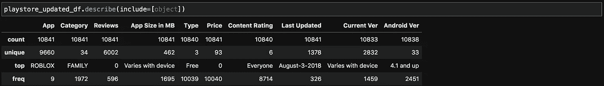*

***Count** of non-null values, number of **unique** values, **top** is most frequent value and **freq** is frequency of top value.*

*   ****流派*** 和 ***类别*** 具有等同的信息，因此**流派**可以被删除，并将它保存到 **playstore_updated_df** :*

*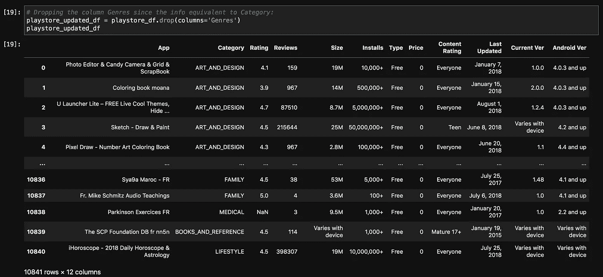*

***Output**: after executing the **drop()** method on **Genres**.*

*   *为了更好的可读性，重命名下面的列！Fetch，确认更改的几行:*

*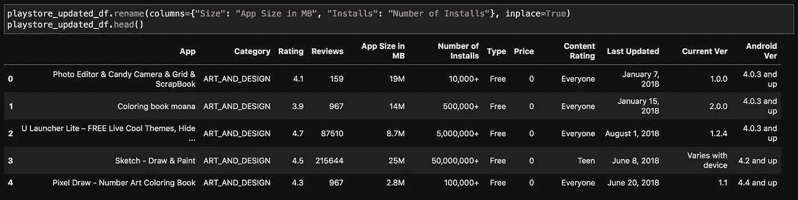*

*Updated DataFrame after renaming.*

*   *要将**安装数量**的数据类型格式化为数字，删除 **+** 和**、**字符:*

*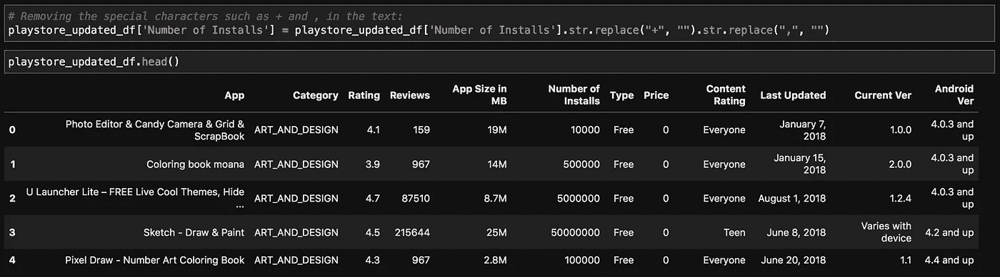*

*First 5 rows to check updated **Number of Installs**.*

*现在，通过使用`to_numeric()`来转换**安装数量**，但是默认情况下，它被转换为 float。*

*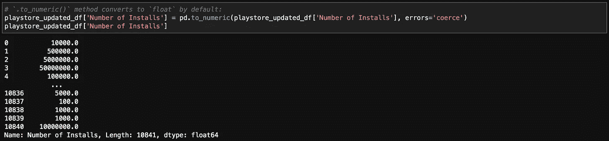*

*Updated **Number of Installs** with float after this execution.*

*接下来，将其转换为 **int** 类型。*每次输出都不需要保存到变量中！**

*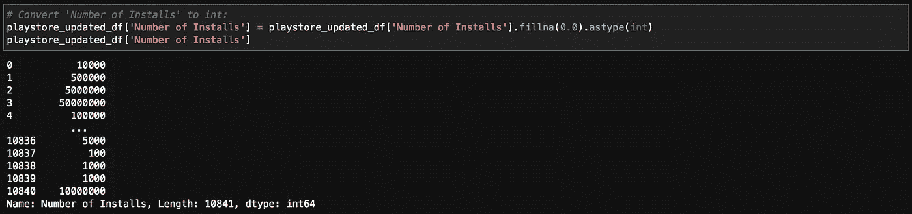*

*Now **Number of Installs** is **int** data type.*

***问:根据应用数量，哪几个是前 3 或前 5 名:***

*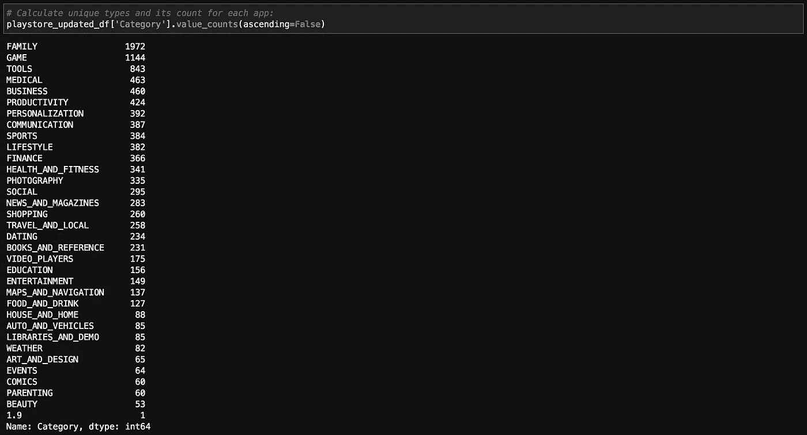*

***FAMILY**, **GAME** and **TOOLS**.*

***问:使用最多的版本是哪个:***

*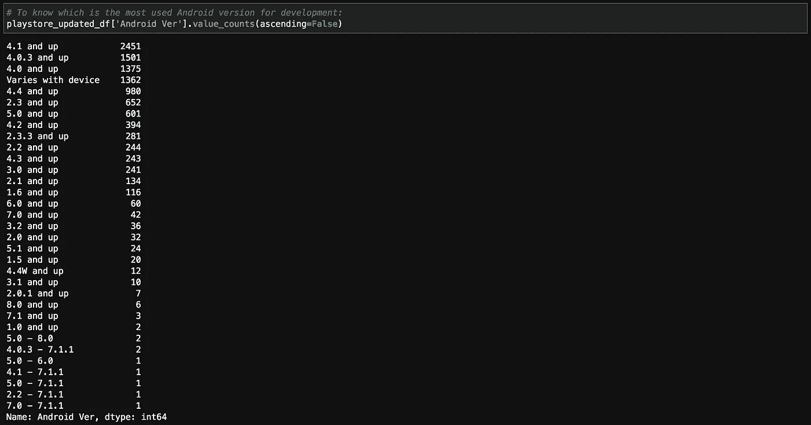*

***4.1+**, **4.0.3+** and **4.0+***

*有时候知道准确的结果很有挑战性。例如，以上输出的 ***随设备变化*** 不是特定版本！*

***问:想知道有多少付费和免费的应用:***

*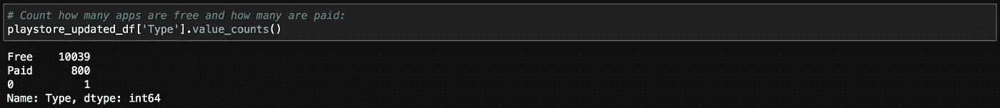*

*10039 apps are free, 800 are paid but one app with zero since it doesn’t have valid entry!*

***问:每个 app 安装多少个*数量*:**`pivot_table()`派上用场。如果您在 MS Excel 中处理过数据，这可能很熟悉。*

*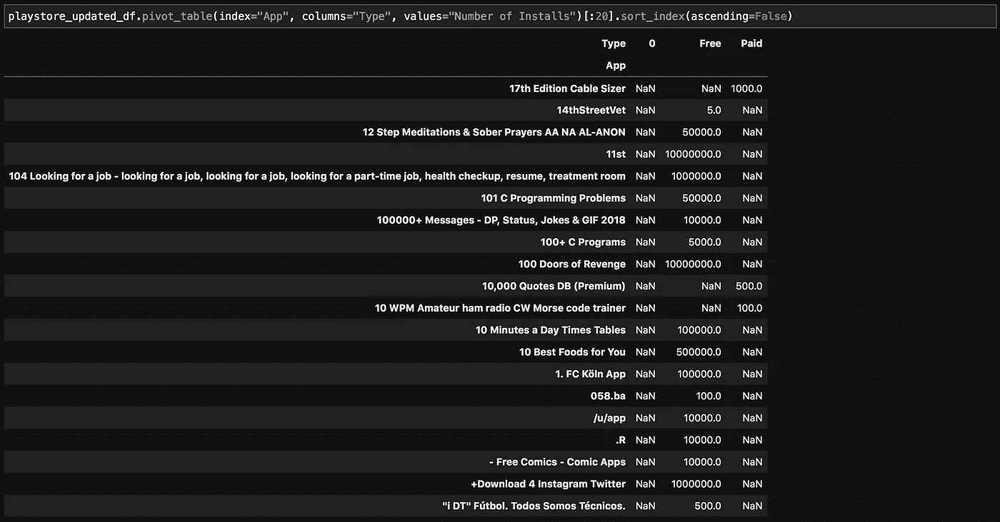*

*Displays first 20 apps based on **index**.*

****类型*** *有 1 个空值，可以用* `*dropna()*` *方法去掉。**

*如果 ***索引*** *参数中的指定列有重复值，则`*pivot()*` *不会对 DataFrame 进行整形。***

*   *子集化数据帧:用于进一步分析并保存到 **playstore_df_sub** :*

**

*Subsetting the original DataFrame (DF).*

*   *保存 **DF** 或以备后用，Jupyter 让我们保存*。各种格式的 ipynb* 文件。可以根据需要保存为 CSV 或 JSON 格式。这是为了保存它。csv 文件:*

```
*playstore_df_sub.to_csv("playstore_df_subset.csv", index=False)*
```

*文件**playstore _ df _ subset . CSV**被保存到项目的根目录下。*

*   *让我们深入研究一下，**数据可视化**(数据的图形化表示):*

*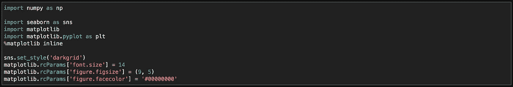*

*Import these modules to generate graphs.*

*`***%matplotlib inline***` *以同样的方式显示图形。ipynb 文件！****RC params****属性和* `***set_style()***` *来改变默认值。**

> *下面是**直方图**、**条形图**和**计数图**。根据数据和要求选择图表，以下是一些基本图表:*

*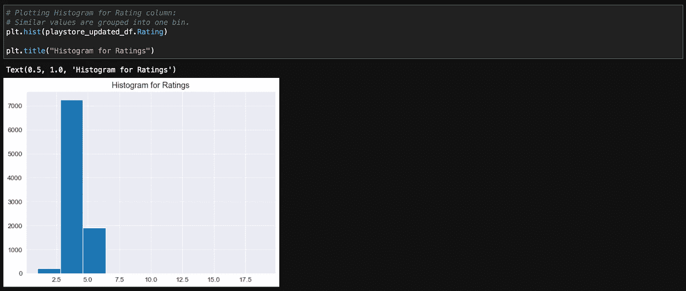*

***Histogram**: graphical representation of the distribution of numerical data.*

*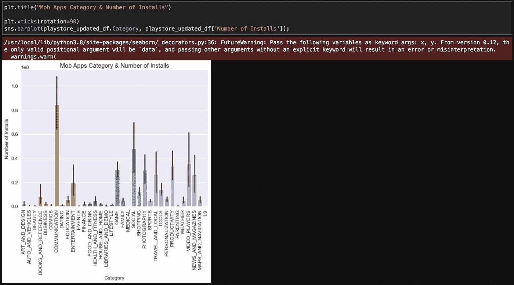*

***Bar graph**: to visualize count of categorical values.*

*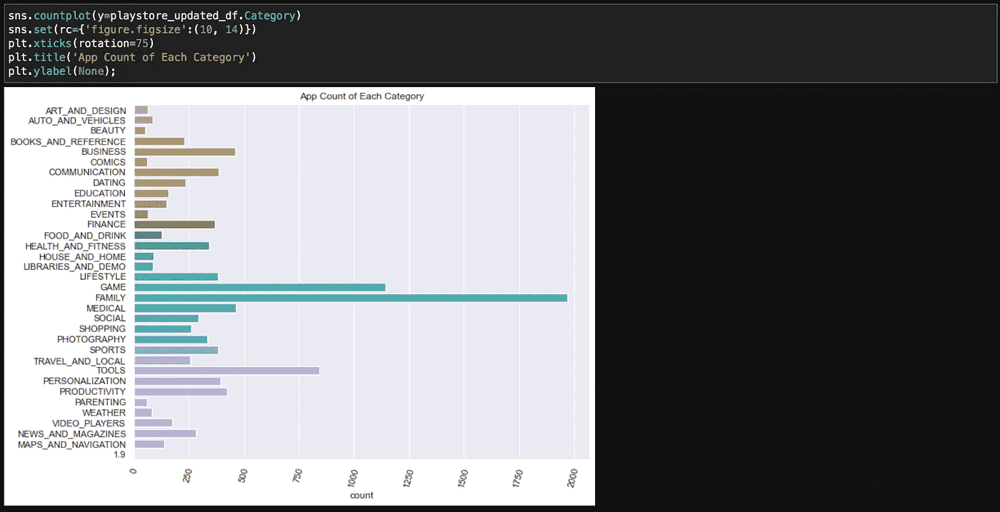*

***Count plot**: to view the app counts of each category.*

> *另一个方面是 **Wordcloud** ，特别针对这类数据:*

*如下安装`wordcloud`模块:*

```
*$ pip3 install wordcloud  # Mac OS> pip install wordcloud   # PC*
```

*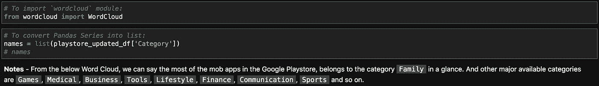*

*Import wordcloud module and generate list of required categorical values.*

*生成上述列表的替代代码:*

```
*names = list(playstore_updated_df["Category"].value_counts().index)*
```

*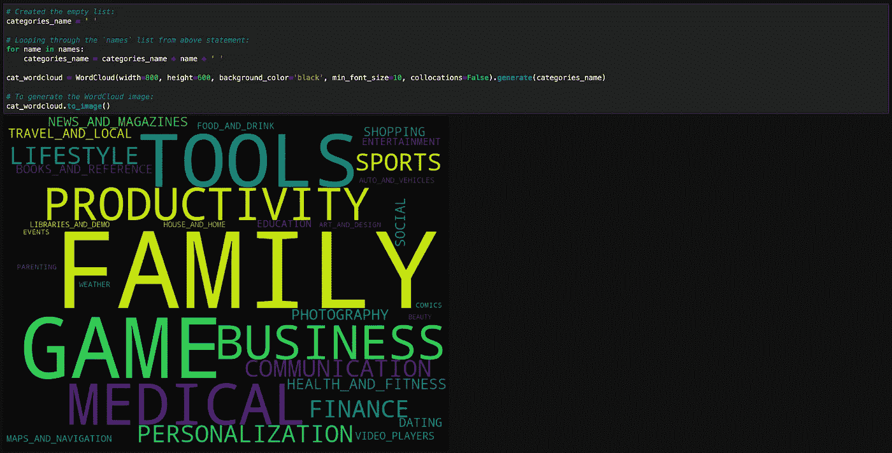*

*Code snippet to generate cloud of words! and WordCloud image. Higher the frequency, larger the font.*

*   *最后，回答分析中的其他问题:*

*Q1: **哪个是使用最多的安卓版本？** = **4.1** 和 **+***

*Q2: **有多少种类的 mob 应用，是哪几种？** =计数为 **34** ，姓名如下。*

**

*Q3: **根据应用** = **家族**、**游戏**和**工具**(查看 WordCloud 图片或代码)数量排名前三的类别是哪几个！*

*Q4: **哪些应用获得了 5 星评级？** =下面高亮显示。*

*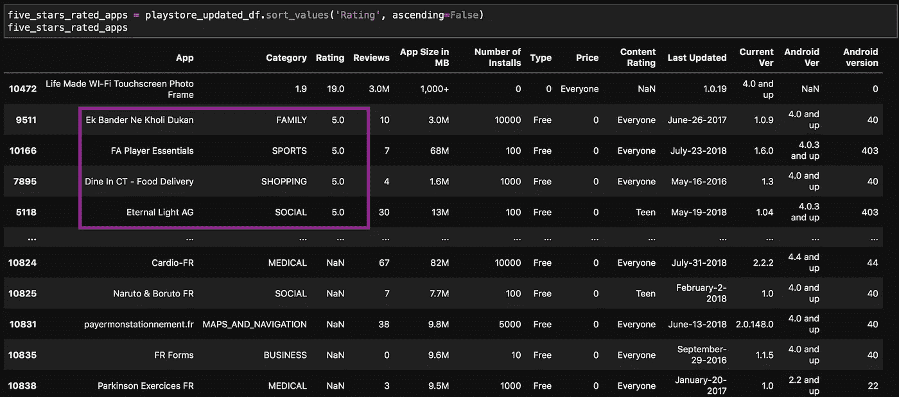*

***提示**:你可以使用 *Google Colab* 或 *Kaggle。他们为笔记本电脑提供免费的 GPU 处理器服务。Kaggle 还提供了一个大型的社区发布数据集存储库。以下是进一步阅读的链接。它们为*学习* & *分享*目的派上了用场，尤其是对于学习团体！**

***资源**:*

*   *[Kaggle](https://www.kaggle.com/) | [Kaggle 开源数据集](https://www.kaggle.com/datasets)*
*   *[谷歌 Playstore 数据集](https://www.kaggle.com/lava18/google-play-store-apps)*
*   *[蟒 3](https://www.python.org/downloads/)*
*   *[Jupyter 笔记本或实验室](https://jupyter.org/)*
*   *[谷歌实验室](https://colab.research.google.com/notebooks/intro.ipynb)*
*   *[蟒蛇](https://www.anaconda.com/) | [迷你蟒蛇](https://docs.conda.io/en/latest/miniconda.html)*

***摘要**:有时会提供每一列的摘要、数据类型及其度量单位！*

*如果您想使用 MySQL 开始使用 DA，请参考以下文章:*

1.  *[**EDA 用 SQL**](/geekculture/eda-with-sql-mysql-4ac1ea1d977b) ，我已经描述了它的概念&编码*
2.  *[**与 MySQL 数据库交互**](https://ramya-n.medium.com/to-interact-with-mysql-database-4f7e75e764d5) 连接 MySQL 服务器和数据库。*

*希望你喜欢这篇文章，就像我喜欢阐述它一样..随意鼓掌！！*

*谢谢大家！*