# 基于 Python 的网飞电影及 IMDB 评分数据分析

> 原文：<https://medium.com/geekculture/data-analysis-of-netflix-movies-imdb-rating-using-jupyter-notebook-d923186da6c7?source=collection_archive---------9----------------------->

## 网飞数据分析项目

你好，数据科学家..！！

我们从卡格尔那里得到了网飞数据集。这不是一个很大的数据集，但仍然很有信息量。我们将从初级水平到高级水平做一个完整的分析。我们的目标是获得尽可能多的有价值的信息。所以，为了不浪费更多的时间，让我们从一杯咖啡开始这个项目。


Netflix Data Analysis

# 代码和分析

*   导入下列库

```
import pandas as pd
import numpy as npimport matplotlib.pyplot as pltimport plotly 
import plotly.express as px
import plotly.graph_objs as go
import plotly.offline as py
from plotly.offline import iplot
from plotly.subplots import make_subplots
import plotly.figure_factory as ff
```

*   让我们看看，我们的数据看起来怎么样。为此，在 Jupyter 笔记本或 Google Colab 单元格中运行下面的命令。根据您的选择分配数据集的路径。

```
df = pd.read_csv("/NetflixOriginals.csv", encoding='latin-1')
df.head()
```

运行单元后，您将在屏幕上看到类似这样的内容。

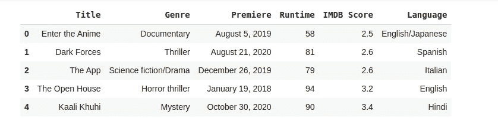

Netflix data analysis

*   现在，让我们了解一些关于我们数据的一般信息。

```
#shape of the data
df.shape#Column Countsdf.columns.value_counts()#Check missing valuesdf.isnull().sum()#data infodf.info()
```

数据库形状将为您提供有关列数和行数的信息。

检查每一列中的空值。幸运的是，我们的数据集中没有空值。

之后，用每一列的类型属性获取更多关于数据集的信息。

*   **添加总理年、月、日一栏。首先，将 premier 日期转换成标准格式。**

```
df["Date"] = pd.to_datetime(df.Premiere)
df["Date"]df["Year"] = df["Date"].dt.year
df["Month"] = df["Date"].dt.month
df["day_of_week"] = df["Date"].dt.dayofweek
df["Year_Month"] = df["Date"].dt.strftime("%Y-%m"df.head()
```

我们将数据分为年、月和日，并将它们添加到单独的列中。当您运行单元时，您会在屏幕上看到类似这样的内容。

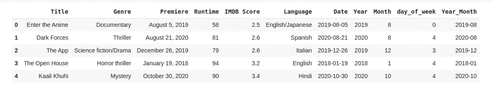

Netflix data analysis

*   **不同流派的电影在给定的网飞数据集中可用。**

```
df.Genre.nunique() #115
df.Genre.unique()
```

运行该单元后，它将为您提供网飞所有 115 种电影类型的名称。

*   **获得更精确的读数**

```
df.Genre.value_counts(normalize=True)*100
```

在给定的数据中，纪录片占 27.22%，剧情片占 13.18%，喜剧片占 8.39%，等等。如果你是一名导演，想为网飞制作一部电影，你必须记住，纪录片比任何其他类型的电影都有更多的视角。

现在，让我们以图形方式查看上述信息。

```
fig = px.bar(data_frame=genre, x=genre.index, y=genre.values, labels={"y":"Number of Movies from the Genre", "index":"Genres"})
fig.update_layout(xaxis={"categoryorder":"total descending"})fig.show()
```

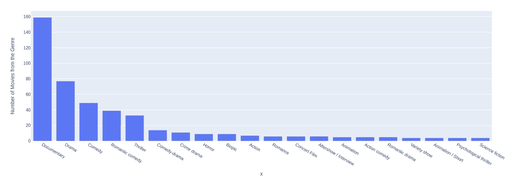

Netflix Movies Genre Data Analysis

*   **来自给定数据集的网飞电影的语言分析**

```
df.Language.unique()
df.Language.value_counts()
df.Language.nunique() #38
```

在使用上面的命令运行单元之后，输出将为您提供关于语言的更多信息，比如独特语言的数量、这些语言的名称、特定语言的电影总数。

让我们用下面的命令来看一个图形视图。

```
top_20_lang = df.Language.value_counts().nlargest(20)
fig = px.bar(data_frame=top_20_lang, x=top_20_lang.index, y=top_20_lang.values, labels={"y":"Count", "index":"Language"})
fig.update_layout(xaxis={"categoryorder":"total descending"})fig.show()
```

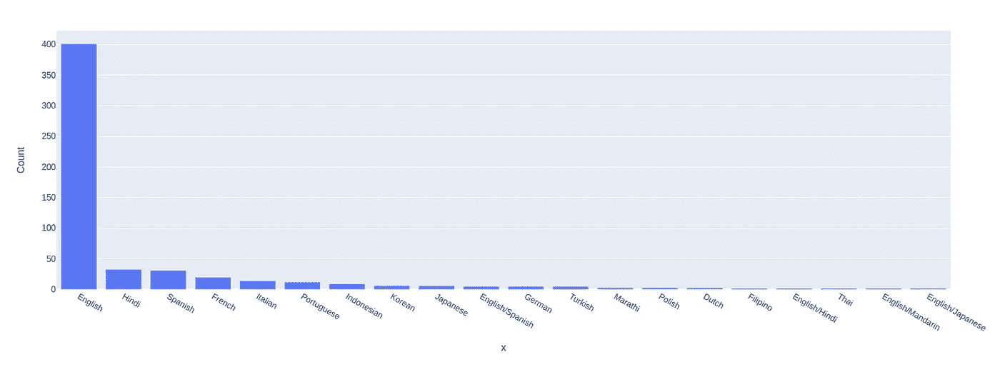

Language-based Data Analysis of Netflix

*   **基于运行时间的分析**

```
df.Runtime.describe()
```

如果你仔细阅读数据，你会发现平均值小于中值。如果平均值小于中值，则分布为负偏态，反之亦然。

```
fig = px.histogram(data_frame=df, x="Runtime", title="Runtime of Programs")fig.show()
```

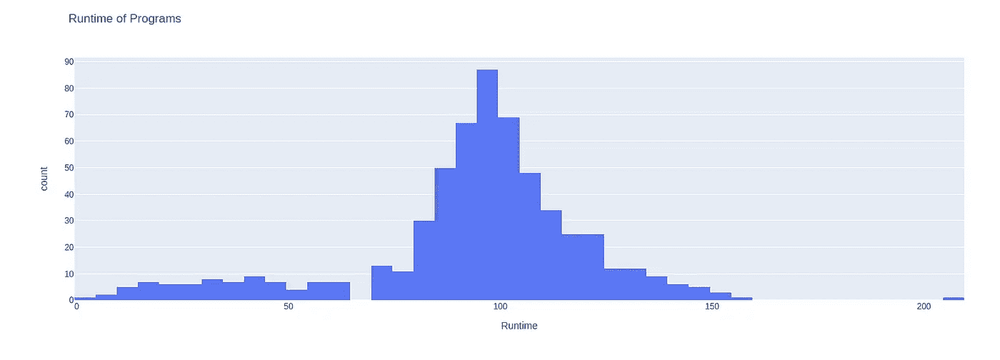

Netflix Data Analysis

通过上面的直方图，我们确认了运行时间的分布是左(负)倾斜的。

```
fig = px.box(data_frame=df, x="Runtime", hover_data=df[["Title", "Genre"]])
fig.update_traces(overwrite=True)fig.show()
```

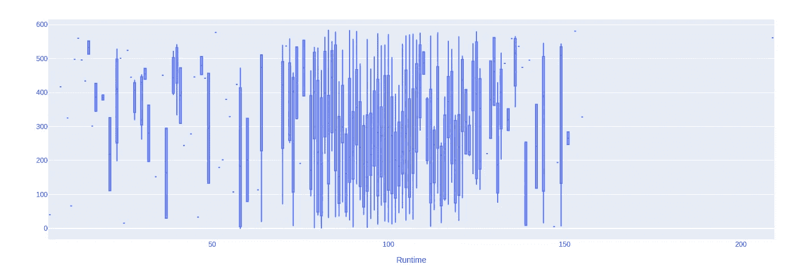

Runtime-based data analysis of Netflix dataset

运行时间最长的电影

```
df[df.Runtime == df.Runtime.max()]["Title"]
```

数据集中运行时间最短的电影。

```
df[df.Runtime == df.Runtime.min()]["Title"]df[df.Runtime == df.Runtime.min()]["Title"]
```

*   **基于 IMDB 评级的分析**

```
df["IMDB Score"].describe()
```

评分最高的电影是 9。最低的是 2.5。同样，中值略大于平均值。所以分布是负偏的。

```
fig = px.histogram(data_frame=df, x=df["IMDB Score"], title="IMDB Scores of the Programs")fig.show()
```

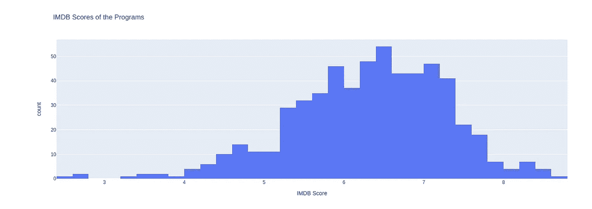

IMDb analysis of Netflix movies

正如你可以清楚地看到，分布是负(左)斜。

```
fig = px.box(data_frame=df, x=df["IMDB Score"], hover_data=df[["Title", "Genre"]])
fig.update_traces(overwrite=False)fig.show()
```

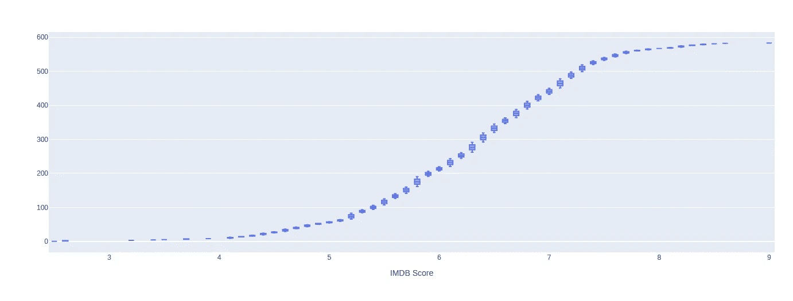

IMDb data analysis of Netflix movies

给定数据集中评分最高的电影。

```
df[df["IMDB Score"] == df["IMDB Score"].max()][["Title", "Genre"]]
```

给定数据集中评分最低的电影。

```
df[df["IMDB Score"] == df["IMDB Score"].min()][["Title", "Genre"]]
```

*   **运行时间和 IMDB 额定值之间的相关性**

```
df[["IMDB Score", "Runtime"]].corr()
```

完美。现在，使用散点图来看看运行时间与 IMDB 分数的关系。

```
fig = px.scatter(data_frame=df, x="IMDB Score", y="Runtime")
fig.update_layout(autosize=False, width=800, height=600,)fig.show()
```

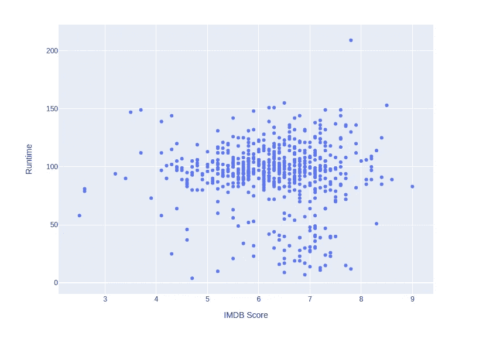

Runtime vs IMDB

如果你是一个导演，那么你必须记住运行时间与评级图。为了获得好的收视率，你必须制作一部运行时间均衡的电影。

*   **年度分析**

```
year = df.Year.value_counts()
year

fig = px.bar(data_frame=df, x=year.index, y=year.values, labels={"y":"Movies", "x":"Year"})
fig.update_layout(xaxis={'categoryorder':'total descending'})

fig.show()
```

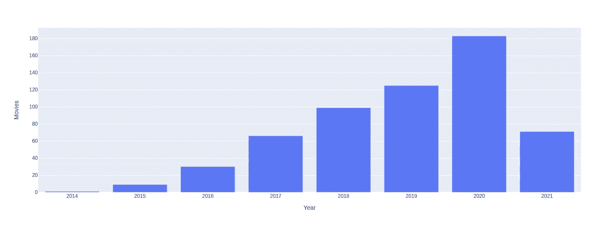

Movie vs year graph

你可以清楚地看到，网飞的电影数量每年都在增加。2021 年尚未完成，因此图表向下。

*   **逐月分析**

```
month = df.Month.value_counts(sort=False)
monthmonths = ['Jan','Feb','Mar','Apr','May','Jun','Jul','Aug','Sep','Oct','Nov','Dec']fig = px.bar(data_frame=df, x=months, y=month.values, labels={"y":"Movies", "x":"Month"})fig.show()
```

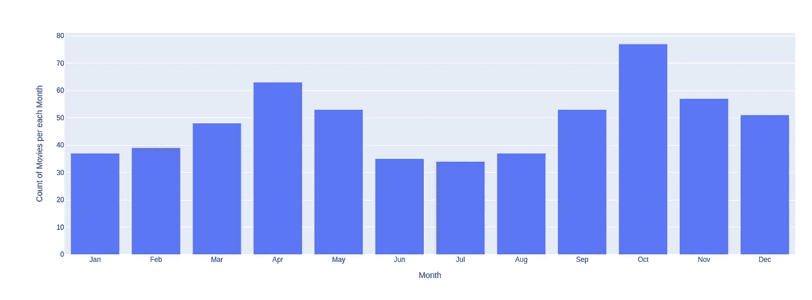

Month wise Netflix movie analysis

十月和四月是网飞电影发行数量最多的时候。因此，如果你打算购买网飞订阅，那么这两个月是你的。

*   **根据给定数据集的 IMDB 评级，排名前 10 的电影**

```
top_10_ratings = df[["IMDB Score", "Title", "Genre", "Year", "Language"]].sort_values(["IMDB Score"], ascending=False)[:10]
top_10_ratingsfig = px.scatter(top_10_ratings, y= 'Title', x='IMDB Score', hover_data = top_10_ratings[['Genre','Year','Language']], color='Genre', 
                 title = "Top 10 High Rated Programs")fig.show()
```

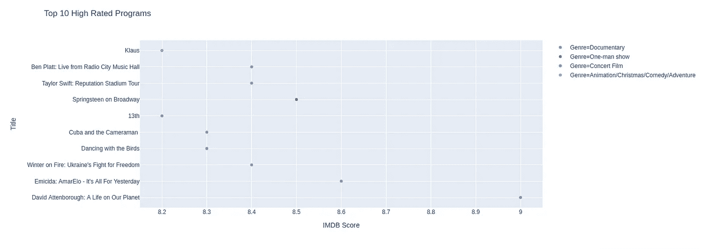

Top 10 movie with highest IMDB rating on Netflix

嗯，就是这样。恭喜你，你完成了对网飞数据集的初级分析。你可以自己多挖掘。因为你可以用数据做很多事情。而你挖掘的信息是有价值的。

**完整的 Github 代码和数据集访问都是** [**这里的**](https://github.com/imrohit007/Netflix-Analysis) **。**

感谢您的阅读。如果这篇文章内容丰富，那么一定要鼓掌并与你的社区分享。