# 使用 Python 库对 Car-Dekho 的车辆数据集进行数据分析。

> 原文：<https://medium.com/geekculture/data-analysis-on-vehicle-dataset-from-car-dekho-using-python-libraries-fab93fc52d50?source=collection_archive---------13----------------------->

## 在这篇文章中，我讨论并在 Kaggle 的车辆数据集上执行了数据科学的 5 个最重要的步骤。

[Source](https://www.nyit.edu/degrees/data_science_ms)

大家好！目前，我正在进行最后一年的项目，主要是基于数据科学和预测分析。所以我发现最好的学习方法实际上是在这个领域做一个小项目，这将给出一个更好的关于未来更大图景的想法，也帮助一些观众从中获得一些知识。

**数据分析**定义为对数据进行清洗、转换和建模，以发现对商业决策有用的信息的过程。在这篇博客中，我试图对我从 Kaggle 网站([https://www . ka ggle . com/nehalbirla/Vehicle-Dataset-from-cardek ho](https://www.kaggle.com/nehalbirla/vehicle-dataset-from-cardekho))上获取的车辆数据集进行数据分析。

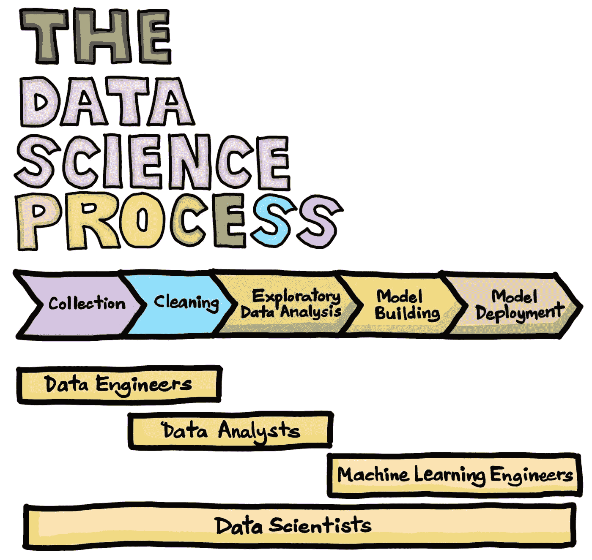

Source: [https://towardsdatascience.com/the-data-science-process-a19eb7ebc41b](https://towardsdatascience.com/the-data-science-process-a19eb7ebc41b)

任何人在开始数据分析之前都会面临的第一个问题是，我应该选择哪种语言来执行数据分析？有几十种选择，比如 Python、Matlab、R 语言等等。在数据科学领域非常受欢迎。特定平台的选择完全取决于一个人的需要和舒适度，并应相应地进行选择。在这里，我更喜欢 Python 语言，并将在 Jupyter 笔记本中使用它。(点击此链接安装 Jupyter 笔记本:( [install_JupyterNotebook](https://jupyter.org/install) )

关于该项目，将讨论的流程如下:

1.  数据收集
2.  数据清理
3.  探索性数据分析
4.  模型结构
5.  模型部署

## **导入库**

## **导入数据:**

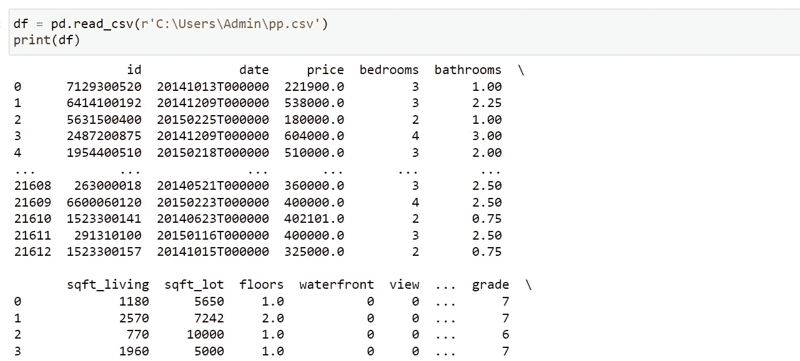

## **了解数据:**

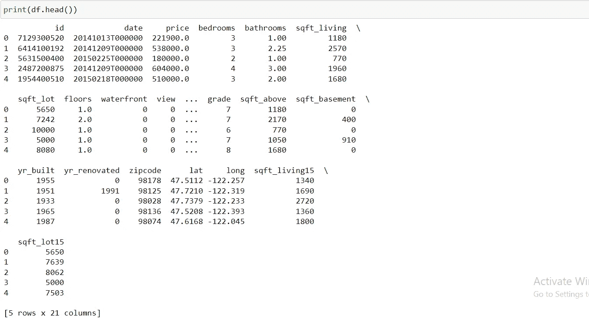

## **列名:**

## **数据帧的形状:**

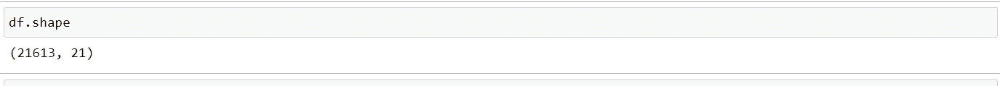

There are 21613 rows and 21 Columns

## **非空计数值:**

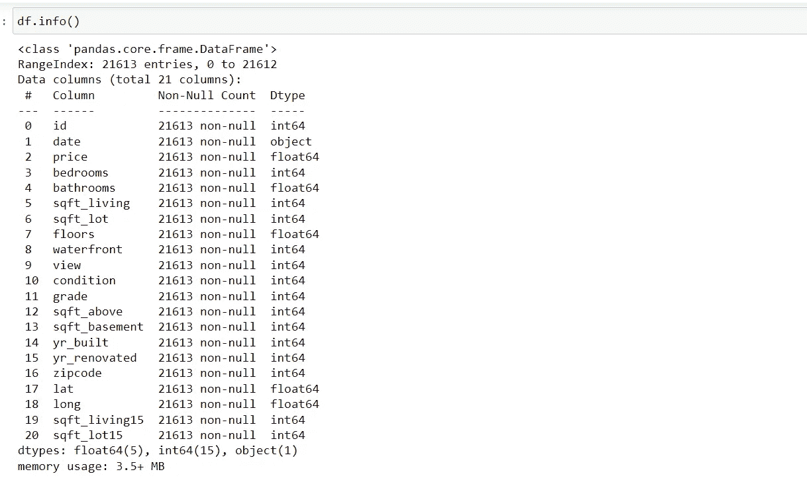

## **使用 D-tale 库的数据可视化:**

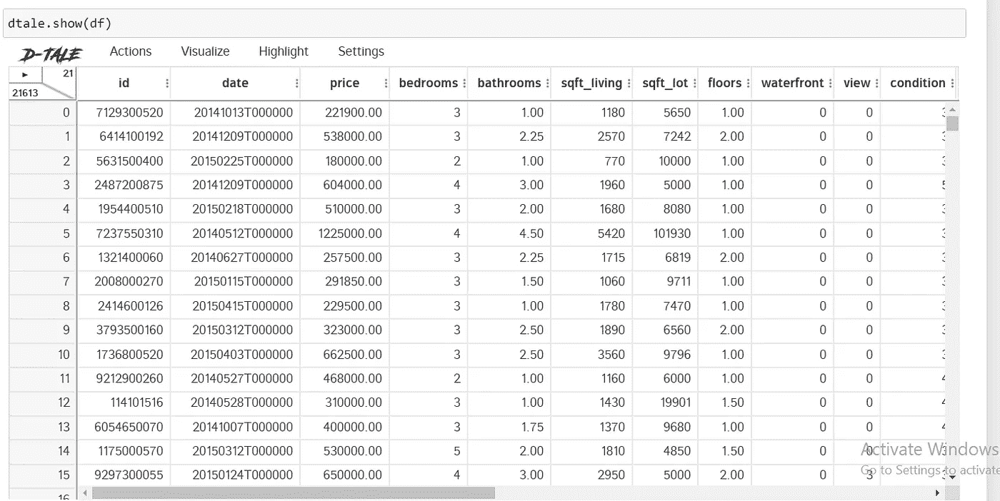

## **检查缺失值:**

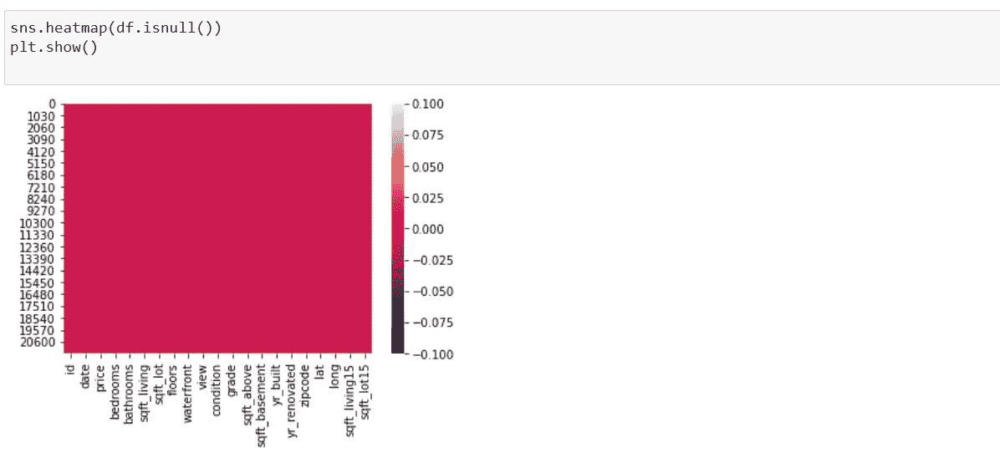

As we can see that the whole plot is unicolor with no white lines indicate that there are no missing values in the Dataframa.

## **使用 D-tale 库查看列分析:**

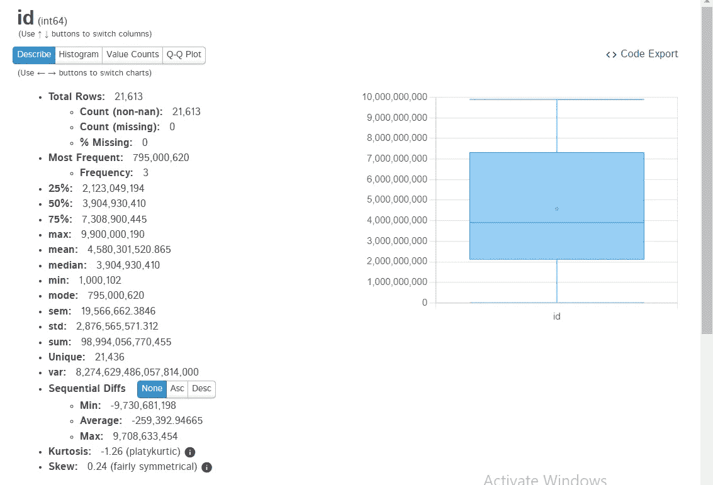

同样，可以对每个列进行列分析，以查看各种参数并进行相应的分析。

## **使用 Dtale 绘制成对图:此函数在** **数据集中绘制多个成对二元分布。**

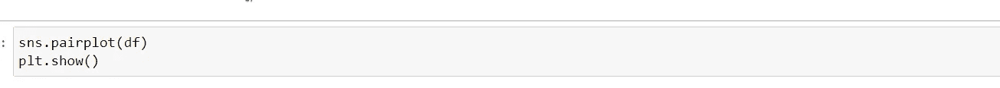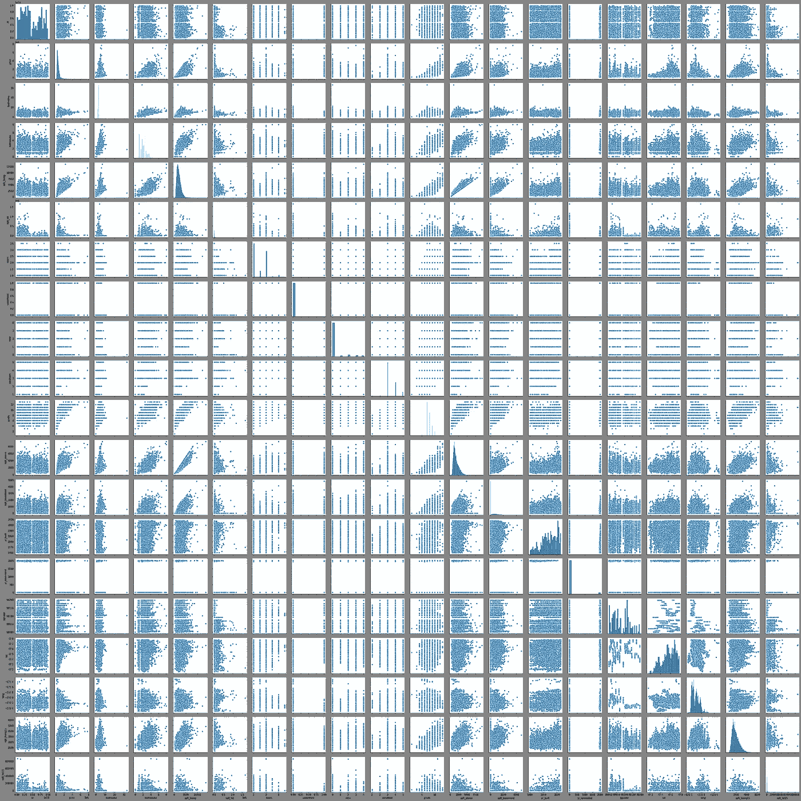

## **热图:**热图用于观察特征变量之间的相关性。

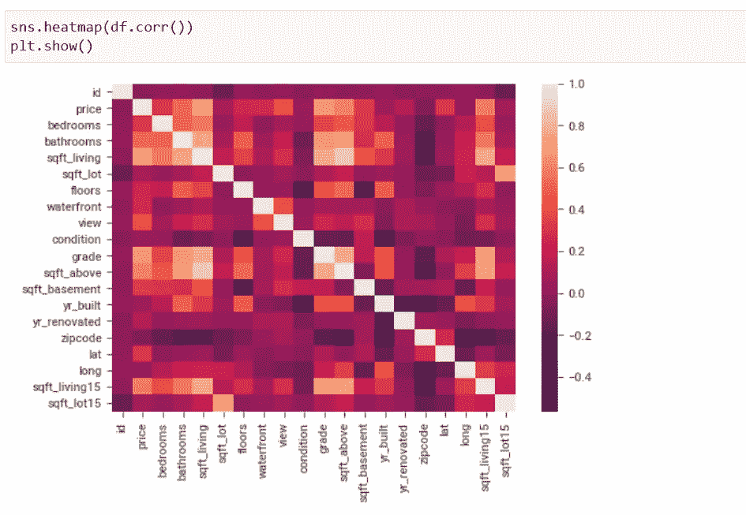

The values in the cells are Pearson’s R values which indicate the correlation among the feature variables. As we can see, these values are nearly 0 for any pair, so no correlation exists among any pair of variable

## **使用 Sweetviz 库:这个库让我们只用几行代码就能完成 EDA&节省了大量时间。**

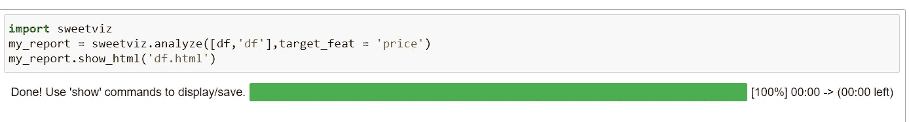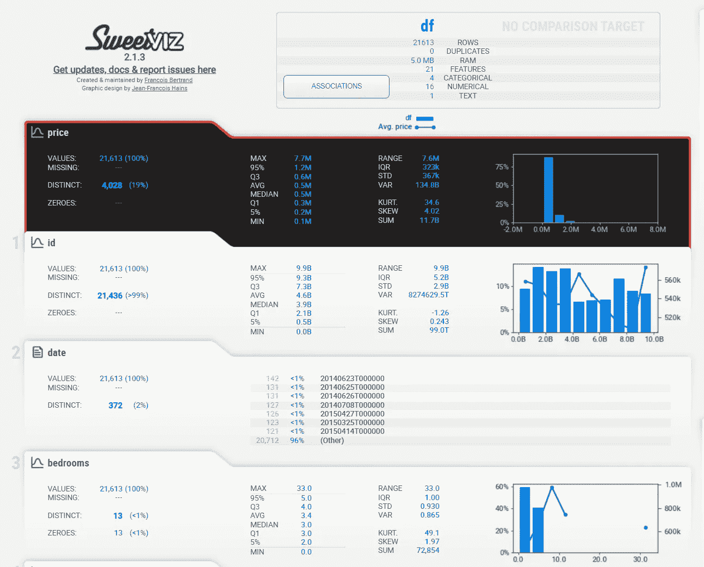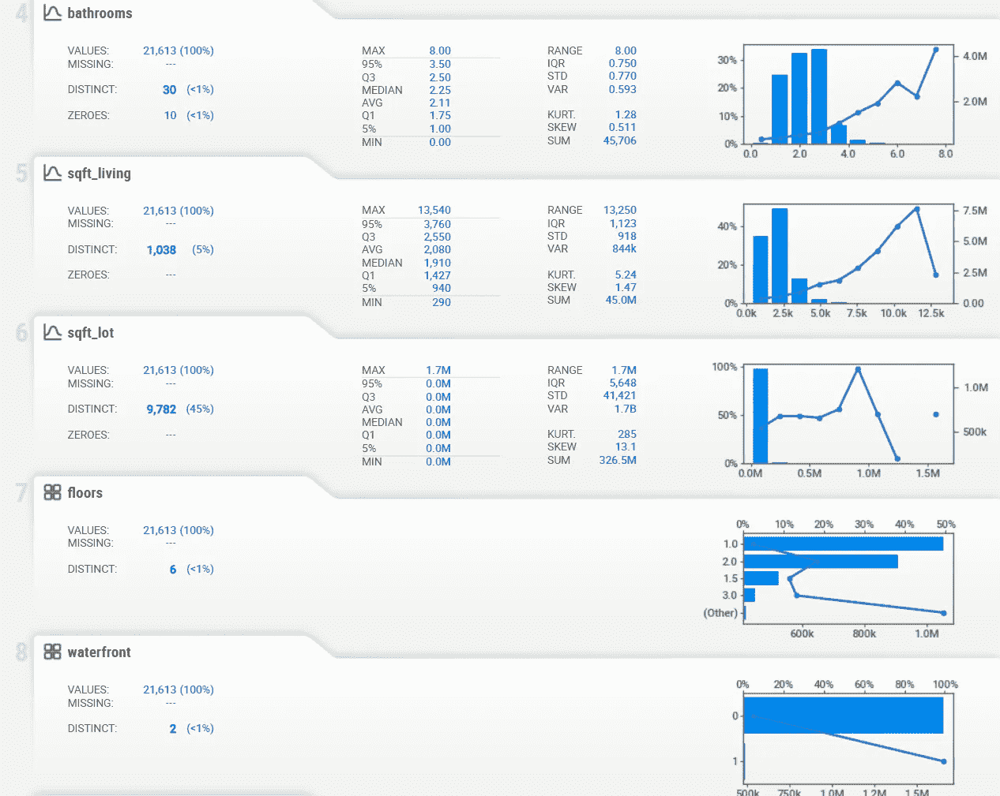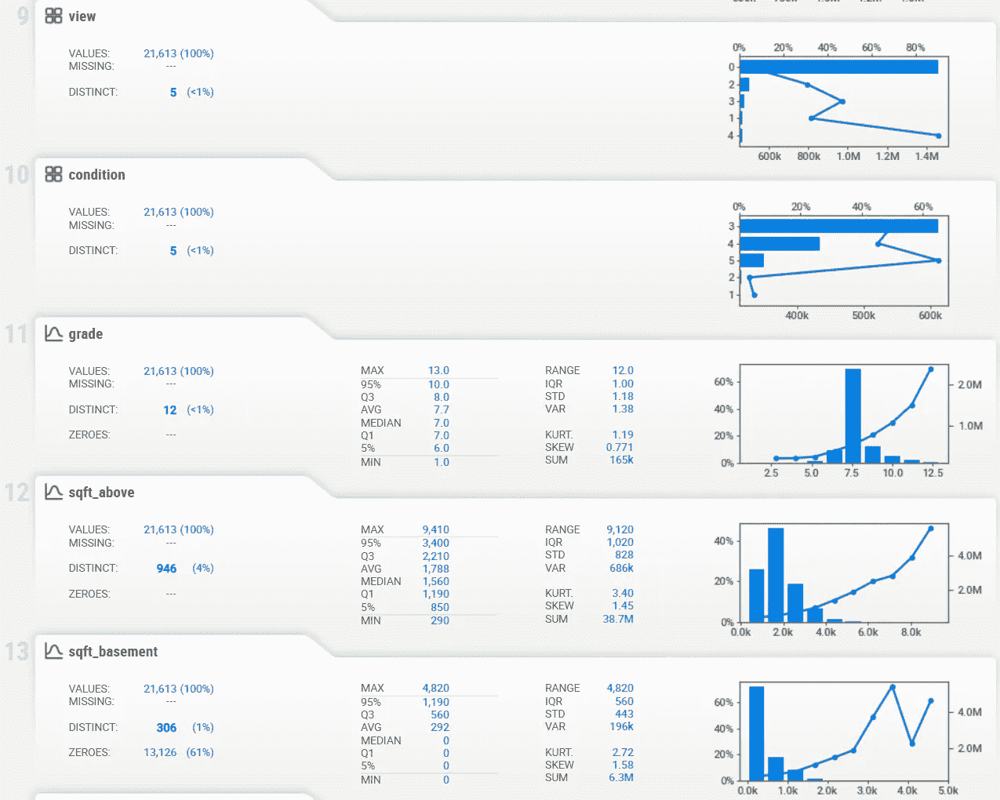

## **联想:**

■这里的**方块**是从 0 到 1 的分类关联(不确定系数&相关比率)。不确定系数是**不对称**(即行标签值表示它们向顶部的每个标签提供了多少信息)。

**圆圈**是从-1 到 1 的对称数值相关性(皮尔逊)。为了清楚起见，**微小对角线**故意留空。

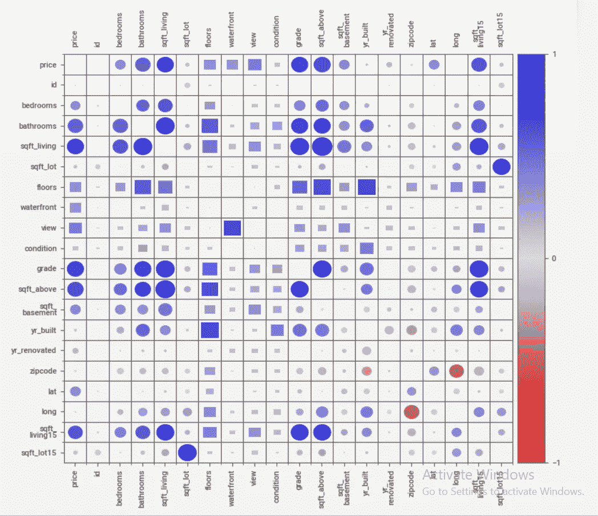

# 构建模型:

构建模型包括以下重要步骤:

1.  将父数据集拆分为训练集和测试集。
2.  选择一种算法。
3.  适合模型。
4.  检查型号。

#在这里，我们正在构建一个预测性的机器学习模型，以使用数据集中的其他特征来预测车辆的价格。

## 将父数据集拆分为训练集和测试集:

为了将样本集分割成训练集，使用 sklearn 中的 train_test_split 函数。之后，分割数据将用于训练和测试模型。

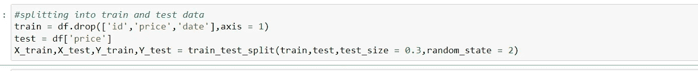

## **可视化测试&列车数据**

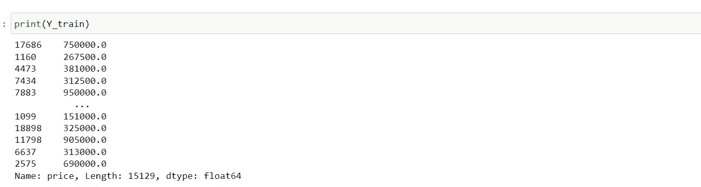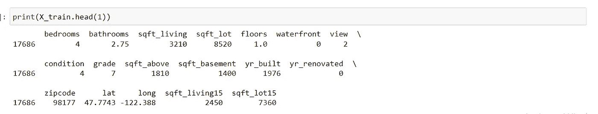

## 选择一种算法:

使用 sklearn 线性回归算法创建模型

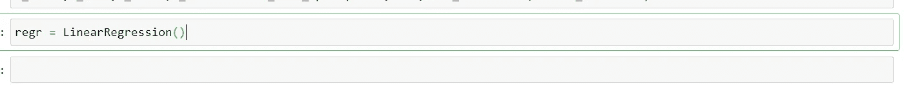

## 符合模型

现在用*训练集*来拟合模型(即训练模型):

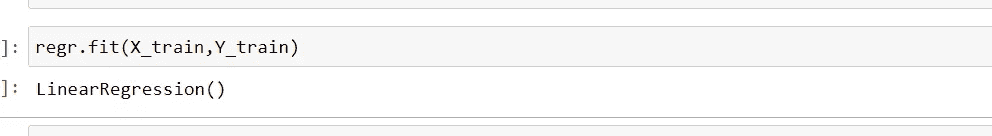

## 检查模型:

下一步是通过将训练集 X“注入”线性回归模型，评估模型使用*训练数据*预测价格的效果:

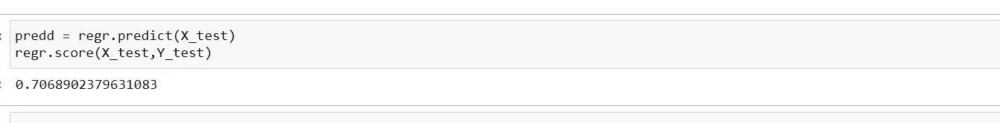

该模型的准确率为 70.68 %。通过各种技术和数据框操作，可以进一步提高该模型的准确性。

# 结语:

在本文中，我们学习了数据分析过程中涉及的一些常见步骤，并通过构建 ML 模型来完成价格预测。我们还看到了几种类型的图表和曲线图，以及每种图表和曲线图所传达的信息。在我看来，Python 是最简单易学的语言之一，它的库像 pandas、seaborn、dtale、sci-kit 等使得进行数据分析要快得多。这不仅仅是它，我鼓励你玩数据，想出不同种类的可视化，并观察你能从中获得什么样的洞察力。