# 借助 Power BI 进行数据分析

> 原文：<https://medium.com/geekculture/data-analytics-with-power-bi-89a208b7c126?source=collection_archive---------39----------------------->

我用我的机器学习知识研究数据科学技术已经有一段时间了。在使用数据科学时，数据分析对于理解数据非常重要。我想到给阿碧权力去进一步探索。这篇文章将仅仅包含一些关于如何做不同的数据分析的概念性工作。开始吧！

"D *数据分析是一种技术层面的分析，具有预测能力，可用于寻找有效的业务解决方案！现在，Power BI 是一种先进的分析工具，可以减少手动工作，并能够帮助组织做出更好的业务决策，创造可操作和有意义的结果。”*

在本文中，我将展示如何使用 PowerBI 来完成数据分析任务。数据分析包括五个阶段:1 .准备数据 2。数据建模 3。可视化数据 4。分析数据。发布和维护交货。在使用 PowerBI 完成这些阶段时，我将剖析一些非常直观的技术。首先，我们需要一些数据来连接 PowerBI。先说第一阶段！

## 准备数据:

我将使用库存、地理、营销、调查和竞争情报数据。数据集可以在[***Google Drive***](https://drive.google.com/drive/folders/1FYS1rE7EAIknT7iJoba6rPK--AA5GJHT?usp=sharing)这里找到。

要将 CSV 文件从本地计算机加载到 PowerBI:

> 获取数据— Excel/CSV —打开文件

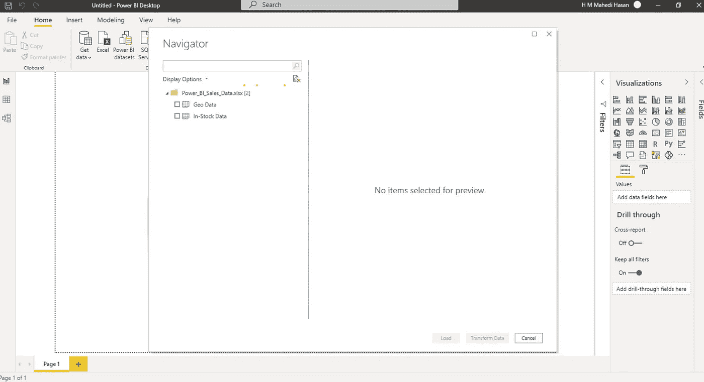

**Connecting Data to PowerBI**

有时，一个文件中可能有多张幻灯片。因此，选择一个你打算去做的。始终选择 ***“转换数据”。*** *变换数据会把你带到* ***幂查询编辑器*** *。在此编辑器中，您将预处理数据集。那么为什么要选择转换数据呢，我们来看一个例子。*

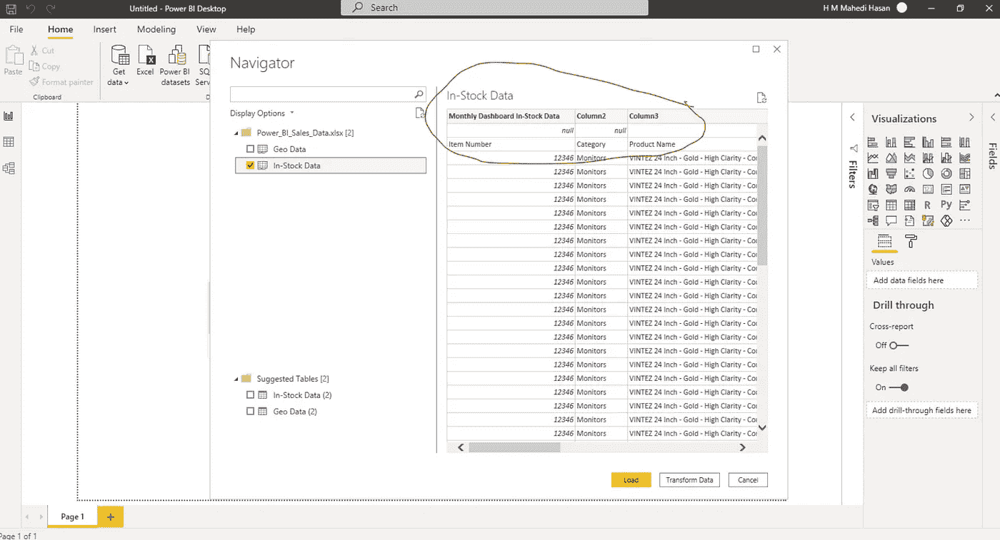

**Selecting Transform Data**

在上面的例子中，我们可以看到有一些空值，并且列标题没有正确放置。因此，我们必须在超级查询编辑器中修复它。

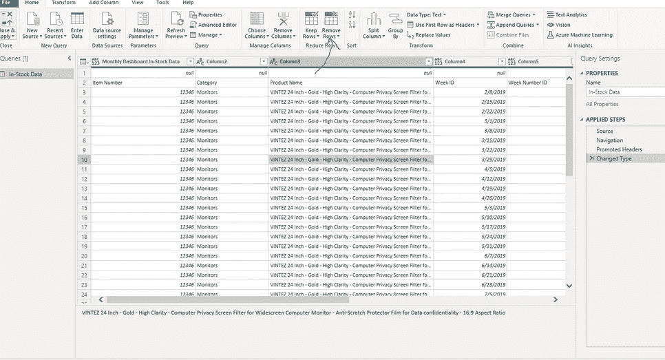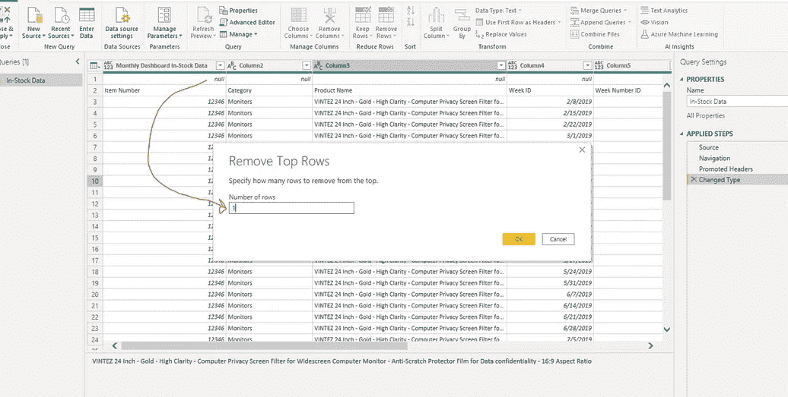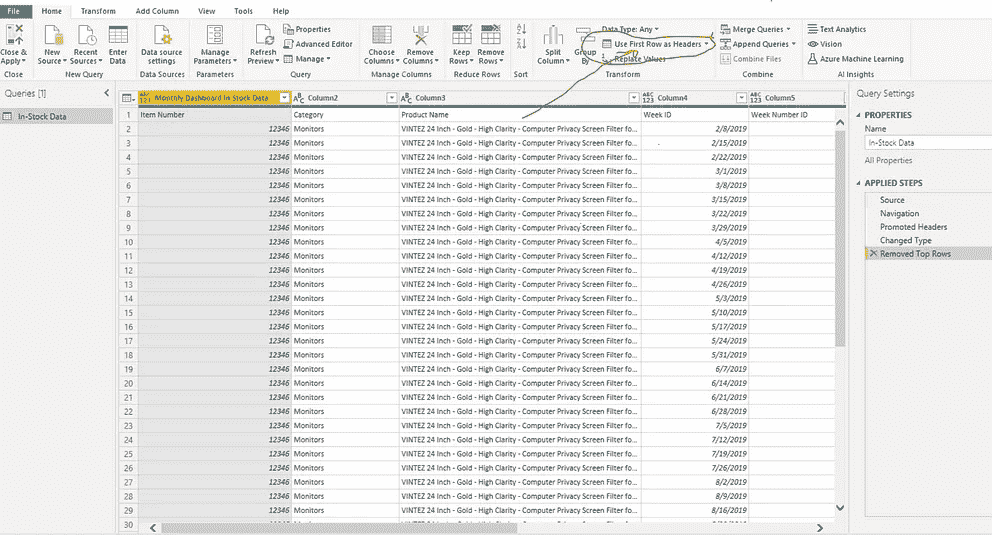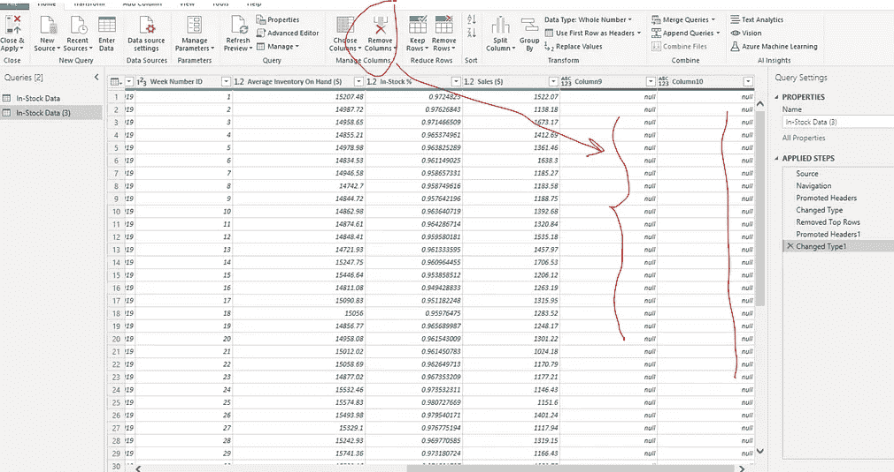

**Preparing the Data!**

在上面的例子中，我们删除了具有空值的行，使用第一行作为标题，还删除了充满空值的列。除此之外，我们还可以做****(如产品名称、周 ID)******【替换值】*** ***(如用其他值替换 null)***。这些是如何清理数据的一些基本示例。如果你看例子的右边，你可以看到 ***应用的步骤。如果你犯了任何错误，你随时可以去掉那一步，重新做。 ***有用的特性对吗？*******

> *创建数据、透视和取消透视*

*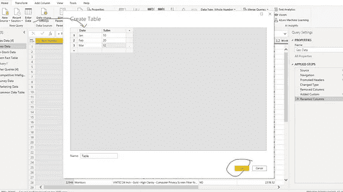**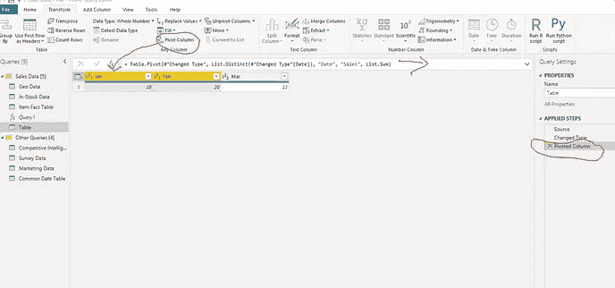**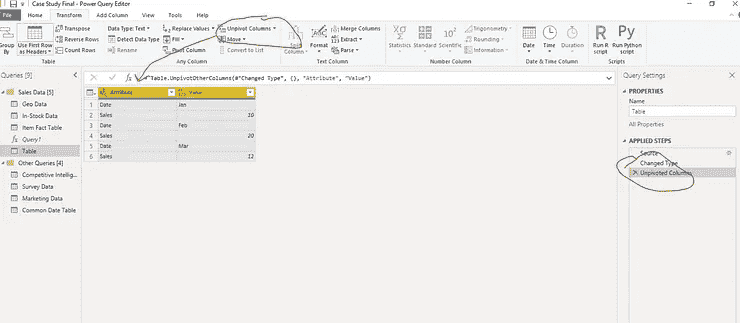*

***Create Data, Pivot, and Unpivot!***

*在这个例子中，我们在 power query 编辑器中创建了一个表来检查 pivot 和 unpivot 的特性！ ***Pivot 将第一列转换成标题(你必须选择)，其余的转换成特性。这个特性可以方便地放置你的数据集！ ***取消透视将帮助您正确地对数据进行分组(如右图)。*** 一个完美的用例是在属性列中调查问题，答案在值列中。****

## *数据建模:*

*数据建模是数据分析的核心功能之一。没有适当的数据建模，您将无法使用您的数据来正确地可视化和分析数据。因此，建模意味着根据数据之间的关系将数据连接在一起。*

*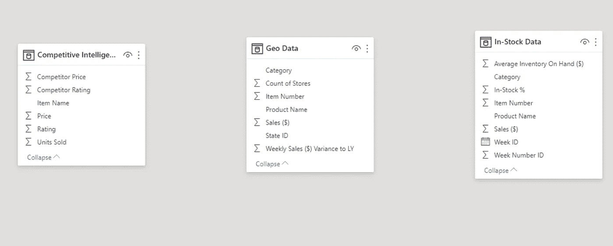*

*Before Modeling!*

*在本例中，我们已经上传了上述数据，并为数据建模阶段做好了准备。在数据建模阶段，我们将看到更多的例子。就这么办吧。首先，从表和列属性开始，你知道给它们适当的含义和描述。*

> *快速措施和新措施*

*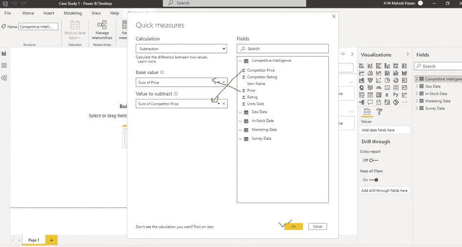**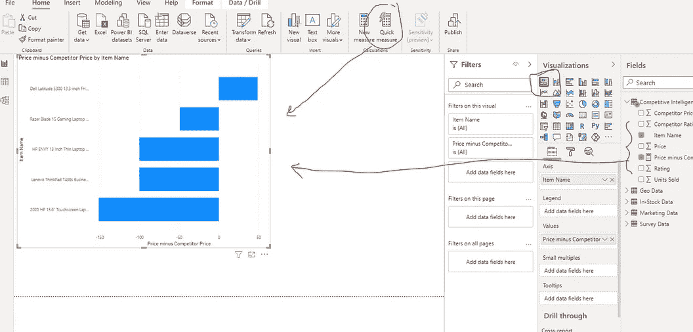*

***Quick Measures!***

*快速测量有助于立即编写您自己的方程，以从数据中找出见解。新措施也与快速措施相同。但是，新的衡量标准要求您自己编写方程式，而快速衡量标准具有一些预定义的功能，您可以在下拉式表单中使用这些功能进行填充(例如左侧示例)。*

*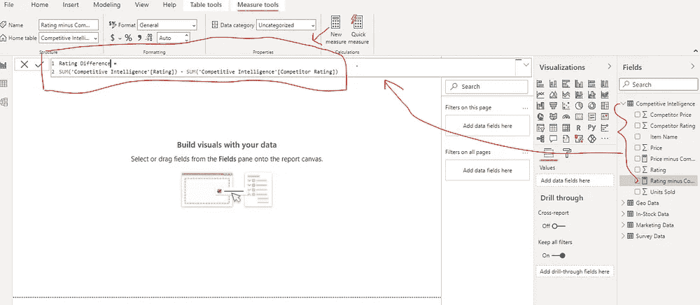**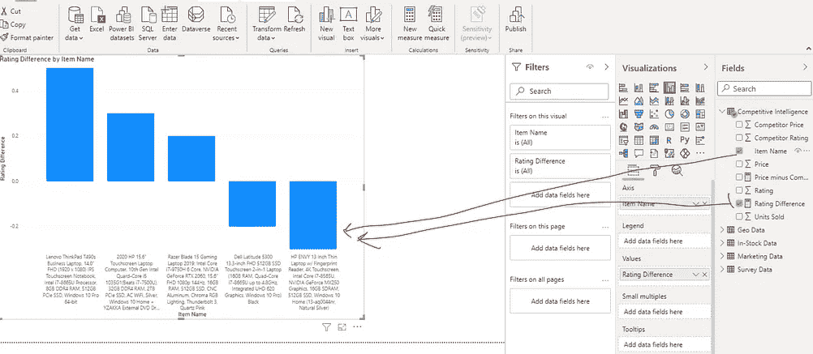*

***New Measures!***

> *解决多对多关系:*

*在解析多对多关系的情况下，您必须创建一个只包含其他表或数据的唯一列的查找表。 ***另一个有用的功能是创建一组你的数据。选择您的数据并右键单击以创建一个组，并给它们一个合适的名称。****

*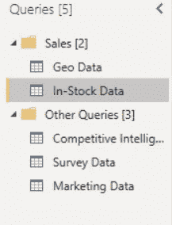*

***Grouping your data!***

*现在，我们想在地理位置和库存数据之间建立一种关系。 ***然而，现在他们却呈现出一种多对多对的关系。我们需要解决这个问题。我们将创建一个查找表。选择您的数据(如库存)，创建一个副本，并给它一个合适的名称。仅通过右键单击项目编号(基于该编号创建关系)选择唯一值，并删除重复行。从重复的数据中删除其他列！(查找表)。****

*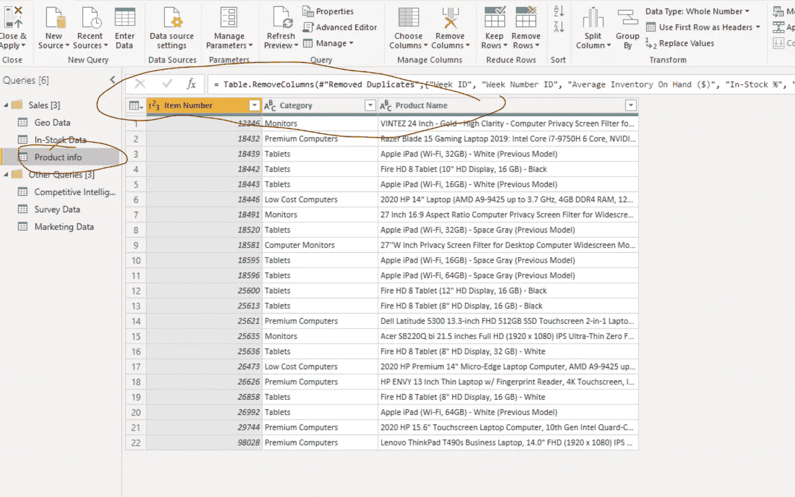*

***Lookup table!***

*现在，如果您单击“应用”并退出超级查询编辑器。您将能够使用产品信息查找表来查看地理数据和库存数据之间的关系(多对一)!*

*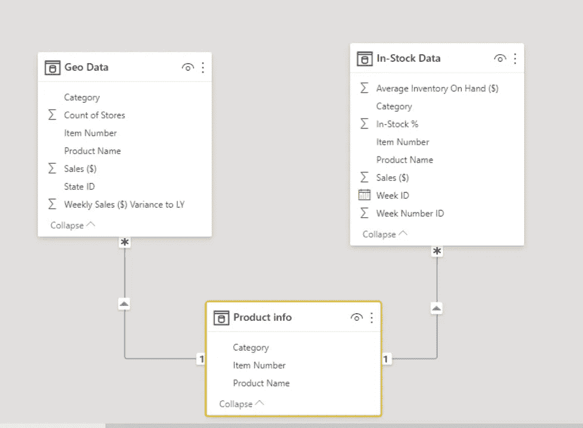*

***Many to 1 Relationship (Data Modeling)***

> *创建层次结构*

*创建层次结构有助于对列进行分组，这有助于以后正确地显示数据。让我们看一个例子。*

*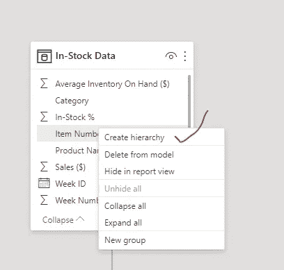**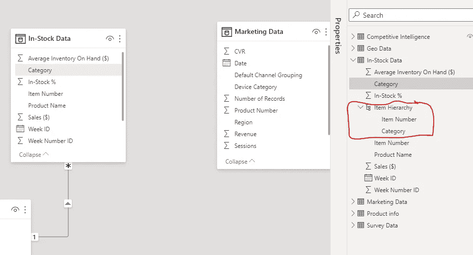*

***Creating Hierarchy!***

> *使用 DAX 的行级安全性*

*这些措施给了我们一些限制，让我们知道谁可以在仪表板上看到什么！很有用的功能！*

*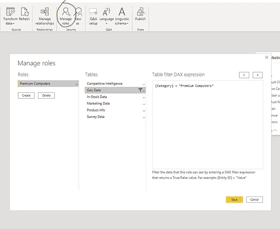**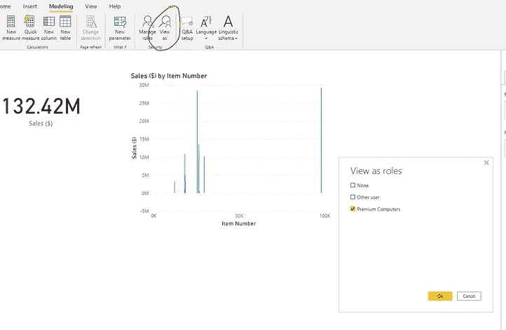**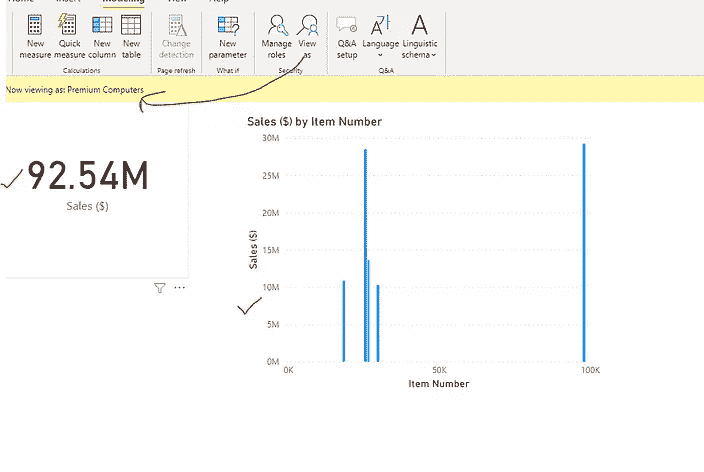*

***Row-Level Security!***

> *数据分析表达式*

*这项技术帮助我们在 PowerBI 中组合函数和操作符来构建公式和表达式。选择您的数据(如竞争价格)并点击新的衡量标准，输入以下等式:*

> *性价比= SUMX('竞争情报'，'竞争情报'[价格] —'竞争情报'[竞争对手价格] * '竞争情报'[售出单位])*

*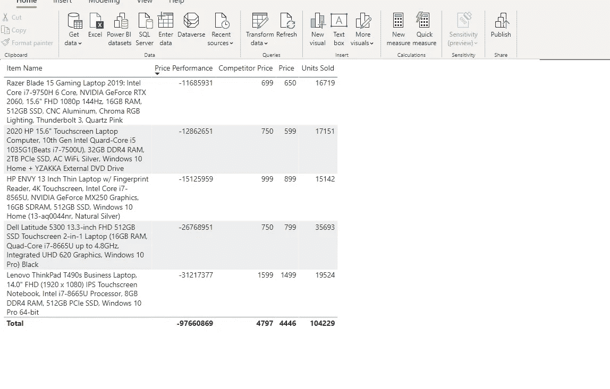*

***Dax Calculation Visualizations!***

*这些是对您的数据执行分析以决定如何对您的数据建模的一些直观示例！加上这些和其他计算，最终模型将是这样的:*

*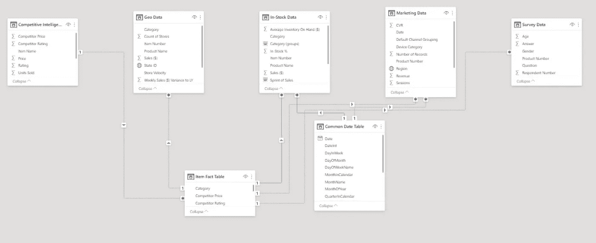*

***Data Modeling!***

## *数据可视化和分析:*

*完成数据建模后，现在我们可以开始数据可视化，以提取对数据的见解，看看它告诉我们什么！*

*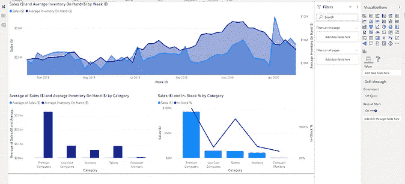**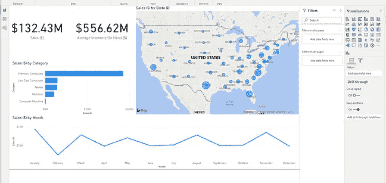**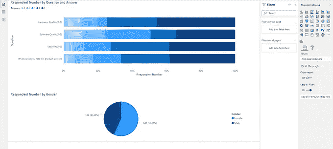*

***Data Visualization!***

**在上面的例子中，我们使用了多种工具将数据可视化来讲述一个故事。这些功能包括时间序列分析、库存分析、使用条形图按类别计算销售额、显示总销售额和库存的 KPI 卡、显示哪些州在销售额方面做得好的地图，并且对于每个类别，我们已经按男性和女性属性可视化了调查。**

> *执行数据颜色的规则*

***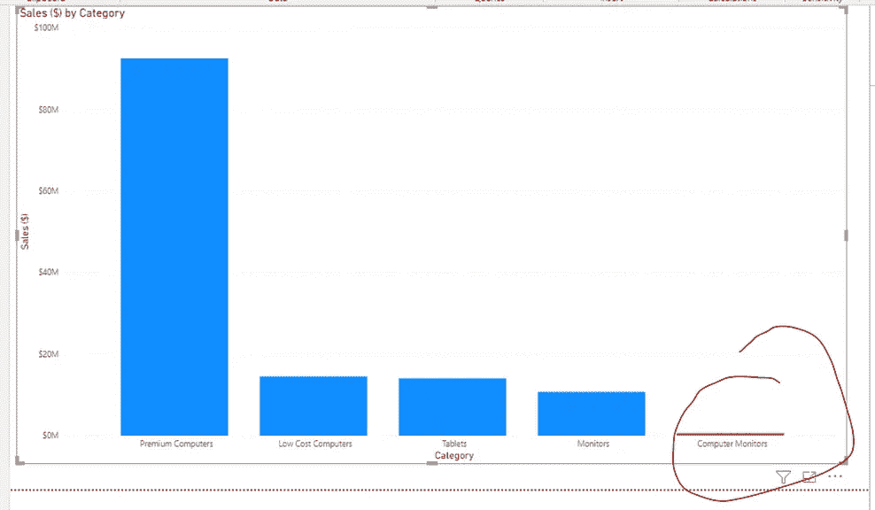*

***Rules to visualize!***

*在上面的例子中，我们设置了规则，如果销售额少于 2000 万美元，就将类别的颜色改为橙色！*

> *斯莱伊萨*

*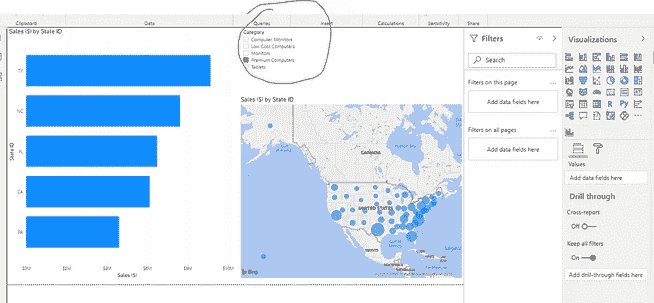**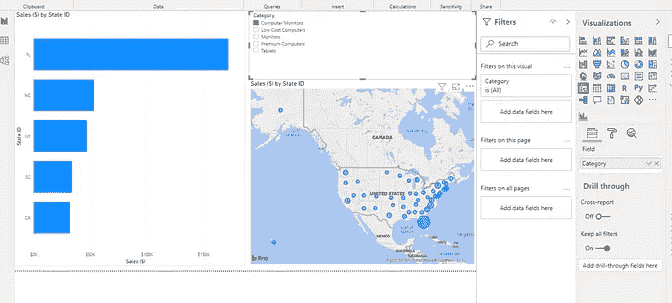**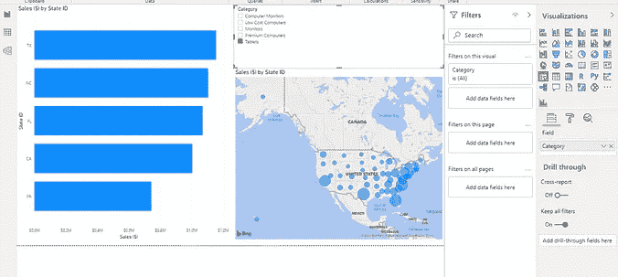*

***Slicer Example!***

*我们可以使用类别切片器来查看条形图和地图中的总销售额！*

> *分析进展*

*我们可以使用分析按钮来使用趋势线、预测和发现异常等。*

*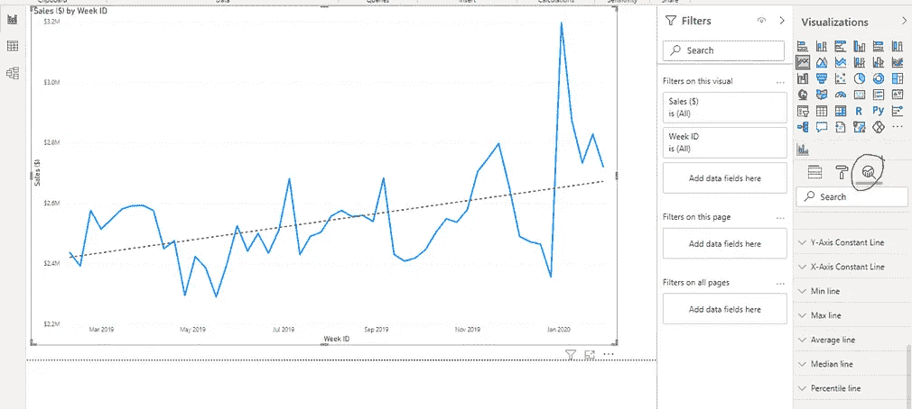**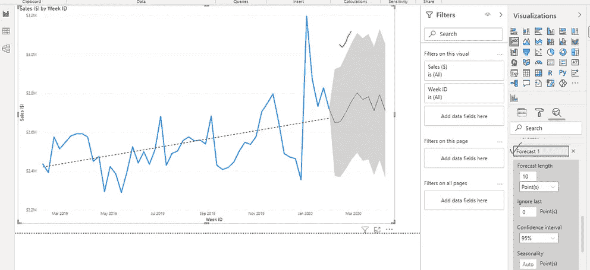*

***Analytics with tend line and forecast!***

*上图告诉我们，销售团队做得很棒！而且天气预报看起来也不错！*

> *库存数据的时间序列分析*

*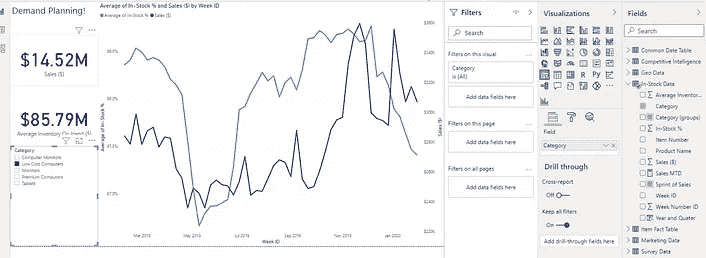**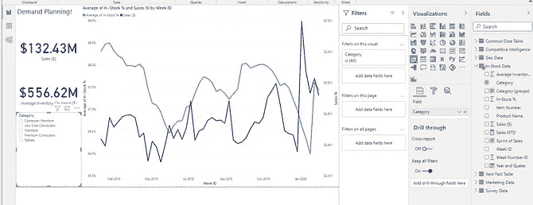***

***Time Series Analysis!***

*除了所有这些特性，关键影响者(有助于发现异常值)和分解树有时也会有所帮助！两个例子都有！*

*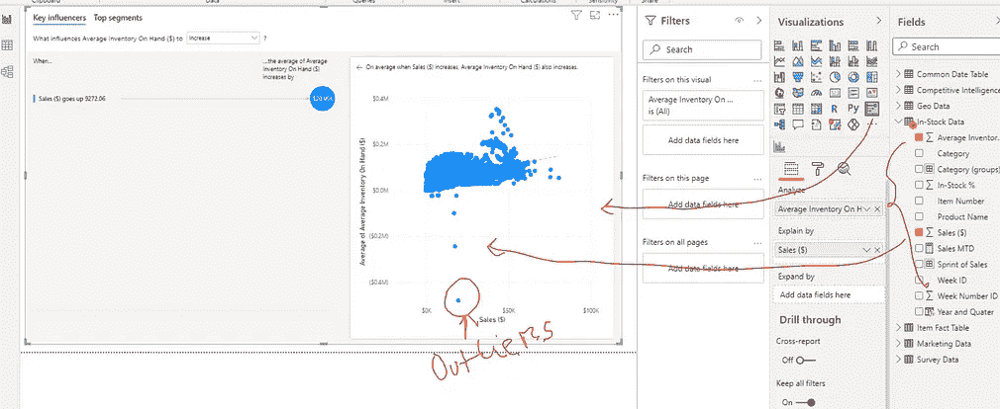**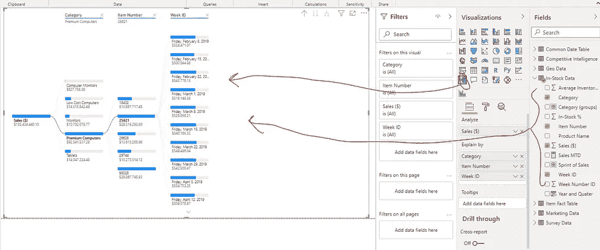*

***Key influencers and Decomposition Tree!***

*以上所有这些技术都有助于我们从数据中提取真知灼见，并根据已经发生的事情做出正确的商业决策？会发生什么？一个业务团队需要通过分析数据来找出这些答案！*

## *部署和维护交付*

*完成以上四个阶段后，现在该发表了！很简单！*

*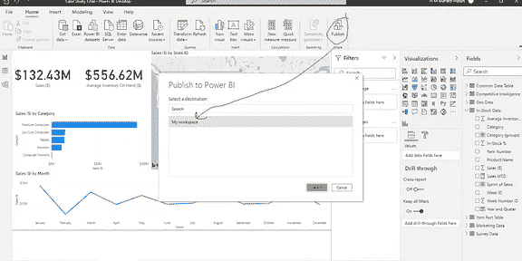**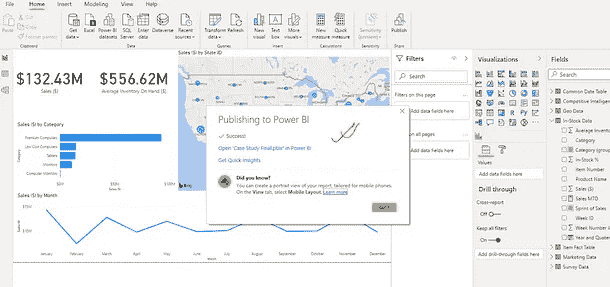**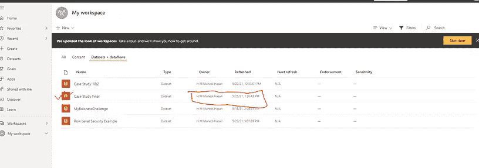*

***Publishing Procedure!***

*但是，有一些事情需要完成，即， ***安装一个网关，用于计划刷新、行级安全性、签署数据集、提供对数据集的访问、创建和管理工作区！*** 我图这个东西可以从这篇文章中分离出来，使之成为单独的一篇！*

*今天到此为止！干杯🙌*