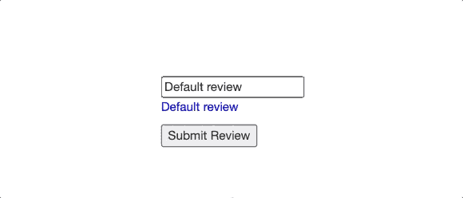

# 角度数据绑定

> 原文：<https://medium.com/geekculture/data-binding-in-angular-7b8394bbda8c?source=collection_archive---------2----------------------->

## Angular 中数据绑定技术的初学者入门


# 介绍

前端部署中的一个常见任务是用数据源中的变量填充 UI 组件的内容。在这种情况下，数据绑定是将布局中的 UI 组件绑定到应用程序中的数据源的有用工具。这在管理组件之间或组件状态和 UI 之间的数据传输时特别有用。

Angular 有几个工具可以让我们在组件状态和 UI 模板的变量之间同步数据。在这里，我们将深入研究 Angular 为数据绑定提供的工具。

# 单向数据绑定

单向数据绑定提供单向连接，将组件状态中的变量绑定到视图(DOM)。

## 插入文字

字符串插值允许您使用`{{ <variable> }}`语法将变量动态嵌入相应的组件模板中。这可用于在 html 标记中分配文本值或属性值。花括号内的任何内容都将被解析并分配给相应的绑定目标。

## 属性绑定

这允许您为模板中的 html 元素的属性赋值。在这个例子中，使用方括号将`link`赋值给`img`元素的`src`属性。

属性绑定也可以用于组件之间的通信。例如将数据传播给其子组件的父组件。在下面的代码片段中，子组件使用`@Input`装饰器公开了一个定制属性`pizzeriaLocations`。这个装饰器表示组件可以从父组件接收属性值。使用属性绑定语法`[<property name>] = value`，父组件中的属性`pizzeriaLocations`被绑定到子组件中的变量`locations`。

注意:如果`@Input`中的参数为空，子组件公开的属性名将默认为变量名(本例中为`locations`)。

Parent Component

Child Component

## 事件绑定

事件绑定允许您监听和响应用户交互。这可能是鼠标点击或移动，或击键。括号`(<event to listen for>)`在这里用来绑定到一个目标事件。在下面的 Pizzeria 组件示例中，事件绑定监听鼠标在按钮上的点击。每当点击按钮时，`onSubmit`就会执行。

在 Angular 中，还可以定义自定义事件。自定义事件允许子组件在事件被触发时将数据传输到父组件。当用户输入数据在一个组件中检索，但需要在一个单独的组件中检索时，这很有用。

为了定义一个定制事件，使用了分配给一个`EventEmitter`对象的`@Output`装饰器。在 Pizzeria 组件中，自定义事件`reviewSubmitted`向 App 组件公开。当调用`EventEmitter.emit(data)`发出一个事件时，父组件将监听该事件并通过`$event`变量访问数据。

Pizzeria Component

App Component

# 双向数据绑定

双向数据绑定是属性绑定和事件绑定的组合，它侦听事件并同时向视图更新值。Angular 使用语法`[(<property>)]`进行双向数据绑定。我们在这里使用`ngModel`指令将`review`绑定到输入值。

双向绑定语法实际上是属性绑定和事件绑定组合的简称。

```
<!-- shorthand syntactic sugar -->
<input type="text" [(ngModel)]="review"><!-- desugared syntax -->
<input type="text" (ngModel)="review=$event" [ngModel]="review'> 
```

Pizza Component



Display

数据绑定到此结束！