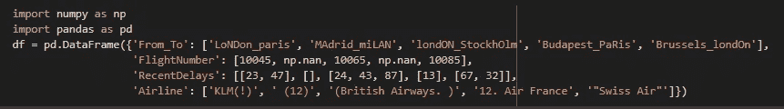
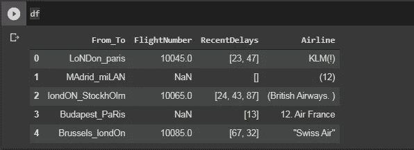
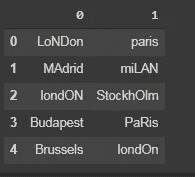
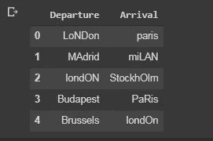
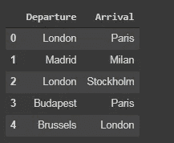
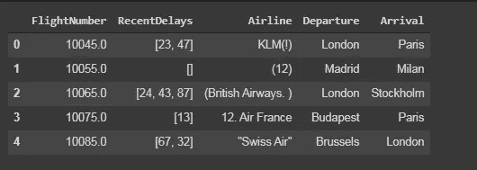
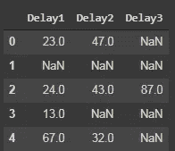
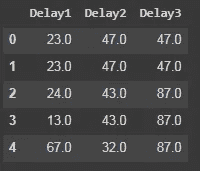
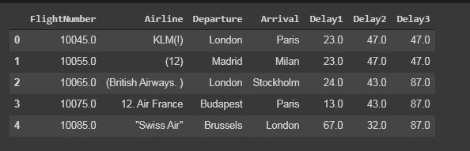
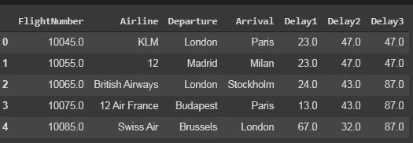

# 数据清理:优秀数据科学家隐藏的一面

> 原文：<https://medium.com/geekculture/data-cleaning-hidden-aspect-of-good-data-scientist-13e03560f231?source=collection_archive---------39----------------------->

本节将涵盖几乎所有的数据清理方法


[Source](https://www.google.com/search?q=cleaning+full+size+image&tbm=isch&ved=2ahUKEwjdv9ayq6rvAhWSHCsKHWSsBKwQ2-cCegQIABAA&oq=cleaning+full+size+image&gs_lcp=CgNpbWcQAzoHCAAQsQMQQzoECAAQQzoCCAA6BggAEAUQHjoGCAAQCBAeOgQIABAYUIepBVj8xwVgrcwFaABwAHgAgAGxAogBhhqSAQcwLjcuOC4xmAEAoAEBqgELZ3dzLXdpei1pbWfAAQE&sclient=img&ei=oyZLYJ3iI5K5rAHk2JLgCg&bih=625&biw=1366#imgrc=kfEdbSCTR7XquM)

在现实世界中，我们不会得到修改的数据，我们需要做的只是修改它本身，这里我们介绍数据清洗。一个好的数据科学家有很强的数据清理/数据修改能力。我将使用熊猫进行数据清理操作。在这篇博客中，我将为数据清理过程创建一个玩具数据集。让我们开始吧…..

**第一步:-创建玩具数据集并导入必要的库**

```
import pandas as pd
import numpy as np
```



code for toy dataframe



figure 1:-result

**步骤 2:-对 From_to 列的操作**

`From_to`列用下划线隔开，下划线前后的字符串分别定义出发地点和到达地点。

这里我们的主要任务是将到达和离开位置分成两个不同列的数据帧。

```
df1=df["From_To"].str.split("_",expand=True)
df1
```



figure 2

这里`expand=True`将拆分后的字符串展开成多列。但是在这里分割成多个列后，我们将得到列名为 0，1，2…所以我们需要重命名这些列。

```
df1=df1.rename(columns={0:"Departure",1:"Arrival"})
df1
```



figure 3

这里有一个问题，地点的名称没有以正确的格式书写。因此，在`capitalize()`的帮助下，我们将把它转换成合适的格式。

```
for i in df1.columns:
    df1[i]=df1[i].str.capitalize()
df1
```



figure 4

现在，在最后阶段，我们将从`df`中删除`From_To`列，并将`df1`与`df`连接起来。

```
df=df.drop("From_To",axis=1)
df=pd.concat([df,df1],axis=1)
df
```


figure 5

**第三步:-对航班号列的操作**

这里，我们将以 10 为增量填充 Nan 值，以便在给定数据集的行中给出有效的序列。

```
for i in range(len(df["FlightNumber"])):
    if pd.isnull(df.loc[i,"FlightNumber"])==True:
        df.loc[i,"FlightNumber"]=df.loc[i-1,"FlightNumber"]+10
df
```



figure 6

最后，我们能够以连续的方式填充所有的空值。

**步骤四:-对最近延迟列的操作**

这里我们的主要任务是将值列表转换成整数形式

```
df2=pd.DataFrame(df["RecentDelays"].tolist())
df2=df2.rename(columns={0:"Delay1",1:"Delay2",2:"Delay3"})
df2 
```



figure 7

用先前的行和列值填充所有的空值。

```
df2=df2.ffill(axis=0)  #filling the previous row value 
df2=df.ffill(axis=1)   #filling previous column values
```



figure 8

```
#dropping raw values and updating modified value in df
df=df.drop("RecentDelays",axis=1)
df=pd.concat([df,df2],axis=1)
df
```



Figure 9

**第五步:-航线栏上的操作**

如果我们看到**航空公司**列，我们会发现每个数据中都有很多不需要的值，例如标点符号、前导/尾随空格、特殊符号，即:-(，)等。在这一列中，我们将删除除字母和数字值以外的所有值。

```
import re
def cleaned(x):
    x=re.sub(r"[^a-zA-Z0-9]"," ",x)
    x=x.strip()
df["Airline"]=df["Airline"].apply(cleaned)
```



Figure 10

**结论:-**

希望你喜欢这个博客，如果你有任何建议，请在下面评论。**不断学习不断探索……**