# MS Excel 和 SQL Server 中的数据清理

> 原文：<https://medium.com/geekculture/data-cleaning-in-ms-excel-and-sql-a1a3bd652c34?source=collection_archive---------34----------------------->

MS Excel 与 SQL 在数据清理中的比较

# 目标

本文的主要目的是介绍几种使用 MS Excel 和 SQL 获得干净数据的方法

# 介绍

数据清理是确保数据正确、一致和可用的过程。数据清理非常重要，因为它提高了数据质量，从而提高了整体生产率。干净的数据有助于做出准确的决策，提高业绩和收入，节省资金和时间，并最大限度地降低合规风险。本文介绍了几种使用 MS Excel 和 SQL 清理数据的方法。

# 空

目标:用 0 替换空值

EXCEL:

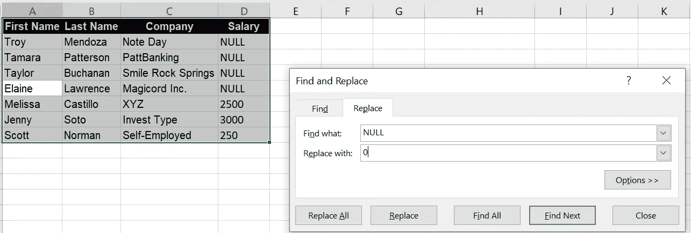

Image By Author

SQL `SELECT ISNULL(column_name, 0 ) FROM table1
OR
SELECT COALESCE(column_name, 0 ) FROM table1`

# 拼写

目标:将 Y 替换为“是”，将 N 替换为“否”，并纠正其他拼写错误

在 Excel 中，这可以通过使用查找和替换方法以同样的方式实现。在“必需”列中找到 Y 并用“是”替换“全部”

```
SQL : 
SELECT CASE WHEN IsAvailable='Y' THEN 'Yes'
            WHEN IsAvailble='N' THEN 'No'
            ELSE IsAvailable END
FROM IceCream
```

# 充满

目标:从电子邮件中找出名字和姓氏

为了在 Excel 中从电子邮件 ID 中提取名字和姓氏，我们使用了自动填充的快捷方式 **Ctrl+E** 。选择每一列并按 ctrl +E 自动填充名字和姓氏。这也可以通过使用“填充”的主页选项卡中的 **FlashFill** 选项来实现，这有助于快速填充这些字段。Excel 能够智能地理解分隔符，这有助于轻松提取名字和姓氏。

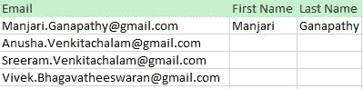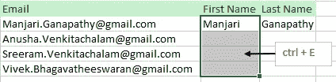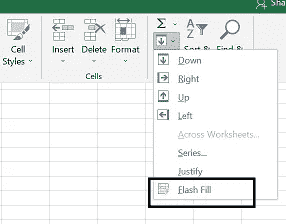

Image By Author

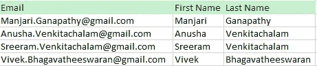

First Name and Last Name from Email. Image By Author

另一种方法是选择要拆分的单元格。选择数据**->-**文本到列- >选择分隔符并应用。

# 排序和过滤

目标:根据名字对表格进行升序排序

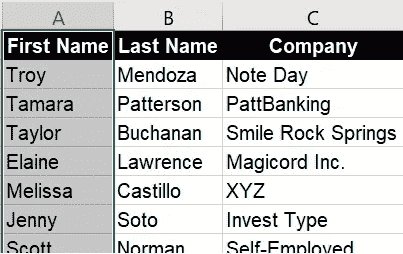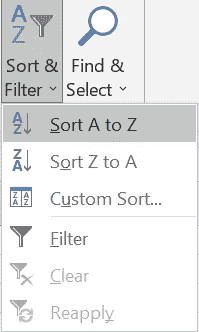

Sort First Name in Ascending order.

要筛选薪资高于所有员工平均值的员工，右键单击薪资筛选器并选择数字筛选器。您可以看到许多选项，并选择所需的选项。我们还可以根据用户要求添加自定义过滤器。

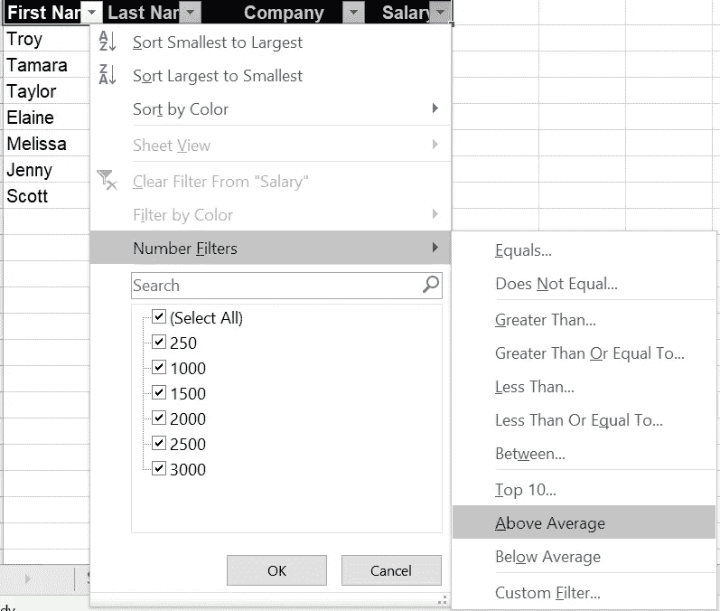

Image By Author

```
SQL:
#ORDER BY clause is used for sorting in ascending or descending orderSELECT * FROM TABLE
ORDER BY First Name ASC;
```

# 格式

目标:

*   删除^ product _ name ^中的尾随空格和前导空格
*   小写产品名称
*   将销售日期更改为“年-月”格式

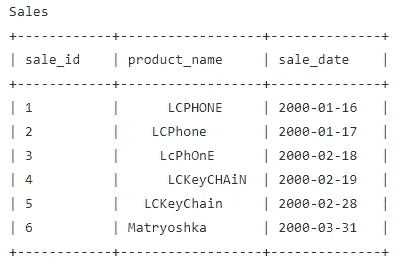

[Source](https://leetcode.com/problemset/database/)

```
Excel:
Lowercase formula: =lower(cellrange)
Trim formula: = Trim(cellrange)
Date and Month =LEFT(number of characters) or format the cells SQL:
SELECT lower(TRIM(product_name))product_name
       ,LEFT(sale_date,7) sale_date
FROM Sales
GROUP BY product_name,sale_date
```

# 复制

目标:找到重复的电子邮件并从表格中删除

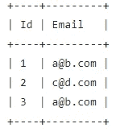

[Source](https://leetcode.com/problemset/database/)

```
EXCEL:
Select the full data, go to Data and click on Remove duplicates.
To visualize the duplicate values, we can use conditional formatting and highlight the duplicate cells or rowSQL:
#List of Duplicate Emails
SELECT email
       ,count(*) cnt_email
FROM PERSON
GROUP BY email
HAVING cnt_email > 1#To Delete Duplicate Emails
Delete FROM TABLE
WHERE Id NOT IN
       (select min(Id)
        from Person
        group by Email)
```

# 移项

目标:将行改为列

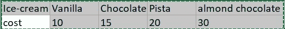

Ice-cream table

如果您需要将行转换为列，或者将列转换为行，请选择您需要转置的单元格，然后复制它。右键单击并单击选择性粘贴，然后选择转置。使用转置函数进行转置的另一种方法是使用格式{=TRANSPOSE(Range)}

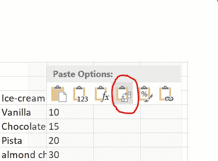

Transpose Ice-cream Table : Image By Author

# **总结**

我们已经看到了如何通过删除重复项、拼写错误、格式化、替换空值、排序和填充 MS Excel 和 SQL 来清理原始数据。