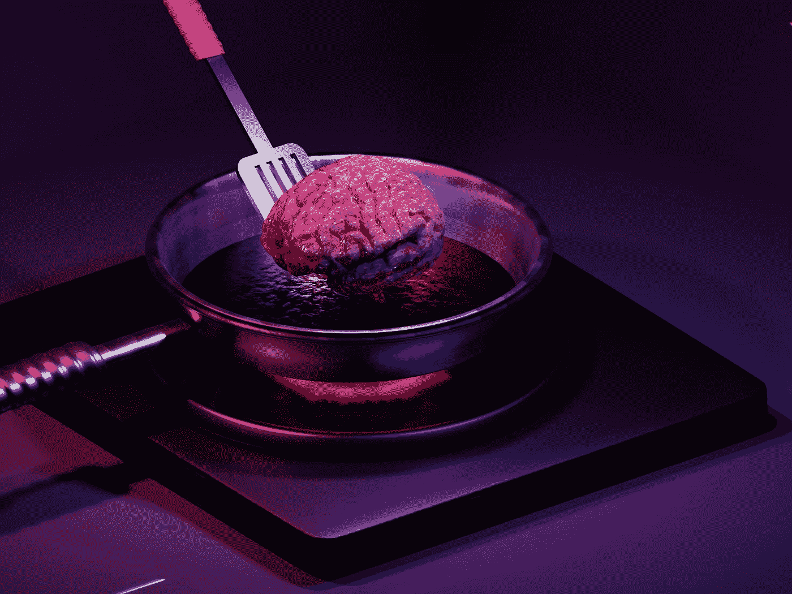

# 数据饮食

> 原文：<https://medium.com/geekculture/data-diets-b68029181b91?source=collection_archive---------13----------------------->

## 是时候开始认真思考我们给大脑吃什么了

Photo by [Anshita Nair](https://unsplash.com/@anshitan?utm_source=medium&utm_medium=referral) on [Unsplash](https://unsplash.com?utm_source=medium&utm_medium=referral)

在现代医学出现之前，节食这个概念并不真正存在。人们刚刚吃了…食物。很明显，为了维持生命，对食物的需求是普遍的。也许其中一些味道更好，或者更容易或更难制作，但食物就是食物。随着生物学和化学的突然发展，我们开始谈论…