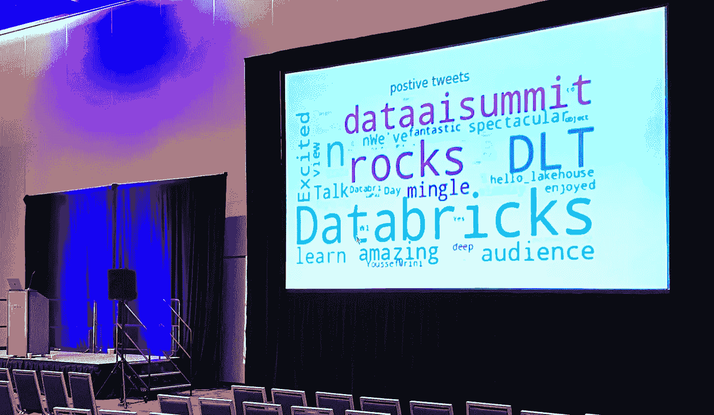
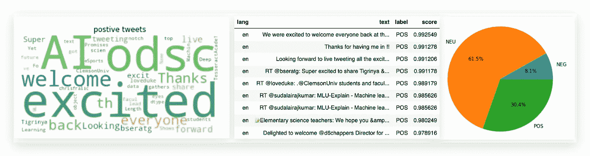

# 2022 年数据与人工智能峰会上的数据工程

> 原文：<https://medium.com/geekculture/data-engineering-at-data-and-ai-summit-2022-18651bfd29ba?source=collection_archive---------9----------------------->

## 数据管道和工作流在现代数据工程中扮演什么角色？部署它们最简单的方法是什么？流式传输数据，保证数据质量怎么样？你能在 15 分钟内扔进一些毫升吗？

# 2022 年的数据工程

组织认识到数据作为一种战略资产在增加收入、改善客户体验、高效运营或改进产品或服务方面的价值。数据确实是所有这些计划的驱动力。

Data Engineering Session at Data and AI Summit

如今，数据通常是从数百个不同的数据源流式传输和摄取的，有时是从数据交换中获取的，通过不同的协调步骤以各种方式进行清理，版本化，并为分析和人工智能而共享。越来越多的数据被货币化。

数据团队依赖于在正确的时间获得正确的数据来进行分析、数据科学和机器学习，但通常面临着满足其数据工程计划需求的挑战。

# 数据工程师的角色

数据工程师的挑战性目标是建立和运行机器，从摄取到货币化的整个过程中创造高保真数据产品。

所有这一切的核心是带有 [Delta Live 表](https://databricks.com/product/delta-live-tables)和[数据块工作流](https://databricks.com/product/workflows)的数据管道。

# 2022 年数据与人工智能峰会上的数据工程会议

我很荣幸能和我的同事 Paul Lappas 在 2022 年数据与人工智能峰会上展示数据工程会议。会议被记录下来(视频如下)，我的 [Twitter 流，三角洲直播表，拥抱脸演示](https://youtu.be/uhZabeKxXBw?t=736)在 12:15 开始。

# GitHub 回购

如果你富有冒险精神，并且喜欢复制我展示的演示，你可以从 [GitHub](https://github.com/databricks/delta-live-tables-notebooks/tree/main/twitter-dlt-huggingface-demo) 获取。

如果你喜欢这篇文章，请在 Medium 上关注我，并为它鼓掌。更多基于云的数据科学、数据工程、AI/ML 关注我[***Twitter***](https://twitter.com/frankmunz)***(或***[***LinkedIn***](https://www.linkedin.com/in/frankmunz/)***)。***