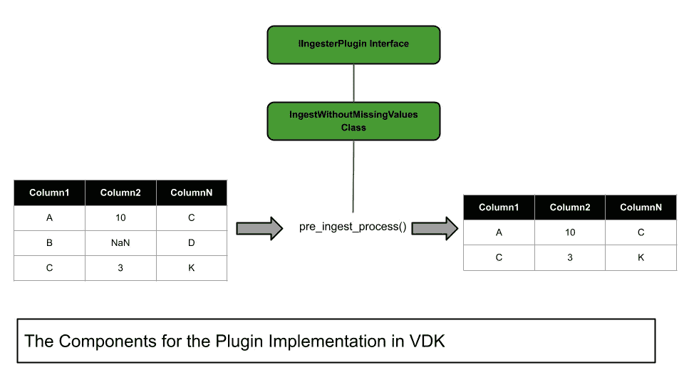

# 数据工程技巧:如何通过 VDK 清理脏数据

> 原文：<https://medium.com/geekculture/data-engineering-tricks-how-to-get-dirty-data-cleaned-through-vdk-60eeeda11ba0?source=collection_archive---------8----------------------->

## 数据工程

## 在通用数据工具包(VDK)中实现自定义数据清理插件


Photo by [Towfiqu barbhuiya](https://unsplash.com/@towfiqu999999?utm_source=medium&utm_medium=referral) on [Unsplash](https://unsplash.com?utm_source=medium&utm_medium=referral)

数据工程是组织和转换数据的过程，以便您可以使用它进行分析和决策。数据清理是数据工程的一个重要部分，因为它可以消除数据集中的不准确性和不一致性。

您可以使用不同的技术来清理数据，最合适的方法将根据特定的数据集而有所不同。最流行的技术之一是处理缺失值。

在本文中，我将向您展示如何使用[多功能数据工具包](https://github.com/vmware/versatile-data-kit) (VDK)来处理丢失的值，这是一个框架，它使得在任何云上使用 Python 或 SQL 来构建、运行和管理您的数据管道变得容易。VDK 在任何云上使用 Python 或 SQL 自动构建、运行和管理您的数据管道。

文章组织如下:

*   与数据清理相关的基本概念
*   VDK 中缺失的值:扩展`IIngesterPlugin`接口
*   VDK 的缺失值:使用 VDK 命令

# 与数据清理相关的基本概念

数据清理是使数据变得干净的过程。清理数据有不同的技术。在本文中，我将重点讨论如何处理缺失值。

缺少值是指没有提供的值。缺失值可以指表中的一列或一整行。

在数据工程中，有几种不同的方法来处理缺失值:

*   **忽略**缺失值，希望它们不要太影响结果。
*   **估算**缺失值，意思是用一些估计值填充缺失值。一种流行的插补方法称为平均值插补，用非缺失值的平均值替换缺失值。如果数据没有严重倾斜，并且没有太多缺失值，这可能是有效的。
*   **多重插补**，对每个缺失值进行多重估计，然后合并所有估计。这可能比均值插补更准确，但计算量也更大。
*   **删除**任何缺少值的行或列。如果只有几个缺失值，并且这些值在数据中分布不均匀，这种方法会很有效。

# VDK 中缺少的值:扩展`IIngesterPlugin`接口

为了执行数据清理，我将在 VDK 实现一个自定义插件。具体来说，我将实现一个扩展 VDK 提供的`IIngesterPlugin`接口的插件。

我将执行以下操作:

1.  创建骨架
2.  配置插件
3.  实现 VDK 插件
4.  编写测试
5.  运行测试

下图显示了实现的组件是如何相互关联的:



Image by Author

## 1.创建骨架和 2。配置插件

首先，您必须创建框架，它将包含您的插件树。关于如何创建 VDK 框架和配置插件的更多细节，请参考我以前的文章。

## 3.实现 VDK 插件

插件实现了`IIngesterPlugin`接口和`pre_ingest_process()`方法。关于`IIngesterPlugin`接口的更多细节，请参考 [VDK GitHub 库](https://github.com/vmware/versatile-data-kit/blob/main/projects/vdk-core/src/vdk/api/plugin/plugin_input.py)。

```
from vdk.api.plugin.plugin_input import IIngesterPlugin
from vdk.internal.builtin_plugins.run.job_context import JobContext
from vdk.internal.core import errors

_log = logging.getLogger(__name__)

class IngestWithoutMissingValues(IIngesterPlugin):
    """
    Create a new ingestion mechanism for ingesting without missing values
    """

    def __init__(self, context: JobContext):
        self._context = context

    def pre_ingest_process(self, payload):

        # Ensure all values in the payload are strings
        metadata = IIngesterPlugin.IngestionMetadata({})
        df = pd.DataFrame.from_dict(payload)
        df.dropna(inplace=True)

        return df.to_dict(orient='records'), metadata
```

我将脚本保存为一个名为`ingest_without_missing_values.py`的文件。

现在，我通过给我的插件添加一个调用来编辑`missing_values_plugin.py`脚本:

```
@hookimpl
def initialize_job(context: JobContext) -> None:
    context.ingester.add_ingester_factory_method(
        "MISSINGVALUES", lambda: IngestWithoutMissingValues(context)
    )
```

## 4.编写测试

作为进一步的步骤，我编写了下面的测试。我创建了一个`test_table`，它包含两列:`city`和`country`。

```
db_dir = str(tmpdir) + "vdk-sqlite.db"
    with mock.patch.dict(
        os.environ,
        {
            "VDK_DB_DEFAULT_TYPE": "SQLITE",
            "VDK_SQLITE_FILE": db_dir,
        },
    ):
        runner = CliEntryBasedTestRunner(sqlite_plugin)
        runner.invoke(
            [
                "sqlite-query",
                "--query",
                "CREATE TABLE test_table (city TEXT, country TEXT)",
            ]
        )
```

然后我用三行定义测试数据，其中一行包含一个缺失值。

```
def test_missing_values(tmpdir):

      ....
      payload = [
            {"city": "Pisa", "country": None},
            {"city": "Milano", "country": "Italia"},
            {"city": "Paris", "country": "France"},
        ]
```

我调用我的插件来删除丢失的值，并获取结果表:

```
def test_missing_values(tmpdir):

        ...  
        pre_ingest = IngestWithoutMissingValues(runner)

        cleaned_payload, metadata = pre_ingest.pre_ingest_process(payload)

        mock_sqlite_conf = mock.MagicMock(SQLiteConfiguration)
        sqlite_ingest = IngestToSQLite(mock_sqlite_conf)

        sqlite_ingest.ingest_payload(
            payload=cleaned_payload,
            destination_table="test_table",
            target=db_dir,
        )
```

最后，我将插件产生的结果与预期结果进行了比较:

```
def test_missing_values(tmpdir):

        ...

        result = runner.invoke(
            [
                "sqlite-query",
                "--query",
                "SELECT country FROM test_table",
            ]
        )

        output = result.stdout

        assert output == (  
        "country\n"
        "---------\n"
        "Italia\n"
        "France\n")
```

最后，我编译新插件，并运行测试:

```
pip install -e /path/to/plugin
cd /path/to/plugin
pytest
```

# VDK 的缺失值:使用 VDK 命令

或者，我可以将缺失值插件实现为 VDK 命令。我已经在我的上一篇文章中描述了如何使用 VDK 命令实现一个插件，因此，在这篇文章中，我将只关注不同之处。

首先，我定义了删除缺失值步骤:

```
class MissingValuesDropper:
    def __init__(self, job_input: IJobInput):
        self.__job_input = job_input

    def drop_missing_values(self, table: str, column : str):

        query = f"DELETE FROM {table} WHERE {column} IS NULL OR {column}  = '';"
        self.__job_input.execute_query(query)

def run(job_input: IJobInput) -> None:
    table = job_input.get_arguments().get("table")
    column = job_input.get_arguments().get("column")

    formatter = MissingValuesDropper(job_input)
    formatter.drop_missing_values(table, column)
```

该步骤从表中删除与作为输入参数提供的给定值相关的所有 null 值和空值。

接下来，我将`drop_missing_values()`函数添加到`preprocessing_plugin.py`中:

```
# Drop missing values
@click.command(
    name="drop-missing-values",
    help="Execute a SQL query against a configured database and drop missing values related to a column.",
    no_args_is_help=True,
)
@click.option(
    "-t",
    "--table",
    help="The name of the table.",
    default="my_table",
    type=click.STRING,
)
@click.option(
    "-d",
    "--column",
    help="The name of the column to clean.",
    default="",
    type=click.STRING,
)

@click.pass_context
def drop_missing_values(ctx: click.Context, table: str, column : str):

    args = dict(table=table, column=column)
    ctx.invoke(
        run,
        data_job_directory=os.path.dirname(drop_missing_values_step.__file__),
        arguments=json.dumps(args),
    )

@hookimpl
def vdk_command_line(root_command: click.Group) -> None:
    ...
    root_command.add_command(drop_missing_values)
```

该函数接收表名和要清理的列作为输入。

最后，我编写了一个类似于数据格式化描述的测试。

# 摘要

恭喜你！你刚刚学会了如何在 VDK 实现一个插件！有两种主要技术:第一种技术实现了`IIngesterPlugin`接口，第二种技术将插件实现为 VDK 命令。

你可以在 [VDK 官方知识库](https://github.com/vmware/versatile-data-kit/tree/main/projects/vdk-plugins)中找到更多关于 VDK 插件的信息。你也可以使用 VDK 已经有的插件！

这篇文章中描述的例子的代码在我的 [GitHub 库](https://github.com/alod83/vdk-examples/tree/main/plugins)中。

# 相关文章

[](https://towardsdatascience.com/how-to-create-a-data-formatting-plugin-in-vdk-dc5f1c7d206d) [## 如何在 VDK 创建一个数据格式插件

### 关于如何通过编写 VDK 自定义插件来操作数据湖中的表的分步教程

towardsdatascience.com](https://towardsdatascience.com/how-to-create-a-data-formatting-plugin-in-vdk-dc5f1c7d206d) [](https://towardsdatascience.com/handling-missing-values-in-versatile-data-kit-bb4f2a907b9c) [## 处理通用数据工具包中的缺失值

### 关于如何使用 VDK 处理缺失值来构建数据管道的教程

towardsdatascience.com](https://towardsdatascience.com/handling-missing-values-in-versatile-data-kit-bb4f2a907b9c) [](https://towardsdatascience.com/using-versatile-data-kit-to-ingest-and-process-data-from-rest-api-6e3e0660b791) [## 使用通用数据工具包从 REST API 获取和处理数据

### 关于如何使用通用数据工具包(VDK)从 REST API 获取数据的教程，以及一些关于如何安装…

towardsdatascience.com](https://towardsdatascience.com/using-versatile-data-kit-to-ingest-and-process-data-from-rest-api-6e3e0660b791) 

# 您可能也对…感兴趣

[](https://towardsdatascience.com/starting-a-career-as-a-data-scientist-57b3406a5390) [## 开始数据科学家的职业生涯

### 关于你的数据科学职业前景的建议

towardsdatascience.com](https://towardsdatascience.com/starting-a-career-as-a-data-scientist-57b3406a5390) [](https://towardsdatascience.com/getting-started-with-comet-ml-549d44aff0c9) [## Comet ML 入门

### 机器学习流行实验平台概述，并附有实例。

towardsdatascience.com](https://towardsdatascience.com/getting-started-with-comet-ml-549d44aff0c9) 

# 奖金！！！

免费阅读本书第 8 章的前 20 页【数据科学的 T4 彗星】

点击[此处](http://www.cometfordatascience.com/)并选择“获取样品！”您可以立即下载 PDF 格式的章节！