# Python 中的数据探索:使用 3 种方法测量 NHL 球员的身高和体重

> 原文：<https://medium.com/geekculture/data-exploration-in-python-height-and-weight-of-nhl-players-using-3-methods-bf33c52692ce?source=collection_archive---------21----------------------->

python 中的数据探索可以像我们希望的那样复杂，也可以不费力。可以加载一个数据集，从头开始计算每个统计数据、指标和图表。还可以使用函数来简化最常见的探索性统计数据的编码。现在也存在完整的库来为我们(几乎)自动化整个数据探索过程。有时候，最自动化的方式会很有用，但在其他时候需要更多的定制。因此，重要的是不仅要了解何时使用每种工具，还要了解如何使用每种工具。

对于这个项目，我决定简要展示三种在 python 中探索数据的方法:

1.  通过手动计算不同的汇总统计和可视化
2.  通过使用。用 pandas 的 describe()方法来大大简化汇总统计的计算
3.  通过使用自动完成大部分数据探索过程的 Pandas Profiling 库

我正在使用的数据集是我使用 nhl 数据 api 生成的这个 [nhl_bio_2020.csv](https://gitlab.com/alexistats/nhl_players_exploration/-/blob/main/nhl_bio_2020.csv) 文件。它包含生物信息(年龄，身高，体重，国籍等。)参加 2020-2021 缩短赛季的所有 NHL 球员。随着联盟中对大个子的重视，特别是防守队员和守门员的位置，我很好奇球员的身高和体重是如何分布的(同时，我也可以尝试每个人都在谈论的熊猫轮廓！).

# **数据探索方法一:手动**

首先，我们需要确保为项目安装了所有的依赖项。从终端，可以使用 pip 或 pip3 手动安装每个包，但一个巧妙的技巧是使用 [requirements.txt](https://gitlab.com/alexistats/nhl_players_exploration/-/blob/main/requirements.txt) 文件，将它存储在与 python 脚本相同的文件夹中，并使用:

```
pip3 install -r requirements.txt
```

当安装一个新的库时，可以在终端中使用下面这行代码将它添加到 requirements.txt 文件中:

```
pip freeze -> requirements.txt
```

既然我们的库已经安装好了，也不碍事了。

首先，我们将希望导入相关的库并加载数据集。

```
import pandas as pd
import numpy as np
import matplotlib.pyplot as plt
import seaborn as sns

data = pd.read_csv("nhl_bio_2020.csv")
data = data[['first_name', 'last_name', 'height','weight', 'position_name']]
print(data.head())## Results of data.head():first_name  last_name height  weight position_name
0       Josh     Jacobs  6' 2"     200    Defenseman
1       A.J.      Greer  6' 3"     210     Left Wing
2       P.K.     Subban  6' 0"     210    Defenseman
3      Scott  Wedgewood  6' 2"     207        Goalie
4       Matt   Tennyson  6' 2"     205    Defenseman
```

数据集中有很多信息，所以我把它限制在球员的名字，他们的身高，体重和位置名称，因为我对位置之间的差异感兴趣。

当查看数据的头部时，首先想到的是高度没有以我们可以很好地处理它的方式格式化。重量也可以从磅改为公斤。现在，让我们将每个身高和体重数据存储为单独的 numpy 数组，并将它们转换为我们可以更好理解的数字:

```
height = np.array(data["height"])
weight = np.array(data["weight"])## Conversion of weights from lbs to kg
x = 0
for item in weight:
    weight[x] = round(item * 0.453592, 1)
    x+= 1## Conversion of heights from feet and inches to cm 
x = 0
for item in height:
    height[x] = int(item[0:1])*30.48 + int(item[2:item.find('"')])*2.54
    x += 1
```

那么上面发生了什么呢？我遍历数组中的每一项来转换它的权重。转换重量很容易，我们只需要乘以 0.453592 的系数就可以把磅转换成千克。

对于高度，同样的循环思想，但我还必须从字符串中提取英尺和英寸作为独立的数字。然后，将这两个数字分别转换为 cm。一旦数字被提取出来，记住使用 int()函数将它们转换成整数是很重要的。的。find()字符串属性是福！它返回特定子串在字符串中的位置。因此，我可以找到英寸停止的位置。

我们的下一步是决定要计算哪些汇总统计数据，然后计算它们。幸运的是，无论如何，这些都是 numpy 中的基本函数。我决定去简单的，看着:

*   意思是，
*   标准差，
*   最低限度，
*   最大值，
*   第 25 百分位，
*   中位数和
*   第 75 百分位

身高和体重。

```
print("Mean of heights = ", height.mean())
print("Standard Deviation of height = ", height.std())
print("Minimum height = ", height.min())
print("Maximum height = ", height.max())
print("25th percentile =", np.percentile(height, 25))
print("Median = ", np.median(height))
print("75th percentile = ", np.percentile(height, 75))## Output of prints:
Mean of heights =  185.95473684210555
Standard Deviation of height =  5.488611988684077
Minimum height =  162.56
Maximum height =  205.74
25th percentile = 182.88
Median =  185.42
75th percentile =  190.5print("Mean of weights = ", weight.mean())
print("Standard Deviation of weight = ", weight.std())
print("Minimum weight = ", weight.min())
print("Maximum weight = ", weight.max())
print("25th percentile =", np.percentile(weight, 25))
print("Median = ", np.median(weight))
print("75th percentile = ", np.percentile(weight, 75))## Output of prints:
Mean of weights =  89.38631578947368
Standard Deviation of weight =  7.02560895321074
Minimum weight =  63
Maximum weight =  115
25th percentile = 84.0
Median =  89.0
75th percentile =  94.0
```

我们可以看到，NHL 球员的身高中位数相当高，只有 185 厘米多一点。我使用中位数，因为它对异常值更稳健，但似乎平均值离它不远。在极端情况下，我们看到最高的球员是一个高耸的 205 厘米(你好 Zdeno Chara！)而最小的选手是 162 cm(内森·格布)，两者相差相当大。

同样，体重中值和平均值也差不多，都是 89 kg。在这里，最轻和最重球员之间的差异是荒谬的，最轻的 63 公斤对最重的 115 公斤——几乎是体重的两倍！

我还打印了第 25 和第 75 个百分位数，但可以更容易地可视化箱线图和分布直方图，以了解我们数据的形状。

```
plt.boxplot(height)
plt.title("Heights of NHL players")
plt.xlabel("height(cm)")
plt.show()
```

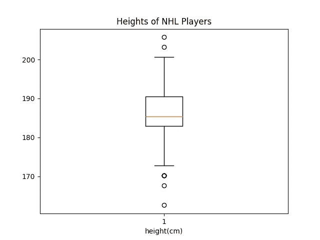

看到分位数比把它们当成数字来读要容易得多！我们还可以看到，最小值和最大值确实是异常值。从这个箱线图来看，似乎有很多球员的身高落在第 25 和第 50 百分位(中间值)之间，所以在 182 和 185 厘米之间。更高的球员有更多的分散，但 190 cm 以上的球员仍然占联盟的 25%!

```
plt.boxplot(height)
plt.title("Weights of NHL Players")
plt.xlabel("weight(kg)")
plt.show()
```

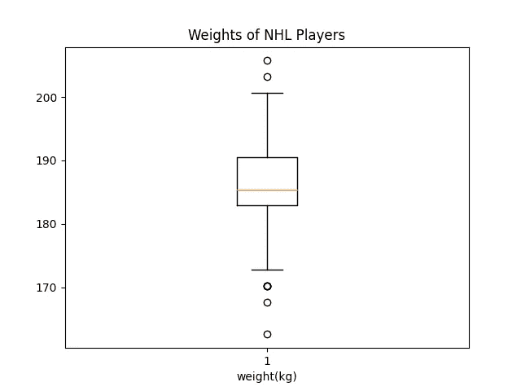

这看起来非常类似于关于高度的箱线图。这是有道理的，因为高个子球员往往更重，小个子球员更轻。

现在，让我们看看分布是什么样子的:

```
sns.set()
plt.hist(height)
plt.title("Height Distribution of NHL players")
plt.xlabel("height(cm)")
plt.ylabel("Number")
plt.show()
```

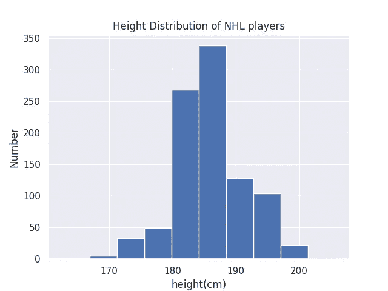

看起来 NHL 球员的身高大致遵循正态分布，我们可以更好地想象我们的标准偏差有多小。

此外，很明显，180 厘米以下的球员有一个界限，这与小球员在 NHL 找工作更难的观点一致。这一点在看数字和箱线图时并不清楚。

现在，让我们看看权重的分布:

```
sns.set()
plt.hist(height)
plt.title("Weight Distribution of NHL Players")
plt.xlabel("weight(cm)")
plt.ylabel("Number")
plt.show()
```

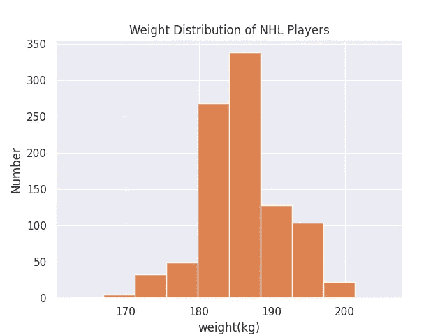

这种分布几乎是高度分布的精确复制。这些可能是高度相关的，但是我们将在未来的数据探索工具中看到它。

这都是为了数据探索的手工方法！手动计算每个指标，手动绘制每个图形需要大量重复的任务。这也容易出现人为错误，因为每个标签都需要设置和格式化得很好。不过好的是我们完全控制了产量。接下来的两种方法会更快，更不容易出错，尽管不太容易定制。

# **数据探索方法二:用熊猫描述()**

作为手动完成上述所有工作的替代方法，我们可以使用 describe()方法，该方法自动计算标准偏差、平均值、最大值、最小值、第 25 个、第 50 个、第 75 个百分点。

我们必须在 pandas 数据帧上执行转换，因为我们之前只转换了 numpy 数组:

```
data = pd.read_csv("nhl_bio_2020.csv")
data.head()
data = data[['first_name', 'last_name', 'height','weight', 'position_name', 'team_name']]

data['weight'] = round(data['weight'] * 0.453592,1)
data['height'] = data['height'].str[0:1].astype(int)*30.48 + data['height'].str[2:5].replace('"','', regex=True).astype(int)*2.54
```

并描述():

```
data["height"].describe()## I will skip weights as it is the same metrics as earlier
# data["weight"].describe()
```

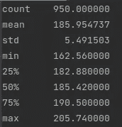

这太棒了！一行代码而不是…八行！接下来是熊猫侧写。

# **数据探索方法 3:使用熊猫图谱**

describe()很棒，因为它只有一行代码。但是，它只输出度量，没有为我们输出任何可视化。熊猫简介做到了这一点，甚至更多！它会在您的数据框架上创建一个完整的数据探索报告。

只需将 ProfileReport 从 pandas_profiling 包导入 python 脚本，并调用适当的函数，然后 tadam！生成了一个非常好的报告。

```
from pandas_profiling import ProfileReport

prof = ProfileReport(data)
prof.to_file(output_file='../pandas_profiling.html')
```

生成的报告输出到您想要的名称，在本例中是“pandas_profiling.html”。这是一个可以在浏览器中打开的 html 文件，提供了一些简洁的分布、缺失值、交互甚至相关矩阵的可视化。而且是互动的。NHL 球员的身高和体重数据生成的报告可以在[这里](https://gitlab.com/alexistats/nhl_players_exploration/-/blob/main/pandas_profiling.html)找到。

让我们从“概述”选项卡开始，看一下大项目:

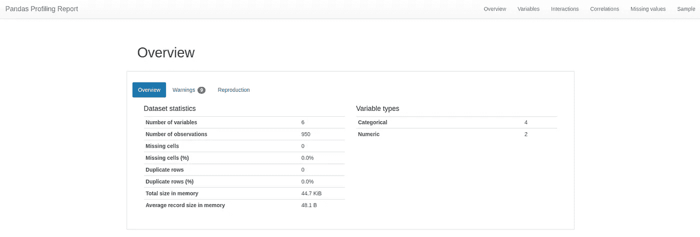

Overview 选项卡提供关于数据集的非常基本的信息:变量数量、大小、内存、缺失值、重复项等。

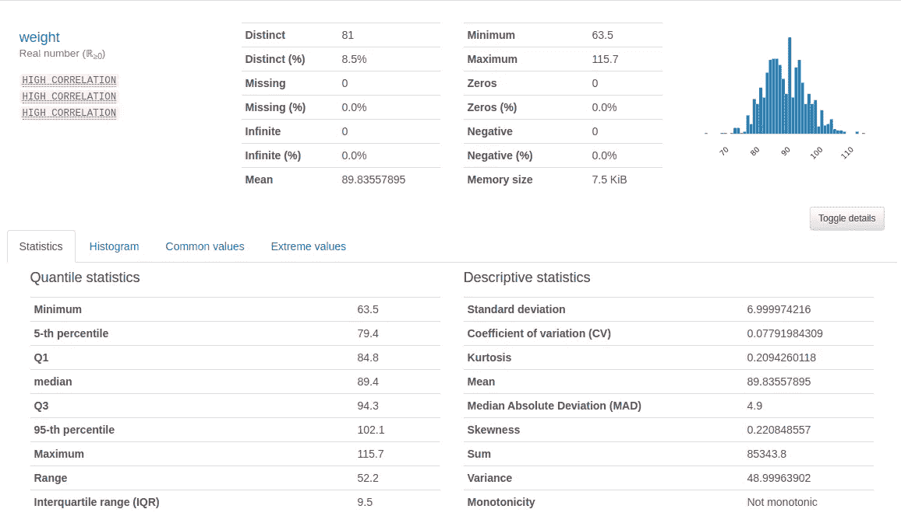

Alongside other variables, we can see a summary of our weight data

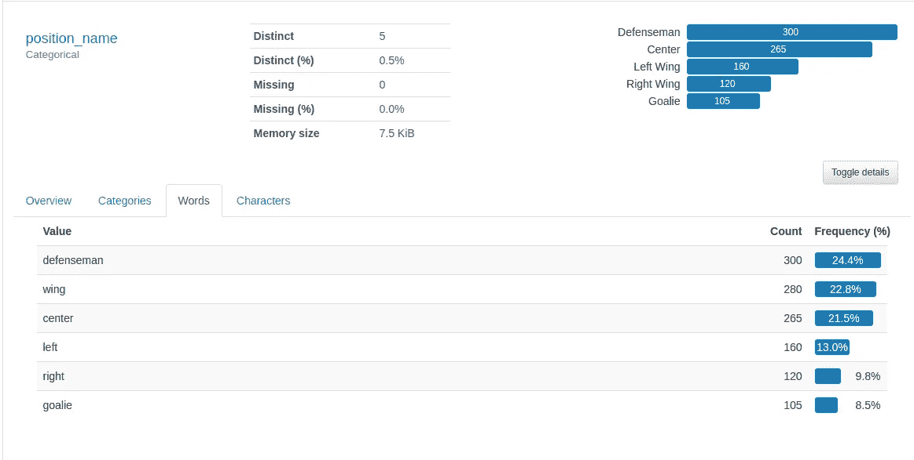

We can also see a summary for categorical variables, such as the player’s positions

接下来是“变量”选项卡，它提供了数据集中每个变量的汇总统计和可视化。无论变量是数值型的还是分类型的，总结都是不同的。

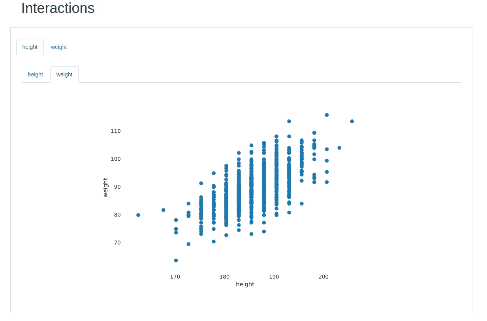

Surprise surprise, player’s height and weight look linearly correlated

下一个选项卡是“交互”选项卡，我们可以探索变量的不同组合，以可视化它们如何相互交互。在这种情况下，我们只能检查身高和体重，但是如果我们有工资信息、点数或任何其他数字变量，我们将能够探索不同的组合，并且一眼就能直观地看到每对变量之间的相互作用。

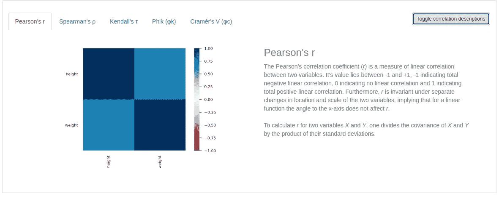

接下来是相关矩阵。Pandas Profiling 为我们提供了探索 5 个不同分数的相关矩阵的选项，我们甚至可以切换分数的描述，这在处理新分数时非常有用。

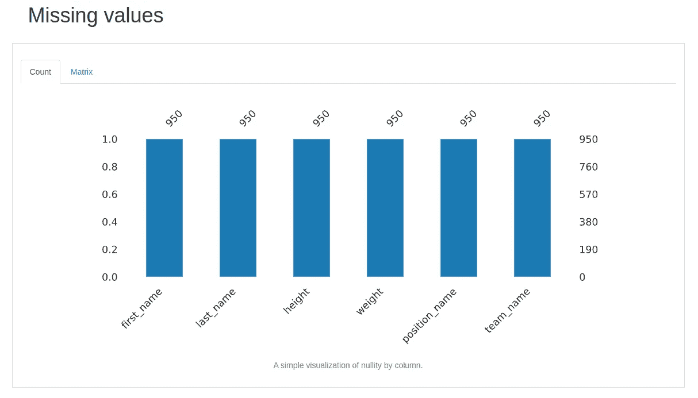

倒数第二个选项卡是“缺失值”选项卡。在这种情况下，我们没有丢失任何变量的值。但是，如果我们有一些，它会显示在这里。

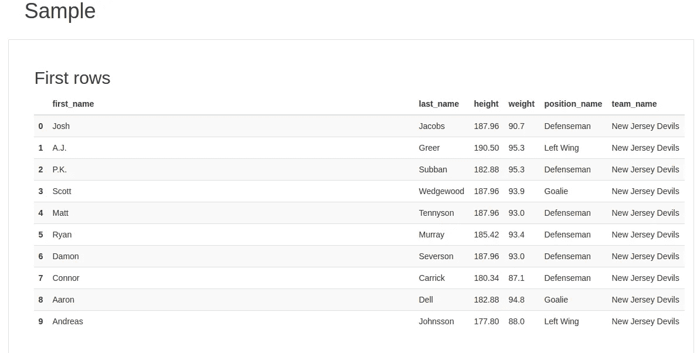

最后但同样重要的是，一个行的示例，它提醒我们。head()方法。在报告的下方还有一个“最后几行”表，所以我们可以了解数据集的前 10 行和后 10 行。

Pandas Profiling 是一个漂亮的工具，可以简化任何需要探索数据集的人的生活。