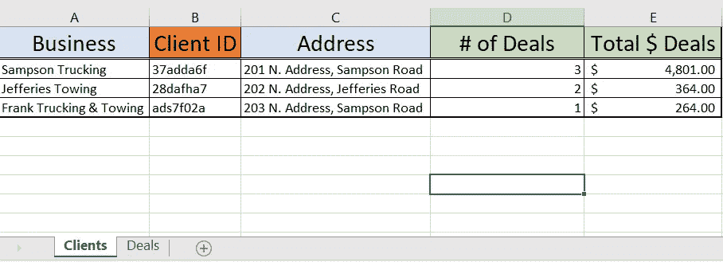
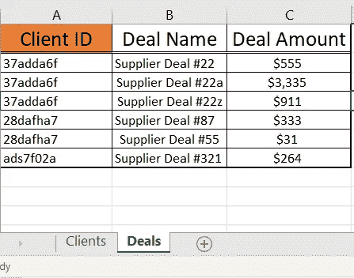
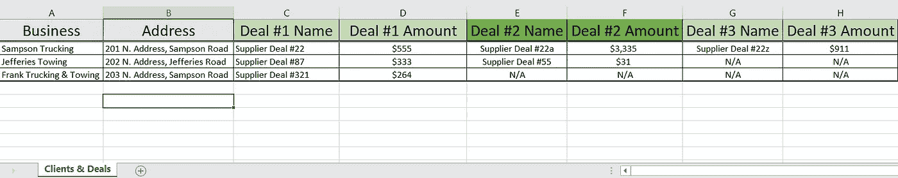
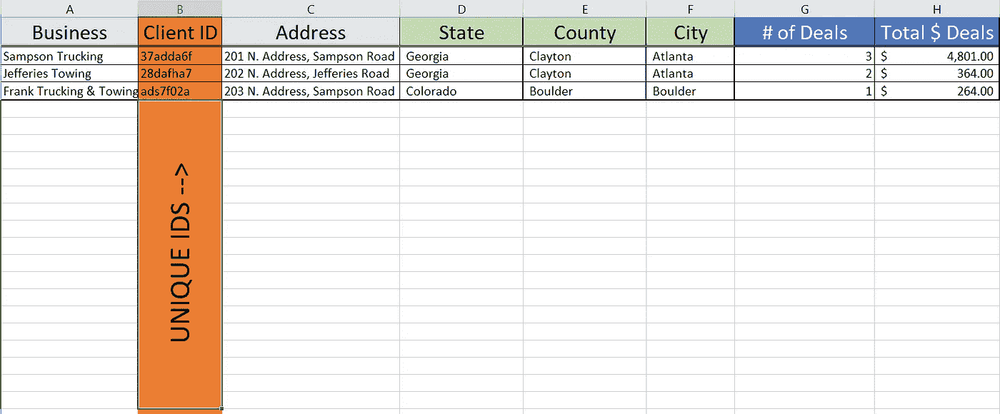

# 傻瓜数据:保存数据库的 2 个技巧

> 原文：<https://medium.com/geekculture/data-for-dummies-2-tips-to-save-your-database-ebba6befc81e?source=collection_archive---------73----------------------->

不管喜欢与否，每个人都要和数据打交道。很多情况下，人们讨厌他们的数据。为什么？

1.  他们的数据集结构不正确。
2.  随着更多数据的出现，情况变得更加混乱。
3.  当你需要时很难找到正确的数据。

别担心。正确的数据库结构可以减少这些问题。但我知道你在想什么。

> 我不是数据呆子！怎么才能学好数据库结构！？

更“无后顾之忧”！你不必是一个数据科学家，就能做出一个好的、可伸缩的数据库结构。事实上，你甚至可以在 Excel 中构建一个伟大的数据库！大家都知道 Excel，所以我就用它来教授本文中的概念。

我要给你两个提示来拯救你的数据库免于进一步的毁坏，我希望它们能帮助你爱上你的数据！

A Well-structured Database is a Happy Database :)

# 虚拟数据库结构—提示

## 技巧 1:使用子行，不要使用列

如果不在早期构建它，会导致很多麻烦的是父->子数据块。例如，如果您有一个客户(父数据)，他们也可能与您有交易或参加活动(子数据)，这是附加的(总是可以有更多的数据片段)。

**父/子数据示例:**

1.  **成员**(父)&他们的**成员活动出席**(子)。
2.  **客户**(父)&他们的**购买**(子)。
3.  **企业**(母公司)及其**员工**(子公司)。
4.  **员工**(父)及其**个人工作日**(子)。

在这些情况下，这里有一个构建父/子数据的好技巧。

> 为父数据创建一个数据表，为子数据创建一个完全独立的数据表(带有唯一的 id 匹配键)。

**良好的父/子数据结构示例**

Main parent dataset of clients

Child dataset of Deals associated with clients.

为什么？好了，为了说明为什么让我们讨论一个建立这个数据结构的坏方法。即子数据点的列。

**错误的父/子数据结构示例**

Bad Bad Bad Parent/Child Structure.

如果您目前正在像这个糟糕的例子一样组织您的数据，请不要担心。许多公司都这样做，但是让我来说服你为什么不应该使用这种结构。

想想数据点，比如网上研讨会的出席率。假设你一年做 50 场网络研讨会，人们可以参加。为客户的每个新网络研讨会数据点创建额外的列将是一场数据库噩梦。这将使你的数据集很快变得混乱，有数百列。非常快。

那么，如何避免长达 1000 列的噩梦数据集呢？

简单→ **使用 2 个数据表:一个父节点，一个 id 匹配的子节点。**

**为什么要使用父/子分离的数据集？**

1.  无论你的客户还有多少交易(子数据点)，你都可以添加更多。对于某些数据库，您有列限制。在这种情况下，**添加更多行没有限制。**
2.  不需要为新数据点(事件、交易、员工等)制作额外的列！
3.  搜索单个子数据(如客户的活动出席情况)和父数据变得更加容易。
4.  对于数据爱好者来说，最好是 SQL 查询！
5.  这是一个更干净、更少麻烦的数据库:)

所以请不要对新的子数据点使用列。使用不同的数据集，将其与父数据集连接，并保存您的数据！

## 提示#2:独特的 ID 代码将拯救你！

**这里有一个问题:**在 5-10 年内，企业会改变名称、地址、电话号码，以及与自身相关的一切。然而，很多数据库(尤其是在 Excel 中)使用那些商业名称&变化点来跟踪它们。

还有，如果一个名字在这里用一种方式拼写，在那里用另一种方式拼写，那该怎么办？如果电子邮件地址改变了怎么办？大写？如果你的文本不完全匹配，你就找不到你的数据，然后天哪，想象一下数据的混乱！

其实， ***这是一个超级普遍的问题*** ，很多数据集都深受其害。

那么如何解决这个，保存你的数据呢？简单。

> 使用唯一的 id 在您的内部数据库和报告中跟踪您的客户。

Use unique ids to track your clients.

对于外部客户报告，他们当然需要他们的名字在文件上，但是对于内部报告，唯一的 id 保持您的数据干净，并且不受名字改变之类的影响。它还有助于轻松匹配您的父母/子女数据(参见提示 1)。

当您处理大量客户和数据时，唯一 id 尤其有用，因为从统计上来说，您的客户中至少有一两个可能会在一年内改变某些东西。此外，一些客户端可能有非常相似的名称，数据库可能会出错。

因此，使用唯一的 id，跟踪您的数据点，并保存您的数据！:)

# 最后的想法

如果你正在试图构建你的数据库，很好！使用这两个技巧来建立一个健康的数据库。

如果你在一个混乱的数据库中阅读这篇文章，看看如何模仿这些提示，这样你的数据会变得更干净。:)

## TL/DR

通过为父/子数据使用单独的数据集来保存您的数据库，并使用唯一的 id 来避免名称更改的噩梦！考虑使用[数据顾问](https://processzip.com)来帮助改善你的结构。