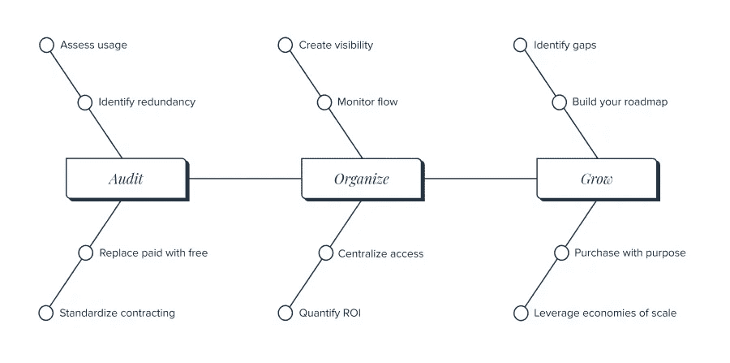
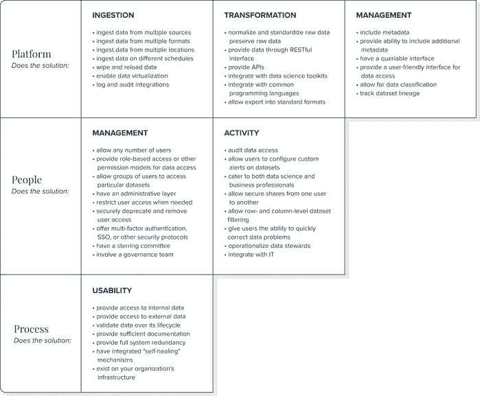

# 数据治理:业务战略的重要组成部分

> 原文：<https://medium.com/geekculture/data-governance-a-crucial-part-of-your-business-strategy-4cf5c405ca4b?source=collection_archive---------16----------------------->

自 2018 年 7 月以来，欧盟《通用数据保护条例》已对超过 [€处以 2 . 74 亿](https://www.enforcementtracker.com/?insights)的罚款。其中大部分([超过€2.28 亿](https://www.enforcementtracker.com/?insights))是因为“数据处理的法律基础不足”和“确保信息安全的技术和组织措施不足”，这意味着大多数违规组织缺乏关键的政策和基础设施组件来使其合规。

这些处罚是新监管现实第一波浪潮的一部分；这是对几十年来狂野西部实践的回应，这些实践导致了个人数据和数据基础设施的猖獗滥用，这些数据基础设施旨在引入数据，但不监控数据是如何被使用的。

尽管罚款 2.5 亿欧元，GDPR 迄今为止相对温和，通常针对不会因罚款而陷入财务困境的大型组织(罚款可高达[€1000 万欧元或该组织全球年收入的 2%](https://www.enforcementtracker.com/?insights) )。但种种迹象表明，GDPR 才刚刚开始。2018 年 7 月至 12 月期间，仅执行了 9 项罚款。这个数字在 2019 年飙升至 144 辆，在 2020 年更是达到了 326 辆。对于还没有看到不祥之兆的组织来说，宽限期即将结束:数据治理是一项业务需求。

## 什么是数据治理？

这给任何不确定数据治理到底是什么的组织带来了一个问题。没有普遍适用的定义。对某些人来说，治理意味着数据安全和隐私。对其他人来说，治理是关于数据管理和质量的。

事实上，数据治理是两者兼而有之。上面提到的两种 GDPR 罚款说明了数据治理作为一个概念的分层性质。第一个是强加给还没有建立*为什么*他们正在使用数据的组织，第二个是强加给还没有建立*如何*的组织。

然而，良好的数据治理的核心是一个系统，它概括了管理数据、实现数据驱动的结果和维护数据安全所需的流程、人员和平台。正确的数据治理是组织更有效地使用更多数据的一种方式，同时围绕谁在使用数据以及他们使用数据的目的创建更强的保护措施。

## 数据治理的业务优势

建立良好的数据治理不仅仅是为了避免监管罚款。数据经济正在发展，数据驱动的组织将塑造商业格局。他们已经是了。

苹果、谷歌和亚马逊是数据第一的组织。他们在不同的领域运作，但他们的核心是找到了如何有效地操作数据的方法。对公共和第三方数据的访问增加、人工智能的兴起和日益分散的劳动力强调了良好治理的数据可以为各种规模的组织带来的好处，前提是他们能够找到正确使用数据的方法。

结果是，任何使用数据的组织都需要一个数据治理策略。然而，该政策的性质是灵活的。数据治理不是一套严格的原则，而是一个适应实施它的组织的目标的框架。公共图书馆使用数据的方式将不同于财富 500 强使用数据的方式，但会有相似之处。对于任何组织来说，找到一种安全的方法来查找新数据、集成数据并监控数据随时间的变化是至关重要的。

## 如何实现数据治理框架

组织开始实施良好的数据治理的最佳方式是评估他们的运营目标:

*   你的障碍是什么？
*   你的数据盲点在哪里？
*   您的数据团队由什么组成，他们大部分时间都在做什么？

良好的数据治理策略既要考虑数据使用的主流法规要求，又要考虑组织中最终用户的特定需求。只考虑安全性的策略可能会忽略可用性部分，即需要访问数据的最终用户。这可能会导致削弱该政策的变通办法。

另一方面，仅考虑运营目标的策略将不合规，并增加违规或罚款的风险。走钢丝的良好数据治理意味着平衡组织的目标和数据隐私法，而不在任何一方面妥协。卓越的数据治理增强了运营成效，同时提高了合规性。下面是在您构建和部署数据治理策略时要遵循的大致框架:

来源:[将灵活的数据治理添加到您的组织中](https://www.thinkdataworks.com/add-flexible-data-governance-into-your-organization)

当您开始实施数据治理解决方案时，有一些问题要问，以确保它符合您的整体战略。

其中一些问题可能是文化上的——我们想成为什么样的组织？对于个人身份信息，我们想采取什么方法？这些都是政策上的考虑，仔细考虑是很重要的。

但是，组织经常将大量精力放在政策问题上，而忽略了支持该政策的流程。说你的组织不处理 PII 是相对容易的——你如何在技术上管理它是一个不同的问题。

当谈到创建良好的数据治理时，需要考虑实际的具体基础设施问题。这些问题可能感觉有点“无关紧要”,但它们恰恰是会使一个强大的数据治理策略出错的考虑因素:

*   我们如何共享数据？
*   我的数据环境是否从多个位置收集数据？
*   我如何监控数据的使用？
*   我如何管理元数据？
*   我如何确保数据的质量？

## 数据治理清单

下面的清单通过将数据治理分为三个主要部分来概述数据治理:平台、人员和流程。该列表中的项目旨在确保您实施的数据治理框架是健壮的、全面的和可扩展的。

来源:[将灵活的数据治理添加到您的组织中](https://www.thinkdataworks.com/add-flexible-data-governance-into-your-organization)

## 业务成果

首先提出困难的问题是一种避免在你向它扔数据时不得不重新构建和重新设计整个解决方案的方法。

好处是显而易见的:除了在一个越来越重视基于 ESG 原则的业务的世界中变得合规，良好的数据治理还有真正的优势。打破信息孤岛，增加业务成果，加速人工智能和人工智能，更好的数据质量，更好的数据分析-良好的数据治理带来更好的数据成果。

数据治理是由技术成熟度支持的政策决策。了解组织中谁在使用数据、他们使用数据的原因以及他们的关键运营目标将有助于您设计一个以组织和人员为中心的数据治理战略。实施这一战略需要一个基础架构来支持数据的安全传播，确保数据访问标准化，并让数据科学家和业务专业人员信任他们用来做出更好决策的信息。

您认为您的企业需要一个数据目录来查找、理解和[使用可信数据](https://marketplace.namara.io/)来推动业务成果吗？[请伸出手。](https://meetings.hubspot.com/eugene)

*原载于*[*https://blog.thinkdataworks.com*](https://blog.thinkdataworks.com/data-governance-the-next-big-thing-in-business-strategy)*。*