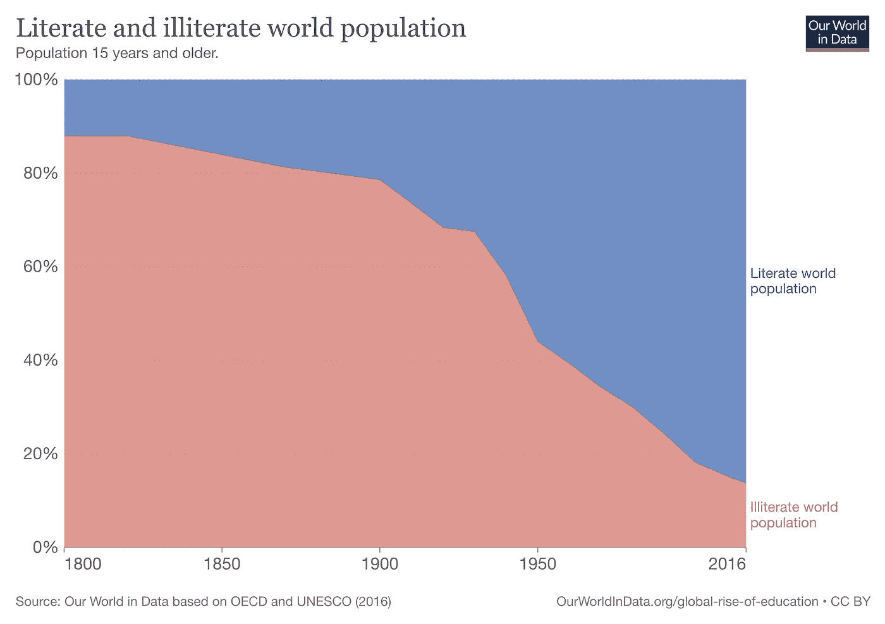
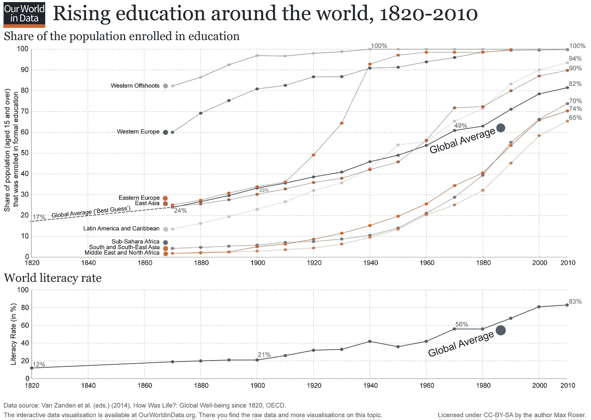

# 数据盲——一个被低估的社会障碍

> 原文：<https://medium.com/geekculture/data-illiteracy-an-underestimated-obstacle-in-society-157d91c6688?source=collection_archive---------19----------------------->

## 数据需求

## 作为构建数字和数据驱动社会的基石

Credits [NeONBRAND](https://unsplash.com/@neonbrand)

## 数据素养作为构建数据驱动文化的基石，是当今商界的热门话题。经常可以看到数据意识和教育计划开始提升员工的技能。旨在提高阅读、写作、交流和解决数据问题的能力。确保他们的员工能够快速将数据转化为价值。但这就够了吗？

在回答这个问题之前，让我们先回顾一下读写能力的总体发展。第一次书面交流可以追溯到公元前 3200 年(詹姆斯·赖特，书写的演变，2014 年)——少数有文化的人在石头或象牙板上的铭文。第一批书出现的时间要晚得多，而且价格昂贵，非常罕见——直到 1450 年现代古腾堡印刷机被发明(History.com，printing press，2021)。这项发明——印刷书籍——让人们更容易获得文学作品，从而点燃了人们阅读和写作的雄心。如果你仔细观察，你会发现在 1820 年，全球只有 12%的人被认为是识字的，而在 2016 年，只有 14%的人被认为是 *il* 识字(见下图，Max Roser andEsteban Ortiz-Ospina，Literacy，Our World in Data，2018)。所以想象一下，在过去的几个世纪里，达到我们今天所看到的文化水平的步伐是多么缓慢。提供我们可能面临的足够长的旅程的重要队列，以提高大众的*数据*识字率。

如果你在读写能力和数据读写能力之间做一个比较，我注意到一个相似的发展路径。与读写能力一样，最初只有少数人具备数据读写能力。对于*数据*而言，它始于科学界，当时*数据*素养被认为是一种必要——通过测试和探索新想法的准确性，理解数据点，探索和建立关于世界的知识(Keith D. Foote，数据素养简史，2021)。然而，如今数据与我们的社会交织在一起，它位于每个技术组件、流程和组织的核心。过去几年的数字革命导致了数据的爆炸；它确实存在于我们的日常生活中。你打开手机，看到天气图，看新闻，他们通过可视化数据向你展示犯罪趋势。

同样，在公司内部，数据是其业务的核心。因此，如今他们几乎要求每个角色都具备数据技能。例如，他们指望人们查看销售仪表板、经济趋势，根据这些数据制定商业计划，并指望他们的员工根据数据采取行动。在书籍的民主化有助于提高识字率的地方，我看到了数据的爆炸，以及获得数字技术(利用数据)的较低门槛和成本增加了流畅使用数据的紧迫性。

正是这种推动数据驱动以提高业务绩效的努力，可能是提高全社会*数据*素养所需的推动者。因此，自然地，这种在公司内部释放数据价值承诺的追求导致了教育员工的需求和冲动——试图提高读取、写入和处理数据的能力。但这就够了吗？鉴于将识字率提高到我们今天看到的水平需要付出巨大的努力和时间。

在公司里有强大的驱动力去获取*数据*的地方，不幸的是我们的社会缺乏这种驱动力。你可以在我们的教育系统中看到这一点，它尚未针对一个只有数字和数据驱动的社会。这很奇怪，因为*数据*是我们今天——主要是数字——交互的核心。这将成为大众进一步发展*数据*素养的重要抑制因素。我们不应该意识不到我们的教育系统作为提高识字率的驱动力的重要作用。

上图显示了入学率和识字率的对比。在 19 世纪末，入学率非常低(四分之一)，导致只有五分之一的人识字。如今，受教育机会显著增加，五分之四以上的人能够阅读(Max Roser andEsteban Ortiz-Ospina，Literacy，Our World in Data，2018)。

那么，我们为什么指望公司来教育大众掌握数据知识呢？为什么我们的教育系统认为*数据*读写能力只与专业领域相关(比如数据科学)？这是我们日常生活中需要的一项至关重要的技能，它太重要了，以至于让单个公司独自承担可能不现实。因此，在公司内部开展培养数据素养的数据意识教育项目不会是灵丹妙药。这肯定会有所帮助，并且是一个伟大的第一步，但我们不要忽视这一点，这将导致我们整个社会良好的数据素养水平。数据和数字技能应该根植于我们的 DNA 中，这需要像调整我们的教育系统这样的激进行动。这将是让每个人都能熟练掌握数据的唯一方法。

对这个话题感兴趣？对于进一步的阅读，我建议:

1.  深入了解扫盲发展的[世界](https://ourworldindata.org/literacy) — Max Roser 和 Esteban Oritis-Ospina 在使用数据讲述扫盲故事方面做了令人惊叹的工作；
2.  在这篇 [HBR](https://hbr.org/2020/02/boost-your-teams-data-literacy) 和 [Gartner](https://www.gartner.com/smarterwithgartner/a-data-and-analytics-leaders-guide-to-data-literacy) 的文章中，数据素养在商业中的重要性得到了很好的支撑；
3.  最后，今天就开始你的教育吧——通过[探索数据扫盲项目的资源](https://thedataliteracyproject.org/)。