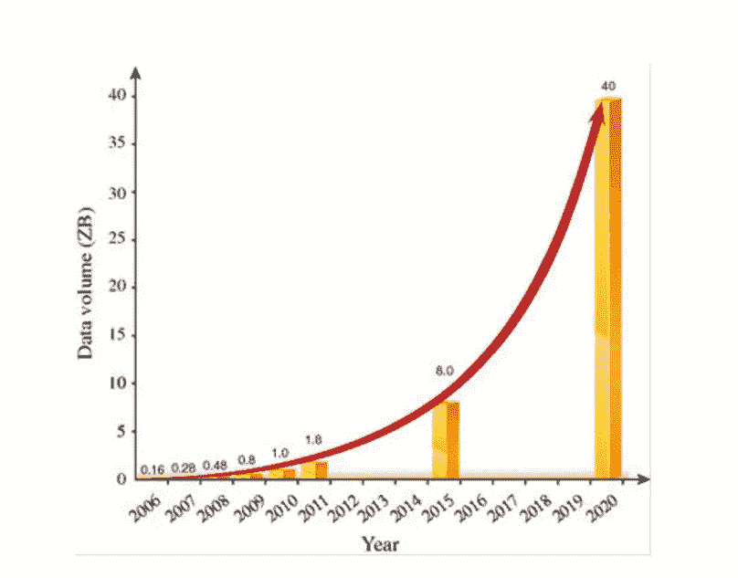

# 数据、信息和知识

> 原文：<https://medium.com/geekculture/data-information-and-knowledge-4e8b9fdeaa04?source=collection_archive---------16----------------------->

Photo by fauxels from Pexels: [https://www.pexels.com/photo/colleagues-looking-at-survey-sheet-3183153/](https://www.pexels.com/photo/colleagues-looking-at-survey-sheet-3183153/)

**数据是新油**。现在互联网就在我们的指尖，随着数据呈指数级增长，我们正在留下数字足迹。

[https://www.researchgate.net/figure/Global-growth-trend-of-data-volume-2006-2020-based-on-The-digital-universe-in-2020_fig5_274233315](https://www.researchgate.net/figure/Global-growth-trend-of-data-volume-2006-2020-based-on-The-digital-universe-in-2020_fig5_274233315)

有不同类型的数据，但大多数数据记录可以分为开放或关闭。**开放数据**顾名思义就是对所有人开放，免费获取、分析和使用，没有任何限制。如调查结果、Sensex、研究数据和已发布的消费者研究。开放数据的最重要形式之一是开放政府数据(OGD)，这是由执政的政府机构创建的一种开放数据形式。**封闭数据**只有授权人员才能访问，包含敏感和重要的记录。

许可证用于区分开放数据，或者在使用开放数据时有任何限制。许可证的一些例子是 **CC0 许可证**，表示数据是开放数据，没有任何限制， **CC-BY** 许可证表示无论何时使用数据，都应该向数据创建者提供信用，但没有使用限制，OGL 表示开放政府许可证。

真实世界的数据通常是原始数据

不完整
不一致
经常缺少某些行为或趋势
最有可能包含许多错误。

这些原始数据可以提炼、提炼，并通过将高级统计工具应用于现有数据来生成新的有价值的见解。这些见解然后被转化为信息，最终创造知识。当原始的事实和数据被收集起来时，某种意义或结构被称为信息，当信息被赋予某种意义时，它被称为知识。

**信息**在不同的时间点有不同的含义，使用越多，价值越大。它是自我生成的，也以自身为食，但它不足以概括一个主题或做出预测。**知识**使用时具有经济价值，增强学科知识，可以预测或推断。

信息可以通过语言或非语言信号以不同的方式复制和传递。相比之下，知识不能被复制，而且传递是非常困难的，因为它需要在接受者那一部分学习。每个组织都围绕着知识。每一条知识都是信息，而每一条信息都不是知识。

从数据中获得的洞察力可用于从技术上解决业务问题，从而提高生产率。这就引出了商业智能和商业分析的概念。

**商业智能**用于在**正确的时间**以**正确的格式**将相关可靠的信息传递给**正确的人**。BI 是一种反应式方法，其主要目标是更快地做出更好的决策。**描述性分析**和**诊断性分析**是 BI。描述性分析回答**“发生了什么？”**主要用于分析公司的收入或销售报告。诊断分析回答**“为什么会这样？”**人力资源部对员工绩效的分析。

**商业分析**是一套统计和运筹学技术、
人工智能、信息技术和管理策略。为了获得有意义的见解，商业分析工具被用于许多功能，包括相关性分析、回归分析、文本挖掘等。这是一种积极主动的方法，预测分析和规范分析都是商业分析的一部分。预测分析回答**“会发生什么？”**用于预测报告，并根据参与度和其他相关因素评估客户流失的可能性。规定性分析回答**“我该怎么办？”它总是处理优化问题，比如医院床位容量和加班时间的优化，或者零售价格和促销的优化。**

