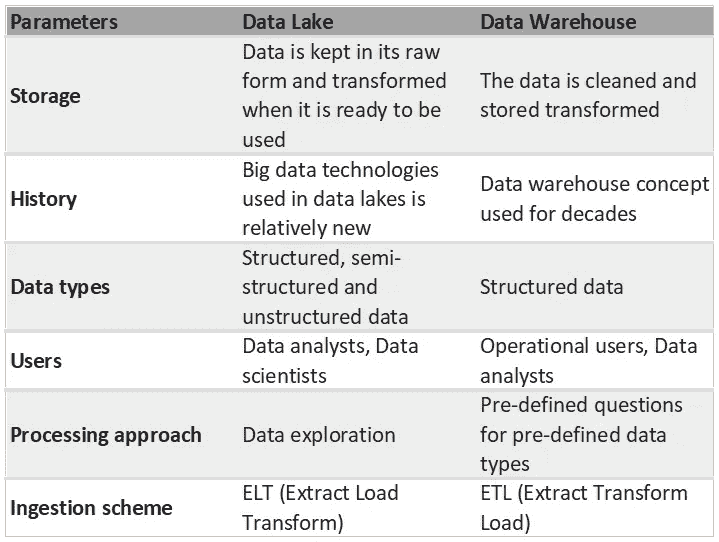

# 数据湖+ DWH =湖屋💙

> 原文：<https://medium.com/geekculture/data-lake-dwh-lakehouse-2a3c903973e5?source=collection_archive---------0----------------------->

如今，成年公司考虑的是如何增加存储在他们的*数据仓库(DWH)和数据湖(DL)* 中的数据的价值，同时削减维护和支持成本。与此同时，新公司面临着巨大的疑问，他们应该计划首先部署什么来从他们的数据中获得最大的优势——DWH 还是 DL。

许多展望未来的人会说，现在是结合两种方法并获得双重利益的最佳时机。但是让我们首先简要地看一下两个已知的概念。

Photo by [janer zhang](https://unsplash.com/@janerzhang?utm_source=medium&utm_medium=referral) on [Unsplash](https://unsplash.com?utm_source=medium&utm_medium=referral)

根据[维基百科](https://en.wikipedia.org/wiki/Data_warehouse)的说法，数据仓库是用于报告和数据分析的系统。DWHs 发明于 80 年代末，由来自不同系统的数据提供，例如会计或控制系统。它们是公司报告数据的中央存储库，在一个地方存储当前和历史数据，这很可能是一个*关系数据库管理系统(RDBMS)* 。单一位置简化并统一了与数据的连接。数据仓库概念意味着提取、转换和加载过程(ETL)。通常，这意味着进入系统的数据在加载时将被转换。ETL 方法帮助你的公司创建一个*单一版本的真相*。

DWHs 广泛用于为整个企业的员工创建分析和政府报告，因为数据是以一致和高度结构化的形式存储的。此外，它们有助于简化系统审计，这对于某些受管制的业务类型至关重要。

上面所写的一切让我们认识到了复杂转换机制的必要性，这是统一数据仓库中的数据所必需的。随着数据源或数据量的增加，复杂的转换不可避免地使扩展系统的过程变得复杂。顺便说一下，在大多数情况下，用数据仓库系统操作流和原始数据是不可能的。

半结构化和非结构化数据变得非常流行和广泛使用。JSON、XML 和其他一些格式现在被认为是行业领导者。数据量显著增加。2010 年代出现了一个新问题。公司一方面感受到对易于扩展的多用途系统的需求，另一方面感受到对与结构化数据无关的系统的需求。数据仓库不能满足这种需求。这就是数据湖出现的时候。

世界正在胜利。在组织和存储*大数据*(顺便说一下，这也是那个时代诞生的术语)方面，这是一个令人难以置信的创新，DL 可能会在不久的将来取代 DWH。大数据、模式和分析在 [Gartner 的 IT 基础设施和运营趋势十大榜单](https://www.computerworld.com/article/2497348/gartner-s-top-10-it-challenges-include-exiting-baby-boomers--big-data.html)中排名第二。数据湖可以回答各种“如何做”的问题。

为世界带来了一种新的 ELT 方法，数据湖现在能够像手指点击一样操作万亿字节的数据。在加载数据时，不再需要对数据进行大规模转换。您可以将原始格式的数据直接放入您的 DL 中，稍后客户加载数据时会用到转换。数据摄取的速度现在允许公司简单地从物联网设备、网络分析、游戏遥测和其他流媒体来源收集大量数据。数据科学家这一新职业越来越受欢迎。他们可以在数据中发现见解和模式，构建并使用 ML 模型进行数据分析和未来预测。

在这个十年结束时，没有人认为 DL 可以取代 DWH。不同的方法追求不同的目标:

Two approaches comparison

同时支持和维护两个解决方案会给公司带来巨大的支持负担和额外成本。作为真相的单一版本，它成本高、复杂且不可靠。专业团体开始理解数据湖和数据仓库将共存。这就是为什么*数据湖*作为 DWH 和 DL 的共生体出现。

lakehouse 解决方案提供的主要功能有:

*   **模式实施**。该解决方案应该有一种方法来支持模式实施(即星形或雪花形)。
*   **数据的并发读写**。运营用户应该能够通过已知的 BI 工具快速访问数据，而流和原始数据应该不间断地保存到存储中。
*   **轻松访问数据**。数据应该可以通过行业公认的工具(Python、R、Scala 等)进行分析和探索。).
*   **数据治理**。该解决方案应该能够跟踪数据完整性，并具有可靠的治理和审计机制。
*   **支持多种数据类型**。该解决方案应该操作结构化数据以及半结构化和非结构化数据。
*   **端到端流式传输**。实时企业报告需要支持流。
*   **降低成本**。将数据存储在廉价的对象存储器中，例如 S3、Blob 等。

市场上已经存在的工具有 Delta Lake、Snowflake、Azure Synapse Analytics、AWS Redshift + Redshift Spectrum 等。每个解决方案都提供了自己的附加功能集，但它肯定是十年来的典范，是增加数据价值的现代方式。

关于湖畔小屋建筑，还有其他资源可供阅读:

[https://www.snowflake.com/guides/what-data-lakehouse](https://www.snowflake.com/guides/what-data-lakehouse)

[https://databricks . com/blog/2020/01/30/what-is-a-data-lake house . html](https://databricks.com/blog/2020/01/30/what-is-a-data-lakehouse.html)

[https://docs . Microsoft . com/en-us/azure/synapse-analytics/overview-what-is](https://docs.microsoft.com/en-us/azure/synapse-analytics/overview-what-is)

[https://docs . AWS . Amazon . com/redshift/latest/DG/c-using-spectrum . html # c-spectrum-overview](https://docs.aws.amazon.com/redshift/latest/dg/c-using-spectrum.html#c-spectrum-overview)