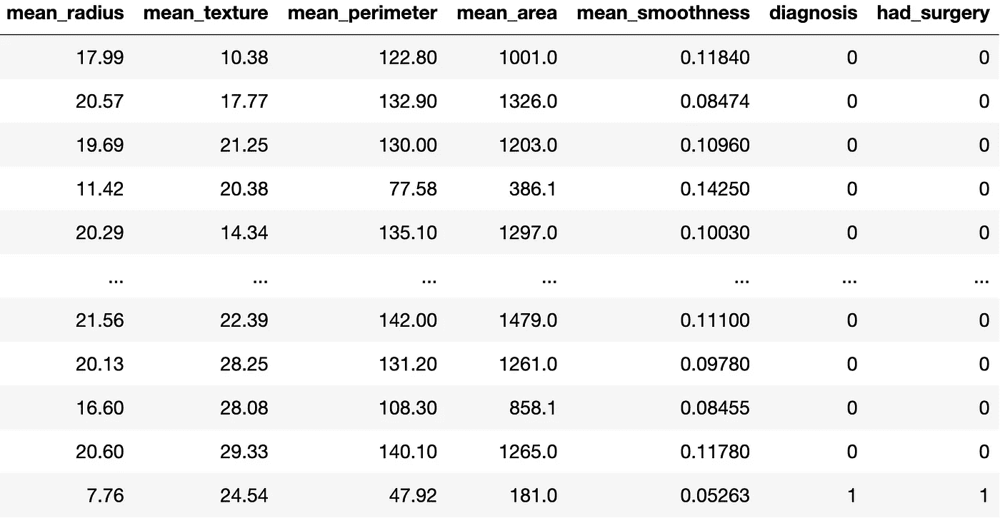

# 机器学习中的数据泄漏

> 原文：<https://medium.com/geekculture/data-leakage-in-machine-learning-30437a0a0a95?source=collection_archive---------16----------------------->

Photo by [Luis Quintero](https://www.pexels.com/@jibarofoto?utm_content=attributionCopyText&utm_medium=referral&utm_source=pexels) from [Pexels](https://www.pexels.com/photo/photo-of-gray-faucet-2339722/?utm_content=attributionCopyText&utm_medium=referral&utm_source=pexels)

在你的脑海中，想象这样一幅画面:你正在准备一场考试，这场考试将决定一个人有多聪明。
在准备试用考试和真正的考试时，您将会用到一组问题。
不幸或幸运的是，你的备考问题与预考问题结合在一起。你可以参加试用考试，并获得 99 分。你继续参加真正的考试，得了 45%的分数。

这里发生了什么？
从预试来看，每个人都可能认为你很聪明，这可能是真的，但实际情况是，你**对你准备的问题有所了解**，这就是为什么你得了 99%的分数，但当面对你从未见过的问题时，你悲惨地失败了。在整篇文章中，这是一个你应该记住的场景。这是机器学习中单向数据泄漏的一个经典例子。

你是否曾经训练过一个[机器学习模型](https://en.wikipedia.org/wiki/Machine_learning)，达到了很好的[精度](https://www.datarobot.com/wiki/accuracy/)而不幸的是这个模型在生产中表现很差？(真实数据)
许多因素都可能导致这种情况，其中最有可能的是**数据泄漏**，这也是本文的重点。
数据泄露是数据科学家和机器学习工程师，初学者和专家都会犯的最大错误之一。

## **什么是数据泄露？**

在训练机器学习模型时，我们有一个训练集和一个测试集。
机器学习的最终目标是产生一个模型，根据看不见的数据进行准确预测。
数据泄露是指训练集对目标或测试集有想法或一些信息的情况。基本上，训练测试之外的数据参与模型开发。
这导致一个具有 95%精确度的度量模型，但是在真实世界数据上表现不佳。还记得上面的考试场景吗？
现在让我们申请吧。就像你知道了考试的题目一样，你通过了考试，因此被认为是聪明的。
机器学习模型也一样。它的准确度很高，因此被认为是一个性能良好的模型。就像你在最初的考试中失败一样，机器学习模型在生产中也失败了，因为它的准确性只源于它对应该测试的数据有所了解。它现在失败了，因为它不是一个好的模型，从一开始，现实世界的数据只是暴露了这个模型有多糟糕。

## **数据泄露的类型和实例**

数据泄露以多种方式出现，然而，数据泄露有两种主要方式:

# **目标泄漏**

在机器学习中，我们有目标变量。目标变量是您试图预测的标签。
当您在包含预测时不可用的要素的数据集上训练模型时，会出现目标泄漏。
由于您的模型已经知道实际结果，因此对于训练数据来说，结果会不切实际地准确。

**让我们来看一个例子:** 使用 Kaggle 的乳腺癌数据集，假设您想要预测谁被诊断患有乳腺癌。
我将添加一个名为 **had_surgery** 的新列，它与 **diagnosis** 具有相同的值，以表明一旦您进行了手术，就意味着您被诊断患有乳腺癌。

The output of the code above

如果我们用上面的数据集开发一个机器学习模型，将包括 **had_surgery** 在内的所有相关列作为特征，将诊断作为我们预测的标签，该模型将会看到 **had_surgery** 的值为 0 的任何人都没有患乳腺癌。由于测试数据与训练数据来自同一个来源，所以模式会在测试中重复，模型会有很大的验证甚至交叉验证分数。
但该模型在随后部署到现实世界中时将非常不准确，因为当我们需要对他们的诊断进行预测时，即使是将被诊断为乳腺癌的患者也不会进行手术。
**避免目标泄露的方法包括**:

1.  从训练集中消除预测后可用的任何特征。在这种情况下， **had_surgery** 应该从训练集中删除。
2.  这是显而易见的，但请确保您没有将目标变量包含在用于预测的特征中。

# 列车测试泄漏

这种类型的数据泄漏与我上面强调的考试场景相同。还记得通过试用考试是因为你在准备过程中接触到了问题吗？同样的情况也会发生。在这里，如果我们不小心区分训练数据和测试数据，就会导致模型在测试期间表现很好，而在生产期间失败。
**避免列车试验污染的方法包括:**

1.  如前所述，在训练机器学习模型时，我们将数据集分为训练集和测试集。尽管并非所有的机器学习模型都需要这样做，但建议考虑通过在训练集和测试集之外添加验证集来将数据集分成三组。为什么？验证集允许我们微调模型的参数。验证集所做的是模拟真实场景，其中模型将在新数据上进行测试。当我们这样做时，我们可以识别任何可能的过度拟合的情况，并且将帮助我们避免训练测试泄漏和部署将在生产中失败的模型的情况。
2.  将数据分成训练、测试和验证集后，建议将数据准备技术和[探索性数据分析(EDA)](https://towardsdatascience.com/exploratory-data-analysis-8fc1cb20fd15) 仅应用于**训练测试**。在 EDA 过程中，对数据进行初步调查，以在汇总统计和图形表示的帮助下发现模式、发现异常、测试假设和检查假设。如果我们将预处理技术应用于整个数据集，EDA 在测试和验证集上产生的额外特征代表了数据泄漏的实例。该模型将已经看到测试和验证数据可能会在准确性等指标上得分很高。

对于专家和初学者来说，理解像数据泄漏这样的概念是非常重要的，因为它们发生在数据科学的真实世界中。我希望在读完这篇文章后，你将能够发现你的机器学习模型中何时存在漏洞，以及如何避免它。
如果读完这篇文章后，数据泄露听起来仍然很抽象，并且你想学得更实际，试试 [Kaggle 的数据泄露练习](https://www.kaggle.com/afiblebo/exercise-data-leakage/edit)。请随意在评论中加入更多信息，尤其是关于数据泄露的书籍。
在我的下一篇文章中，我将讨论数据清理，我们将看一个包含杂乱数据和源代码的真实例子。

你好，我是奎亚基！
我的目标是撰写文章，以一种对绝对初学者来说清晰的方式解释 Python、数据科学和机器学习的概念。
在[*LinkedIn*](https://www.linkedin.com/in/kweyakieblebo/)*和*[*Twitter*](https://twitter.com/dede_codes)*上跟我连线。*

**推荐资源**

[机器学习的特征工程。](https://www.oreilly.com/library/view/feature-engineering-for/9781491953235/) [机器学习中的数据泄露。](https://machinelearningmastery.com/data-leakage-machine-learning/) [如何在进行数据预处理时避免数据泄露。](https://machinelearningmastery.com/data-preparation-without-data-leakage/)