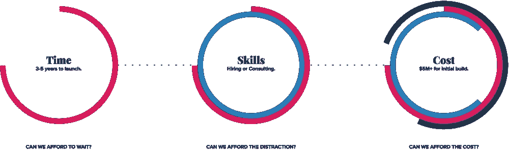

# 数据管理:购买还是构建

> 原文：<https://medium.com/geekculture/data-management-buy-vs-build-75f5e7317ccc?source=collection_archive---------20----------------------->

## 企业中的数据状态

企业面临的新现实相当简单:资本支出已经冻结，发现运营支出中的低效率已成为当务之急。

[**麦肯锡研究发现**](https://www.mckinsey.com/business-functions/mckinsey-digital/our-insights/the-digital-led-recovery-from-covid-19-five-questions-for-ceos) ，甚至在疫情袭击之前，92%的组织认为他们的商业模式需要在数字化转型方面做出巨大努力才能保持竞争力。

基于最近和持续的经济衰退，“花费”是一个可怕的词。数字化转型和数据增长可能会让位于底线节约和消除冗余。但这给组织留下了一个难题:“我们可以推迟多长时间访问可以推动我们业务发展的数据？”

## 数据，无处不在的数据(一滴饮料也没有)

虽然有大量的数据可用， [**但并不是所有的数据都可以访问**](https://blog.thinkdataworks.com/the-difference-between-available-and-accessible) 。连接到数据的主要挑战在于使数据可用所需的文书工作。数据准备是任何数据专业人员的工作中最没有吸引力但最耗时的部分，并且通常是数据科学创新的最大障碍。

面对如此庞大的可用数据量，组织很难确定他们需要哪些数据，更难找到源和数据集。为不同的数据连接到不同的门户、导航许可和监控更新都是需求。即使这样做了，数据通常也不是用于分析的正确格式。

下一步是转换，将数据和模式结构化以符合您的需求。然后在整个组织中共享它，同时确保数据是最新的和有效的，并且您可以在更新时跟踪其结构和内容。如果听起来有很多事情要做，那就是。

## 数据管理—购买还是构建？

当您连接到多个来源时，这类任务会占用大量时间。这意味着，虽然您可能会看到在您的组织中使用更多数据的一些好处，但它可能不会给您带来您认为会得到的结果。不过不要担心，你在一个很好的公司里——几乎 70%的大公司说他们不是真正的数据驱动型公司。

最终，任何组织都会对数据管理平台产生需求，而这种需求会带来一个新问题:构建还是购买？

## 内部构建的挑战

公司需要找到以可重复、可扩展的方式连接数据的方法。即席数据不是一个选项，因为如果你需要更多的数据，那么你需要更多的人。这不是一个可扩展的模型。那么构建自己的数据处理管道是什么样子的呢？

虽然内部构建有很多好处，但从时间和金钱的角度来看，它都很昂贵。雇佣、设计、启动、托管、仓储和维护都是巨大的工程。

鉴于数据技术是目前最热门的领域，技术每天都在变化。当数据不是你的核心竞争力，你的手指不在脉搏上时，你的解决方案可能在它出现之前就过时了。

## 高开销，低产出

因此，您不需要一个完整的端到端管理平台(**)—如果您只连接到几个源，会怎么样？数据更新不太频繁怎么办？**

**即使对于(相对)少量的数据，拥有一个中央访问平台仍然是有意义的。当每个案例都以不同的方式处理时，审计您的数据过程就成了一场噩梦。假设它为你赚钱可能更容易，因为，嘿，它是数据——每个人都在使用它，所以它肯定是好的。**

****

**当您的数据科学团队陷入准备和保管工作的泥沼，而这些工作占据了他们 80%以上的时间时(图表的右侧)，业务成果(左侧)不在他们应该在的地方就不足为奇了。**

**使用集中访问允许管理员查看您现有订阅中的冗余。它还消除了每个团队单独进行数据清理的需要。**

**实际上，你错过了几个机会:停止效率的损失；使用更高质量的数据获得更好的总体项目成果；让您的数据科学家专注于您雇用他们的目的；节省时间和资金，让新数据流入您的组织。即使在涉及单个数据集和看似简单的联系时，从单一真实来源的高质量数据开始也是非常有意义的，并且预先购买可以节省快速增加的持续成本。**

## **科技债务利息很高**

**陷入工作方式是很常见的。预计会有一定程度的科技债务，但不总是容易看出何时你的成本开始超过它的收益。创新发生得很快，遗留的系统和方法可能会拖累你。**

**看看你现在在哪里是改进的第一步，如果很难审计你的系统，你已经遇到了需要(快速)修复的东西。**

## **数据治理、质量和可审计性**

**因此，假设您的内部解决方案在数据连接、访问和分发方面确实出类拔萃。治理呢？当您处理数据时，安全性、透明性和可追溯性需要优先考虑。数据治理是一个非常难以构建到外部数据管道中的组件，因为它需要可审计性和监控来确保数据完整性。**

## **为您的组织寻找合适的解决方案**

**没有放之四海而皆准的方法，每个公司的容量和能力都是不同的。当谈到外部数据管理解决方案时，从头构建它需要大量的时间、金钱和专业知识。即使你只连接到几个数据源，也有很好的理由选择“购买”而不是“构建”，以确保你从每个数据点获得最大收益。**

**我们正在经受一场经济风暴，对于您的组织来说，找到优化生产力和消除冗余的方法至关重要。数据不仅是创新所需的重要组成部分，也是业务连续性所需的重要组成部分。问题不在于你是否需要一个数据管理解决方案，而在于如何花得聪明，让每一分钱都有回报。**

**想了解有关协调业务和数据战略的更多信息吗？**

**[请求咨询我们的数据专家](https://meetings.hubspot.com/eugene)或[浏览](https://marketplace.namara.io/)最大的解决方案就绪数据目录，以确定 [ThinkData 的技术](https://www.thinkdataworks.com/products/namara)如何推进您的项目。**

***原载于*[*https://blog.thinkdataworks.com*](https://blog.thinkdataworks.com/data-management-buy-vs-build)*。***