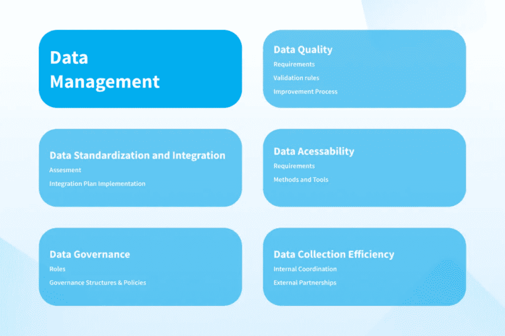
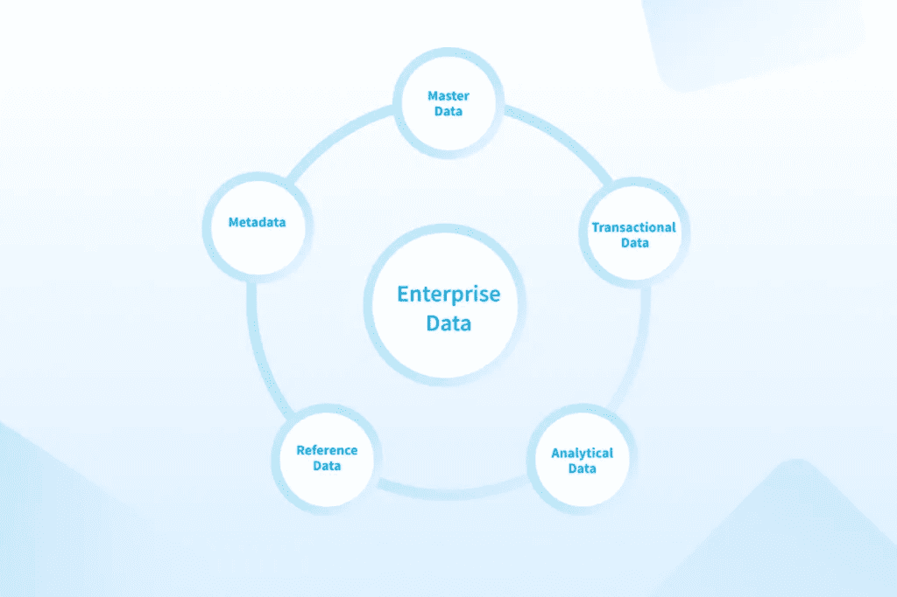
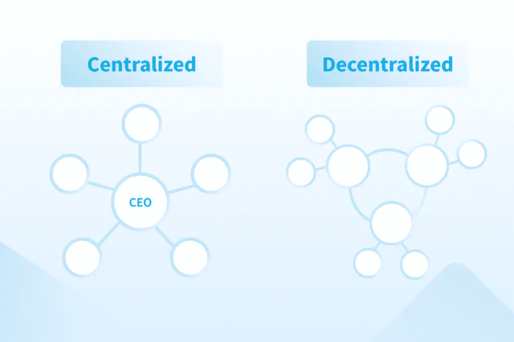

# 数据管理策略:流程和业务优势示例— NIX United

> 原文：<https://medium.com/geekculture/data-management-strategy-process-and-business-benefit-example-nix-united-1fcb193b209e?source=collection_archive---------16----------------------->

从财务预测到供应链、市场营销和产品销售，在许多情况下，数据在现代企业的工作中扮演着至关重要的角色。这是任何企业的血液，没有它，就不可能做出决策，无论是战略决策还是运营决策。数据本身只是一堆数字。它需要被有效地收集、分析、存储和使用。实施[数据管理](https://nix-united.com/services/big-data-management-services-data-engineering/)不是奢侈品，而是必需品，你做得越有效率，你的竞争优势就越大。

如果您的企业正在处理大量数据，并且您正在寻找组织、存储和使用这些数据的方法，您会发现今天的文章非常有用。今天，您将了解数据管理的流程是什么，它由哪些组件组成，以及在您的企业中实施这一策略的最佳实践。

不同组织的所有内部机制，无论是应用程序的运行、分析解决方案，还是算法，都与所有利益相关者的数据可用性直接相关。但是如果这个数据是巨大的，那么就不能再称之为传统了。用传统的数据处理软件来操作和管理并不容易。作为一个规则，更重要的信息可以从中提取出来，好处要广泛得多。

术语“大数据”既可以指庞大而复杂的数据集，也可以指用于处理这些数据集的方法。大数据有四个主要的“V”型特征:

*   **卷**:大数据直接关系到海量数据的出现，以 TB、Pb、甚至 exabytes 计量，其处理需要强大的工具。
*   **种类**:一个大数据集通常可以包括结构化数据(通常存储在关系数据库中)、部分结构化数据(数据不适合表格，但可以分层组织)和非结构化数据(没有组织好的结构:音频和视频资料，以及图像)
*   **速度**:大数据生成快，往往实时处理。如果一台机器足够处理数据，很可能不是大数据。集群中的服务器数量总是多于一个
*   准确性:准确性或简单地说可信度指的是数据的质量。具有高准确性的数据对于分析是有价值的，并且对整体结果做出有意义的贡献。

大数据为公司带来了巨大的机遇，包括对客户行为的重要洞察、对市场活动的更准确预测以及整体效率的提高。如果没有适当的管理，这些数据将变得毫无用处。为了确保所有数据管理流程顺利运行，数据管理系统应运而生。它旨在确保数据的准确性、可用性、安全性和及时性。得益于此，所有员工都可以高效地执行任务和解决问题。但这并不是它的全部好处。数据管理策略示例中的最佳实践允许您实现以下目标:

*   因为数据组织得很好，不需要不断地传输，并且因为具有适当权限的员工可以访问它，所以生产率提高了
*   员工不必执行相同的任务或处理相同的信息，因为数据不会重复，这意味着成本效率提高
*   大数据是大责任，所以保证数据的安全可靠保存非常重要。在数据管理系统的帮助下，公司可以访问某些类型的数据，如银行卡号、支付信息等。，只给那些有适当权限的人
*   任何企业的成功很大程度上取决于在必要时做出快速决策的能力。否则，就有赔钱或错失良机的风险。当你不得不花费大量时间试图联系同事并获得你需要的信息时，对数据的访问不应该局限于团队领导。数据管理过程确保了*数据被按时*接收，这在远程工作时尤其有用
*   收集的数据越准确、越及时，团队看到的画面就越完整，从而做出更好的决策。使用设计良好的数据管理工具可以确保这一点。这也在相反的方向起作用:有了错误或不准确的数据，就不可能做出正确和有利可图的决策

# 数据管理系统的组成部分是什么？

数据管理系统的基本功能取决于具体的应用，无论是教育过程中的数据、医药、在线销售还是其他服务的提供。即使是最小的公司通常也有自己的网站、购买或订单历史、用户信息等。-可以收集和分析的一组数据。但是组成数据管理系统的组件有一个基本列表:

*   **用户对数据的引入和使用**包括查看、创建、修改和删除记录，以及搜索数据、排序数据或保存查询结果的能力
*   **数据结构管理**包括数据分类、查找表和复杂数据结构的创建
*   **数据的核对和标准化**负责重复数据的识别、验证和删除
*   **与公司信息系统的集成**包括从本地系统自动导入和导出变更，本地和中央数据结构之间的数据比较，以及为应用程序和用户提供一套服务以访问和管理数据
*   **数据管理过程的管理**是对用户角色和权限的管理，以及维护数据交换的历史，执行导出和导入

# 什么是企业数据管理？

业务组织中接收和存储的各种数据在不断增长和变化。你如何处理它们，组织它们，提取有用的信息，并确定它们的准确性？为此，实施了专门的企业数据管理软件。

企业数据管理(EDM)是为组织内部流程和外部通信提取和存储数据的过程。换句话说，EDM 不仅是管理数据的过程，也是管理人的过程。这意味着公司的所有员工都能收到准确、及时和必要的信息。

这样做的主要目的是为交换数据创造条件，同时保持信心和信任。这使得组织能够更好地了解其客户，开发新产品，并基于对大量公司数据的分析做出关键的财务决策。

可以管理的数据范围很广，包括:

*   **基础数据**。这不是事务性业务数据
*   **事务性数据。**这是关于采购、生产、销售等的信息。
*   **分析数据**。这些是针对交易数据生成的报告
*   **参考数据**。这用作维护一般规则的说明
*   **元数据**。这是关于其他业务数据的描述性信息

当组织和分析所有这些数据似乎是一项不可能完成的任务时，企业数据管理就来了。设计良好的软件保证了组织性、可访问性和结构化。借助企业数据管理，组织可以轻松实现:

*   用于准确分析的可用性和高质量数据
*   数据安全性和合规性
*   整合来自多个来源的数据，从而提高效率
*   拥有一致的数据架构，可随您的业务轻松扩展

为了确保所有数据管理工具和技术都能正确工作，并且所有信息都能得到最有效的利用，创建企业数据管理策略是一种帮助。

数据管理策略(DMS)是创建策略/计划的过程，用于处理由组织创建、维护、管理和处理的数据。其主要目标是制定业务战略，以确保数据:

*   收集、储存、消费和加工
*   受到控制和保护
*   分类和标准化

由于公司已经取得巨大成功的情况屡见不鲜，因此所有者很难理解数据管理流程为什么以及如何改善已经取得巨大成功的公司。但是有许多例子表明，报告和分析的结果在许多新的商业计划中充当了一种秘密成分。公司制定数据管理策略:

*   思考未来的趋势以及如何最好地管理它们
*   不断改进组织各级的决策过程
*   管理对企业成功至关重要的数据流
*   形成一种数据文化
*   鉴于数字信息的数量、深度和可访问性，发展可持续的竞争优势

简单地说，数据管理策略是数据使用的 GPS 导航器。它们确保数据管理过程遵循高效、有用和简单的公认规则。这种同质性使整个企业能够进行有效的沟通，以进行有效的数据驱动型决策。构建数据战略对每个企业都很有价值。

# 实施业务数据策略的最初步骤是什么？

要为更易于管理的环境做好准备，需要一些过渡步骤。当然，很难将所有事情都分成几个步骤，因为实施高质量和可靠的战略需要时间，但是这里有一些例子可以帮助您开始您的旅程。

# 1.确定要遵循的目标

如果你想立刻得到所有的东西，却看到眼前一片模糊，那么就有可能将资源引向错误的方向，存储和处理不必要的数据，浪费时间、金钱和精力。

为了存储和处理数据，挑选出 2-3 个全局和优先区域要合理得多。之后，围绕它们建立更小的目标，这将一砖一瓦地建立战略，定义流程和管理方法，并帮助您确定哪种工具最适合公司。

# 2.创建数据处理

一旦确定了收集和处理数据的目的，就该考虑如何实现这些目标了。新收集的数据往往是非结构化的、质量未知的、不相关的和不一致的。一般来说，只有一小部分专家负责它们的储存、使用和转化。同时，其他员工也无法理解或接触到他们。

思考以下问题:

*   **数据研究**:如何收集，从哪些来源收集。
*   **数据维护**:数据存储在哪里，以什么形式(结构化或非结构化)，如何提高其质量、完整性、可用性和安全性。
*   **数据的使用**:谁拥有这个或那个数据，需要以什么形式交付给接收方，目的是什么。尽可能考虑自动化数据处理。

# 3.组织模式的定义

这些是划分、授权和责任归属的原则。本质上，组织模型显示了如何形成一个单位。有三个主要原则可供您选择适合您业务的原则:

*   **集权**是下级所有重要决策和行动都要经过最高管理者批准的过程。
*   权力下放是各级权力的系统化授权。最高管理层保留做出重要决策的权力。其余的权力可以下放给中层和下层管理人员。
*   利用**混合原理**，在不同的部门观察到不同的结构，这些变化取决于内外部条件的变化。

# 4.选择可靠的数据管理服务提供商

找到能够满足您所有数据需求的专家非常重要，从咨询、用经验丰富的开发人员加强您的团队、将本地数据迁移到云，到数据管理解决方案的复杂实施。

如果您尚未选择拥有数据工程专业知识的团队来处理数据生命周期的所有方面，我们的团队将很乐意为您提供大数据管理和所有相关流程。

# 5.员工培训

如果员工不遵守所有政策，数据管理战略将毫无意义。他们必须了解所有数据管理流程，并作为单一机制工作。这就是为什么对所有员工进行培训，让他们了解如何根据自己的职责管理数据、会出现什么问题以及如何应对这些问题非常重要。

此外，在实施数据管理策略后，创建通用策略并提高对技术和流程的理解的最佳实践是进行公司范围的教育培训。否则，团队的不同部分可能会有不同的观点，这会导致冲突。

# 最后的想法

没有一种适用于所有企业的数据管理策略。然而，没有什么禁止为每个业务单独创建一个，这样不仅可以成功地收集、分析和保存数据，还可以在不降低盈利能力的情况下适应未来的需求。数据管理系统一旦建成，工作就没有结束。之后，开始了测试和实现新集成的漫长过程。

构建一个数据管理系统可能会花费很多时间，但它很快就会成为您业务运作的一个组成部分。相信专业人士。我们实施了成熟的数据管理流程，因此您不必担心数据管理的内部工作，而是专注于新的机会。

[联系我们](https://nix-united.com/blog/data-management-strategy-all-you-need-to-know-in-simple-words/#contact-us)咨询大数据管理。我们将帮助您确定最适合您特定业务需求的方法、工具和技术。

*原载于 2022 年 8 月 26 日*[*【https://nix-united.com】*](https://nix-united.com/blog/data-management-strategy-all-you-need-to-know-in-simple-words/)*。*