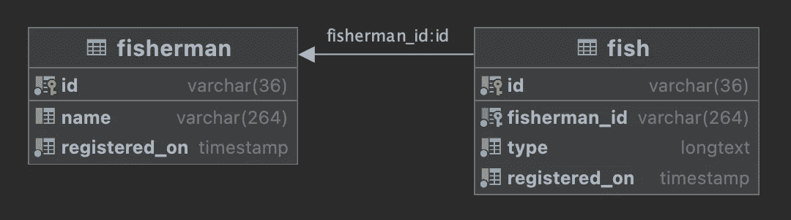

# 顺利进行数据迁移

> 原文：<https://medium.com/geekculture/data-migration-with-no-frustration-89147454ff2e?source=collection_archive---------4----------------------->

## 使用 Liquibase 和 jOOQ 在 Spring Boot Java 项目中自动迁移数据和生成活动记录的分步指南

Image by [Myriams-Fotos](https://pixabay.com/users/myriams-fotos-1627417/?utm_source=link-attribution&amp;utm_medium=referral&amp;utm_campaign=image&amp;utm_content=2739115) from [Pixabay](https://pixabay.com//?utm_source=link-attribution&amp;utm_medium=referral&amp;utm_campaign=image&amp;utm_content=2739115)

有时候，给一个人一条鱼可能比教他钓鱼更有用。然而，最重要的是，知道如何捕鱼对我们个人和职业的成长是必要的。

在这篇文章中，我们的鱼🐟是 Spring Boot 项目中的持久层，具有自动数据迁移和活动记录生成功能。我要告诉你如何抓住它。相信我，这不仅仅是往水里扔个钩子。

涉及的库和插件:`java`、`spring-boot`、`maven`、`liquibase-maven-plugin`、`mysql-connector-java`、`jooq-codegen-maven`、`jooq-metedata-extention-liquibase`和`modelmapper`。

# 先决条件

为了允许数据库迁移，我们需要一个数据库(没门！).在应用程序和任何相关的 Java 对象之前构建数据库，您可能会感到不自在。好吧，继续读下去，你会看到事情变得多么完美。

## 启动 MySql 容器

如果您已经有了一个到数据库的连接—这对您有好处—只需跳到下一节。否则，您可以在 Docker 或 Podman 上运行驱动程序容器。我不打算解释怎么做，因为我们有更重要的事情要做。不过，如果你是 Mac 用户，想用 Podman 来使用 MySQL，我会让你的生活更轻松。只需将以下命令复制粘贴到您的终端。

## 初始化 Spring Boot Java 项目

这里也一样—如果要向现有项目添加持久层，请跳过这一部分。但是，如果您是从零开始，只使用 Lombok 依赖项(所有其他依赖项我们将手动添加)初始化 Spring Boot Java 项目。

# 数据库迁移工具

## 我们到底为什么需要数据库迁移工具？

数据库迁移工具设置了自动化的模式更改，允许跨多个环境进行版本控制、跟踪和一致性更改。这些能力在实现 CI/CD 时非常有用，CI/CD 要求将所有代码(包括数据库)检入版本控制系统，并作为软件发布过程的一部分进行部署。

最著名的数据库迁移工具是 Liquibase 和 Flyway。在本文中，我将重点介绍 Liquibase。

## 液态碱

Liquibase 是一个数据迁移工具(dah！).它与 Flyway 的主要区别是能够支持各种抽象的、与数据库无关的文件格式，如 XML、YAML 和 JSON(除了普通的 SQL 脚本之外)。

# 设置 Liquibase

## 创建主变更日志

我想从创建一个主 changelog XML 开始，这将是所有 Liquibase 更改的根。

我习惯称这个主变更日志文件为`db.changelog-master.xml`(名字应该很直观，对吧？)并将 changelog 文件放在 resources 目录下:`src/main/resources/db/changelog/`

这是主变更日志的初始内容:

注意，模式位置 XSD 文件应该与您使用的 Liquibase 版本对齐。这里是对现有 XSD 文件的引用。

一般来说，主文件只是一个包含的集合，它指向包含实际变更的变更日志。目前，我们的变更日志没有包含。我们稍后将回到这一点。

## 创建 Liquibase 属性

属性文件描述了如何将 Liquibase 连接到选定的数据库。除其他外，该文件可包含以下信息:

在这个属性文件中，除了硬编码的数据库用户名和密码，您还可以看到一个 JDBC URL，它由驱动程序(在我们的例子中是 MySQL)、主机(注意，我的端口是 23306，因为这是我在创建 MySql 容器时定义的)和数据库名称组成；以及我们之前创建的主 changelog 文件的相对路径。

看起来简单，但是闻起来很腥，不是吗？嗯，我想，用硬编码的凭证定义数据库连接对本教程来说是非常好的。但是公海上到处都是鲨鱼，我们真的不想给它们喂敏感信息，比如凭据。

此外，数据库连接参数与环境相关。现在，我将跳过所有动态参数。这是我的`liquibase.properties`文件的样子:

顺便说一下，您也可以跳过驱动程序定义，但在这种情况下，当数据迁移正在运行时，您可能会看到以下日志(取决于库版本):

> 正在加载类“com.mysql.jdbc.Driver”。这已被否决。新的驱动程序类是“com.mysql.cj.jdbc.Driver”。驱动程序通过 SPI 自动注册，通常不需要手动加载驱动程序类。

## 配置 Liquibase Maven 插件

Liquibase 迁移可以在 Spring Boot 应用程序启动时自动运行(需要`liquibase-core`依赖)，也可以使用`liquibase-maven-plugin`按需运行。我认为数据库模式修改应该作为一个单独的、独立的过程来处理，这就是我选择第二个选项的原因。

让我们将 MySQL 连接器和 Liquibase maven 插件添加到我们的 Spring Boot Java 项目中。

只是指出，插件的配置部分包含一个到我们之前创建的`liquibase.properties`文件的链接。

数据库连接器脚注:

1.  MySql 连接器很容易被另一个连接器替换。查看[支持的数据库](https://www.liquibase.org/get-started/databases?_ga=2.246731847.2112191932.1661062318-490409157.1659866482)列表。
2.  MySql 连接器可以被定义为 Liquibase 插件的依赖项的一部分。然而，在上面的截图中，它作为一个普通的依赖项存在，因为我们也需要它用于持久层 DSL 连接。

我们几乎完成了 Liquibase 的设置。现在，通过运行`$ mvn clean compile`编译您的项目。下一个命令 Liquibase 更新数据库模式(还没有什么要更新的，但是让我们检查一下，所有的东西都连接正确)。Liquibase maven 插件通过命令`$ mvn liquibase:update`启动数据库迁移过程。

现在，如果在属性文件中仍然有一个硬编码的数据库连接，您应该会看到一个漂亮的绿色“build success”消息。但是如果你跟着我，你会面临这个错误:

> 数据库 URL 既没有作为参数指定，也没有在属性文件中指定。

该错误表明 maven 命令需要更多的参数。看看 Liquibase 是如何接收数据库凭证的:

下面是示例命令的样子:

尝试使用您的数据库登录信息执行该命令。建立成功？哦，应该是。看看这条信息上面的几行。您会注意到以下内容:

> [信息]创建名为 DATABASECHANGELOG 的数据库历史表
> [信息]从 DATABASECHANGELOG 读取

`DATABASECHANGELOG`和`DATABASECHANGELOGLOCK`表是在 Liquibase 首次运行时创建的。Liquibase 使用这些表来控制变更集的执行，并跟踪执行进度。虽然`DATABASECHANGELOG`包含关于已执行变更集的信息，但是`DATABASECHANGELOGLOCK`表阻止了 Liquibase 的并发执行。

恭喜你。达到第一个里程碑！我们完成了 Liquibase 设置。

## 创建实际的变更日志

这是创建我们第一个 changelog 框架的数据库迁移的时候了。

Liquibase(与 Flyway 相反)支持用 XML、JSON 或 YAML 编写变更日志。这个插件真的很酷，因为标记语言对 SQL 方言是不可知的，当我们面对方言不一致时，这使得我们的生活更容易(对于那些喜欢在本地工作反对 H2 的人来说)。当然，这需要学习一种新的方法来指定数据库的变化，但是不用担心，这很容易，事实上，Liquibase 概念已经很好地记录在文档中了。

组织变更日志最常见的方式是通过主要版本。因为这是我们的第一个变更日志，我们给它起个名字`db.changelog-1.0.xml`，并把它放在主变更日志文件`src/main/resources/db/changelog`的同一个方向。

我们的 changelog 中的第一个变更集(需要应用到数据库的一组变更)是`fisherman`表创建(如果不存在)。是的，我骑在这个钓鱼主题上。

有一些关于 changelog 的工具:

1.  变更日志文件中的每个变更集都以一个`author`和一个`id`属性开始。现在，关于变更集 id，对于每个变更日志文件，它必须是唯一的。顺便说一下，id 标签只是作为一个标识符；它不控制要应用的变更集的顺序，并且不需要为整数。
2.  可以为每个变更集或整个变更日志指定前提条件和回滚操作。在下面的示例中，您可以看到创建表的前提条件“如果不存在”。

创建新版本文件时，用新包含的文件更新我们之前创建的`db.changelog-master.xml` 。

第一个变更日志已完成。我们准备跑了。命令`$ mvn liquibase:update`看看会发生什么。

如果您正在跟踪我，您将在`fisherman_db.DATABASECHANGELOG`表中看到该单个记录。

现在，让我们将附加变更集添加到现有的 changelog 文件中。创建一个新表`fish`，多对一关联到`fisherman`；

再次运行`$ mvn liquibase:update`命令，您将会看到，Liquibase 只执行最新的变更集(没有在`fisherman_db.DATABASECHANGELOG`表中注册的变更集)。

我们到达了下一个里程碑。数据库定义完成。下面是我们刚刚创建的图表:

我们正走向持久层。

# 面向对象的查询

jOOQ 是一个 Java 库，它使用活动记录模式来实现轻量级数据库映射。它提供了一种特定于领域的语言来使用从数据库模式生成的类来构造查询，从而实现了关系型和面向对象型的双重目标。换句话说，jOOQ 是处理所有 Java-SQL 基础设施需求的魔法。

我们告诉过 jOOQ 使用活动记录模式，对吗？让我们从记录生成开始。

## jOOQ 记录生成

源代码生成是 jOOQ 的关键资产之一。jOOQ 的代码生成器将数据库模式逆向工程成一组 Java 类，比如建模表和记录。

以下是源代码生成的主要原则:

1.  增强的 IDE 支持:您现在可以直接针对数据库模式键入 Java 代码，同时可以访问关于模式类型的所有必要信息。
2.  类型安全:当数据库模式改变时，生成的代码也会改变。对现有表的更改(如删除或重命名列)将导致编译错误。当然，我们喜欢编译错误，因为我们可以在早期修复它们。

从 jOOQ 开始，在项目的 pom 文件中添加一个`jooq-codegen-maven`插件。接下来，为了允许从 Liquibase 模式生成记录，添加`jooq-metedata-extention-liquibase`作为插件的依赖项。

这个`org.jooq.meta.extensions.liquibase.LiquibaseDatabase`扩展允许使用 jOOQ 和 Liquibase 迁移脚本，而无需在目标数据库上实际运行迁移。值得注意的是，jOOQ 代码生成器的数据源在后台使用 H2 来模拟迁移。如果您计划编写 SQL 形式的迁移脚本，请记住这一点。

确保定义 Liquibase 主变更日志文件的位置(`db.changelog-master.xml`)；以及生成记录的目标位置。

接下来，运行`$ mvn clean compile`。当这个过程完成时，生成的代表我们的表和记录的 Java 类将被添加到您刚刚定义的目标目录中(在我的例子中是`target/generated-sources/jooq`)。

我们终于完成了数据库设置。这是构建我们的应用程序的最佳时机。先说波若斯。

# 应用实体

## 普通 Java 对象(POJO)

之前，我们在数据库中添加了`fisherman`和`fish`表。现在，我将创建匹配的 Java 对象。

注意`Fisherman`和`Fish`都扩展了`BaseEntity`，其中包括控制字段 id 和时间戳。我们稍后将开发的抽象存储库将受益于这个`BaseEntity`超类。

接下来，我们需要将这些对象映射到记录的能力。

## 模型映射

有几种技术可以将 POJO 转换成 jOOQ 记录，然后再转换回来。 [ModelMapper](http://modelmapper.org/) 是我最喜欢的方式(同一个库，我用于 API 映射)。现在，只需将模型映射器依赖项添加到项目的 pom 文件中。

让我们评估一下我们的现状。因此，我们有一个数据库和模式，我们有自动生成的 Java 对象，表示表的记录。此外，我们有应用程序实体和模型映射器依赖关系，将这些实体转换成生成的记录，然后再转换回来。

现在，我们需要向应用程序添加一个持久层，即应用程序和数据库之间的通信层。让我们从定义存储库开始。

# 仓库

当使用存储库时，我更喜欢按照数据库表来定义存储库。有了两个域表——`fisherman`和`fish`——在当前的“教鱼”项目中，我将需要两个合适的存储库，`FishermanRepository`和`FishRepository`。

两个存储库都需要与数据库通信的能力，对吗？它有某种可重复使用的东西的气味。比如一个抽象的存储库，它将包含所有的基本定义(这是我们之前创建的 BaseEntity)。在这种情况下，相应的表和域实体将由扩展基本存储库的每个存储库提供。

注意，大写的`FISHERMAN`和`FISH`是 jOOQ 生成的表格记录。

仅此而已！为了测试我们自己，让我们创建一个方法来初始化 Fish 和 Fish 对象，并将它们写入数据库。

从测试类或 main 方法调用`fish()`方法，您将看到数据库中的记录。

钓得好，同事们！🤓

在这篇文章中，我关注的是创造记录。然而，如果您也有兴趣阅读数据库，您可以在[完整项目](https://github.com/genezeiniss/jooq-liquibase-e2e.git)中找到示例。在我的 [GitHub 库](https://github.com/genezeiniss/jooq-liquibase-e2e.git)中查看这个故事的源代码。