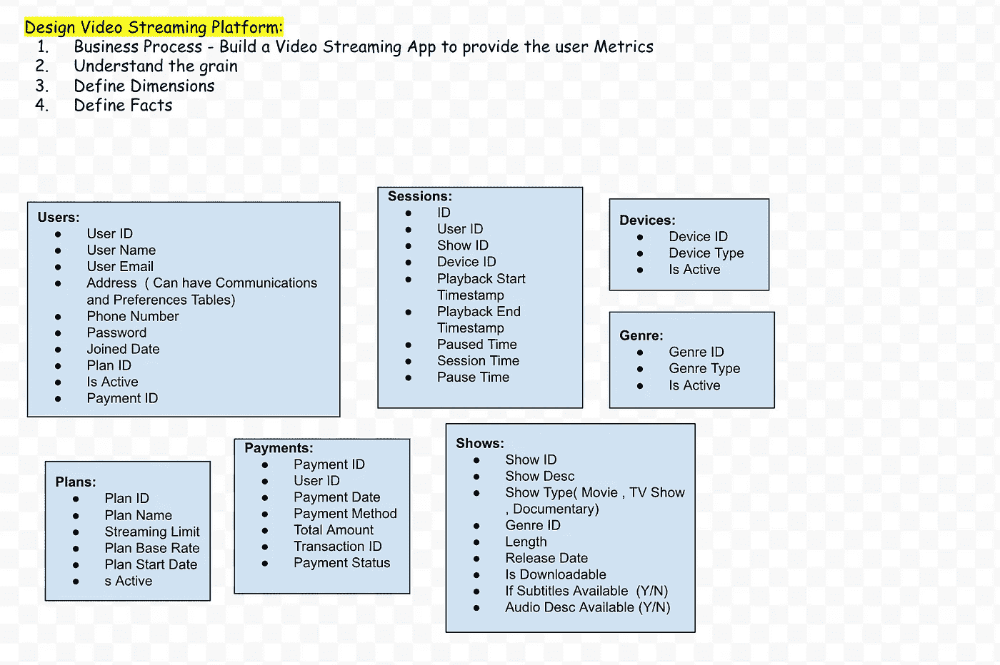

# 数据仓库:为视频流应用程序设计数据模型

> 原文：<https://medium.com/geekculture/data-modeling-design-video-streaming-platform-e8aa4f121b1b?source=collection_archive---------3----------------------->

Photo by [Markus Spiske](https://unsplash.com/@markusspiske?utm_source=medium&utm_medium=referral) on [Unsplash](https://unsplash.com?utm_source=medium&utm_medium=referral)

# 四步维度设计流程:金宝集团

1.  选择业务流程
2.  声明粒度(“如何描述事实表中的单个行？”)
3.  确定维度(“业务人员如何描述从业务流程度量事件中得到的数据？”)“何人、何事、何地、何时、为何、如何”与事件关联。
4.  确认事实

参考自[https://www . Kimball group . com/data-warehouse-business-intelligence-resources/Kimball-techniques/dimensional-modeling-techniques/four-4-step-design-process/](https://www.kimballgroup.com/data-warehouse-business-intelligence-resources/kimball-techniques/dimensional-modeling-techniques/four-4-step-design-process/)

# 案例研究:视频流平台应用

**业务流程:**为视频流平台建模，回答常见问题

> 每天/每月有多少用户流
> 
> 每个用户的平均观看次数
> 
> 查看特定内容的用户
> 
> 在发布日期观看特定内容的用户。

**纹:**每个交易级别上的单独会话

**维度:**日期、用户、节目、计划、类型和设备

**事实:**会话和支付

**派生事实:**建议将它们物理存储在表中。在这个案例研究中，会话时间很简单，但是存储它意味着在 ETL 过程中一致地计算它，以消除用户计算错误的可能性。**某些派生事实可以添加到视图中以最小化空间，或者可以添加到任何 BI 工具中。**

> 示例 1:会话时间(播放开始和结束时间之间的时间差。示例 2:即将发布标志(Y/N)(如果发布日期晚于当前日期)

**第一部分:尺寸**

**日期维度:**

所有数据模型总是需要一个显式的日期维度表。SQL date 函数不支持许多日期组件，包括周数、财政年度、季节、假日、工作日和周末。与其试图在查询中确定这些计算，不如将其存储在日期维度表中。

**用户维度:**

在这方面，我们将涵盖正在使用视频流应用程序的用户。我们将在模型的中心使用这些信息。用户表包含所有相关用户(当前用户和新用户)的列表。对于每个用户，我们将存储他们的唯一 ID、姓名(名和姓)、电子邮件、地址、电话号码、加入日期、当前计划 ID(以确定他们当前使用的会员身份)、活动(以确定用户是否仍然活动或选择退出服务)和付款 ID。

> 请注意，users 表中没有提到用户登录的详细信息，我们当然可以维护不同的表，以便根据用户的权限(如果有的话)跟踪用户的每次登录(登录开始日期、登录结束日期)。
> 
> 还要注意，如果用户有一个以上的地址或电话号码，我们可以添加通信(类型(电话/电子邮件/地址)和首选项表。

**计划维度:**

在这个领域，我们将涵盖用户可以在平台上选择的所有月度/年度会员计划。对于每个计划，都有一个唯一的 ID、计划名称、屏幕数量限制、基本费率、计划开始日期、is 活动列。

**显示尺寸:**

在这方面，我们将涵盖视频流平台上的所有节目。每个节目都具有唯一的参考 Id、节目描述/名称、节目类型(电影、连续剧、纪录片)、流派 ID、播放时间/长度、发布日期(如果字幕可用)(布尔标志)以及音频描述是否可用(布尔标志)、是否可下载(布尔标志)。

> 请注意，我们可以将电视连续剧单独放在一个单独的表中，而不包括在节目表中，以提供该季中每一集的更多细节(一个节目的一对多关系)。为了简单起见，我只显示了维度。

**流派维度:**

该表存储了平台上所有可用的流派。所有类型都有唯一的 ID 和类型(惊悚片、动作片、剧情片)，并且是指示类型状态的活动标志。

**设备尺寸:**

该表存储了兼容使用该平台的所有设备。所有设备都有唯一的 ID、设备类型(手机、平板电脑、台式机)和活动标志，以指示设备的状态。

**第二部分:事实**

**会话事实:**

在此区域，我们将涵盖用户访问视频流平台时播放的所有会话。每个会话都有唯一的会话 id、用户 id、节目 id、设备 id、回放开始时间戳、回放结束时间戳、会话时间、暂停时间。

**付款事实:**

该表存储用户进行的所有支付。每笔付款包括付款 id、用户 Id(付款人)、付款日期、付款方式、总金额、交易 ID 和付款状态。

**图表:**

