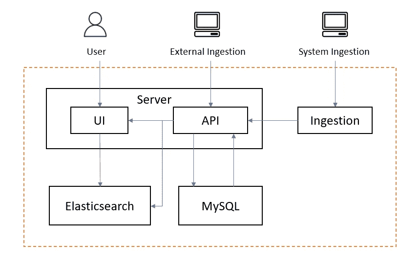

# 数据可观察性和发现平台— OpenMetadata

> 原文：<https://medium.com/geekculture/data-observability-discovery-platform-openmetadata-b718c8c2143b?source=collection_archive---------0----------------------->

Photo by [Iñaki del Olmo](https://unsplash.com/@inakihxz?utm_source=unsplash&utm_medium=referral&utm_content=creditCopyText) on [Unsplash](https://unsplash.com/s/photos/catalog?utm_source=unsplash&utm_medium=referral&utm_content=creditCopyText)

管理数据关于数据

数据发现是数据消费工作流程中至关重要的第一步。数据发现回答数据的不同方面，如来源、存储位置、数据的意义、数据的最新/相关程度、其他人如何使用数据以及数据如何形成当前形式(世系)等。因此，数据发现成为数据平台的重要组成部分。

基于对搜索(solr)、属性查找(数据库)、实体关系(图形数据库)和元数据定期刷新(调度器/队列)等四种主要功能的工具选择，许多公司已经构建了自己版本的元数据平台。少数几个主要的是 Amundsen、DataHub、Atlas、Metacat、Databook 和 Marquez。每个产品都有自己收集元数据的方式和规范。有些支持一定数量的源，而有些集成非常有限。

一般来说，数据平台的目录/元数据段有以下缺点。

1.  非标准化元数据集合
2.  数据目录不兼容(需要重新收集数据)
3.  有限，不是真正的公司范围的端到端数据谱系
4.  数据质量和可观察性缺失或不足
5.  不可发现的 ML 资产

收集元数据的开放标准可能成为缺乏有效发现和可观察性的合理解决方案，并为下一代数据平台奠定坚实的基础。

[开放数据发现规范(ODD Spec)](https://github.com/opendatadiscovery/opendatadiscovery-specification) 试图创建一个开源的、行业范围的元数据标准，使工程师能够从云原生应用、基础设施和其他数据源收集和导出元数据。

# open 元数据

[OpenMetadata](https://open-metadata.org/) 被吹捧为元数据的开放标准。发现、协作和正确获取数据的单一位置。

OpenMetadata 有自己的规范，可以在[这里](https://github.com/open-metadata/OpenMetadata/tree/main/catalog-rest-service/src/main/resources/json/schema)找到。每个模式定义都映射到数据/资产实体类型。

## 五大支柱

OpenMetadata 采用一种[**JSON-schema**](http://json-schema.org/)**first**方法来处理元数据。元数据模式定义了元数据的核心抽象和词汇，以及类型、实体和实体间关系的模式。这是开放元数据标准的基础。

**SAML 受保护的元数据 API**—用于生成和消费基于用户界面模式的元数据，以及工具、系统和服务的集成。

**元数据存储** —连接数据资产、用户和工具生成的元数据的实体和关系图的组织。

**摄取框架** —用于集成工具并将元数据摄取到元数据存储的可插拔框架。摄取框架已经支持 50 多个众所周知的数据仓库——Google big query、Snowflake、Amazon Redshift、Apache Druid 和 Apache Hive，以及数据库——MySQL、Postgres、Oracle 和 MSSQL。它还有 Airbyte，Airflow & DBT 的连接器。

**OpenMetadata 用户界面** —易于使用的用户界面，便于用户发现所有数据并就其进行协作。

## OpenMetadata 组件

*   服务器—用户界面和应用编程接口
*   弹性搜索—搜索和分析引擎
*   MySQL —实体、其属性和关系的存储层
*   摄入—气流

## OpenMetadata 功能

*   支持使用 RBAC 的人物角色
*   支持关键字和高级搜索
*   支持表、列和管道沿袭
*   证明使用元数据
*   对主题、仪表板、管道等实体的支持
*   支持资产重要性的自定义标签
*   支持术语表——定义、标准化和上下文化数据资产的通用语言
*   活动源—在单个视图中显示链接到资产的所有变更事件
*   为数据所有者提出任何更改请求对象的任务工作流
*   质量、剖析器和度量——由远大前程、DBT 或其他数据质量工具支持的质量测试
*   元数据版本控制

开心编目！！！！