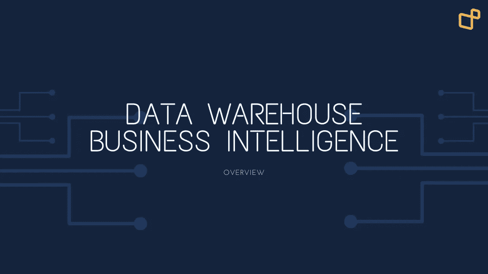

# 数据仓库和商业智能概述

> 原文：<https://medium.com/geekculture/data-overview-data-warehouse-and-business-intelligence-d76e83f4c7b0?source=collection_archive---------8----------------------->

Overview data warehouse and data warehouse architectures

# 数据仓库的⚡️Overview

*数据仓库* (DW)是一个存储关系数据的仓库，这些数据经过组织、清理和标准化，供企业使用。数据仓库由面向主题的数据库组成，并且是直接支持*决策支持系统* (DSS)功能的非易失性的。在这种情况下，数据仓库包括…