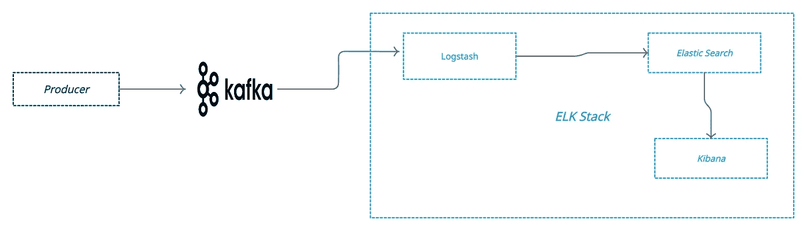
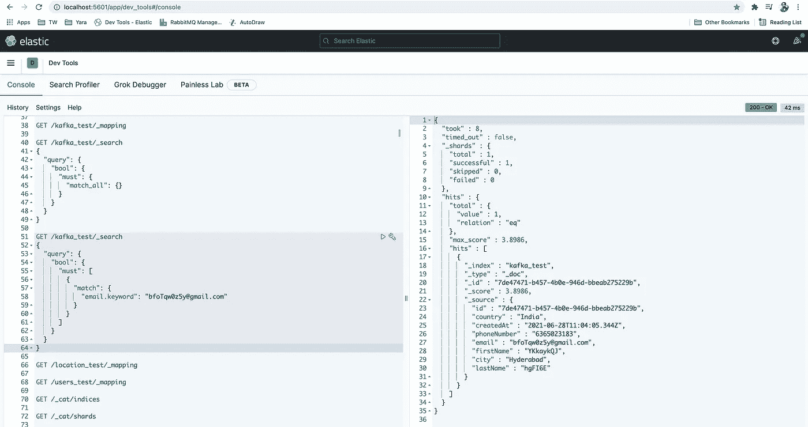

# 从 Kafka 到使用 logstash 的弹性搜索的数据管道

> 原文：<https://medium.com/geekculture/data-pipeline-from-kafka-to-elastic-search-using-logstash-5edca8d44d82?source=collection_archive---------1----------------------->

这个故事讲述了如何为 Kafka 主题的输入配置 logstash，并修改数据，然后发布到 Elasticsearch 索引。



1.  ***生产者→*** 通常可以是任何系统，这里是一个简单的节点应用程序，它将数据发布到 KAFKA topic，持续 5 秒钟。
2.  ***KAFKA →*** 这里 KAFKA 添加为 logstash 的事件源。
3.  ***麋鹿栈→*** 这里的麋鹿栈一般有很多组件。在这里，我们使用 logstash 从 KAFKA 主题中选取数据，并根据我们的要求进行转换/增强，然后将其放入弹性搜索索引中。

# **制片人**

我们可以使用任何机制，我使用了一个简单的节点应用程序，它每 5 秒钟将数据推送到 Kafka topic。

我使用 Kafka-js npm 模块来集成 node js 应用程序。

它以这种格式生成一条消息

```
{
   "id": "908e4d36-693b-4c26-867d-b8c5a477c5f9",
   "event": "USER-CREATED",
   "data": {
      "id": "ea66b115-a5d0-41ea-b168-e55acd2d5bf1",
      "firstName": "aSujSqfJ",
      "lastName": "qA9V8D",
      "country": "India",
      "email": "[qrgdHpTt70@gmail.com](mailto:qrgdHpTt70@gmail.com)",
      "city": "Hyderabad",
      "createdAt": "2021-06-28T06:04:21.555Z"
  },
  "createdAt": "2021-06-28T06:04:21.555Z"
}
```

> globalId →整个事务的 UUID。
> 
> 事件→事件类型。
> 
> 数据→这是主要消息，通常这是推送到弹性搜索的数据。
> 
> createdAt →创建事件时。

# 日志存储配置

Logstash 这里有 kafka 输入插件。

启动管道

```
**$ <Path to logstash>/logstash-7.13.0/bin/logstash -f kafka_input.conf**
```

日志文件在这里

```
Using JAVA_HOME defined java: /Library/Java/JavaVirtualMachines/jdk-11.0.9.jdk/Contents/Home
WARNING, using JAVA_HOME while Logstash distribution comes with a bundled JDK
Sending Logstash logs to /Users/ereshgorantla/Documents/Dev/logstash-7.13.0/logs which is now configured via log4j2.properties
[2021-06-28T17:53:49,659][INFO ][logstash.runner          ] Log4j configuration path used is: /Users/ereshgorantla/Documents/Dev/logstash-7.13.0/config/log4j2.properties
[2021-06-28T17:53:49,667][INFO ][logstash.runner          ] Starting Logstash {"logstash.version"=>"7.13.0", "jruby.version"=>"jruby 9.2.16.0 (2.5.7) 2021-03-03 f82228dc32 Java HotSpot(TM) 64-Bit Server VM 11.0.9+7-LTS on 11.0.9+7-LTS +indy +jit [darwin-x86_64]"}
[2021-06-28T17:53:49,736][WARN ][logstash.config.source.multilocal] Ignoring the 'pipelines.yml' file because modules or command line options are specified
[2021-06-28T17:53:50,395][INFO ][logstash.agent           ] Successfully started Logstash API endpoint {:port=>9600}
[2021-06-28T17:53:50,890][INFO ][org.reflections.Reflections] Reflections took 31 ms to scan 1 urls, producing 24 keys and 48 values 
[2021-06-28T17:53:51,938][INFO ][logstash.outputs.elasticsearch][main] New Elasticsearch output {:class=>"LogStash::Outputs::ElasticSearch", :hosts=>["//localhost:9200"]}
[2021-06-28T17:53:52,213][INFO ][logstash.outputs.elasticsearch][main] Elasticsearch pool URLs updated {:changes=>{:removed=>[], :added=>[[http://localhost:9200/](http://localhost:9200/)]}}
[2021-06-28T17:53:52,346][WARN ][logstash.outputs.elasticsearch][main] Restored connection to ES instance {:url=>"[http://localhost:9200/](http://localhost:9200/)"}
[2021-06-28T17:53:52,381][INFO ][logstash.outputs.elasticsearch][main] Elasticsearch version determined (7.12.1) {:es_version=>7}
[2021-06-28T17:53:52,382][WARN ][logstash.outputs.elasticsearch][main] Detected a 6.x and above cluster: the `type` event field won't be used to determine the document _type {:es_version=>7}
[2021-06-28T17:53:52,471][INFO ][logstash.outputs.elasticsearch][main] Using a default mapping template {:es_version=>7, :ecs_compatibility=>:disabled}
[2021-06-28T17:53:52,509][INFO ][logstash.javapipeline    ][main] Starting pipeline {:pipeline_id=>"main", "pipeline.workers"=>12, "pipeline.batch.size"=>125, "pipeline.batch.delay"=>50, "pipeline.max_inflight"=>1500, "pipeline.sources"=>["/Users/ereshgorantla/Documents/Dev/logstash-7.13.0/bin/kafka_input.conf"], :thread=>"#<Thread:0x2a2178b4 run>"}
[2021-06-28T17:53:53,164][INFO ][logstash.javapipeline    ][main] Pipeline Java execution initialization time {"seconds"=>0.65}
[2021-06-28T17:53:53,186][INFO ][logstash.javapipeline    ][main] Pipeline started {"pipeline.id"=>"main"}
[2021-06-28T17:53:53,267][INFO ][logstash.agent           ] Pipelines running {:count=>1, :running_pipelines=>[:main], :non_running_pipelines=>[]}
[2021-06-28T17:53:53,287][INFO ][org.apache.kafka.clients.consumer.ConsumerConfig][main][ae489294520557f50868788a24777fed1bf55b79e3959e0db90560e1c19bde12] ConsumerConfig values: 
 allow.auto.create.topics = true
 auto.commit.interval.ms = 5000
 auto.offset.reset = latest
 bootstrap.servers = [localhost:9092]
 check.crcs = true
 client.dns.lookup = default
 client.id = logstash-0
 client.rack = 
 connections.max.idle.ms = 540000
 default.api.timeout.ms = 60000
 enable.auto.commit = true
 exclude.internal.topics = true
 fetch.max.bytes = 52428800
 fetch.max.wait.ms = 500
 fetch.min.bytes = 1
 group.id = logstash
 group.instance.id = null
 heartbeat.interval.ms = 3000
 interceptor.classes = []
 internal.leave.group.on.close = true
 isolation.level = read_uncommitted
 key.deserializer = class org.apache.kafka.common.serialization.StringDeserializer
 max.partition.fetch.bytes = 1048576
 max.poll.interval.ms = 300000
 max.poll.records = 500
 metadata.max.age.ms = 300000
 metric.reporters = []
 metrics.num.samples = 2
 metrics.recording.level = INFO
 metrics.sample.window.ms = 30000
 partition.assignment.strategy = [class org.apache.kafka.clients.consumer.RangeAssignor]
 receive.buffer.bytes = 32768
 reconnect.backoff.max.ms = 50
 reconnect.backoff.ms = 50
 request.timeout.ms = 40000
 retry.backoff.ms = 100
 sasl.client.callback.handler.class = null
 sasl.jaas.config = null
 sasl.kerberos.kinit.cmd = /usr/bin/kinit
 sasl.kerberos.min.time.before.relogin = 60000
 sasl.kerberos.service.name = null
 sasl.kerberos.ticket.renew.jitter = 0.05
 sasl.kerberos.ticket.renew.window.factor = 0.8
 sasl.login.callback.handler.class = null
 sasl.login.class = null
 sasl.login.refresh.buffer.seconds = 300
 sasl.login.refresh.min.period.seconds = 60
 sasl.login.refresh.window.factor = 0.8
 sasl.login.refresh.window.jitter = 0.05
 sasl.mechanism = GSSAPI
 security.protocol = PLAINTEXT
 security.providers = null
 send.buffer.bytes = 131072
 session.timeout.ms = 10000
 ssl.cipher.suites = null
 ssl.enabled.protocols = [TLSv1.2]
 ssl.endpoint.identification.algorithm = https
 ssl.key.password = null
 ssl.keymanager.algorithm = SunX509
 ssl.keystore.location = null
 ssl.keystore.password = null
 ssl.keystore.type = JKS
 ssl.protocol = TLSv1.2
 ssl.provider = null
 ssl.secure.random.implementation = null
 ssl.trustmanager.algorithm = PKIX
 ssl.truststore.location = null
 ssl.truststore.password = null
 ssl.truststore.type = JKS
 value.deserializer = class org.apache.kafka.common.serialization.StringDeserializer[2021-06-28T17:53:53,345][INFO ][org.apache.kafka.common.utils.AppInfoParser][main][ae489294520557f50868788a24777fed1bf55b79e3959e0db90560e1c19bde12] Kafka version: 2.5.1
[2021-06-28T17:53:53,345][INFO ][org.apache.kafka.common.utils.AppInfoParser][main][ae489294520557f50868788a24777fed1bf55b79e3959e0db90560e1c19bde12] Kafka commitId: 0efa8fb0f4c73d92
[2021-06-28T17:53:53,345][INFO ][org.apache.kafka.common.utils.AppInfoParser][main][ae489294520557f50868788a24777fed1bf55b79e3959e0db90560e1c19bde12] Kafka startTimeMs: 1624883033344
[2021-06-28T17:53:53,354][INFO ][org.apache.kafka.clients.consumer.KafkaConsumer][main][ae489294520557f50868788a24777fed1bf55b79e3959e0db90560e1c19bde12] [Consumer clientId=logstash-0, groupId=logstash] Subscribed to topic(s): elastic-test
[2021-06-28T17:53:53,552][INFO ][org.apache.kafka.clients.Metadata][main][ae489294520557f50868788a24777fed1bf55b79e3959e0db90560e1c19bde12] [Consumer clientId=logstash-0, groupId=logstash] Cluster ID: gZmKvPigQ1mp7NnmDS0JAg
[2021-06-28T17:53:53,553][INFO ][org.apache.kafka.clients.consumer.internals.AbstractCoordinator][main][ae489294520557f50868788a24777fed1bf55b79e3959e0db90560e1c19bde12] [Consumer clientId=logstash-0, groupId=logstash] Discovered group coordinator localhost:9092 (id: 2147483647 rack: null)
[2021-06-28T17:53:53,555][INFO ][org.apache.kafka.clients.consumer.internals.AbstractCoordinator][main][ae489294520557f50868788a24777fed1bf55b79e3959e0db90560e1c19bde12] [Consumer clientId=logstash-0, groupId=logstash] (Re-)joining group
[2021-06-28T17:53:53,563][INFO ][org.apache.kafka.clients.consumer.internals.AbstractCoordinator][main][ae489294520557f50868788a24777fed1bf55b79e3959e0db90560e1c19bde12] [Consumer clientId=logstash-0, groupId=logstash] Join group failed with org.apache.kafka.common.errors.MemberIdRequiredException: The group member needs to have a valid member id before actually entering a consumer group
[2021-06-28T17:53:53,563][INFO ][org.apache.kafka.clients.consumer.internals.AbstractCoordinator][main][ae489294520557f50868788a24777fed1bf55b79e3959e0db90560e1c19bde12] [Consumer clientId=logstash-0, groupId=logstash] (Re-)joining group
[2021-06-28T17:53:53,571][INFO ][org.apache.kafka.clients.consumer.internals.ConsumerCoordinator][main][ae489294520557f50868788a24777fed1bf55b79e3959e0db90560e1c19bde12] [Consumer clientId=logstash-0, groupId=logstash] Finished assignment for group at generation 77: {logstash-0-ce05c9df-eab4-42f4-9e80-d02d768fb87f=Assignment(partitions=[elastic-test-0, elastic-test-1, elastic-test-2])}
[2021-06-28T17:53:53,579][INFO ][org.apache.kafka.clients.consumer.internals.AbstractCoordinator][main][ae489294520557f50868788a24777fed1bf55b79e3959e0db90560e1c19bde12] [Consumer clientId=logstash-0, groupId=logstash] Successfully joined group with generation 77
[2021-06-28T17:53:53,583][INFO ][org.apache.kafka.clients.consumer.internals.ConsumerCoordinator][main][ae489294520557f50868788a24777fed1bf55b79e3959e0db90560e1c19bde12] [Consumer clientId=logstash-0, groupId=logstash] Adding newly assigned partitions: elastic-test-1, elastic-test-0, elastic-test-2
[2021-06-28T17:53:53,592][INFO ][org.apache.kafka.clients.consumer.internals.ConsumerCoordinator][main][ae489294520557f50868788a24777fed1bf55b79e3959e0db90560e1c19bde12] [Consumer clientId=logstash-0, groupId=logstash] Setting offset for partition elastic-test-1 to the committed offset FetchPosition{offset=34, offsetEpoch=Optional[0], currentLeader=LeaderAndEpoch{leader=Optional[localhost:9092 (id: 0 rack: null)], epoch=0}}
[2021-06-28T17:53:53,593][INFO ][org.apache.kafka.clients.consumer.internals.ConsumerCoordinator][main][ae489294520557f50868788a24777fed1bf55b79e3959e0db90560e1c19bde12] [Consumer clientId=logstash-0, groupId=logstash] Setting offset for partition elastic-test-0 to the committed offset FetchPosition{offset=34, offsetEpoch=Optional[0], currentLeader=LeaderAndEpoch{leader=Optional[localhost:9092 (id: 0 rack: null)], epoch=0}}
[2021-06-28T17:53:53,593][INFO ][org.apache.kafka.clients.consumer.internals.ConsumerCoordinator][main][ae489294520557f50868788a24777fed1bf55b79e3959e0db90560e1c19bde12] [Consumer clientId=logstash-0, groupId=logstash] Setting offset for partition elastic-test-2 to the committed offset FetchPosition{offset=39, offsetEpoch=Optional[0], currentLeader=LeaderAndEpoch{leader=Optional[localhost:9092 (id: 0 rack: null)], epoch=0}}
**{"lastName":"vG10IB","id":"fe62998f-7301-4925-ba55-948718edff63","email":"**[**vRp6xfUrjv@gmail.com**](mailto:vRp6xfUrjv@gmail.com)**","country":"India","phoneNumber":"5547841377","createdAt":["2021-06-28T12:24:08.059Z","2021-06-28T12:24:08.059Z"],"firstName":"Iqz68AQD","city":"Hyderabad"}
{"lastName":"1x2eTN","id":"9c15d29c-28e8-478c-b5fc-e64ac26bfec8","email":"**[**M5wKXKbeLg@gmail.com**](mailto:M5wKXKbeLg@gmail.com)**","country":"India","phoneNumber":"7488472642","createdAt":["2021-06-28T12:24:13.057Z","2021-06-28T12:24:13.057Z"],"firstName":"NTLAxJGx","city":"Hyderabad"}
{"lastName":"uKNpFx","id":"cb60c62e-1176-42e0-9fd2-2a9984e8c8c3","email":"**[**AnESvjjr7e@gmail.com**](mailto:AnESvjjr7e@gmail.com)**","country":"India","phoneNumber":"3473641681","createdAt":["2021-06-28T12:24:18.057Z","2021-06-28T12:24:18.057Z"],"firstName":"4ibZ9oAf","city":"Hyderabad"}
{"lastName":"eBYECI","id":"8367dbc1-a97a-4416-ba1d-a9a7bc0bd8d1","email":"**[**3MmLfghnQE@gmail.com**](mailto:3MmLfghnQE@gmail.com)**","country":"India","phoneNumber":"5567777344","createdAt":["2021-06-28T12:24:23.061Z","2021-06-28T12:24:23.061Z"],"firstName":"VcJsgmUQ","city":"Hyderabad"}
{"lastName":"EnGuX5","id":"b6861014-3e21-4fc8-9942-8a4d03ee8af1","email":"**[**5kiQ8WJ3DK@gmail.com**](mailto:5kiQ8WJ3DK@gmail.com)**","country":"India","phoneNumber":"6324142195","createdAt":["2021-06-28T12:24:28.065Z","2021-06-28T12:24:28.065Z"],"firstName":"4J6CD194","city":"Hyderabad"}
{"lastName":"VVStQ4","id":"fbe0e179-4257-4d9c-9af1-9d45e20dfe82","email":"**[**tSmVTHAjtp@gmail.com**](mailto:tSmVTHAjtp@gmail.com)**","country":"India","phoneNumber":"7447348404","createdAt":["2021-06-28T12:24:33.070Z","2021-06-28T12:24:33.070Z"],"firstName":"8e6Bqd4A","city":"Hyderabad"}
{"lastName":"vmymkf","id":"33a34e22-2f07-424a-b18c-19460bfdf01e","email":"**[**7sByLKubXW@gmail.com**](mailto:7sByLKubXW@gmail.com)**","country":"India","phoneNumber":"7514533404","createdAt":["2021-06-28T12:24:38.072Z","2021-06-28T12:24:38.072Z"],"firstName":"C7bWKmcS","city":"Hyderabad"}
{"lastName":"BCJyh8","id":"f14067c7-3479-48da-8b61-4273c083bb37","email":"**[**OatVUgW2el@gmail.com**](mailto:OatVUgW2el@gmail.com)**","country":"India","phoneNumber":"8133534382","createdAt":["2021-06-28T12:24:43.072Z","2021-06-28T12:24:43.072Z"],"firstName":"FXO4ZjvF","city":"Hyderabad"}
{"lastName":"njDEJd","id":"f1fbc0a4-6aa6-4da7-96cd-84b375cfb6e1","email":"**[**4DWQ5pYyH3@gmail.com**](mailto:4DWQ5pYyH3@gmail.com)**","country":"India","phoneNumber":"4547256629","createdAt":["2021-06-28T12:24:48.077Z","2021-06-28T12:24:48.077Z"],"firstName":"BZwMroZG","city":"Hyderabad"}
{"lastName":"oTq5NW","id":"421a9963-330b-4092-9432-aa81b589aa72","email":"**[**5etfAZ2H6s@gmail.com**](mailto:5etfAZ2H6s@gmail.com)**","country":"India","phoneNumber":"8023354519","createdAt":["2021-06-28T12:24:53.077Z","2021-06-28T12:24:53.077Z"],"firstName":"CU5aM5Z6","city":"Hyderabad"}
{"lastName":"XWd3I8","id":"b5849c18-48dc-4749-a24f-1acc0b3b862a","email":"**[**RVYS7sheWL@gmail.com**](mailto:RVYS7sheWL@gmail.com)**","country":"India","phoneNumber":"3667878114","createdAt":["2021-06-28T12:24:58.078Z","2021-06-28T12:24:58.078Z"],"firstName":"EFxzELXr","city":"Hyderabad"}
{"lastName":"OfSkkN","id":"711b48a9-ff48-46c4-a66b-9ba6c69bd2b8","email":"**[**Cm5s5ztWd9@gmail.com**](mailto:Cm5s5ztWd9@gmail.com)**","country":"India","phoneNumber":"6315352267","createdAt":["2021-06-28T12:25:03.081Z","2021-06-28T12:25:03.081Z"],"firstName":"1AP640oA","city":"Hyderabad"}
{"lastName":"8bAsL0","id":"542fc8e7-ae07-494e-9325-dd4541a20f9c","email":"**[**SxRzQ5KwoP@gmail.com**](mailto:SxRzQ5KwoP@gmail.com)**","country":"India","phoneNumber":"5155732673","createdAt":["2021-06-28T12:25:08.082Z","2021-06-28T12:25:08.082Z"],"firstName":"q3qyJzmo","city":"Hyderabad"}
{"lastName":"i2SMbe","id":"4b39d5aa-6330-4f3c-8611-ed6af3f248df","email":"**[**iSAk52Il2M@gmail.com**](mailto:iSAk52Il2M@gmail.com)**","country":"India","phoneNumber":"5264784887","createdAt":["2021-06-28T12:25:13.087Z","2021-06-28T12:25:13.087Z"],"firstName":"wDrb5mSs","city":"Hyderabad"}
{"lastName":"f5NJlq","id":"a792ec26-ba77-401c-8b8e-bc8cdcbaa32c","email":"**[**5U1E7aLnKC@gmail.com**](mailto:5U1E7aLnKC@gmail.com)**","country":"India","phoneNumber":"3526446960","createdAt":["2021-06-28T12:25:18.092Z","2021-06-28T12:25:18.092Z"],"firstName":"DOfV6TB8","city":"Hyderabad"}
{"lastName":"nW13Cu","id":"811b7316-c8c6-47bc-a114-b1ba625fd42d","email":"**[**UegDLU0SjS@gmail.com**](mailto:UegDLU0SjS@gmail.com)**","country":"India","phoneNumber":"3187549427","createdAt":["2021-06-28T12:25:23.097Z","2021-06-28T12:25:23.097Z"],"firstName":"p4OL5HwN","city":"Hyderabad"}
{"lastName":"vWmP3Z","id":"101ba113-17fc-4815-828d-06b3ec8f48d3","email":"**[**yvsdOOjHcd@gmail.com**](mailto:yvsdOOjHcd@gmail.com)**","country":"India","phoneNumber":"7223352978","createdAt":["2021-06-28T12:25:28.101Z","2021-06-28T12:25:28.101Z"],"firstName":"T4gyntft","city":"Hyderabad"}
{"lastName":"COMcHe","id":"a598d8b8-45f5-4447-b73f-a4a45cb606fa","email":"**[**M6U3Hau2Tc@gmail.com**](mailto:M6U3Hau2Tc@gmail.com)**","country":"India","phoneNumber":"8727781780","createdAt":["2021-06-28T12:25:33.104Z","2021-06-28T12:25:33.104Z"],"firstName":"4x7eqP6x","city":"Hyderabad"}
{"lastName":"YP7AsR","id":"7388d77c-066a-4896-b034-f35c7e07fcce","email":"**[**pSdxS8uKRS@gmail.com**](mailto:pSdxS8uKRS@gmail.com)**","country":"India","phoneNumber":"7626725363","createdAt":["2021-06-28T12:25:38.109Z","2021-06-28T12:25:38.109Z"],"firstName":"pREORO9n","city":"Hyderabad"}
{"lastName":"OASkWN","id":"a3b749f1-4b93-44b4-a0bf-e6d80a07ebd5","email":"**[**WgoCXiUq2l@gmail.com**](mailto:WgoCXiUq2l@gmail.com)**","country":"India","phoneNumber":"3277317696","createdAt":["2021-06-28T12:25:43.109Z","2021-06-28T12:25:43.109Z"],"firstName":"tRru4bgA","city":"Hyderabad"}
{"lastName":"Njdzqy","id":"0b7708dd-4474-4e6d-b43b-dc6d28cd1290","email":"**[**9bGdz3lnZH@gmail.com**](mailto:9bGdz3lnZH@gmail.com)**","country":"India","phoneNumber":"6206735632","createdAt":["2021-06-28T12:25:48.111Z","2021-06-28T12:25:48.111Z"],"firstName":"FVaylzzV","city":"Hyderabad"}
{"lastName":"FKNSSq","id":"5356b78e-3e2a-422e-956d-ee89742d430f","email":"**[**0sbwfOzvKS@gmail.com**](mailto:0sbwfOzvKS@gmail.com)**","country":"India","phoneNumber":"9374688173","createdAt":["2021-06-28T12:25:53.112Z","2021-06-28T12:25:53.112Z"],"firstName":"bTVBXvbw","city":"Hyderabad"}
{"lastName":"Bf4W6C","id":"e3ce9e6f-ee86-4442-a89a-90c7e4e1ff92","email":"**[**7bGyL9GT0Y@gmail.com**](mailto:7bGyL9GT0Y@gmail.com)**","country":"India","phoneNumber":"3767961884","createdAt":["2021-06-28T12:25:58.116Z","2021-06-28T12:25:58.116Z"],"firstName":"nltrpLjm","city":"Hyderabad"}**
```

让我们在本地设置中测试本地弹性搜索。

