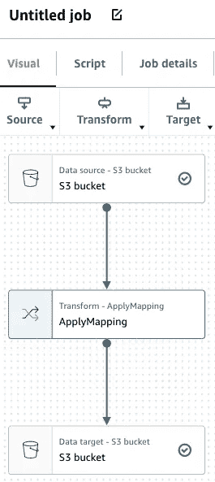
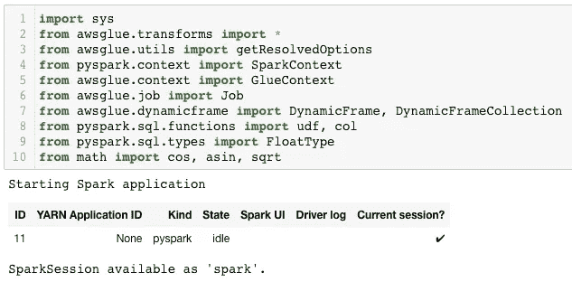
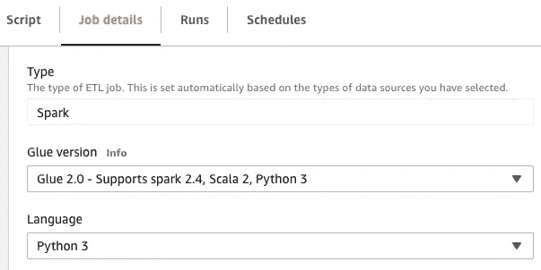
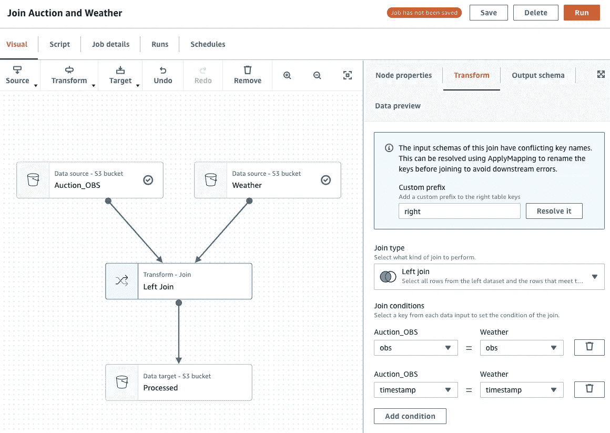

# 用 AWS Glue 进行数据预处理

> 原文：<https://medium.com/geekculture/data-preprocess-with-aws-glue-27890c69a8ee?source=collection_archive---------23----------------------->


Photo by [Mika Baumeister](https://unsplash.com/@mbaumi?utm_source=unsplash&utm_medium=referral&utm_content=creditCopyText) on [Unsplash](https://unsplash.com/s/photos/big-data?utm_source=unsplash&utm_medium=referral&utm_content=creditCopyText)

如果你是 AWS 上的新手，使用 AWS 服务是非常混乱的。我敢打赌你不知道从哪里或者如何开始你的任务。如果你已经做了一些入门的例子，但仍然不知道概念或机制，那么我推荐你也阅读一下 [AWS Glue FAQ](https://aws.amazon.com/glue/faqs/) 。虽然会有点无聊，但我听说 FAQ 对 SAA(AWS 认证解决方案架构师；助理认证)。你不需要什么都懂，AWS 的世界会比你想象的要大。

**开发环境**


Photo by [Markus Spiske](https://unsplash.com/@markusspiske?utm_source=unsplash&utm_medium=referral&utm_content=creditCopyText) on [Unsplash](https://unsplash.com/s/photos/sandbox?utm_source=unsplash&utm_medium=referral&utm_content=creditCopyText)

在大多数情况下，你的任务会比基本的例子更复杂，你需要在 Glue Studio GUI 之外定制脚本。AWS Glue Studio 不方便测试调试源代码。所以在本地使用 docker 映像进行开发会更容易。
https://AWS . Amazon . com/blogs/big-data/developing-AWS-glue-ETL-jobs-locally-using-a-container/

但是有一些限制，现在只支持 glue 1.0，不支持 AWS Glue Parquet writer([format = " Glue Parquet](https://docs.aws.amazon.com/glue/latest/dg/aws-glue-programming-etl-format.html#aws-glue-programming-etl-format-glue-parquet)")。
没有容器，如果想本地开发，查看更多限制，关注下一个链接
[https://docs . AWS . Amazon . com/glue/latest/DG/AWS-glue-programming-ETL-libraries . html](https://docs.aws.amazon.com/glue/latest/dg/aws-glue-programming-etl-libraries.html)

如果你成功创建了一个带有胶水图像的 docker 容器，你可以通过[*http://localhost:8888*](http://localhost:8888)访问 jupyter notebook。以我来说，我已经有了 jupyter 笔记本端口 8888。所以我换到了 8080 端口。

```
docker run -itd -p 8080:8888 -p 4040:4040 -v ~/.aws:/root/.aws:ro --name glue_jupyter amazon/aws-glue-libs:glue_libs_1.0.0_image_01 /home/jupyter/jupyter_start.sh
```

您应该在运行此命令之前完成“aws 配置”。

您可以选择 PySpark、Python 3、Spark 和 SparkR 等新笔记本。默认的粘合脚本包括“从 pyspark.context 导入 spark context”py spark 将是正确的选择。

首先我推荐使用 Glue Studio 的 Job 可视化编辑器。在设置了诸如 S3 桶源和目标这样的基本东西之后，重用一个自动生成的脚本是有帮助的。复制或下载。



Glue Job Visual Editor — Default flow

因为没有' *sys.argv* '值，所以您应该为开发环境中自动生成的脚本修复一个。

```
## [@params](http://twitter.com/params): [JOB_NAME]
# args = getResolvedOptions(sys.argv, ['JOB_NAME'])
args = { "JOB_NAME": "job0"}
```

当只有导入脚本行作为一个单元正确运行时，您可以看到下面的输出图像，包括“可用的火花视觉”。



screenshot after running an import cell

**任务**

我的任务是将天气数据添加到时间序列数据集中。使用了 3 个数据集。
- OBS:观察有其 ID、名称、位置等等。
- Weathers:每日天气数据包含时间戳、平均温度、雨滴、观测的平均风速
- Auctions:每日时间序列数据集包含 item_id、时间戳、target_value、纬度和经度。

它需要两个步骤。
1。寻找最近的 OBS
2。将天气数据与 OBS 结合

**使用自定义项**

这是 udf 的基本用法(来自 pyspark.sql.functions)。DataSource1 有一个位置字段，其值的示例是“35.1234_127.1234”。我不得不离开，去另一个新的专栏。类型来自“pyspark.sql.types”。

```
get_lat = udf(lambda x: float(x.split('_')[0]), FloatType())
get_lon = udf(lambda x: float(x.split('_')[1]), FloatType())df1 = DataSource1.toDF()
df1 = df1.withColumn('lat', get_lat(df1['location']))\
    .withColumn('lon', get_lon(df1['location']))\
    .drop('location')df1.printSchema()
```

**DynamicFrame.fromDF**

要将结果写入 S3，需要' *awsglue.dynamicframe* '中的 DynamicFrame。如前所述，您不能在这个开发环境中使用“glueparquet”格式。在控制台中的生产模式下进行更改，或者您可以使用参数。

```
DataSink0 = glueContext.write_dynamic_frame.from_options(frame = DynamicFrame.fromDF(df1, glueContext, 'OBS'), connection_type = "s3", format = "csv", connection_options = {"path": "s3://target/to/path/", "partitionKeys": []}, transformation_ctx = "DataSink0")
job.commit()
```

**胶水 1.0 vs 胶水 2.0**

[AWS Glue 2.0 版的作业启动时间加快了 10 倍，最短计费时间为 1 分钟。](https://aws.amazon.com/blogs/aws/aws-glue-version-2-0-featuring-10x-faster-job-start-times-and-1-minute-minimum-billing-duration/?nc1=h_ls)在我的例子中，Glue 1.0 在 AWS cloud 上运行一个作业多花了大约 5 分钟。找不到不用胶水 2.0 的理由。然而，我们还不能在使用 docker 容器的开发环境中逃脱 Glue 1.0。我们的测试环境也很快。[两者都支持 Spark 2.4.3](https://docs.aws.amazon.com/glue/latest/dg/release-notes.html) ，但是当' *udf* '返回类型被写成字符串时，有时会显示不同的结果，一个成功开发(Glue 1.0)，另一个在 AWS Glue 控制台运行(Glue 2.0)失败。

```
AttributeError: 'NoneType' object has no attribute '_jvm'
```

这可能是一部分。然而，glue 2.0 设置建议在控制台环境中作为产品使用。是的，还是会有点混乱。



**同列**

这是一些源代码找到最近的观察与纬度和经度。 *df0* 是观察值， *df1* 是具有位置的拍卖数据集。因此，这是将最接近的观察 ID 附加到 df1 上。起初，我认为使用 2 列和双循环需要行迭代，但是使用带有列的“*是可能的。*

```
# source from [https://stackoverflow.com/a/41337005/14539284](https://stackoverflow.com/a/41337005/14539284)
def distance(lat1, lon1, lat2, lon2):
    p = 0.017453292519943295
    hav = 0.5 - cos((lat2-lat1)*p)/2 + cos(lat1*p)*cos(lat2*p) * (1-cos((lon2-lon1)*p)) / 2
    return 12742 * asin(sqrt(hav))def closest(data, v):
    return min(data, key=lambda p: distance(v['lat'],v['lon'],p['lat'],p['lon']))obs = list(map(lambda row: row.asDict(), df0.collect()))
set_obs = udf(lambda x, y: closest(obs, { "lat": x, "lon": y })['id'])df1 = df1.withColumn('obs', set_obs(df1["lat"], df1["lon"]))
df1.printSchema()
```

**iterrows**

其实我也是 spark 上的新手。只是，我有过用 spark 3.0 使用' *applyInPandas'* 的体验。但是我在这种环境下大部分方法都失败了。我们处于支持 spark 2.4 的受限环境 AWS Glue 1.0。(最近 Glue 3.0 在控制台可用，支持 spark 3.1)。有一些用 spark dataframe 循环行的方法，但是我不能这样做。我可能应用了一些错误的东西，但是它失败了，至少在我的开发环境中是这样。你可以查看更多 pyspark 技术作为下一个链接。
*-*[*https://towardsdatascience . com/5-ways-to-add-a-new-column-in-a-py spark-data frame-4e 75 C2 FD 8c 08*](https://towardsdatascience.com/5-ways-to-add-a-new-column-in-a-pyspark-dataframe-4e75c2fd8c08) *-*[*https://sparkbyexamples . com/py spark-loop-iterate-through-rows-in-data frame/*](https://sparkbyexamples.com/pyspark/pyspark-loop-iterate-through-rows-in-dataframe/)

**重启内核或 spark.stop()**

在工作期间，您可能会看到下一个错误。完成工作后，只需在每个任务上运行“spark.stop()”或重启内核继续工作。

```
An error was encountered:
Invalid status code '404' from [http://localhost:8998/sessions/8](http://localhost:8998/sessions/8) with error payload: {"msg":"Session '8' not found."}
```

**加入天气数据**

最后，用上面的结果和天气数据集创建了一个新作业。“左连接”使用 obs(观察 id)和时间戳作为关键字。它只使用 Glue Studio GUI 来完成。



Glue Studio Job — Left Join datasets