# 数据预处理

> 原文：<https://medium.com/geekculture/data-preprocessing-28c19caf09d5?source=collection_archive---------15----------------------->

# 介绍

多年来，我们已经看到许多行业的决策和分析越来越多地由数据和模型驱动。许多组织开始接受使用机器学习作为业务优化的一部分。然而，机器学习模型的好坏取决于用于训练它们的数据质量。我们可以考虑金融机构如何使用交易金额或位置等客户信息来检测信用卡欺诈。在这些观察上有不干净的数据很容易脱离机器学习模型。一旦从各种来源收集了数据，首先要确保在将数据输入模型之前对其进行适当的清理。

数据预处理从来都不是一件容易的事情，许多数据科学家在数据预处理方面都面临着诸多挑战。除了理解业务问题并试图提出解决问题的最佳方法这一挑战之外，数据预处理也是一个需要大量时间和投入的领域。在本文中，我使用了科学 python 生态系统以及 follow 和 ArcGIS 平台的地理空间数据可视化和分析功能来强调数据预处理的一些关键方法，即:数据清洗、探索性数据分析、变量转换和特征工程。

我使用了从 Github 获得的加州住房数据。数据集包含 20，640 个条目。每个条目代表一个区。有 10 个属性*经度，纬度，住房 _ 中位数 _ 年龄，总 _ 房间，总 _ 床位，人口，家庭，中位数 _ 收入，中位数 _ 房屋 _ 价值，海洋 _ 邻近度*。这个数据集是基于 1990 年加州人口普查的数据。它并不完全是最近的，但它有许多学习的品质，所以我们将假设它是最近的数据。

*注* : *本文使用的 Python 笔记本可以在这里找到* [*Python 笔记本*](https://github.com/Musa70/Data-Preprocessing/blob/main/Data%20Preprocessing.ipynb) *。*

# 数据收集

在典型的现实环境中，数据通常分布在来自不同来源的多个表/文档/文件中。要访问这些数据，您首先需要获得您的凭证和访问授权。然而，对于我使用的数据集，事情要简单得多，我只需下载一个压缩文件，其中包含一个包含所有数据的 CSV 文件。

为了下载这个文件，我使用了一个函数。一旦该函数被调用，它就创建一个*数据集/住房*，下载*住房. tgz* ，并从目录中提取*住房. csv* 。如果对原始文件进行了更改，这种方法特别有用，它使得在代码运行时获取这些更改成为可能。我们可以快速浏览一下数据框的片段。

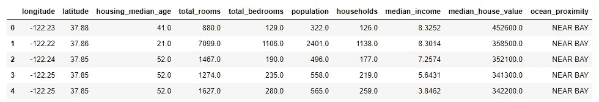

使用 python 的 *info ()* 方法，我们可以获得数据的快速描述，特别是总行数、每个属性的类型和非空值的数量。

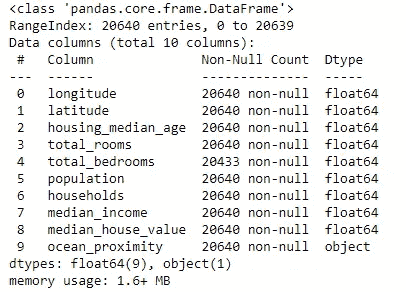

共有 10 个属性，其中 9 个是数字属性(*float 64*)*ocean _ proximity*是唯一一个 *object* 类型的非数字属性。

# 数据清理

## 缺失数据

数据科学家很少会避免丢失数据的问题。一旦发现缺失数据，面临的挑战就是解决缺失数据引发的问题。为此，数据科学家的主要关注点是寻找缺失数据背后的模式和关系，以便在应用任何补救措施时尽可能保持原始的值分布。根据 [Hair 等人(2013)](https://books.google.co.zm/books?id=JlRaAAAAYAAJ) “检查您的数据”一章，对于个别案例或观察，10%以下的缺失数据通常可以忽略。一旦做出这个决定，数据科学家必须应用专门的技术来处理可忽略的缺失数据。Pandas 使净化表格数据变得极其容易。

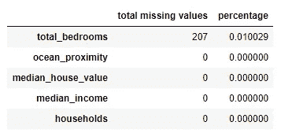

查看数据框中缺失值的汇总显示，*total _ hydro es*列中的 207 个条目被记录为 NA，表示缺少描述的属性。这些来自*total _ believes*列的缺失值使用平均中心性度量进行了补救。

## 极端值

房地产数据中的异常值可能是由多种原因造成的，例如数据输入过程中的打字错误。绘制数值列的分布图可以让人感觉到数据集中的异常值。我使用了两种不同的图来检查异常值的存在。直方图和箱线图。

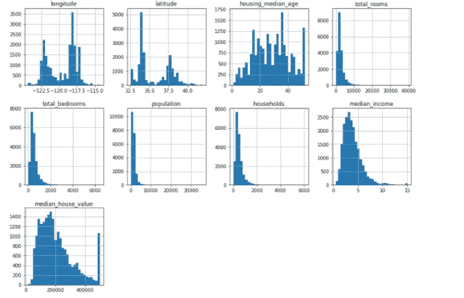

Histogram Plots of variables

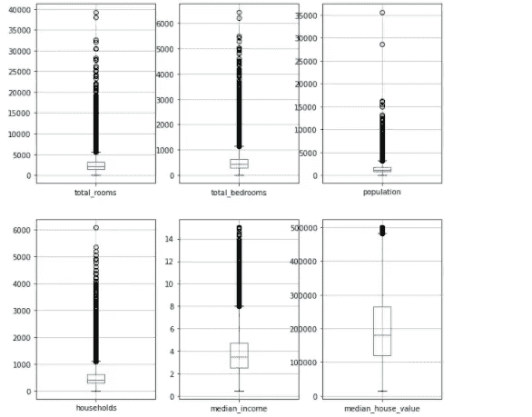

Boxplots of Variables

从上面的箱线图来看，似乎有几个异常值需要关注。*总房间数*、*总卧室数*、*人口数*、*户数*、*中值收入*似乎异常值最多，而*中值房屋价值*似乎没有那么多异常值，但我们无法确定。从直方图中，我们看到分布中存在巨大的偏斜，这也可能是异常值的结果。有几种不同的方法可以过滤异常值。一种流行的技术是使用 6 sigma 滤波器，该滤波器可以去除大于平均值 3 倍标准差的值。此过滤器假设数据遵循正态分布，并使用平均值作为中心性的度量。然而，当数据受到异常值的严重影响时，就像在这种情况下，平均值可能会被扭曲。使用中位数的四分位数间距(IQR)过滤器是一种更稳健的中心性测量方法，可以以更可靠的方式过滤掉距离中位数一定距离的异常值。

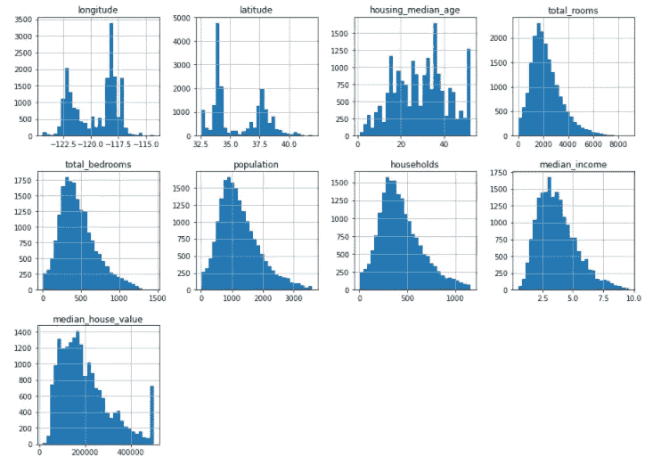

6 Sigma Filter

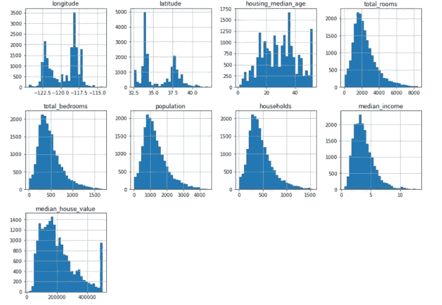

IQR Filter

在使用 IQR 过滤器去除异常值之后，数字列的分布看起来更加健康。

# 数据转换

机器学习工作流中使用的模型通常会对数据做出假设。这方面的一个例子是逻辑回归模型，它假设独立变量和对数优势的线性。

在大多数数据集中，要素和目标变量通常是不一致的。正态分布的偏斜度为零，任何对称数据的偏斜度都应该接近零。偏斜度的负值表示数据向左偏斜，偏斜度的正值表示数据向右偏斜。所谓偏左，是指左尾巴相对于右尾巴长。同样，右斜意味着右尾巴相对于左尾巴长。

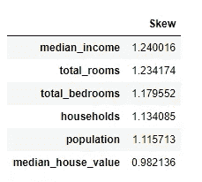

这个问题可以通过使用数据转换来解决。数据转换有多种方法，例如对数转换、平方根转换等[链接](http://fmwww.bc.edu/repec/bocode/t/transint.html)。在本文中，平方根转换用于转换偏斜变量。

看起来大多数变量在转换后更正态分布。

# 探索性数据分析

对于探索性的数据分析，目标主要是更深入地了解数据。在预处理练习的这个阶段，使用了两种主要技术，统计技术和视觉技术。

假设这个数据集包含经度和纬度，一种可视化方法是使用散点图来查看所有地区。因为我们知道数据集中的数据是加利福尼亚州的地区数据，所以我们可以从下面的散点图中看到，它类似于加利福尼亚州的地图。

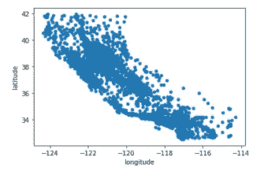

对图表进行一些修改可以使数据点密度高的地方更容易可视化。

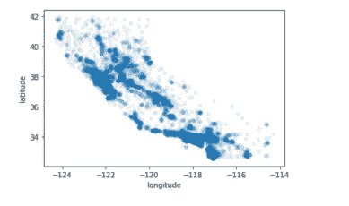

你可以看到高密度区域，即海湾地区和洛杉矶和圣地亚哥周围，加上中央山谷相当高密度的一长串区域，特别是萨克拉门托和弗雷斯诺周围。然而，这只有在你知道加州地图的确切布局或者你身边有地图的情况下才有可能。

Pandas 提供了一个有效的 API 来研究数字列的统计分布。为了探索这个数据集的空间分布，使用了 flour for Python。

与绘制数据框对象的统计图类似，交互式地图微件上的空间图也可绘制如下。

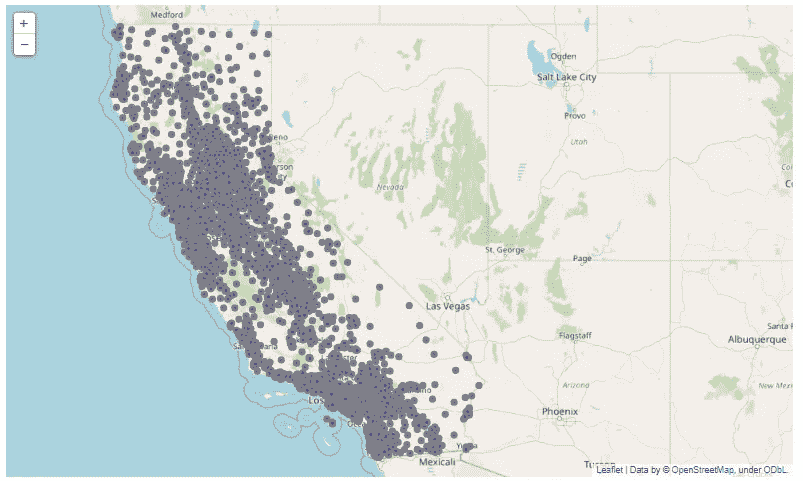

使用聚类算法来检测主要的聚类，我能够创建一个显示不同地区聚类的地图，正如您从下面的地图中看到的，它显示了与上面散点图中记录的相似的聚类分布。

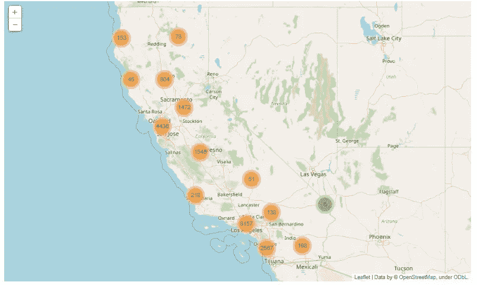

我们可以更进一步，根据加州不同的县对观察结果进行聚类。为此，我们需要为数据集创建一个新列，包含这些地区所在的不同县。这是通过对 Folium 和 ArcGIS API for Python 使用反向地理编码功能完成的。

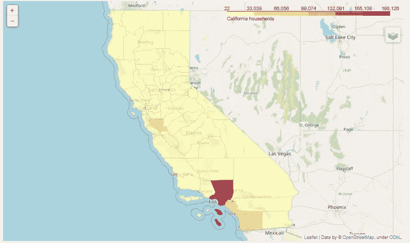

根据生成的地图，我们看到洛杉矶县人口最多。

## 相关

在 python 中，你可以使用 *corr ()* 方法轻松计算每对属性之间的*标准相关系数*(也称为*皮尔森的 r* )。

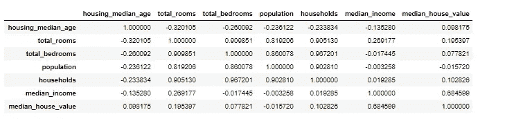

相关系数范围从-1 到 1。相关系数接近 1，代表强正线性关系；例如，当*中值收入*和*中值房屋价值*之间的相关系数为 0.68 时。这意味着随着*中位收入*的增加，平均房价*也会增加。相关系数为-1 意味着有很强的负相关。最后，接近零的系数意味着没有线性相关性。*

我们还可以使用散点图矩阵函数来检查属性之间的相关性，散点图矩阵函数将每个数字属性与每个其他属性进行对比。主对角线显示每个属性的直方图。我们再次看到，预测中值房价最有希望的属性是中值收入。

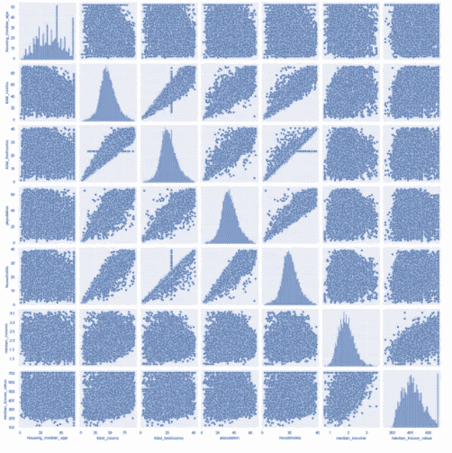

## 分类变量

这些变量描述了一个数据单元的“特征”,是从一小组类别中选出的。在 python 中，分类变量的类型可以是“Object”或“int64”。可视化分类变量的一个好方法是使用箱线图。下面是一个生成的箱线图，用于调查“海洋邻近度”和“中值房屋价值”之间的关系。

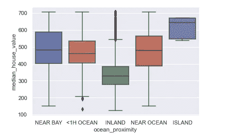

在这里，我们看到五个海洋邻近度类别之间的房屋中值分布非常明显，足以将*海洋邻近度*作为*房屋中值*的潜在良好预测值。

## ANOVA:方差分析

方差分析(ANOVA)是一种统计方法，用于检验两组或更多组的平均值之间是否存在显著差异。ANOVA 返回两个参数:

f 检验分数:ANOVA 假设所有组的平均值相同，计算实际平均值与假设值的偏差，并将其报告为 f 检验分数。分数越大，意味着均值之间的差异越大。

P-value: P-value 告诉我们计算出的分值在统计上有多重要。

如果一个变量与我们正在分析的变量密切相关，那么期望 ANOVA 返回一个相当大的 f 检验分数和一个小的 p 值。

我们可以利用这一点来检查海洋邻近度和中值房价之间的关系。对于此分析，我们推测中值房屋值与海洋邻近值有很大不同。因此，这旨在有足够的证据来拒绝零假设。

*   *h0*:不同海洋邻近度的房屋中值相等
*   *H_1* :不同 ocean _ proximities 的房屋的 median_house_value 不相等

我们将𝛼设定为 0.05，也就是 95%的置信水平。

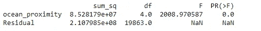

这是一个很好的结果，大的 f 检验分数显示了很强的相关性，P 值几乎为 0，表明几乎有一定的统计学意义，因此我们拒绝零假设。这意味着，在 95%的置信水平下，我们拒绝了具有不同海洋邻近度的房屋的中值相等的零假设。

接下来，我们还可以检查县和中值房价之间的关系。对于此分析，我们推测中位数 _house_value 与 county 有显著差异。因此，这旨在有足够的证据来拒绝零假设。

*   *h0*:不同县的房屋中值相同
*   *H_1* :不同县的房屋中值不相等

我们将𝛼设定为 0.05，也就是 95%的置信水平。

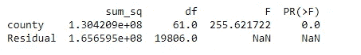

这是一个很好的结果，大的 f 检验分数显示了很强的相关性，P 值几乎为 0，表明几乎有一定的统计学意义，因此我们拒绝零假设。这意味着，在 95%的置信水平下，我们拒绝了具有不同海洋邻近度的房屋的中值相等的零假设。

# 特征工程

## 特征编码

大多数机器学习算法只对数字数据起作用，而不能处理分类数据。因此，我们需要将分类数据转换成数字形式，同时又不失去信息的意义。因为 ocean_proximity 变量没有排名属性，所以我使用了 python 的一键编码功能。

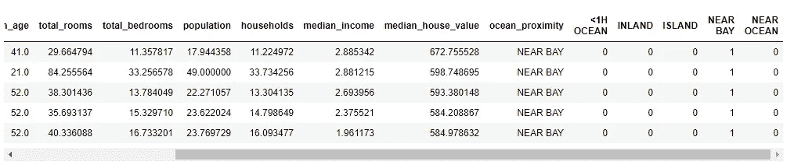

## 特征缩放

特征缩放是大多数机器学习算法最重要的先决条件之一。数据集的各种要素的取值范围可能大相径庭。例如，与卧室的数量相比，像 median_house_value 这样的属性往往是非常大的数字，当在没有缩放的情况下使用时，它往往会在超过其分配权重的分数中占主导地位。

为了纠正这一点，使用 scikit-learn 库中的 *MinMaxScaler* 函数将所有数字列缩放到 0–1 的统一范围。

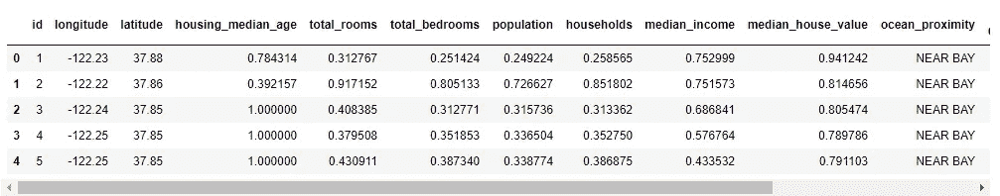

# 结论

本文展示了数据科学和机器学习如何应用于房地产行业的一个方面。如本研究所示，Python 库(如 Pandas)可用于可视化和统计分析，而库(如 Folium 和 ArcGIS API for Python)可用于空间分析。

我试图对数据预处理中一些最常见和最重要的步骤做一个简单的说明。通常，一个人探索数据的深度将取决于你试图揭示什么样的关系。在大多数情况下，从数据检索阶段开始，这个过程可能不像我上面描述的那样简单，数据通常不容易访问。其次，数据清理阶段很可能是一个迭代的过程，因为您可能不得不一遍又一遍地运行不同的测试，以确保数据对于模型来说足够干净。

另一件需要注意的事情是，输入数据在空间上丰富了有关观察区所在的不同县的信息。这可以扩展到使用各种 API 的进一步工程，这取决于你想要构建的模型的类型以及你想要解决的业务问题的类型。