# 自然语言处理中的数据预处理和 EDA。

> 原文：<https://medium.com/geekculture/data-preprocessing-and-eda-for-natural-language-processing-56e45c1df36d?source=collection_archive---------5----------------------->

在实现任何机器学习模型或执行统计假设测试之前，了解关于您的数据的足够见解是非常重要的。探索性数据分析为您提供了对数据的洞察。

在本文中，我们将讨论各自可用的 python 包，以及在自然语言处理领域应该执行的不同探索性任务。对于这篇文章，我使用的是 [Kaggle IMDB 情感分析](https://www.kaggle.com/lakshmi25npathi/imdb-dataset-of-50k-movie-reviews)数据和 Google colab 平台。那么，让我们开始…

## **安装和导入软件包**

我们将使用这些包进行分析。最后提到了软件包的参考文献。

```
!pip install texthero
!pip install -q kaggle # to download the dataset
!pip install wordcloud
!pip install -U textblob
!python -m textblob.download_corpora# importing
import pandas as pd
import matplotlib as plt
import seaborn as sns
import texthero as hero
from texthero import stopwords
import os
from wordcloud import WordCloud
import nltk
nltk.download('wordnet')
from nltk.stem import WordNetLemmatizer
from textblob import TextBlob,Word
```

## 读取数据

从 Kaggle 下载和读取数据集。现在，只考虑 5000 行的探索。

```
!kaggle datasets download -d lakshmi25npathi/imdb-dataset-of-50k-movie-reviews
!unzip 'imdb-dataset-of-50k-movie-reviews.zip' -d kaggle_IMDB#reading data
file_name='kaggle_IMDB/IMDB Dataset.csv'#reading dataframe
df= pd.read_csv(file_name, header='infer',nrows=5000)df.head()
```

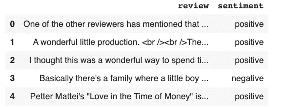

Kaggle IMDB dataset

## 数据预处理

有各种各样的任务需要在数据处理中执行，如小写，删除停用词，删除数字，删除网址，HTML 标签等等。

对于基本的清理和词汇化，我使用了 [texthero](https://github.com/jbesomi/texthero) 和 nltk 包，它提供了与文本预处理和数据探索相关的特性。代码如下:

```
def lemma_per_pos(sent):
'''function to lemmatize according to part of speech tag'''
   t = TextBlob(sent)
   t_dict = {"J": 'a',"N": 'n',"V": 'v',"R": 'r'}
   w_n_t = [(w, t_dict.get(p[0], 'n')) for w, p in t.tags]
   lemmatized_list = [w.lemmatize(t) for w, t in w_n_t]
   return " ".join(lemmatized_list)def df_preprocessing(df,col_name):
    default_stopwords = stopwords.DEFAULT # adding some stop words as for movie review,so removing it
   custom_stopwords = default_stopwords.union(set(["movie","film"])) df[col_name]=[text.replace('<br','') for text in df[col_name]] # cleaning
   df[col_name]= (
              df[col_name]
              .pipe(hero.clean)
              .pipe(hero.remove_html_tags)
              .pipe(hero.remove_brackets)
              .pipe(hero.remove_urls)) # lemmatization
   df[col_name]= [lemma_per_pos(sent) for sent in df[col_name]]
   df[col_name]=hero.remove_stopwords(df[col_name],custom_stopwords) return df
```

正如我们在预处理中看到的，我删除了一些最常见的词，如电影，电影。这背后的原因可以在下图中看到，文本数据中最常见的单词在情感分析中不起作用。这就是为什么分析数据在任何文本处理中都是一个重要的先决条件，以后，您可以根据自己的需要改变预处理步骤。

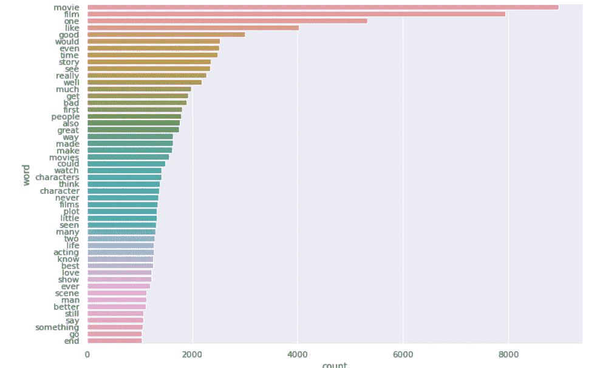

Most common words (generated without removing common words)

此外，还有像 *make、made、films、film、characters 这样的单词,*被视为不同的单词。因此，术语化对于解决这个问题很重要。

[](https://en.wikipedia.org/wiki/Lemmatisation)**(****词汇化*** *)在语言学中是将一个单词的屈折形式组合在一起的过程，这样它们就可以作为一个单独的项目来分析，通过该单词的词汇或词典形式来识别。(来源:维基百科)**

*有许多不同的词汇化包可供使用。比较那些技术来验证你想要的能不能实现总是比较好的。例如，如下图所示，一个是根据词性标注(POS)的词汇化，另一个是没有词性的词汇化。你可以清楚地看到不同之处。检查你的 lemma 输出并根据你的需要使用它们是一个很好的实践。*

*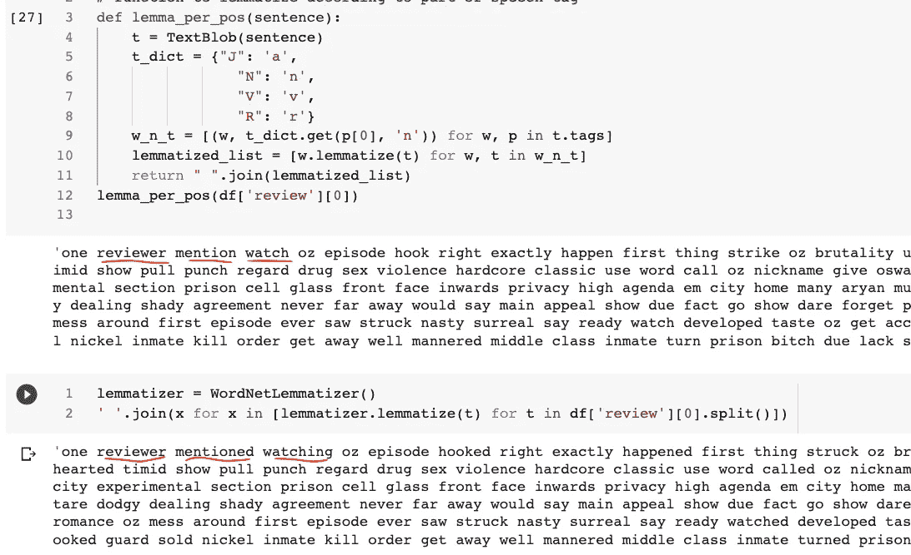*

*并且，在去掉最常见的单词和词汇化之后，分布看起来是这样的。*

*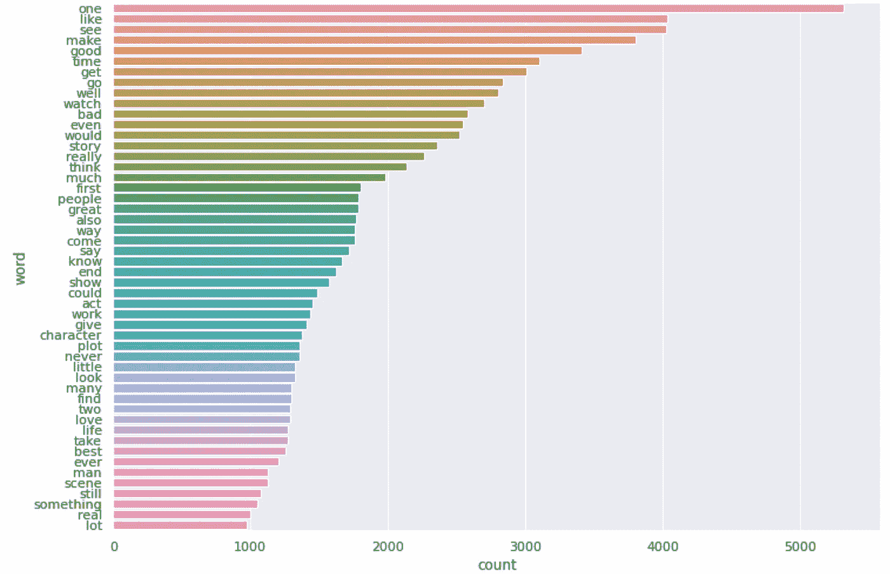*

*Most common words after stop words, most common words removal and lemmatization.*

## *句子层次分析*

*文本统计包括句子长度分布、最小值、最大值和平均长度。*

*检查句子长度分布。代码和输出如下:*

```
*df['len']= df['review'].str.len()print('Max length: {}, Min length: {}, Average Length :  {}'.format(max(df['len']),min(df['len']),df['len'].mean()))df['len'].hist()*
```

*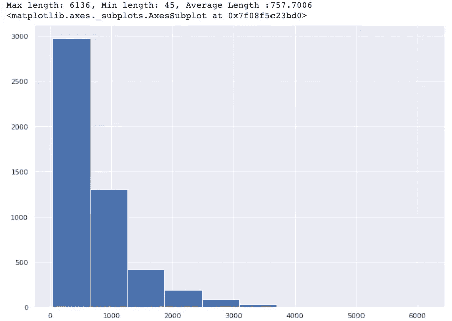*

*Length distribution*

*从分布来看，大部分文章长度在 0-1000 之间，最大长度、最小长度和平均长度分别为 6136、45、757。这里要注意的一点是，句子长度包括单词之间的空格。如果你想要没有空间的分配，你可以使用下面的代码。*

```
*df['len']= df['review']str.split().map(lambda x: len(x))
df['len'].hist()*
```

## *单词级分析*

*对于单词级分析，我们需要将一个完整的文本样本组合成一个文本文档，然后拆分成单词。*

```
*text= ' '.join(t for t in df['review'])
words_list= text.split()*
```

*创建一个字典，将单词作为关键字，将它们的计数作为值，然后创建单词的数据帧。*

```
*word_freq= {}
for word in set(words_list):
    word_freq[word]= words_list.count(word)#Creating dataframe of words
df_word= pd.DataFrame(word_freq.items(),columns=['word','count'])*
```

*在为 word 创建了数据帧之后，现在我们可以添加每个单词的长度。*

```
*df_word['word_len']= df_word['word'].map(lambda x: len(x))# sorting values 
df_word=df_word.sort_values('count',ascending=False).reset_index(drop=True)df_word*
```

**

*word dataframe*

*最常见的 50 个单词是:*

```
*df_top= df_word.head(50)sns.barplot(df_top['count'],df_top['word'])*
```

*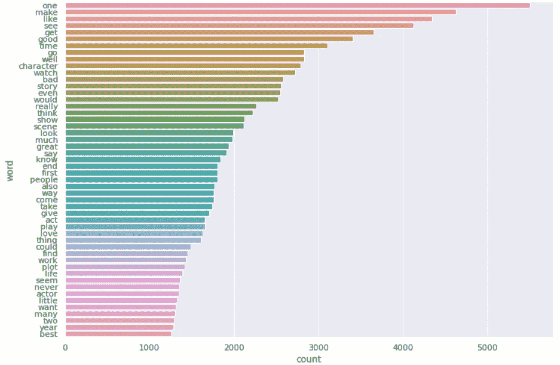*

*Most common words*

*现在，长度分布。*

```
*df_word['word_len'].hist()*
```

*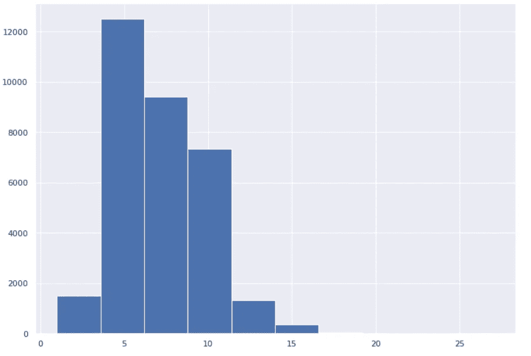*

*Word length distribution*

***等等！**，这里有些诡异。有长度超过 15 的单词。我们必须验证，这些到底是不是英文单词？*

*让我们检查一下…*

```
*df_word[df_word['word_len']==max(df_word['word_len'])]*
```

*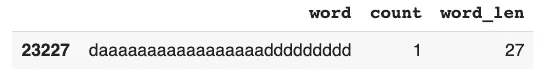*

*Non-English word*

*有时，用户只是在评论中输入随机字符，我们需要找到并删除它们。我们可以通过检查这个单词实际上是一个英语单词来做到这一点。我已经在预处理代码中添加了这种验证。*

```
*nltk.download('words')
from nltk.corpus import words
setofwords = set(words.words())lemmatized_list = [w.lemmatize(t) for w, t in w_n_t if w in setofwords]*
```

*解决问题后，*

*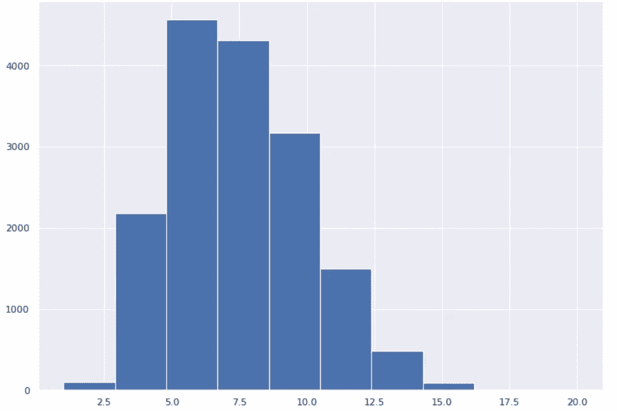*

*Word length distribution*

*现在，最长的单词显示如下，这似乎是正确的英语单词。*

*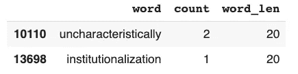*

*这就是分析的美妙之处，我们在后期面对问题之前就发现了问题。*

## *主题建模*

*哪些单词代表文本语料库，让我们用 python 中的 [wordcloud](https://amueller.github.io/word_cloud/) 包来绘制这些单词。*

```
*wordcloud = WordCloud(background_color=’white’,max_words=100,
                      max_font_size=40,
                      scale=3,
                      random_state=1)
                      .generate(text)
plt.axis(“off”)
plt.imshow(wordcloud)*
```

*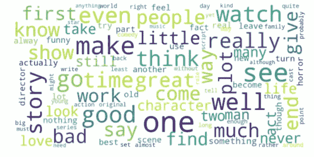*

*最后，您可以在文本示例中看到代表电影评论的单词，这些是评论电影最常用的单词。*

## *评论的情绪*

*让我们检查一下情感在文本数据中是如何分布的。对于这个任务，我们将再次使用 textblob。*

*TextBlob 的情绪输出了一个极性和主观性的元组。**极性**范围[-1.0，1.0]其中-1.0 为负极性，1.0 为正极性，0.0 为中性。**主观性**范围【0.0，1.0】其中 0.0 表示高度客观，1.0 表示非常主观。*

```
*df[‘review’][8]*
```

*即*

**“积极向前看看坏错误看真的一坏糟透了几乎每一种方式行事宋蹩脚的乡村曲调少了四次廉价的令人讨厌的令人厌烦的极端的很少高兴看到结局的事给分远了最好的表演最少使咬劲一个”**

```
*TextBlob(df[‘review’][8]).sentiment*
```

*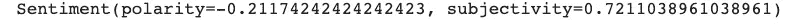*

*根据 TextBlob，给定的句子带有负面情绪和高度主观，如果我们阅读评论，这是有意义的。*

*现在，完成文本语料库中的情感分布。*

```
*def polarity(x):
    if TextBlob(x).sentiment[0]<-0.25:
       return 'Negative'
    if TextBlob(x).sentiment[0]>0.25:
       return 'Positive'
    return 'Neutral'df['sentiment']= df['review'].map(lambda x: polarity(x))
df['sentiment'].hist()*
```

*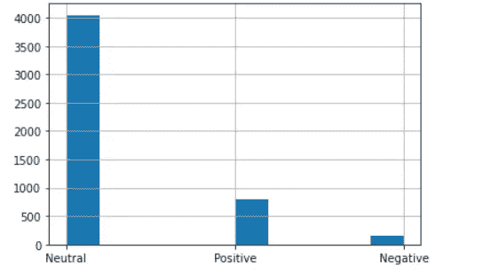*

*sentiment distributiion*

*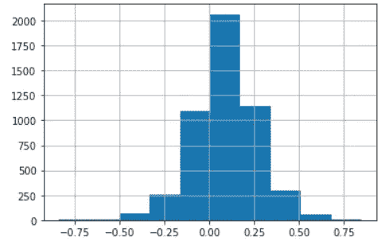*

*Sentiment distribution without mapping to classes*

*根据情感分布，大多数评论是中性的，极少数评论有负面情感*

## *进一步探索*

*使用 tf/idf 和主成分分析，我们可以在散点图中显示我们的数据，并检查它在 2D 散点图中的外观。*

```
*df[‘pca’] = (df[‘review’].pipe(hero.tfidf).pipe(hero.pca))hero.scatterplot(df, ‘pca’, color=’sentiment’, title=”sentiment”)*
```

*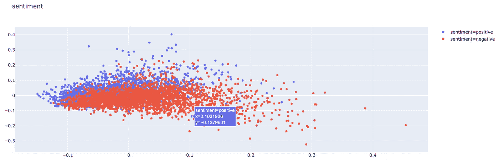*

*Scatter plot*

*现在，我们尝试使用 k-means 聚类来发现文本语料库中的隐藏聚类。*

```
*df[‘kmeans_labels’] = (df[‘review’].pipe(hero.tfidf)
                       .pipe(hero.kmeans, n_clusters=2)
                        .astype(str))hero.scatterplot(df, ‘pca’, color=’kmeans_labels’, title=”K-means”)*
```

**

*K-means plot*

## ***最终意见***

*在本文中，我们讨论了不同的数据预处理和探索性数据分析包及其实现。像 texthero、textblob 和 nltk 这样的包可以简化复杂的任务，节省时间和精力。*

*对于情感分析，我发现上述步骤足够了。然而，还有进一步的分析任务，如 n-grams 分布、词性、可读性测试和实体识别，可以通过提到的 python 包来实现(对于可读性测试，您可以使用 [Textstat](https://pypi.org/project/textstat/) )。请浏览参考资料以获取更多信息。*

*希望如此！，这篇文章很有用，你学到了一些新东西。*

*谢谢你和快乐的分析！*

## *参考资料:*

1.  *[https://www . ka ggle . com/Lakshmi 25 npath I/IMDB-dataset-of-50k-movie-reviews](https://www.kaggle.com/lakshmi25npathi/imdb-dataset-of-50k-movie-reviews)*
2.  *[https://github.com/jbesomi/texthero](https://github.com/jbesomi/texthero)*
3.  *[https://textblob.readthedocs.io/en/dev/index.html](https://textblob.readthedocs.io/en/dev/index.html)*
4.  *[https://www.nltk.org/](https://www.nltk.org/)*
5.  *[https://amueller.github.io/word_cloud/](https://amueller.github.io/word_cloud/)*
6.  *[https://pypi.org/project/textstat/](https://pypi.org/project/textstat/)*