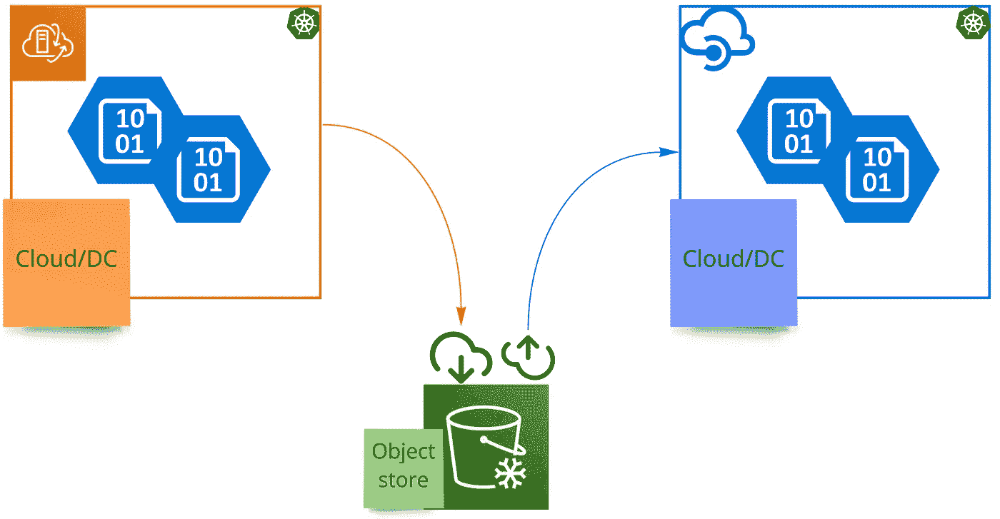
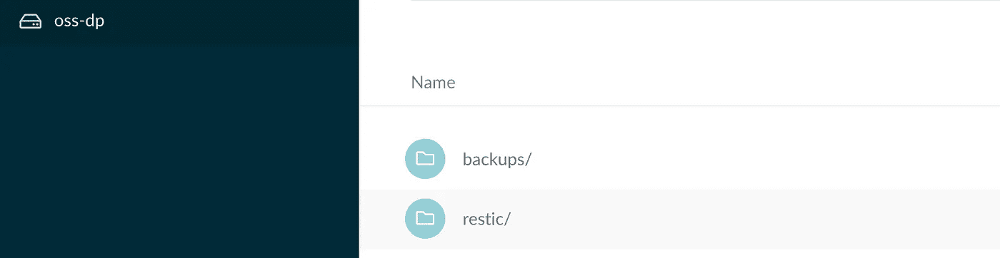
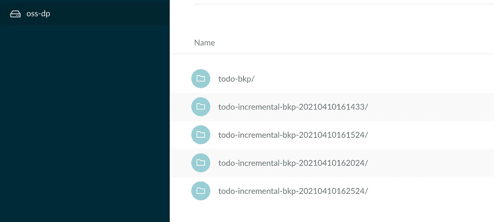

# 数据保护

> 原文：<https://medium.com/geekculture/data-protection-80549698533?source=collection_archive---------11----------------------->

## 使用 Velero 进行 K8s 备份和恢复

Velero 是一个开源备份工具，用于保存和恢复 Kubernetes 集群状态。K8s 集群状态(包括挂载的数据)保存在一个外部对象存储中，用于在意外丢失/删除的情况下在同一个集群中恢复它，或者在不同云中其他地方的新集群中恢复它。它使用云提供商的本机功能拍摄卷快照，并使用 restic 促进供应商中立的备份。

> **背景:**让我们看看如何利用 Velero 在运行于两个不同云上的 K8s 集群之间移动数据。这将使用 restic 集成，而不是本地云提供商快照功能。



> **先决条件:**在两个不同的云'/dcs '和外部预配置的 S3 兼容对象存储中运行 K8s 集群。

> **Init:** 源是通过 Tanzu Mission Control (TMC)在 AWS 上提供的 Tanzu Kubernetes 网格(TKG)集群，目标是本地 GKE 集群，Minio 作为外部对象存储。

让我们在 Postgres DB 上安装一个具有外部状态依赖的 Spring 反应式 r2dbc 应用程序。Postgres 存储作为 PVC 安装在 EBS 卷上。要部署到 TKG 集群的源代码和 K8s 资源清单可从这里获得。

> **源操作**

创建一个新的名称空间`kubectl create ns todo`，将上面的 repo 克隆到本地文件系统，并使用 ska fold-CLI/waypoint 等工具将应用程序部署到这个名称空间。使用这些工具，构建和部署通过单个清单定义集成并完成。

> 一个**PP-展开**

```
skaffold run -n todo --tail
```

在克隆的源存储库中导航到目标 k8s 文件夹，并运行上面的命令来构建应用程序并将其部署到 TKG。确保将部署和 skaffold 清单中的映像引用更新到您的注册表和 repo 引用中。

```
╰─ **kubectl -n todo get pods**
NAME                             READY   STATUS    RESTARTS   AGE
todo-79855b98fb-5vxj6            1/1     Running   0          41h
todo-postgres-6dd5c84546-dj7kl   1/1     Running   0          41h╰─ **kubectl -n todo get pvc**
NAME                STATUS   VOLUME                                     CAPACITY   ACCESS MODES   STORAGECLASS   AGE
todo-postgres-pvc   Bound    pvc-54ded26c-7451-4129-957a-fc4d949c57b5   5Gi        RWO            standard       41h╰─ **kubectl -n todo get svc**
NAME            TYPE        CLUSTER-IP       EXTERNAL-IP   PORT(S)    AGE
todo            ClusterIP   10.100.101.246   <none>        8080/TCP   41h
todo-postgres   ClusterIP   10.103.2.225     <none>        5432/TCP   41h
```

让我们向 todo 应用程序发送一些 POST/PUT 请求，以使用 [httpie](https://httpie.io/) 或您选择的任何工具对后台 Postgres 持久性存储进行更改。

> 数据持久性

```
╰─ **kubectl -n todo port-forward svc/todo 8080:8080**
Forwarding from 127.0.0.1:8080 -> 8080
Forwarding from [::1]:8080 -> 8080╰─ **http :8080/todo**
HTTP/1.1 200 OK
Content-Type: application/json
transfer-encoding: chunked[
    {
        "id": "3fc179e3-353b-440b-8164-12f98df3a545",
        "status": true,
        "task": "My first todo"
    }
]╰─ **http POST :8080/todo id="" task="Velero data protection"**
HTTP/1.1 201 Created
Content-Length: 92
Content-Type: application/json{
    "id": "fba98524-e830-4569-912f-3a4cdecee1dc",
    "status": false,
    "task": "Velero data protection"
}╰─ **http POST :8080/todo id="" task="Velero data recovery"** status=true
HTTP/1.1 201 Created
Content-Length: 89
Content-Type: application/json{
    "id": "3724f8e5-e2ac-44e5-ae03-5b25c04191ef",
    "status": true,
    "task": "Velero data recovery"
}╰─ **http PUT :8080/todo id="fba98524-e830-4569-912f-3a4cdecee1dc"** status="true" task="Velero data protection"
HTTP/1.1 200 OK
Content-Length: 91
Content-Type: application/json{
    "id": "fba98524-e830-4569-912f-3a4cdecee1dc",
    "status": true,
    "task": "Velero data protection"
}
```

跳回以检查数据存储状态，

```
╰─ **http :8080/todo**
HTTP/1.1 200 OK
Content-Type: application/json
transfer-encoding: chunked[
    {
        "id": "fba98524-e830-4569-912f-3a4cdecee1dc",
        "status": true,
        "task": "Velero data protection"
    },
    {
        "id": "3fc179e3-353b-440b-8164-12f98df3a545",
        "status": true,
        "task": "My first todo"
    },
    {
        "id": "3724f8e5-e2ac-44e5-ae03-5b25c04191ef",
        "status": true,
        "task": "Velero data recovery"
    }
]
```

> **初始化 Velero**

让我们使用 CLI 安装 velero，

```
velero install --use-restic \
    --default-volumes-to-restic \
    --provider aws \
    --plugins velero/velero-plugin-for-aws:v1.2.0 \
    --bucket **<bucket_store_name>** \
    --secret-file **<bucket_access_creds_file_path>** \
    --backup-location-config region=minio,s3ForcePathStyle="true",s3Url=**<s3_endpoint_url>**default-volumes-to-restic 
- will enable the restic volume backup by defaultsecret-file
- content of the file would be like,
***[default]
aws_access_key_id=<val>
aws_secret_access_key=<val>***backup-location-config
- point it to the S3 minio endpoint and region location
```

检查安装的状态，

```
╰─ **velero backup-location get**
NAME      PROVIDER   BUCKET/PREFIX   PHASE       LAST VALIDATED                  ACCESS MODE
default   aws        oss-dp          Available   2021-04-10 21:02:24 +0530 IST   ReadWrite╰─ **kubectl -n velero get all**
NAME                          READY   STATUS    RESTARTS   AGE
pod/restic-lxl8g              1/1     Running   0          49s
pod/restic-tlwx6              1/1     Running   0          49s
pod/velero-65b78c9b54-z5nx2   1/1     Running   0          50sNAME                    DESIRED   CURRENT   READY   UP-TO-DATE   AVAILABLE   NODE SELECTOR   AGE
daemonset.apps/restic   2         2         2       2            2           <none>          52sNAME                     READY   UP-TO-DATE   AVAILABLE   AGE
deployment.apps/velero   1/1     1            1           54s
```

> **初始化备份**

为`todo`名称空间启动 velero 备份，

```
╰─ **velero backup create todo-bkp --include-namespaces todo**
Backup request "todo-bkp" submitted successfully.
```

检查备份状态，

```
╰─ **velero backup describe todo-bkp**
Name:         todo-bkp
Namespace:    velero
Labels:       velero.io/storage-location=default
Annotations:  velero.io/source-cluster-k8s-gitversion=v1.19.4+vmware.2
              velero.io/source-cluster-k8s-major-version=1
              velero.io/source-cluster-k8s-minor-version=19Phase:  CompletedErrors:    0
Warnings:  0
```

S3 minio 存储桶将为启动的备份创建包含工件的适当结构。



minio object-store

> **目标运营**

让我们将上下文切换到 GKE 目标集群，并使用 CLI 以与上面相同的方式安装 velero。检查集群状态，

```
velero install --use-restic \
    --default-volumes-to-restic \
    --provider aws \
    --plugins velero/velero-plugin-for-aws:v1.2.0 \
    --bucket **<bucket_store_name>** \
    --secret-file **<bucket_access_creds_file_path>** \
    --backup-location-config region=minio,s3ForcePathStyle="true",s3Url=**<s3_endpoint_url>**- point the velero controller to the same external minio store.╰─ **velero backup-location get**
NAME      PROVIDER   BUCKET/PREFIX   PHASE       LAST VALIDATED                  ACCESS MODE
default   aws        oss-dp          Available   2021-04-10 21:25:21 +0530 IST   ReadWrite╰─ **k get ns**
NAME              STATUS   AGE
default           Active   5m57s
kube-node-lease   Active   5m59s
kube-public       Active   5m59s
kube-system       Active   5m59s
velero            Active   63s
```

> **初始化恢复**

恢复该集群中的`todo`名称空间，

```
╰─ **velero backup get**
NAME       STATUS      ERRORS   WARNINGS   CREATED                         EXPIRES   STORAGE LOCATION   SELECTOR
todo-bkp   Completed   0        0          2021-04-10 21:05:23 +0530 IST   29d       default            <none>╰─ **velero restore create --from-backup=todo-bkp todo-restore**
Restore request "todo-restore" submitted successfully.
Run `velero restore describe todo-restore` or `velero restore logs todo-restore` for more details.
```

检查还原状态，

```
╰─ **velero restore describe todo-restore**
Name:         todo-restore
Namespace:    velero
Labels:       <none>
Annotations:  <none>Phase:  Completed╰─ **kubectl get ns**
NAME              STATUS   AGE
default           Active   10m
kube-node-lease   Active   10m
kube-public       Active   10m
kube-system       Active   10m
todo              Active   2m2s
velero            Active   5m53s╰─ **kubectl -n todo get pods**
NAME                            READY   STATUS    RESTARTS   AGE
todo-5b76c86c69-rvtgd           1/1     Running   1          3m39s
todo-postgres-d95749c96-lx2bq   1/1     Running   0          3m39s╰─ **kubectl -n todo get pvc**
NAME                STATUS   VOLUME                                     CAPACITY   ACCESS MODES   STORAGECLASS   AGE
todo-postgres-pvc   Bound    pvc-d53829e5-a379-424c-af03-78dd796b251a   5Gi        RWO            standard       4m5s
```

检查数据存储状态，

```
╰─ **http :8080/todo**
HTTP/1.1 200 OK
Content-Type: application/json
transfer-encoding: chunked[
    {
        "id": "fba98524-e830-4569-912f-3a4cdecee1dc",
        "status": true,
        "task": "Velero data protection"
    },
    {
        "id": "3fc179e3-353b-440b-8164-12f98df3a545",
        "status": true,
        "task": "My first todo"
    },
    {
        "id": "3724f8e5-e2ac-44e5-ae03-5b25c04191ef",
        "status": true,
        "task": "Velero data recovery"
    }
]
```

恢复在目标群集中成功完成，状态与源相同。所有这些都发生在不对集群文件/定义进行任何更改的情况下。默认情况下，它使用 restic 作为安装期间指示的持久性。

清理名称空间`kubectl delete ns todo`

> **增量备份**

让我们将上下文切换到源 TKG 群集，并启动一个定时备份流程。Velero 对创建的时间表进行增量备份。根据 RTO/RPO 要求创建 Cron 计划。在这种情况下，cron 每 5 分钟运行一次，以备份指定的命名空间资源。

```
╰─ **velero schedule create todo-incremental-bkp --schedule="*/5 * * * *" --include-namespaces=todo**
Schedule "todo-incremental-bkp" created successfully.╰─ **velero schedule get**
NAME                   STATUS    CREATED                         SCHEDULE      BACKUP TTL   LAST BACKUP   SELECTOR
todo-incremental-bkp   Enabled   2021-04-10 21:44:33 +0530 IST   */5 * * * *   720h0m0s     44s ago       <none>
```

让我们发布更多更新，

```
╰─ **http POST :8080/todo id="" task="Velero incremental backups"** status=true
HTTP/1.1 201 Created
Content-Length: 95
Content-Type: application/json{
    "id": "0bde3c1e-70b8-4545-b73e-f02ef9f6e2b1",
    "status": true,
    "task": "Velero incremental backups"
}╰─ **http :8080/todo**
HTTP/1.1 200 OK
Content-Type: application/json
transfer-encoding: chunked[
    {
        "id": "fba98524-e830-4569-912f-3a4cdecee1dc",
        "status": true,
        "task": "Velero data protection"
    },
    {
        "id": "3fc179e3-353b-440b-8164-12f98df3a545",
        "status": true,
        "task": "My first todo"
    },
    {
        "id": "3724f8e5-e2ac-44e5-ae03-5b25c04191ef",
        "status": true,
        "task": "Velero data recovery"
    },
    {
        "id": "0bde3c1e-70b8-4545-b73e-f02ef9f6e2b1",
        "status": true,
        "task": "Velero incremental backups"
    }
]
```

跳到 minio 控制台，您会注意到增量备份更新。



scheduled incremental back-ups

> **再次初始化恢复**

让我们将上下文切换回目标群集，以启动恢复过程。

```
╰─ **kubectl get ns**
NAME              STATUS   AGE
default           Active   38m
kube-node-lease   Active   38m
kube-public       Active   38m
kube-system       Active   38m
velero            Active   33m
```

现在从增量备份中恢复`todo`命名空间数据，

```
╰─ **velero restore create --from-schedule=todo-incremental-bkp todo-incremental-restore --include-namespaces=todo**
Restore request "todo-incremental-bkp" submitted successfully.╰─ **velero restore describe todo-incremental-restore**
Name:         todo-incremental-restore
Namespace:    velero
Labels:       <none>
Annotations:  <none>Phase:  CompletedStarted:    2021-04-10 22:02:08 +0530 IST
Completed:  2021-04-10 22:02:36 +0530 ISTBackup:  todo-incremental-bkp-20210410163024
```

检查还原状态，

```
╰─ **kubectl get ns**
NAME              STATUS   AGE
default           Active   43m
kube-node-lease   Active   43m
kube-public       Active   43m
kube-system       Active   43m
todo              Active   79s
velero            Active   38m╰─ **kubectl -n todo get pods**
NAME                            READY   STATUS    RESTARTS   AGE
todo-5b76c86c69-rvtgd           1/1     Running   1          5m41s
todo-postgres-d95749c96-lx2bq   1/1     Running   0          5m41s╰─ **kubectl -n todo get pvc**
NAME                STATUS   VOLUME                                     CAPACITY   ACCESS MODES   STORAGECLASS   AGE
todo-postgres-pvc   Bound    pvc-32a3329f-55d5-40d7-90bf-046b2960b6d6   5Gi        RWO            standard       6m38s
```

重新检查数据存储状态，

```
╰─ **http :8080/todo**
HTTP/1.1 200 OK
Content-Type: application/json
transfer-encoding: chunked[
    {
        "id": "fba98524-e830-4569-912f-3a4cdecee1dc",
        "status": true,
        "task": "Velero data protection"
    },
    {
        "id": "3fc179e3-353b-440b-8164-12f98df3a545",
        "status": true,
        "task": "My first todo"
    },
    {
        "id": "3724f8e5-e2ac-44e5-ae03-5b25c04191ef",
        "status": true,
        "task": "Velero data recovery"
    },
    {
        "id": "0bde3c1e-70b8-4545-b73e-f02ef9f6e2b1",
        "status": true,
        "task": "Velero incremental backups"
    }
]
```

Velero 已经完全恢复了名称空间状态，所有资源和数据都完好无损。这是一个常见的用例，其中 Velero 用于为灾难恢复安排 K8s 集群的常规备份。

> ***引用:*** Velero[https://Velero . io](https://velero.io)[](https://velero.io/)*Velero 源码* [https://github.com/vmware-tanzu/velero](https://github.com/vmware-tanzu/velero) *Spring App 源码* [https://github.com/srinivasa-vasu/todo.git](https://github.com/srinivasa-vasu/todo.git)*Velero-rest*