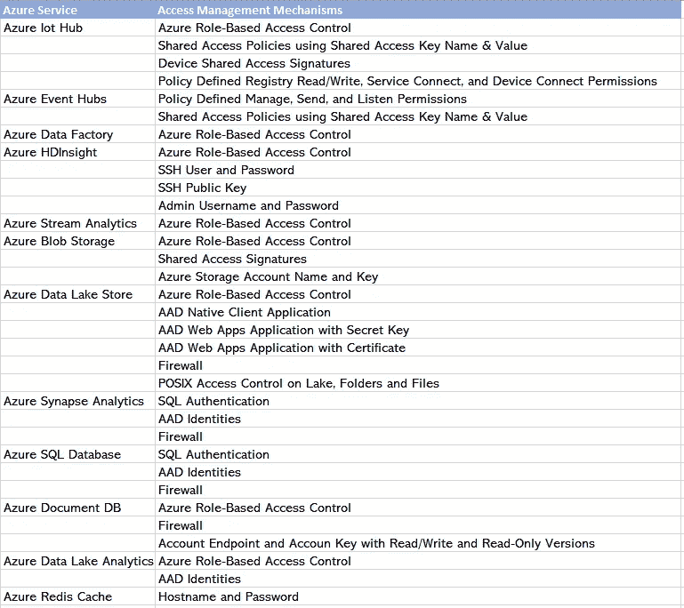
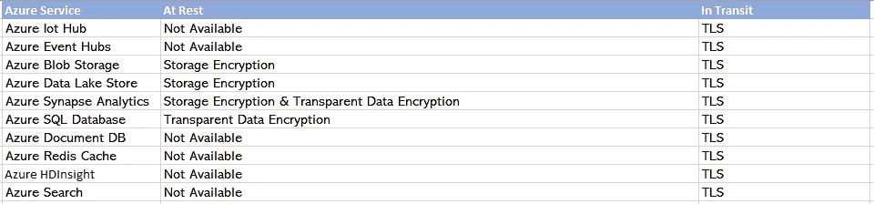
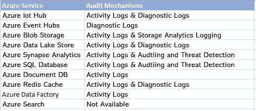

# Azure 服务上的数据保护

> 原文：<https://medium.com/geekculture/data-protection-on-azure-services-4c73f505d003?source=collection_archive---------40----------------------->

如果你是一名数据工程师或数据科学家，使用 Azure 云来构建你的分析管道或服务，你会经常遇到这样的问题:在生产部署的情况下，控制谁可以访问你的管道中的资源，以及一旦他们有了访问权，他们可以做什么。

Azure 中的数据保护机制根植于下面列出的主要思想:

**身份:**将访问服务的用户或组

**认证:**验证用户或应用程序的身份证明

**授权:**允许用户或应用程序在通过身份验证后执行特定任务的特权或访问级别。

虽然管理上述内容的实际机制因每个 Azure 服务而异，但它们可以缩小到以下访问管理机制:

**Azure Active Directory (AAD)身份:**使用 Azure Active Directory 来管理用户、应用程序或组身份。

**共享访问签名:**加密保护的 URIs，定义了资源上允许的权限。

**共享密钥:**作为凭证的密钥名和秘密值对或用户名和密码。

**基于角色的访问控制(RBAC):** 根据用户或应用程序在角色或组中的成员资格应用于用户或应用程序的权限。

**防火墙:**尝试访问服务的客户端基于 IP 地址的访问。

**策略:**用户被允许采取的动作可以从 POSIX 风格的权限(例如，读、写、执行)到更多特定于服务的权限。

Azure 上一些常用的基于分析的服务的可用访问管理机制如下:

Figure 1 — Access Management Mechanisms for Commonly Used Analytics Based Services on Azure

除了控制谁可以访问您公司的数据以及他们有权做什么之外，还需要考虑静态数据的安全性以及传输中数据的安全性。

以下是静态数据保护的几个可用选项:

**透明数据加密:**对于 Azure SQL 和 Synapse Analytics 等数据库，数据在写入前加密，在读取前解密，这些操作对客户端应用程序是透明的。

**磁盘加密:**磁盘卷或虚拟硬盘的加密。

**存储加密:**对于像 Azure Blob Storage 和 Azure Data Lake 这样的文件存储，数据在写入之前被加密，在读取之前被解密。

对于传输中的数据，最常用的选项如下:

**TLS :** 在客户端和数据存储之间使用行业标准传输层安全性，以提供跨公共通道(如互联网)的安全通信。

Azure 上一些常用的基于分析的服务的可用数据保护机制如下:

Figure 2— Data Protection Mechanisms for Commonly Used Analytics Based Services on Azure

审计和监控对于了解谁在对您的数据做什么也很重要。Azure 中的主要审计机制如下:

**诊断日志:**诊断日志捕获与服务管理的数据交互的 Azure 存储帐户操作。

**活动日志:**虽然这个功能在几乎所有的服务上都有，但是它可以捕获任何影响 Azure 服务配置的变化。

**审计和威胁检测:**该特性是针对 SQL 数据库和 SQL 数据仓库的。

**Storage Analytics 日志记录:** Azure Blob Storage 在此类别下提供了一组专门的审计日志。

Azure 上的一些上述基于分析的服务的可用审计机制如下:

Figure 3— Audit Mechanisms for Commonly Used Analytics-Based Services on Azure