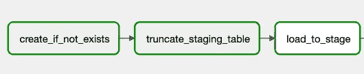
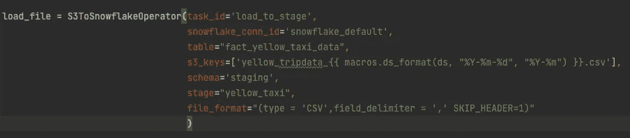
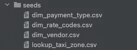
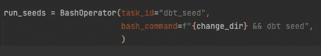
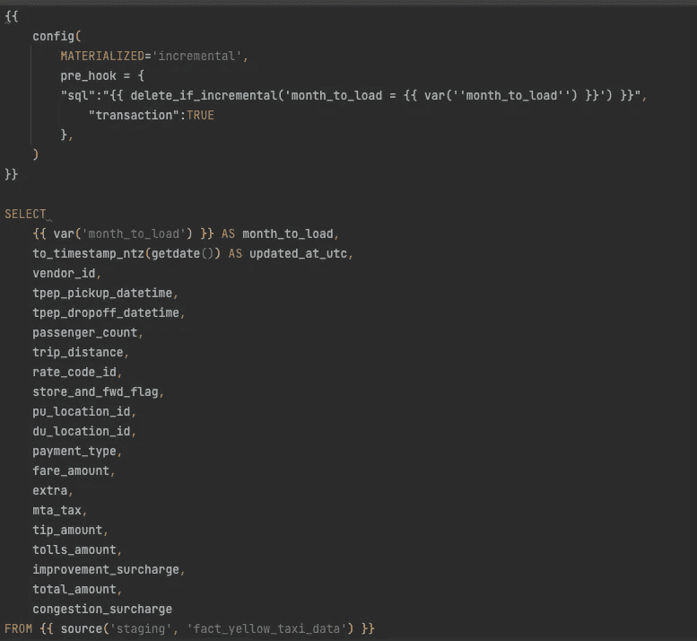
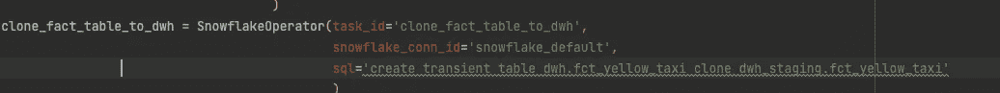
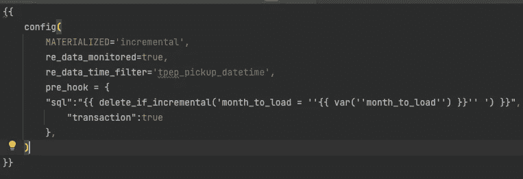
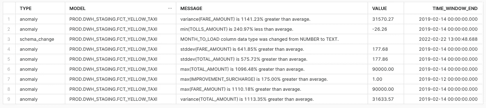

# 数据质量和可靠性

> 原文：<https://medium.com/geekculture/data-quality-and-reliability-bb26c29e58f2?source=collection_archive---------4----------------------->


Photo by [Luke Chesser](https://unsplash.com/@lukechesser?utm_source=unsplash&utm_medium=referral&utm_content=creditCopyText) on [Unsplash](https://unsplash.com/s/photos/data-quality?utm_source=unsplash&utm_medium=referral&utm_content=creditCopyText)

## 在弄乱生产数据或保持数据的可靠性和高质量之前，了解您的问题

# 介绍

说数据是新的石油/黄金/熏肉(任何能让你的船漂浮的东西)现在很流行。数据人员的工作和努力终于得到了认可。不是这样的，甚至不是很久以前。如果你从事数据工作，你知道我在说什么。Excel 猴子，SQL 写手，没多少人把这个领域当必须的。随着公司越来越受数据驱动，或者想要自己的数据，人们得到了长期以来应得的认可。

但是，如果数据质量没有得到检查并流向数据湖、数据仓库、数据仓库，那该怎么办呢？说得好，“垃圾进——垃圾出。”您可能会注意到，数据质量和数据可靠性也正在成为一个热门话题。在这篇博文中，我计划用一些已知/未知的工具来涵盖我的假设场景，并提供一些关于市场上存在什么的见解。注意！SaaS 工具没有任何游戏选项(或一定数量的测试积分)，如雪花，所以我只会提到它们。

> 请记住，仅仅因为掌握开源技术功能的基础并通过在您的数据上使用它们来检查它们是如何工作的更容易，所以我会更加关注它们。在 SaaS 的产品上，你可能需要签署一些文件/合同等，然后才能完全检查它们。因此，我在最后列出了一些公司。

# 设置

数据仓库——雪花。我在 Snowflake 中创建了一个 stage，并嵌入了证书来使其工作，因此不需要身份验证。我每天在工作中使用它，并注意到一些简洁的功能:批量复制、横向扩展、快速纵向扩展、时间旅行。

我在之前的[帖子](https://towardsdatascience.com/airbyte-worth-the-hype-d2f25d0a7ca5)中使用过 Airbyte，它有点慢，所以我不会使用它(让我们假设数据已经在那里了，而不是这篇博文的一个点)。到目前为止，雪花中的复制到选项击败了它，所以我们将使用 AWS S3 作为存储层，这将很好地吸收数据。

dbt——我试用了一下这个工具，并写了一篇关于它的[帖子](https://towardsdatascience.com/oh-my-dbt-data-build-tool-ba43e67d2531),现在我不能不使用 dbt 进行转换了！

调度程序—气流。我广泛使用它，真的很喜欢这个工具，并且知道如何使用它。在 HomeToGo 领导“一个调度器管理所有调度器”倡议；你可以在(惊喜！)我的[博文](https://engineering.hometogo.com/apache-airflow-at-hometogo-8f97a12b2be5)。

我将使用的数据— [黄色出租车出行数据](https://www1.nyc.gov/site/tlc/about/tlc-trip-record-data.page)。我也从那里提取了一些维度查找表。

# 摄取

与 Airbyte 非常相似，我从 s3 层加载东西。仅仅因为我的 DWH 解决方案在云中，我不需要将数据下载到我的 docker 映像并从那里加载。因此，为了第一次成功运行，我在 staging 表上重用了类似的“如果不存在就创建”逻辑。

```
CREATE TABLE IF NOT EXISTS staging.fact_yellow_taxi_data *(* vendor_id int,
    tpep_pickup_datetime timestamp,
    tpep_dropoff_datetime timestamp,
    passenger_count int,
    trip_distance DOUBLE PRECISION,
    rate_code_id int,
    store_and_fwd_flag char*(*1*)*,
    pu_location_id int,
    du_location_id int,
    payment_type int,
    fare_amount DOUBLE PRECISION,
    extra DOUBLE PRECISION,
    mta_tax DOUBLE PRECISION,
    tip_amount DOUBLE PRECISION,
    tolls_amount DOUBLE PRECISION,
    improvement_surcharge DOUBLE PRECISION,
    total_amount DOUBLE PRECISION,
    congestion_surcharge DOUBLE PRECISION
*)*
```

为了不在 staging table 上写任何东西，我们预先将其截断，这样我们就不会有任何剩余数据，也不会加载从文件中获取的数据。



Extract Load part

前两个任务是简单的 SnowflakeOperator(运行 SQL 语句),第二个任务是 S3ToSnowflakeOperator。文件名结构简单，所以我将利用如下所示的 airflow 宏:



S3ToSnowflakeOperator

现在加载种子(静态维度)，我将它们作为 CSV 加载到种子文件夹中



dimensions/lookup tables

为了创建它们，我必须用 dbt seed 命令运行它们，所以我使用 BashOperator。change_dir 是对我们的 dbt 文件夹的更改目录命令。



Seed execution

# 转换

此时，我们可以尝试将数据加载到我们的 DWH 模式中。因为我们正在加载非冲突时段的数据，并且在加载数据之前这是幂等的，所以我们应该删除相同时段的数据。为此，我将借用我们在工作中使用的宏，称为“delete_if_incremental”

```


    
        delete from *{{* this *}}* where *{{* where_clause *}}
    {*% endset %*}

    {*% if is_incremental*()* %*}
        {*%do run_query*(*query*)* %*}
    {*% endif %*}

{*% endmacro %*}*
```

为什么需要它？如果我们需要重新加载一些错误的数据，我们不希望有重复，一种处理方法是删除您插入的句点。如果它在那里——没有重复，没有在那里——没有伤害。

如果是增量运行，则在模型表上执行删除查询—该表为空/不存在。如果我们不添加这个条件，我们会得到一个错误，即表不存在，这对于第一次运行或回填时是正确的。

模型本身非常简单，我们按原样插入所有列，对于其中的一点元数据，我添加了我正在加载的月份和数据加载的时间(timestamp_ntz 类型)。



loading to the fact table

# 数据质量

我们去看精彩的部分吧！让我们设置一些关系的基本测试来断言一些假设。拥有 dbt 测试或 dbt_expectations 可以帮助您理解数据以及是否需要对数据采取行动。

初始假设:

*   金额和票价/附加费必须大于或等于 0
*   供应商 Id、费率代码、付款类型应该与种子中的内容相匹配
*   距离、取货、卸货时间、位置 id 在技术上不应为空

运行测试已经表明，一些值与我预期的不一样，可能为空。显然，出于某种原因，这些金额列可能是负数。我们还有供应商 id 4 和 rate_code_id 99，这些在文件中没有记录。所以我正在调整种子，让它们分别被标记为未知。

想象一个非常可能的情况，你从你的产品经理那里得到一些描述，一个你正在咨询的公司，这将是文件及其可能的值。你在它上面创建了一个过程，当我到这里的时候，你已经得到了这些可爱的问题。因此您可以通过基本的数据验证规则很快发现它们。

## 如何不把后期的生产数据弄乱？

选项 1:代替测试最终的表，我们可以在源上移动这些测试，并确保源数据是正确的。这将需要在加载时进行一些额外的操作，并导致 ETL 方法。

选项 2:继续此过程，但使用雪花克隆选项。运行测试，如果它们通过->克隆数据到它的最终位置。会 ELT 最终用户将只能看到经过清理/正确的数据。克隆表不会增加太多的复杂性，我们也不会污染面向用户的数据。

让我们选择第二种方案。为此，我们应该为所有的最终表使用不同的模式。就叫它 DWH 吧。在这个模式中，我们将移动种子(静态维度)和事实表的克隆版本。

请记住，如果您不指定您正在克隆一个瞬态对象，克隆将不会工作。所以调整 dbt_project.yml 就可以了。

```
SQL compilation error: Transient object cannot be cloned to a permanent object.
```

在这种情况下我是如何做到的:



Cloning transient object to a transient object

如果你想了解更多关于瞬态表的细微差别，你可以在这里查看。

## 为什么我认为这种方法更优越？

利用雪花克隆能力，我们只是添加对现有文件的引用，因此在这种情况下，额外的存储非常少(几乎为 0)。如果我们不在雪花上，我们可以将表原样复制到最终的模式中。

使用不同的模式，我们确保只有当数据被验证并且其质量得到保证时，我们才替换它。想象一个场景，管道里有东西破裂了，我们也搞砸了历史时期。最终用户会看到垃圾，并会问发生了什么很多。数据恢复可能需要一段时间，如果你没有备份，假设我不想在这种情况下处于你的位置。

在这种情况下，面向用户的数据不会混乱。也可以用于更容易的恢复。你可以告知管道有问题，但是没有一个报告是混乱的。

# 数据可靠性

我们已经做了基本的检查。但是，如果数据量过大，数据本身出现异常，会发生什么情况呢？如果模式改变破坏了我们的管道——列类型改变了，列被删除了，我们该怎么办？

为了解决这个问题，我们可以检查一些工具，看看它们在我们的场景中是如何工作的，并将它们集成到我们的管道中。

## Re_data

我假设 Re 的意思是可靠性。超级整洁的 dbt 包。你可以看看他们的[网页](https://www.getre.io/)。

该工具检查数据中的异常。您可以选择指定要监控和检查的内容，也可以让该工具完成所有工作。


你可以继续他们的教程(虽然一开始有点混乱，但只有当我彻底阅读了参考部分，尤其是 [config](https://docs.getre.io/latest/docs/reference/config) 时，我才明白过来)。

TL；DR:添加到模型 re_data_monitored=true 和 re_data_time_filter 列(如果有),即



re_data model config

并添加一个 BashOperator 来执行

```
re_data run --start-date {{ds}} --end-date {{next_ds}} --interval days:1
```

这将每天运行检查(基于时间过滤器列)并检查源。如果有季节性，可以指定不同的时间段，如 7 天或 30 天。更好的是，它可以检查数据中的异常模式变化。



data alerting information

正如您所看到的，模型上有一个模式变更，这可以在 slack 中提醒我们。如果您依赖于该数据源，这将非常有帮助。

## 该领域的其他参与者

[**基础资料**](https://www.elementary-data.com/)——来自以色列的相对新鲜的创业公司。他们专注于表更改和数据沿袭(他们计划推出列级沿袭)。你可以在这里查看他们的视频演示。基本上，他们用附加信息扩展(改变)dbt YAML 文件，然后在他们的 UI 中可视化它。当我与公司创始人交谈时，我发现他们是从数据血统开始的，但由于他们也有这种能力，我也提到了他们。

[**Anomalo**](https://www.anomalo.com/)**—为异常提供 SaaS 解决方案的启动。提高数据质量和可靠性的专用工具。[这篇博文](https://engineering.hometogo.com/monitoring-data-quality-at-hometogo-8e57a8c5889)可以让你深入了解 HomeToGo 是如何在生产中使用它的。**

**[好像他们的工具在做和 Anomalo 类似的事情。该工具还提供了数据沿袭和发现功能，这是一个很好的附加功能。](https://www.siffletdata.com/)**

**[**data fold**](https://www.datafold.com/)**—看起来是一个什么都做的工具，数据可靠性+列级血统。从试用他们的演示来看，他们似乎也使用了一些出租车数据[😅](https://emojipedia.org/grinning-face-with-sweat/)****

****[**蒙特卡洛数据**](https://www.montecarlodata.com/) —在评论中，看起来像是一个具有多种集成的相当成熟的工具。根据他们发表的博客文章，很明显他们经历了同样的痛苦，知道什么问题需要解决。****

****[**Anodot**](https://www.anodot.com/)**—当我在 Wix.com 的时候，我们有一个带有异常检测工具的概念验证。这个侧重于实时数据。但是随着 Kappa 建筑越来越受欢迎，这个可能是你的问题的解决方案。******

******内部构建的工具 —你可以使用 Prophet、Kats、Orbit 或简单的统计库创建一个工具。问题是，你有多热衷于维护它们，并在过程中不断调整？******

******如果我错过了什么，请在评论中告诉我！我也很高兴看到他们。******

# ******摘要******

******如果你想使用开源软件，Re_data 是一个完美的选择。它很好地工作在您的 dbt 流之上。它们也有自己的 UI，我没有在这里探究，在那里您可以检查关于您运行的测试和检查的日志，包括 dbt 测试！我看到他们做得非常出色，开始看起来像是 SaaS 工具的竞争对手。让我们看看他们的 SaaS 版本会在什么时候发布什么(我怀疑这个工具只会是开源的)。******

******如果你正在寻找 SaaS 软件，那里有很多。与不同的供应商进行概念验证(他们都渴望将您作为客户)，这样您就可以对您的数据进行试用演示，以全面评估他们的能力。******