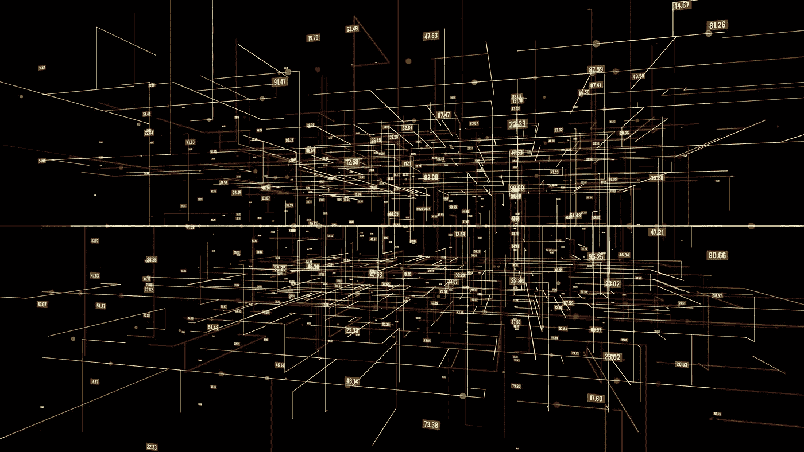

# 数据表示设计模式

> 原文：<https://medium.com/geekculture/data-representation-design-patterns-d0714debb23f?source=collection_archive---------15----------------------->

> **数据表示**是指以模型实际操作的转换格式(**特征**)表示输入模型的真实世界数据(**输入**)。

一些简单的数据表示技术包括:

**#1。在** `**[-1, 1]**` **:** 范围内输入缩放数值

这在两个方面有所帮助:

1.  更快的收敛，因此模型训练更快/更便宜
2.  不同特征的相对权重大小差异可忽略不计`=>`几乎相似的 L1/L2 规则

有四种方法可以缩放线性数字输入:

1.  **最小-最大缩放***:* `x1_scaled``=``(2*x1``-``max_x1``-``min_x1)/(max_x1``-``min_x1)` 😞**缺点:**最小值和最大值直接由训练集决定。
2.  **裁剪** *(结合最小-最大缩放)* :与最小-最大缩放不同，这里的最小和最大值是合理的估计值。数据在这些值之间线性缩放，然后在`[-1, 1]`之间限幅。
    `-1` s 和`1` s 一般出来都是离群值。😃
    裁剪适用于**均匀分布的**数据。
3.  **Z 分数标准化**:`x1_scaled``=``(x1``-``mean_x1)/stddev_x1`
    这种类型的缩放导致训练数据集的均值和单位方差为零。
    如果是**正态分布**，换算值是无界的，但有 67%的时间位于`[-1, 1]`之间。
4.  **Winsorizing**:根据百分位数剪辑数据集，如第 10 和第 90 百分位数或第 5 和第 95 百分位数等。

对于有偏差的数据，我们需要在缩放之前对数据进行转换。通常使用的一些变换技术包括**对数变换*，*桶化输入*，*** 或类似于 [**box-cox 变换**](https://www.isixsigma.com/tools-templates/normality/making-data-normal-using-box-cox-power-transformation/) 的参数变换技术

**#2。代表数字输入的数组:**

1.  由其统计(如均值、中位数等。),
2.  根据它的经验分布
3.  如果数组以某种方式排序，则按数组中的固定项数。

**#3。一次性编码或虚拟编码分类输入**

> 当输入线性无关时，最好使用虚拟编码。

**#4。将数字输入视为分类输入，并映射到一个独热编码列**

1.  当数字输入只是一个指标时，例如*一周的天数*
2.  当输入和标签之间的关系不连续时，例如*周五的流量水平不同于周一的流量水平*
3.  对数值变量进行分组，例如，*周一至周五是工作日，周六和周日是周末。* ❗️这确实导致了一些输入在序数性质上的损失。
4.  当数字输入的不同值对标签具有不同影响时，这是对数字输入进行分类的情况，例如，当*试图确定婴儿出生时是否健康时，出生时体重为****×体重为*** *的三胞胎婴儿被认为比出生时体重相同的双胞胎婴儿更健康。这里，* ***复数*** *是可以分类的东西，因为它对标签有直接影响。*

**#5。分类变量数组可以表示如下:**

1.  *统计*数组中每个词出现的次数
2.  使用*相对频率*代替计数，以避免大的数字
3.  如果数组是有序的，则用固定数量的项表示输入数组
4.  表示统计数据中的数组

# 散列特征设计模式

> 使用类似**农场指纹**的哈希算法将输入分桶，如下所示:
> 
> `ABS(MOD(FARM_FINGERPRINT(INPUT), NUM_BUCKETS))`

这种设计模式应该在以下情况下使用

1.  分类特征的词汇不完整
2.  由于基数(💡**基数**指特定列中包含的唯一值的数量)
3.  冷启动—💡涉及系统无法对尚未收集足够信息的输入做出任何推断的问题。*生产中的模型无法对新数据进行预测。*

应该避免❌Cryptographic 散列算法。为什么是❓

> 我们需要散列具有确定性和唯一性。

❓How:我们要选择水桶的数量吗？

✔️

> **一个更好的方法是使用铲斗大小作为一个超级参数，并监控最适合当前问题的值。💯**

**😞但是，也有一些权衡，比如:**

1.  **模型准确性损失，*当分类输入分布高度偏斜时*更加明显**
2.  **桶数少时的桶碰撞**
3.  **空哈希桶**

**为了处理权衡 1 和 2，我们可以添加一个 ***集合特征*** 作为模型的输入，以避免丢失关于单个输入的信息。**

**为了克服权衡 3，当使用散列特征列时，我们可以使用 **L2 正则化**来使与空桶相关联的权重接近零。**

# **嵌入式设计模式**

> **嵌入是一种可学习的数据表示，将高基数数据映射到低维空间，而不会丢失信息。**

**❓Why 不是一键编码吗？**

1.  **一键编码高基数分类特征导致矩阵稀疏，不适用于 ML 算法。**
2.  **一键编码将分类变量视为独立变量。因此，我们不能使用一键编码来捕捉不同变量之间的关系。**

> **嵌入通过捕捉低维空间中变量之间的紧密关系来解决这个问题。**

**❓Can 嵌入能代替聚类或主成分分析吗？**

****是的**，其实嵌入权重可以在主模型训练循环中确定，不像聚类或者 PCA 需要事先做。**

****权衡:**一定程度的信息损失**

****超参数:**嵌入维度**

> ****经验法则:**使用唯一分类元素总数的四次方根或者应该是类别中唯一元素数的平方根的 1.6 倍左右，且不少于 600。**

**这种设计模式可以用于**

1.  **基于文本输入的分类问题中的文本嵌入，**
2.  **图像嵌入**
3.  **训练用于图像嵌入的自动编码器，其中特征和标签是相同的，并且损失是重建误差。这允许自动编码器实现非线性降维。
    *自动编码器将高维输入映射到低维空间，应用嵌入来学习相似的低维空间中变量之间的紧密关系，然后将其映射回高维空间。这里，模型被训练来学习将一个较低维度嵌入到另一个较低维度的权重。因此，模型具有更好的性能。***
4.  **上下文语言模型，如 **Word2Vec** (嵌入是相同的，与用法无关)和 **BERT** (嵌入是上下文相关的)与自动编码器做的一样，只是针对文本。**

# **特征交叉设计模式**

> **该模式通过显式地将输入值的每个组合作为一个单独的特征，帮助模型更快地了解输入之间的关系。**

**使用特征交叉可以**

1.  **仅使用线性模型帮助解决某些问题**
2.  **加速训练(就像真的比 DNN 快，如果达到正确的功能交叉)**
3.  **更少的训练数据`=>`更低的模型复杂度**

**❓Can 它能应用于数字特征吗？**

**是的。为了将特征交叉应用于数字特征，我们可以将特征值分组。**

****取舍:****

1.  **特征交叉导致稀疏向量。
    **解决方案😃**我们可以在特征交叉后使用一个嵌入层，将其降低到一个较低的维度，同时保持紧密关系。**
2.  **当特征以高基数跨越两个分类特征时，基数急剧增加。为了避免这种情况，我们可以应用 ***L1 正则化*** (鼓励特征稀疏)或 ***L2 正则化*** (限制过拟合)。**

# **多通道输入设计模式**

> **这种设计模式通过连接所有可用的数据表示，解决了表示不同类型的数据或可以用复杂方式表示的数据的问题。**

**例如，根据图像和当天的时间预测交通违规，或根据用户评论、支付金额和当天的时间预测餐馆的用户评级-处理一起表示不同的数据类型。**

**在餐馆评论的例子中，我们还可以用一种既包含评级又能说明好坏的方式来表示用户评级——这是一个以复杂方式表示数据的例子。**

## **以多种方式表示文本数据**

1.  **弓形编码**
2.  **嵌入—通过考虑文本文档中单词的顺序或含义来确定单词之间的关系**
3.  **从文本中提取表格数据并用 BOW 编码/嵌入进行连接**

## **以多种方式表示图像数据**

1.  **像素值—例如，将模型中的 28×28 像素黑白图像表示为 28×28 数组，其整数值范围为 0 到 255**
2.  **平铺结构——有助于提取有意义的细节和潜在模式
    实现这一点的一种方法是使用具有最大池的 CNN，有/无重叠。**
3.  **像素值和平铺结构的组合**
4.  **使用带有*元数据*的图像(例如，一天中的时间是交通违规预测任务中的元数据)**

**这些是我从**机器学习设计模式这本书上的笔记。**要深入了解，我推荐读这本书。链接如下。**

**接下来我们将看看 [**问题表征设计模式**](https://manojpatra.medium.com/problem-representational-design-pattern-dea210e583b2) **。****

# **参考**

** [## 机器学习设计模式

### 本书中的设计模式捕捉了机器学习中反复出现的问题的最佳实践和解决方案。的…

www.oreilly.com](https://www.oreilly.com/library/view/machine-learning-design/9781098115777/)**