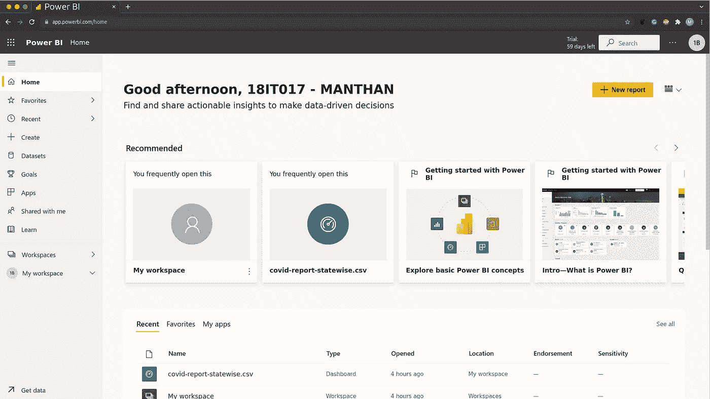
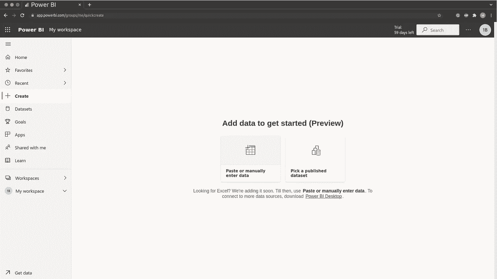
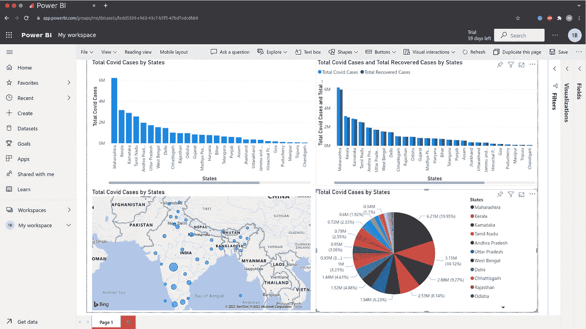
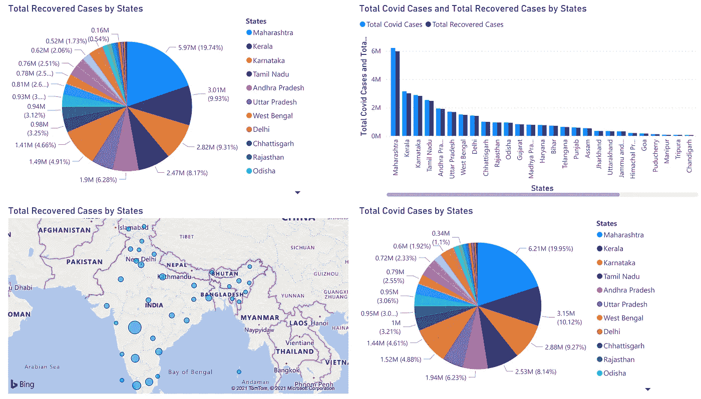
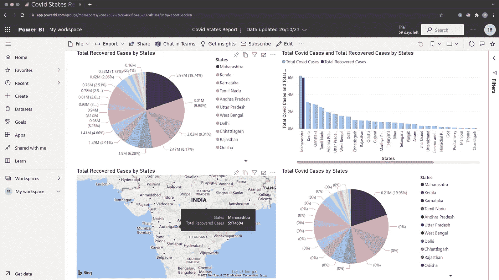
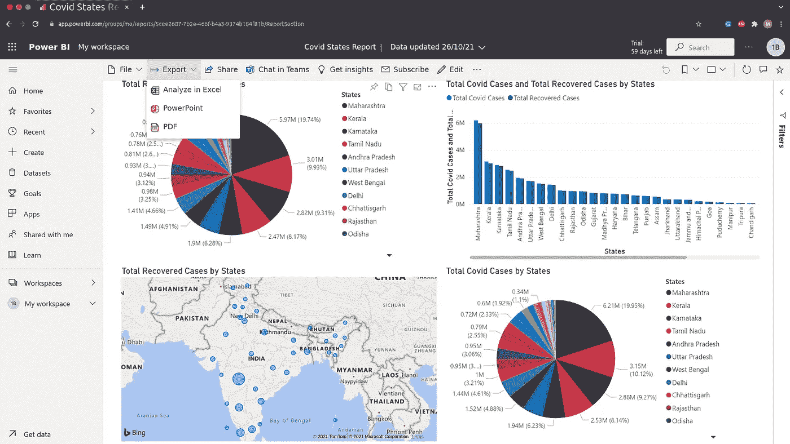

# 数据科学👨‍💻:构建您的第一份电源 BI 报告

> 原文：<https://medium.com/geekculture/data-science-build-your-first-power-bi-report-ec7d518bdf1a?source=collection_archive---------19----------------------->

**欢迎来到数据科学博客系列。**请点击这里查看我之前的数据科学博客系列 [***的博客。***](https://manthan-bhikadiya.medium.com/)

> 没有什么可怕的，只是需要理解。
> 
> ~玛丽·居里

> ***打报告:***

首先创建一个空白工作区。我们可以导入数据集，也可以使用一些样本来创建一份 power BI 报告。在这里，我从头开始创建报告。我使用的是**covid-state wise-report . CSV。**你可以从这里的[下载那个文件。](https://github.com/manthan89-py/Data-Science/blob/master/Practical%201%20Scrapping%20the%20Data/covid-report-statewise.csv)

Homepage of Power BI

创建报告时，点击右侧的 ***新建报告*** 按钮。

Options for Report Creation

正如我告诉你的，我们可以通过手动输入数据或上传文件来制作报告。

这里我选择了选项 2 **选择一个已发布的数据集**，然后上传 CSV 文件。

对于 Covid Statewise 报告，您可以创建自己的可视化。这里我用了条形图，饼状图和地理图。

1 st Report

正如你所看到的，我们总共有 4 个可视化。

我们有一个各州和各州 Covid 案例总数的条形图。另一个图表是按州和州列出的总恢复数+总阳性 Covid 病例数。然后，我们有一个简单的地理图表，用圆圈大小显示了所有 Covid 案例。最后，我们有一个漂亮的饼图，显示了各州的 Covid 案例总数。

现在，通过选择或突出显示报告中的任何区域，我们可以在所有 4 个可视化中获得该部分的特定信息。

再来看另一篇报道……

2nd Report

如您所见，我仅将条形图更改为饼图，其他内容与我们的第一份报告相同。

我们可以通过从字段部分选择列并从可视化部分选择适当的可视化来创建这个可视化。

Only for Maharastra

正如您在这里看到的，我从饼图中选择了马哈拉施特拉邦部分，所有图表都突出显示了马哈拉施特拉邦的信息。

这就是我们分析东西的方式..！！

Export Report

要让这张图表对您的演示有用，您必须导出它。因此，通过点击导出，您会得到一个选项 PDF。

> ***获取洞见特征***

Power BI 提供的一个很牛逼的特性叫做 ***Get Insights*** 。在选择列之后，Power BI 会自动发现一些细节并生成一些可视化效果。当我们只想了解数据集的概况时，这个特性非常有用。

阅读更多关于**获得真知灼见**特色 [***这里……***](https://docs.microsoft.com/en-us/power-bi/create-reports/service-insights)

> **结论:**

我希望你能学到一些东西。

自己探索力量匕的惊人特性 [***【资源】***](https://monashdatafluency.github.io/Power_BI/introduction-to-power-bi.html)

**领英:**

 [## 印度古吉拉特邦苏拉特曼丹·比卡第亚-查罗特科技大学|…

### 查看 Manthan Bhikadiya 在世界上最大的职业社区 LinkedIn 上的个人资料。Manthan 有 3 份工作列在…

in.linkedin.com](https://in.linkedin.com/in/manthanbhikadiya) 

Github:

 [## manthan89-py -概述

### 对 AI、深度学习、机器学习、计算机视觉、区块链、Flutter 感兴趣😇。做一些竞争性的…

github.com](https://github.com/manthan89-py) 

**感谢阅读！如果你喜欢这篇文章，请鼓掌👏尽可能多的按按钮。这将意味着很多，并鼓励我继续分享我的知识。如果你喜欢我的内容，请在 medium 上关注我，我会尽可能多地发布博客。**