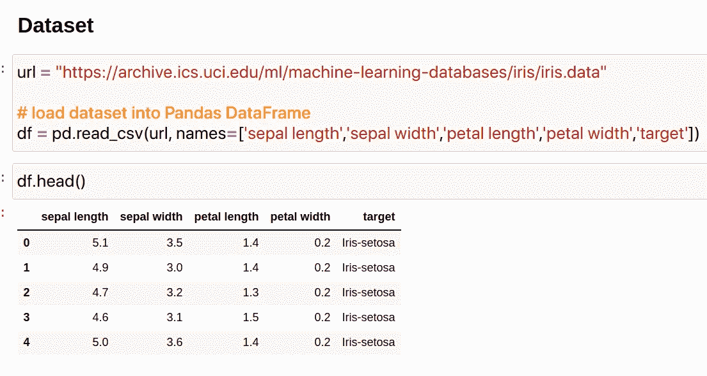
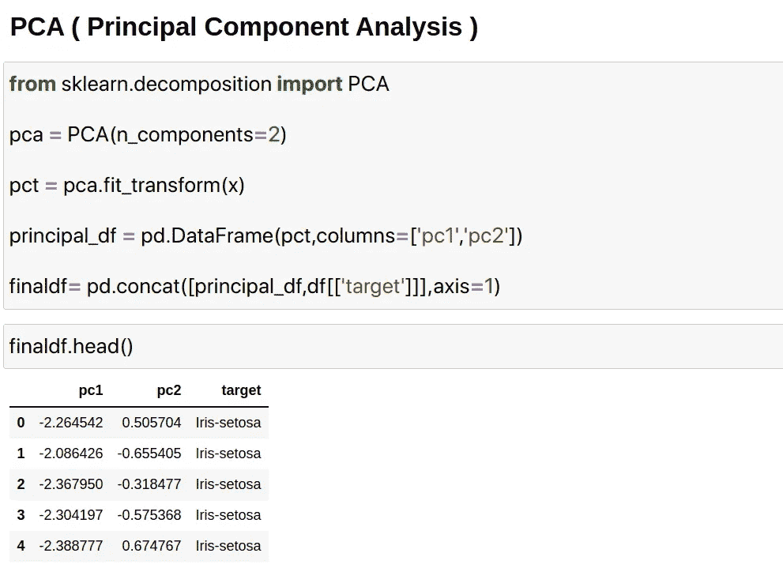
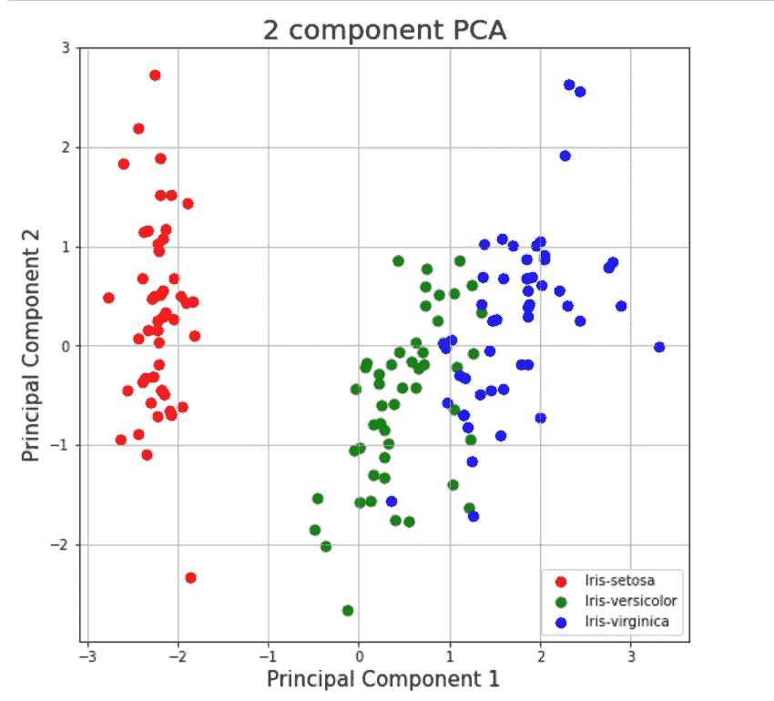
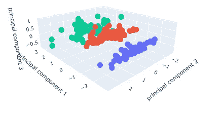
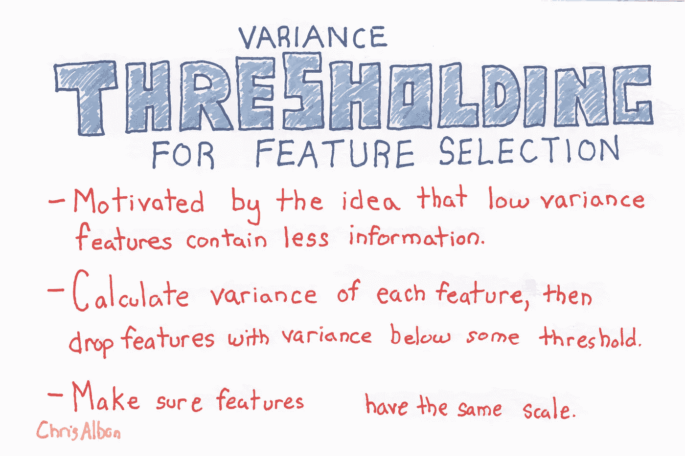
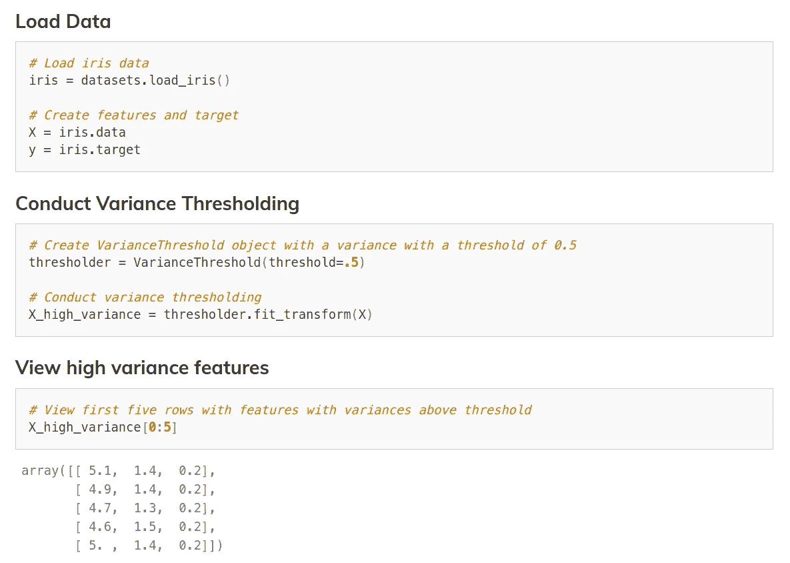
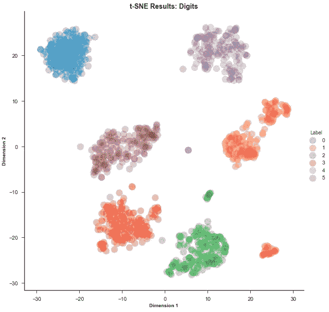

# 数据科学👨‍💻:使用 Python 的数据简化技术

> 原文：<https://medium.com/geekculture/data-science-data-reduction-techniques-using-python-3de757a20a3b?source=collection_archive---------8----------------------->

**欢迎来到数据科学博客系列。**请点击这里查看我之前的数据科学博客系列 [***的博客。***](https://manthan-bhikadiya.medium.com/)

> 成功不是最终的，失败不是致命的
> 
> 重要的是继续下去的勇气。
> 
> ~温斯顿·丘吉尔

> **数据还原:**

因为数据挖掘是一种用于处理大量数据的技术。在处理大量数据时，这种情况下的分析变得更加困难。为了消除这种情况，我们使用数据简化技术。它旨在提高存储效率，降低数据存储和分析成本。

> ***降维:***

这通过编码机制减小了数据的大小。它可以是有损的，也可以是无损的。如果从压缩数据重建后，原始数据可以恢复，这种减少被称为无损减少，否则它被称为有损减少。两种有效的降维方法是:小波变换和 PCA(主成分分析)。

> ***主成分分析:***

主成分分析(PCA)是一种统计程序，它使用[正交变换](https://en.wikipedia.org/wiki/Orthogonal_transformation)将一组可能相关变量的观察值转换为一组被称为主成分的[线性不相关](https://en.wikipedia.org/wiki/Correlation_and_dependence)变量的值。不同主成分的数量等于原始变量的较小数量或观察值的数量减一。这种转换的定义方式是，第一个主成分具有最大可能的[方差](https://en.wikipedia.org/wiki/Variance)(即，尽可能多地考虑数据中的可变性)，并且每个后续成分在与前面成分[正交](https://en.wikipedia.org/wiki/Orthogonal)的约束下依次具有最大可能的方差。得到的矢量是不相关的[正交基集](https://en.wikipedia.org/wiki/Orthogonal_basis_set)。

PCA 对原始变量的相对比例很敏感。

## **关于数据集:**

> ***主成分分析:***

> ***组件投影(2D):***

解释方差告诉你有多少信息(方差)可以归因于每个主成分。这一点很重要，因为当你可以将 4 维空间转换成 2 维空间时，你会丢失一些方差(信息)。通过使用属性 explained_variance_ratio_，可以看到第一个主成分包含 72.77%的方差，第二个主成分包含 23.03%的方差。这两个部分总共包含 95.80%的信息。

> ***(3D)组件投影:***

原始数据有 4 列(萼片长度、萼片宽度、花瓣长度和花瓣宽度)。在这一部分中，代码将 4 维的原始数据投影到 3 维。新组件只是变化的三个主要方面。

> ***方差阈值:***

[https://chrisalbon.com/code/machine_learning/feature_selection](https://chrisalbon.com/code/machine_learning/feature_selection/variance_thresholding_for_feature_selection/)

方差阈值是特征选择的简单基线方法。它会移除方差未达到某个阈值的所有要素。默认情况下，它会移除所有零方差特征。我们的数据集没有零方差特性，因此我们的数据在这里不受影响。

[https://chrisalbon.com/code/machine_learning/feature_selection](https://chrisalbon.com/code/machine_learning/feature_selection/variance_thresholding_for_feature_selection/)

> ***t-SNE:***

t-分布式随机邻居嵌入(t-SNE)是一种[无监督的非线性技术](https://blogs.sas.com/content/subconsciousmusings/2017/04/12/machine-learning-algorithm-use/)，主要用于数据探索和高维数据可视化。更简单地说，t-SNE 给你一种感觉或直觉，告诉你数据是如何在高维空间中排列的。它是由劳伦斯·范德·马滕斯和杰弗里·辛顿在 2008 年开发的。

更多关于 [**t-SNE…**](https://distill.pub/2016/misread-tsne/)

[https://towardsdatascience.com/an-introduction-to-t-sne-with-python-example-5a3a293108d1](https://towardsdatascience.com/an-introduction-to-t-sne-with-python-example-5a3a293108d1)

> ***代号:***

 [## GitHub-man than 89-py/Data-Science:这个存储库包含概念和项目相关的数据…

### 这个存储库包含数据概念以及媒体博客。这个库是学院工作的一部分，每个文件夹…

github.com](https://github.com/manthan89-py/Data-Science) 

> ***结论:***

我希望你现在已经了解了数据简化技术，如 PCA，VarianceThreshold 和 t-SNE。

更多关于[数据缩减。](https://www.geeksforgeeks.org/data-reduction-in-data-mining/)

## LinkedIn:

 [## 印度古吉拉特邦苏拉特曼丹·比卡第亚-查罗特科技大学|…

### 查看 Manthan Bhikadiya 在世界上最大的职业社区 LinkedIn 上的个人资料。Manthan 有 3 份工作列在…

in.linkedin.com](https://in.linkedin.com/in/manthanbhikadiya) 

## Github:

 [## manthan89-py -概述

### 对 AI、深度学习、机器学习、计算机视觉、区块链、Flutter 感兴趣😇。做一些竞争性的…

github.com](https://github.com/manthan89-py) 

**感谢阅读！如果你喜欢这篇文章，请点击**👏**尽可能多的按按钮。这将意味着很多，并鼓励我继续分享我的知识。如果你喜欢我的内容，请在 medium 上关注我，我会尽可能多地发布博客。**