# 数据科学👨‍💻:橙色工具介绍第 1 部分

> 原文：<https://medium.com/geekculture/data-science-introduction-to-orange-tool-part-1-bff18bb159a?source=collection_archive---------10----------------------->

**欢迎来到数据科学博客系列。**请点击这里查看我之前的数据科学博客系列 [***的博客。***](https://manthan-bhikadiya.medium.com)

> 如果你继续用你一贯的方式思考，
> 
> 你会继续得到你一直拥有的。
> 
> ~凯文·特鲁多

这个博客是关于一个橙色的数据挖掘工具。在 orange 工具的帮助下，我们可以做很多事情，如可视化编程、数据可视化、数据探索、数据挖掘等。orange 工具是免费和开源的，您可以非常容易地将其安装在任何操作系统上。

Orange 是一个**开源的数据可视化、机器学习和数据挖掘工具包**。它具有用于探索性数据分析和交互式数据可视化的可视化编程前端，也可以用作 Python 库。

> ***下载流程:***

对于 windows，请下载。exe 文件从[到**这里。**](https://orangedatamining.com/download/#windows)

对于 Linux，请点击这里查看这个惊人的博客 [**。**](https://thequickblog.com/how-to-install-orange-data-mining-software-in-ubuntu-1804/)

> ***概述:***

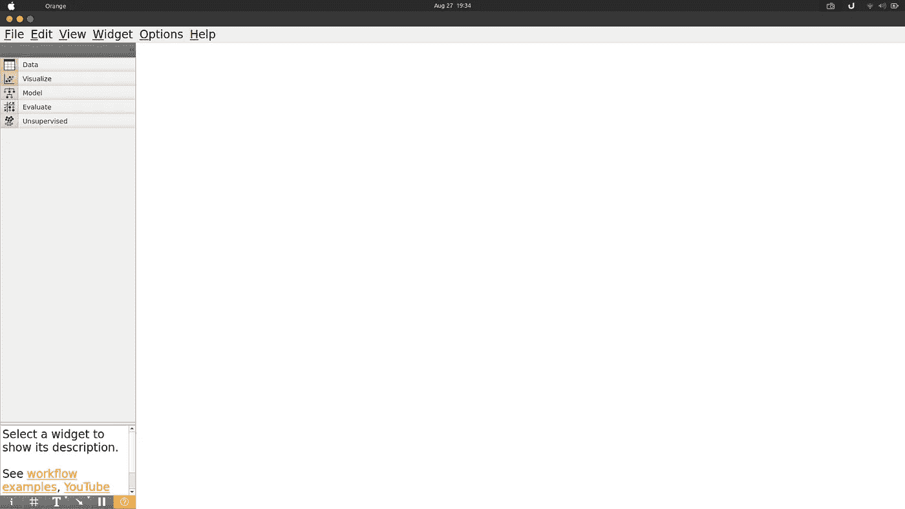

这里是橙色的黑色画布，您将在这里进行所有的数据探索。在左侧，您可以看到总共有 5 个部分，这 5 个部分都包含不同的小部件，我们将在未来使用这些小部件进行数据探索。

点击这里查看橙色工具 [***的**小部件目录**。*T32**](https://orangedatamining.com/widget-catalog/)

> **数据集:**

在 orange 工具中，我们可以加载任何类型的数据。orange 工具提供了一些测试数据集。我们将使用 **Iris** 数据集进行所有解释。

加载数据集我们必须使用**文件部件**，它在数据部分可用。点击文件部件后，它会自动出现在画布上，然后你必须双击该部件，你会得到一个这样的窗口。

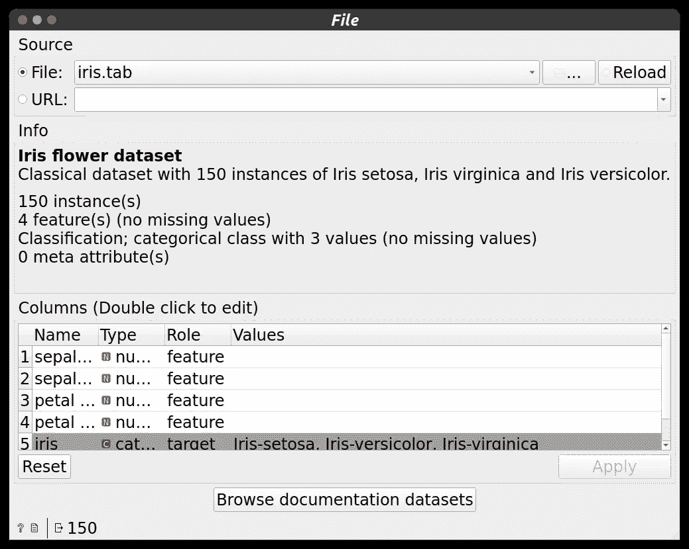

File Widget Properties

正如你所看到的，默认情况下，它将加载 **iris.tab** 数据集。该窗口还显示关于数据集的信息。它还将显示关于数据集的列的信息。这就是数据在文件小部件中的表现方式。还有其他可用的数据集，如泰坦尼克号，住房，心脏病等…你必须自己探索。

> ***工作流程:***

Orange 工具提供了许多小部件，我们可以以适当的方式将这些小部件相互连接起来，这就是我们生成工作流的方式。我们还可以使用该工具自带的一些内置工作流。我们可以将该工作流用于我们的任务。

点击此处查看工具 [***附带的工作流程列表。***](https://orangedatamining.com/workflows/)

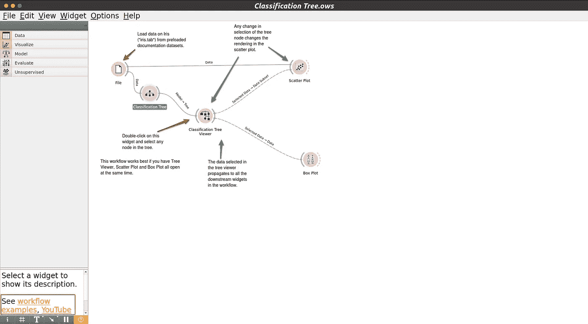

Classification Tree Workflow

正如您在左下角看到的，我们有选项**工作流示例。**在工作流示例中，我们有很多工作流选项。

在这里我加载**分类树**工作流。

加载工作流后，你可以看到许多小部件相互连接。我们还可以根据需要修改这个小部件。

分类树工作流使用决策树方法探索数据的分类。让我们看看 Iris 数据集的分类树。

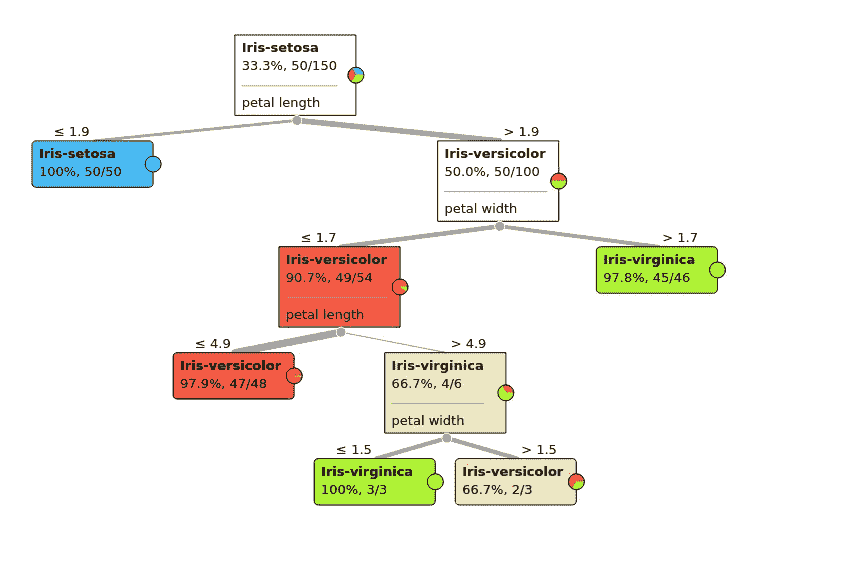

Decision Tree for Iris Dataset

通过点击**树查看器**，您可以为您的数据集获得这种类型的决策树。

最后，我们需要散点图和箱线图小部件，它们与树查看器相连，所以首先，您必须从树查看器中选择数据，然后您可以将所选数据可视化到散点图和箱线图小部件中。

> ***数据探索:***

我们可以非常容易地可视化数据集，还可以使用这个橙色工具从数据中获得洞察力。

我用下面的工作流程(由我创建)来解释。

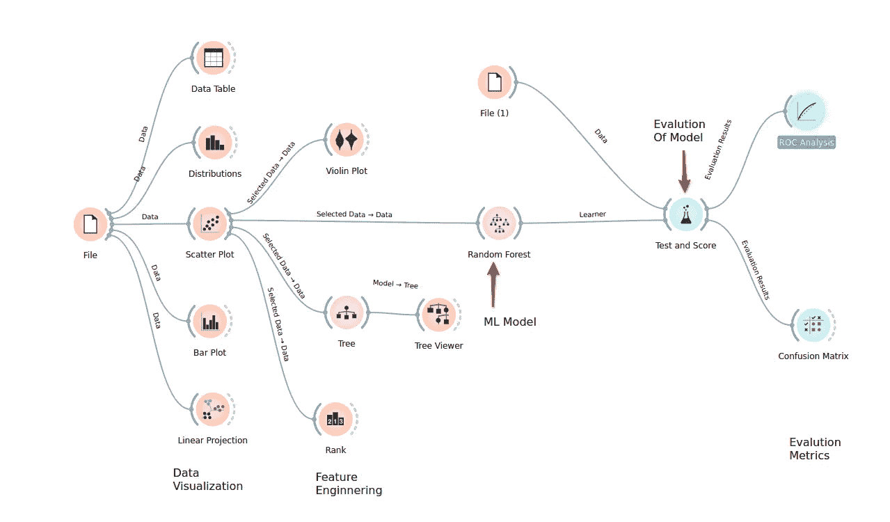

ML Model Workflow

对于探索部分，我使用了以下小部件:

**(1)数据表:**用于以表格形式查看数据集的信息。此处虹膜列为黑色，即它是目标变量。

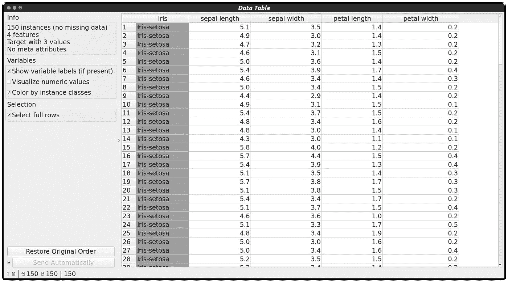

Data Table Widget

**(2)分布:**用于获取数据的分布信息。

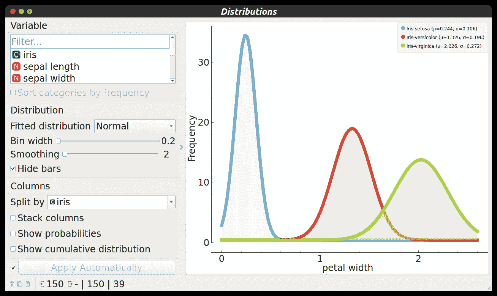

Normal Distribution of Petal Width

**(3)散点图:**用于使用散点图可视化数据

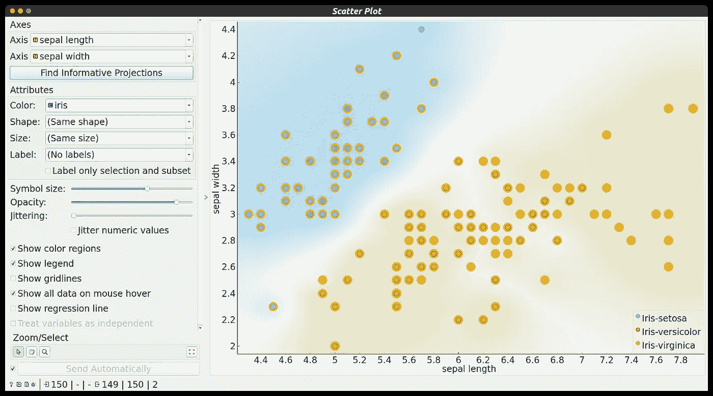

sepal length— sepal width ( X-Y axis ): scatter plot

**(4)条形图:**将数据表示成条形。很简单的&基本剧情。

**(5)线性投影:**在这个小部件中，可以将数据可视化到 3D。对于更高的维度，它会将数据投影到一个线性平面上。

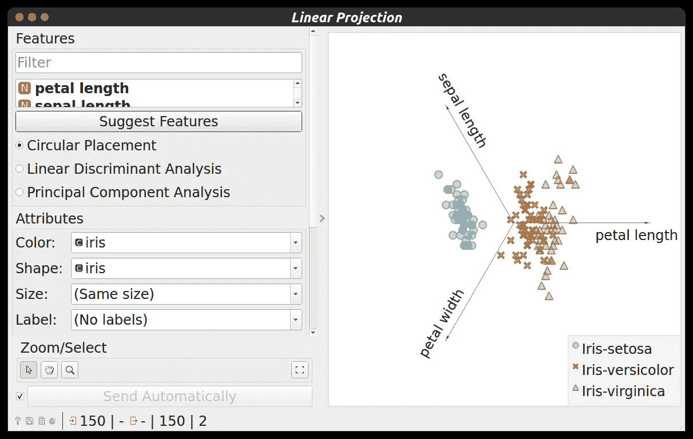

Linear Projection

**(6)小提琴图:**小提琴图是一种绘制数值数据的方法。它类似于一个箱形图，在每一侧增加了一个旋转的核密度图。

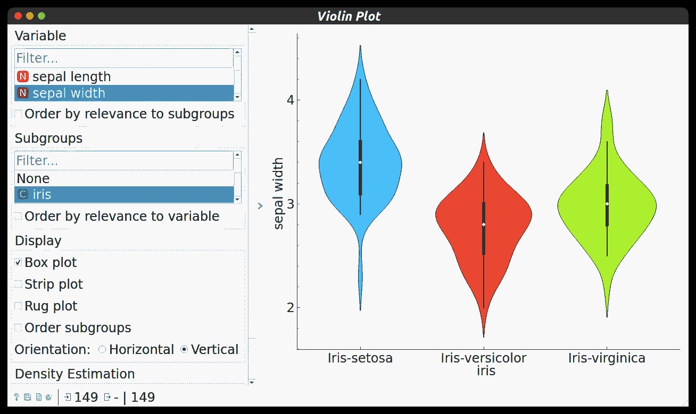

Violin Plot

**(7) Rank:** 它使用评分方法，然后告诉我们哪些特征对分类最重要。

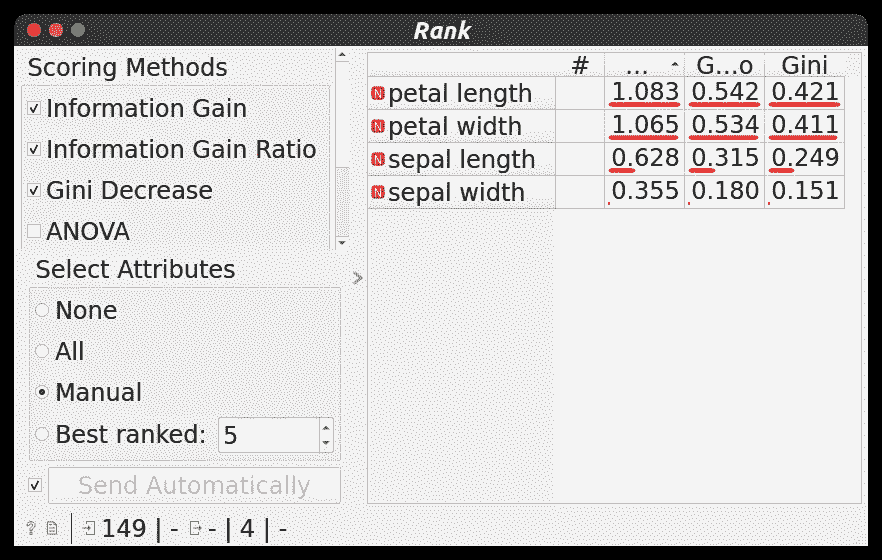

Rank Widget

在对数据进行可视化探索后，我应用了随机森林小部件，这是一种随机森林机器学习算法。随机森林与散点图相连，因此首先，我们必须从散点图中选择数据点，然后它会使用随机森林机器学习算法将数据分类。

为了测试这个模型，我使用了 **Test & Score** Widget。文本&分数部件连接两个部件，一个是随机森林，另一个是文件部件。文件部件最多可以有五个连接，所以我使用了另一个文件部件。

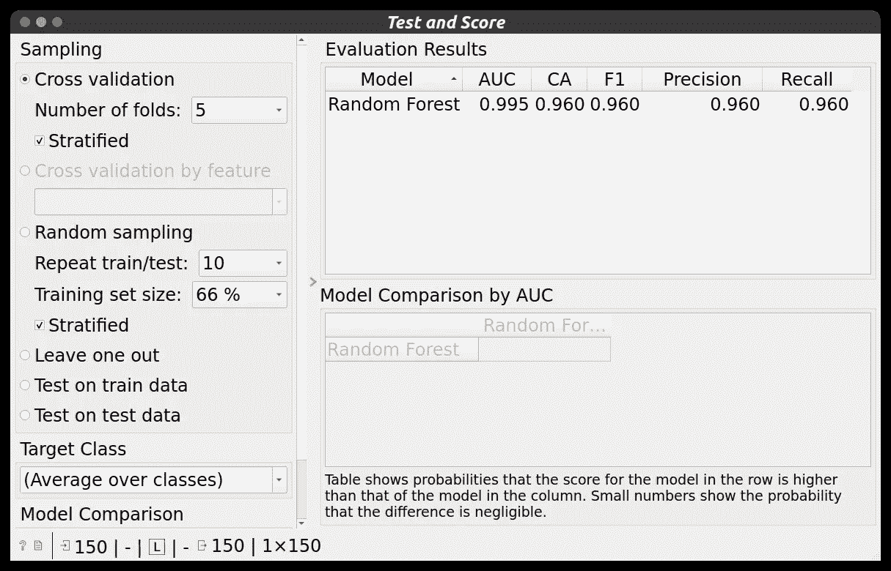

Random Forest Evaluation

如你所见，我们得到了 **96%的召回率**和**的精确度**，也就是说我们的模型工作得非常好。

现在，为了进行更多的评估，我将测试和评分小部件与**混淆矩阵小部件**和 **ROC 分析小部件连接起来。从这两个小部件中，我得到了以下输出。**

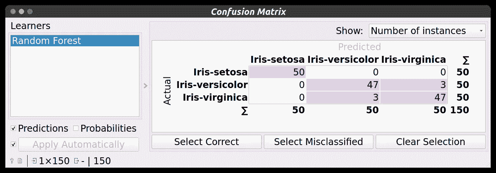

Confusion Matrix Widget

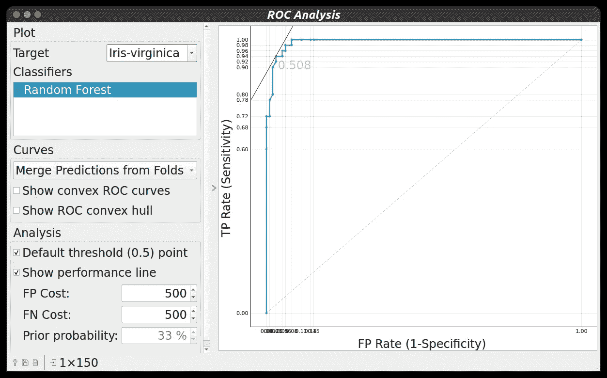

ROC Curve Analysis

*探索更多关于 Widgets**[***这里…***](https://orangedatamining.com/widget-catalog/)*

> ****加载本地数据集:****

*现在，我们在橙色工具中加载本地数据集。从 [***这里下载 Iris.csv。***](https://gist.githubusercontent.com/netj/8836201/raw/6f9306ad21398ea43cba4f7d537619d0e07d5ae3/iris.csv)*

*为了从本地设备加载 CSV，我们必须使用 **CSV 导入**小部件。通过使用这个小部件，我们能够将本地数据加载到 Orange 工具的表格格式中。我们可以使用**数据表**控件查看数据信息。*

*以下是本地数据集加载的工作流。*

*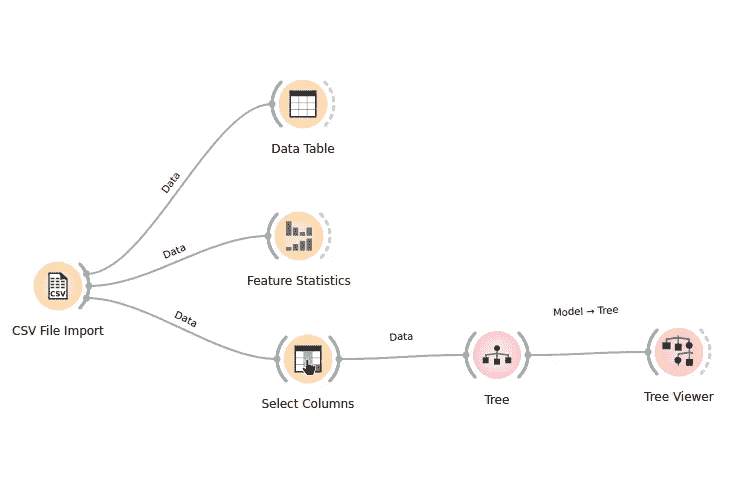*

*Local Dataset Loading Workflow*

*正如您在这里看到的，我使用了两个新的小部件进行探索。*

***(1)特征统计:**用于获取中值、众数、缺失值、分布、最小值、最大值等统计信息。*

*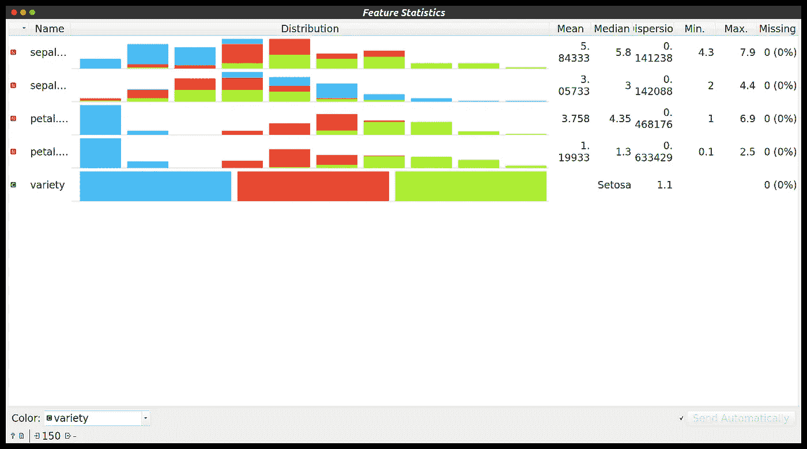*

*Feature Statistics of Variety Column*

***(2)选择列:**选择列用于给出特征变量和目标变量的信息。当我们加载本地数据集时，我们必须使用选择列，这就是 Orange 工具通知要素和目标变量的方式。*

> ****从 API/URL 加载数据集:****

*现在，我们将加载互联网上可用的数据，而无需下载。我使用这个 URL 来加载数据。*

*[https://gist . githubusercontent . com/netj/8836201/raw/6 f 9306 ad 21398 ea 43 CBA 4 f 7d 537619 d0e 07 D5 AE 3/iris . CSV](https://gist.githubusercontent.com/netj/8836201/raw/6f9306ad21398ea43cba4f7d537619d0e07d5ae3/iris.csv)*

*我们可以通过使用**文件小部件**从 URL 加载数据。文件小部件有一个名为 URL 的选项，在该部分中，我们必须提供我们的 URL，然后我们就可以简单地获取数据。*

*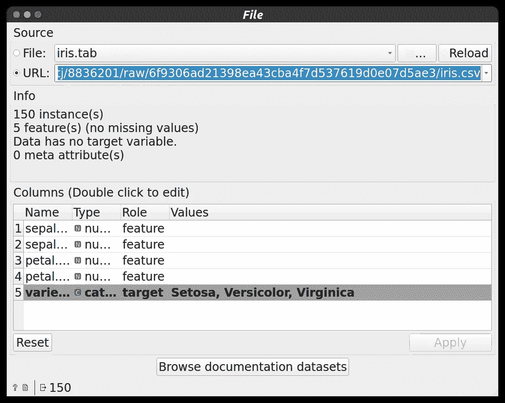*

*File Widget with URL option*

*其他 Widgets 信息 [***在此。***](https://orangedatamining.com/widget-catalog/)*

> ****已配置文件:****

* [## 数据科学/实用 4 橙色工具介绍第 1 部分，位于 master man than 89-py/数据科学

### 这个存储库包含概念和项目相关的数据科学和机器学习。-数据科学/实用 4…

github.com](https://github.com/manthan89-py/Data-Science/tree/master/Practical%204%20Introduction%20to%20Orange%20tool%20Part-1) 

> ***结论:***

我希望你能从这篇博客中学到一些东西。在这里探索更多关于橙色工具 [***的信息。***](https://orangedatamining.com/docs/) 可以参考网上的一些其他资料，学习一下。

继续探索…！！👍

[橙色工具介绍第二部分](https://manthan-bhikadiya.medium.com/data-science-introduction-to-orange-tool-part-2-c59d483d9716)

## LinkedIn:

 [## Manthan Bhikadiya -数据科学家- Pivotchain 解决方案| LinkedIn

### 查看 Manthan Bhikadiya 在世界上最大的职业社区 LinkedIn 上的个人资料。Manthan 有 3 份工作列在…

linkedin.com](https://linkedin.com/in/manthanbhikadiya) 

## Github:

 [## manthan89-py -概述

### 对 AI、深度学习、机器学习、计算机视觉、区块链、Flutter 感兴趣😇。做一些竞争性的…

github.com](https://github.com/manthan89-py) 

**感谢阅读！如果你喜欢这篇文章，请鼓掌👏**尽可能多的按按钮(最多 50 次**😂)**。这将意味着很多，并鼓励我继续分享我的知识。如果你喜欢我的内容，请在 medium 上关注我，我会尽可能多地发布博客。*****