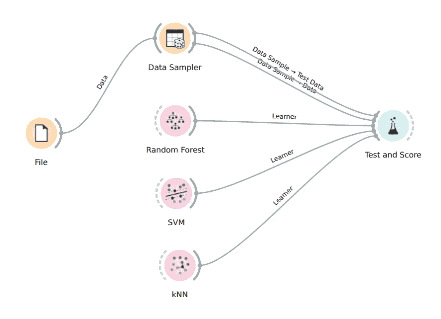
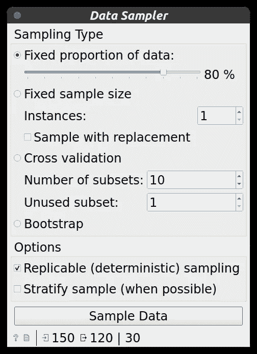
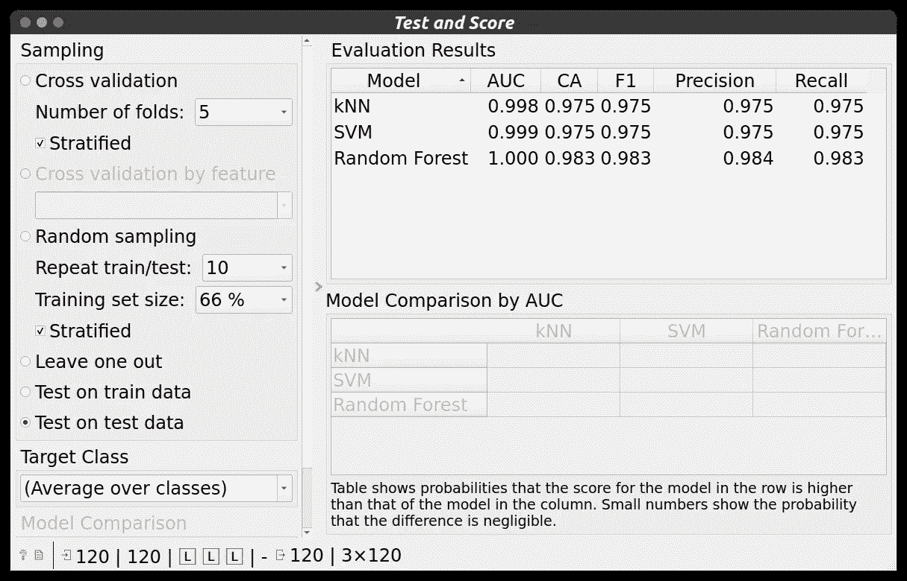
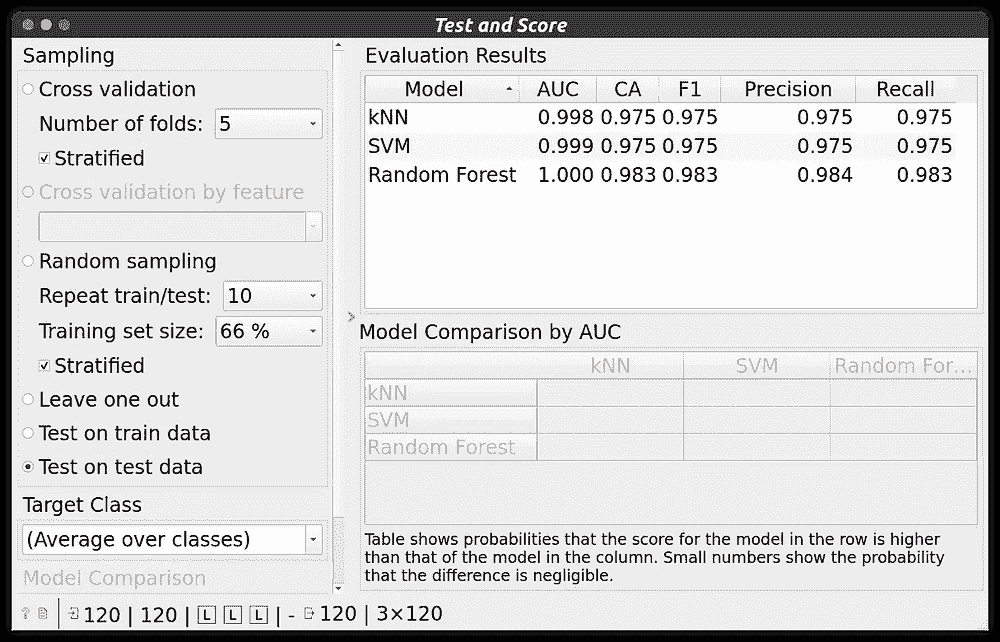
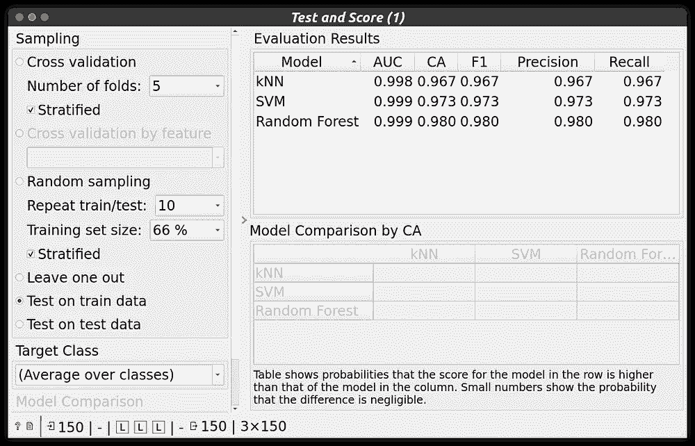
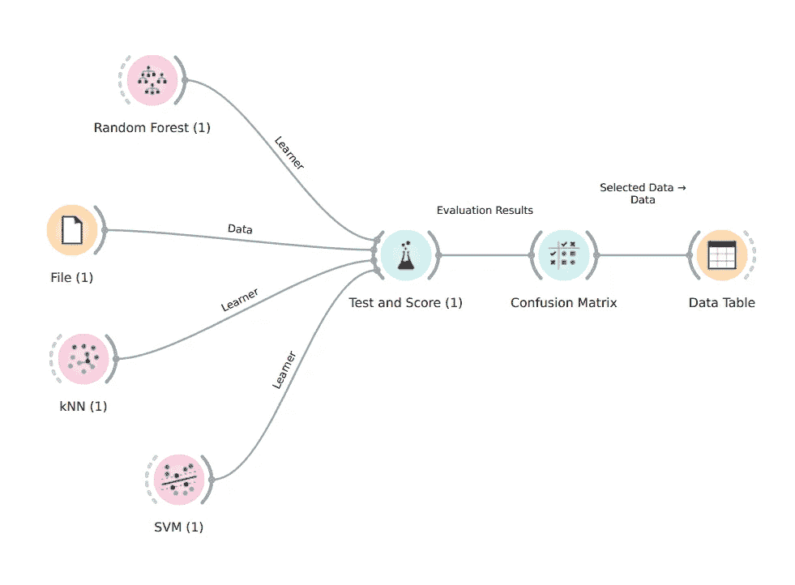
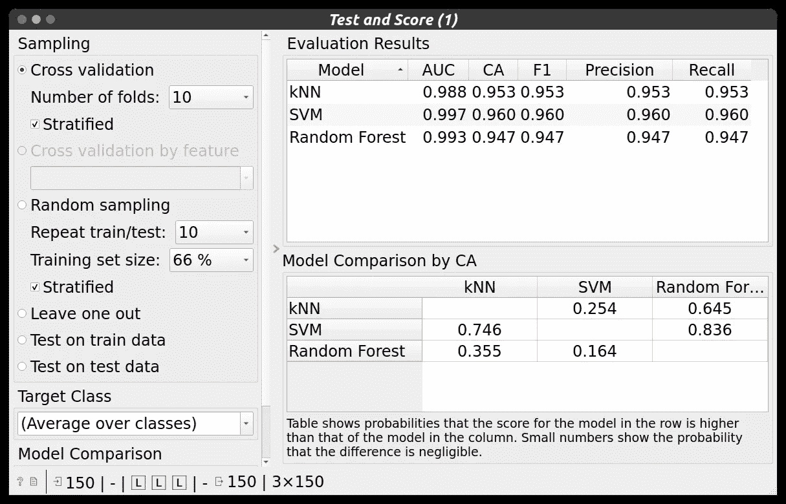
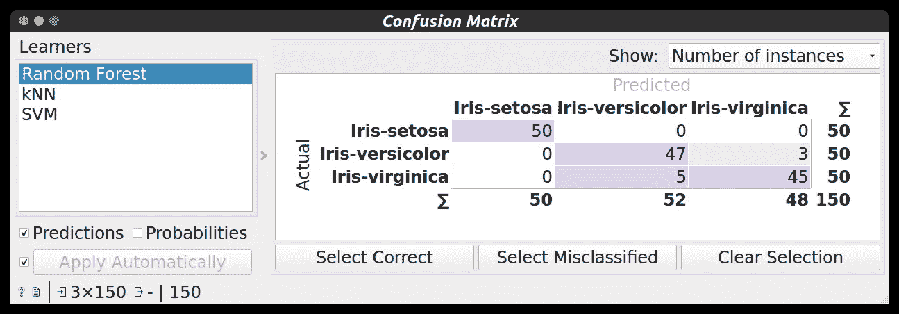
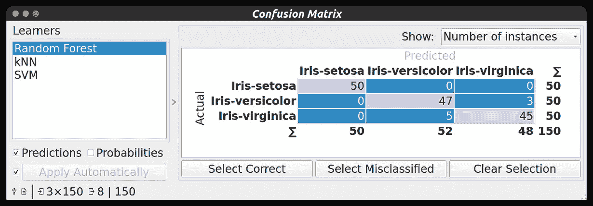
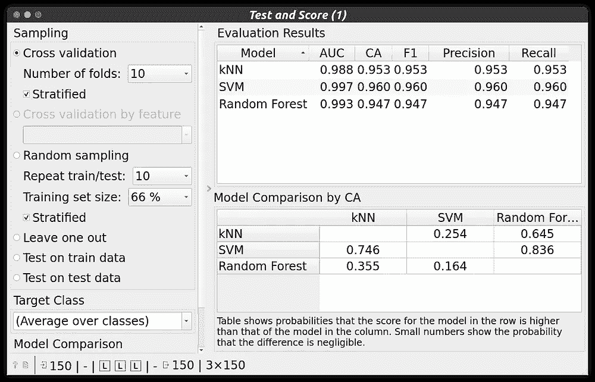

# 数据科学👨‍💻:橙色工具介绍第 2 部分

> 原文：<https://medium.com/geekculture/data-science-introduction-to-orange-tool-part-2-c59d483d9716?source=collection_archive---------8----------------------->

**欢迎来到数据科学博客系列。**请点击这里查看我之前的数据科学博客系列 [***的博客。***](https://manthan-bhikadiya.medium.com/)

> 创造自由未来的最好方法就是去创造它。
> 
> ~亚伯拉罕·林肯

这篇博客是关于如何使用 Orange 工具将数据分成训练和测试的。我们还将了解更多关于测试和分数部件。我们还将使用 Orange 工具探索交叉验证方法。

> ***必备:***

[*橙色工具介绍第一部分*](https://manthan-bhikadiya.medium.com/data-science-introduction-to-orange-tool-part-1-bff18bb159a)

> ***列车测试拆分:***

现在，如果你来自 ML DL 背景，那么你可能知道为什么这是一个更重要的步骤。对于那些不知道的人，我们将数据分为两部分:训练数据和测试数据。我们根据训练数据训练我们的模型，然后我们将根据测试数据测试我们的模型。测试数据在训练期间是不可见的，所以这就是为什么我们实际上可以了解我们的模型在不可见数据上的表现。

对于训练测试分割，我使用了下面的工作流程。

Train Test Split Workflow

这里，像往常一样，我在 orange 工具附带的文件小部件中加载 iris.tab 数据集。

之后，我将整个数据集传递到**数据采样器**小部件中。在数据采样器小部件中，我们将把数据集划分为训练和测试数据。

Data Sampler Configuration

如你所见，我将数据分成 80:20 的比例，即 80%的训练数据和 20%的测试数据。在底部，您可以从总共 150 个数据点中看到 120 个数据点用于训练，30 个数据点用于测试。

现在，在分割数据后，我将数据采样器与测试和分数部件连接起来。我连接了两条线，一条用于训练数据，另一条用于测试数据。

*数据样本- >数据(列车数据)*

*数据样本- >测试数据(测试数据)*

现在为了创建模型，我使用了随机森林、SVM(支持向量机)和 KNN ( K 最近邻)部件。这些小工具都是机器学习算法。连接所有的部件与测试和分数部件。

测试和分数部件必须需要两件事。

(1)数据(训练和测试)

(2)机器学习算法

当我们使用训练测试数据时，我们总是在测试数据上测试我们的模型，所以我们必须在测试和分数小部件中指定那个东西。

Test & Score Widget Properties

如您所见，在左侧**选择了测试数据测试**，即您看到的结果(右侧)来自测试数据测试。

我们得到了所有算法的最佳结果。(大约 98%的分类准确度)

## 拆分数据对分类结果/分类模型有什么影响？

With Splitting vs Without Splitting

正如你所看到的，分割的精确度要高一点，但并非总是如此。这里我们有非常干净和低的数据(150 个数据点)，但在某些情况下，当我们有很多数据点时，如果你不分割你的数据，那么你的模型可能会过拟合。所以把数据分成训练和测试总是好的。这样我们就可以获得我们的模型在未知数据集(测试数据)上表现如何的信息。

> ***交叉验证:***

交叉验证是一种**重采样程序，用于评估有限数据样本上的机器学习模型**。

我们可以使用 Test & Score 小部件进行交叉验证。注意，在分割数据交叉验证期间，不仅使用训练数据，也不使用测试数据，而是使用整个数据集。

对于交叉验证，我使用了以下工作流程:

Cross-Validation Workflow

现在你已经熟悉了这个工作流程，这是一个非常简单的工作流程，我们将直接关注测试和分数小部件。

Test & Score with Cross-Validation

如你所见，我使用的折叠次数= 10，即总共 10 次随机数据点将在我们的模型上进行测试，然后我们将得到一个平均结果。交叉验证是评估模型的一种非常强大的技术。我们还可以通过交叉验证来发现我们的模型是否过度拟合。

之后，测试和分数小部件与**混淆矩阵**连接，我们可以在混淆矩阵中看到结果，之后，我们可以从混淆矩阵中选择数据，并在**数据表**小部件中查看。

Confusion Matrix ( with not selected anything )

Misclassified data

正如你所看到的，首先我从混淆矩阵中选择错误分类的数据，然后在数据表小部件上查看它。这就是我们如何使用混淆矩阵和数据表小部件来探索我们的结果。

## 交叉验证对模型输出/准确性有什么影响？

Without Cross-Validation vs With Cross-Validation

如你所见，在使用交叉验证时，我们的准确性在下降，但这仍然是一个非常好的性能。在没有交叉验证的情况下，我们将测试我们的模型一次，在有交叉验证的情况下，我们在来自数据集的随机数据点上测试我们的模型 K 次**(K =折叠数)**。这就是为什么在获得测试数据的良好准确性后，总是通过执行交叉验证来确保准确性。

使用交叉验证时，您可以通过准确性、精确度、召回率、f1 值、AUC 曲线等指标参数查看模型比较

点击这里阅读这篇文章，了解更多关于交叉验证的细节。

> ***已配置文件:***

 [## 数据科学/实用 5 橙色工具介绍第 2 部分，在 master man than 89-py/数据科学

### 这个存储库包含概念和项目相关的数据科学和机器学习。-数据科学/实用 5…

github.com](https://github.com/manthan89-py/Data-Science/tree/master/Practical%205%20Introduction%20to%20Orange%20tool%20Part-2) 

> **结论:**

我希望现在你能在橙色工具中自己工作。我试着尽可能多地报道一些事情。现在你可以自己探索更多。

请点击这里查看橙色工具 [***的更多功能。***](https://orangedatamining.com/docs/)

继续探索…！！👍

## LinkedIn:

 [## Manthan Bhikadiya -数据科学家- Pivotchain 解决方案| LinkedIn

### 查看 Manthan Bhikadiya 在世界上最大的职业社区 LinkedIn 上的个人资料。Manthan 有 3 份工作列在…

linkedin.com](https://linkedin.com/in/manthanbhikadiya) 

## Github:

 [## manthan89-py -概述

### 对 AI、深度学习、机器学习、计算机视觉、区块链、Flutter 感兴趣😇。做一些竞争性的…

github.com](https://github.com/manthan89-py) 

**感谢阅读！如果你喜欢这篇文章，请点击**👏**尽可能多地按下按钮(最多 50 次**😂)**。这将意味着很多，并鼓励我继续分享我的知识。如果你喜欢我的内容，请在 medium 上关注我，我会尽可能多地发布博客。**