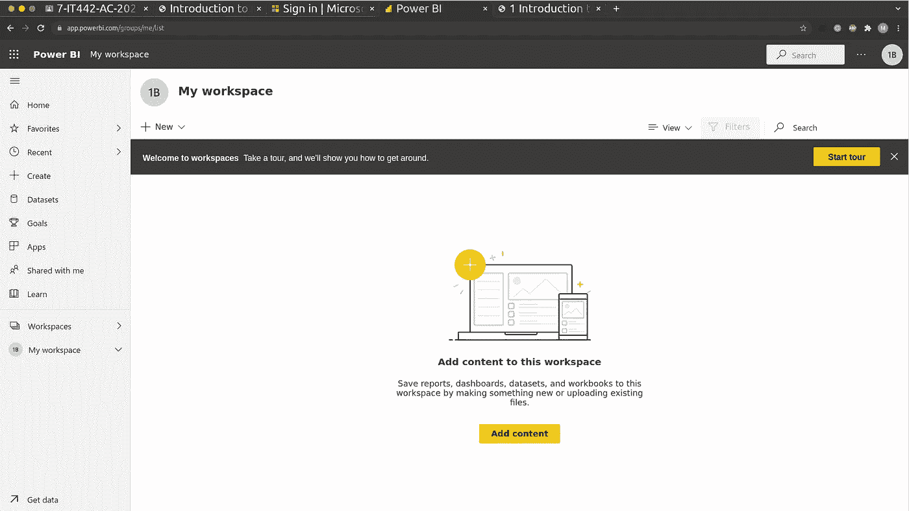
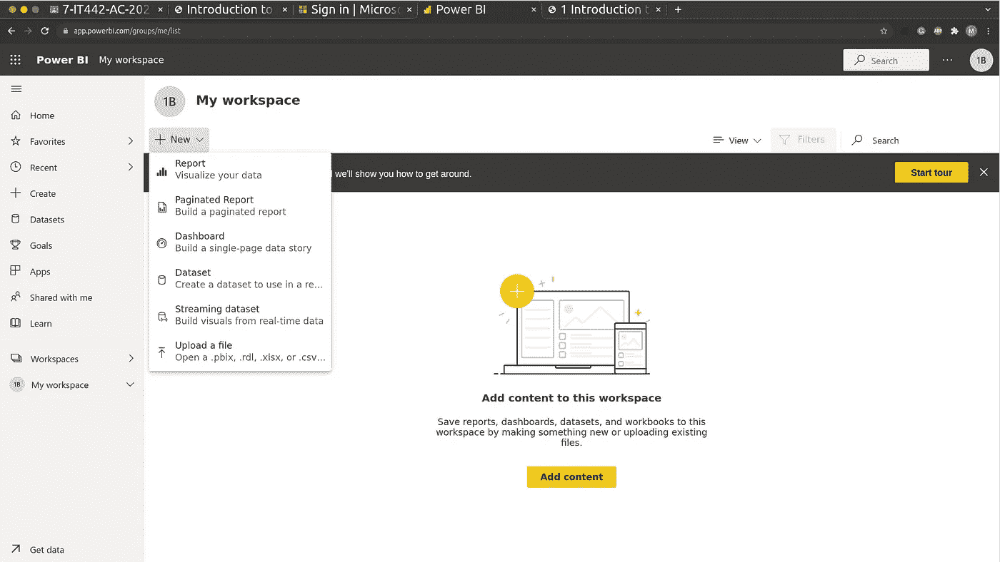
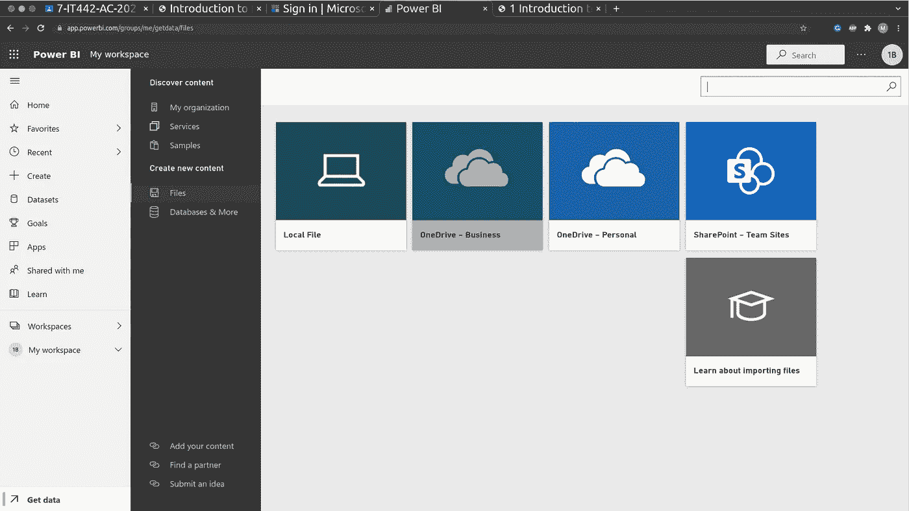
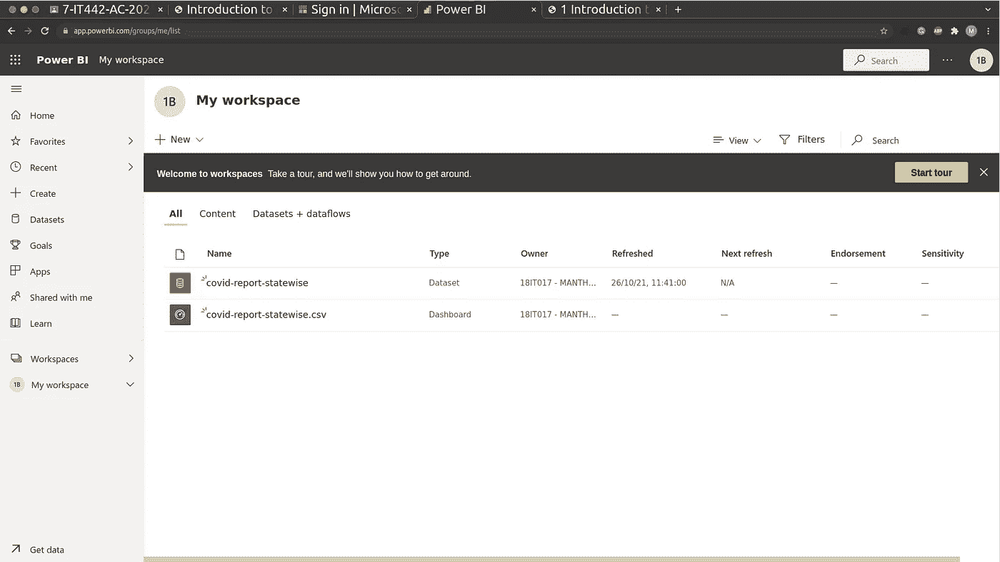
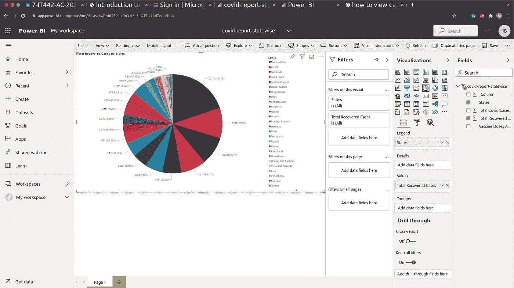
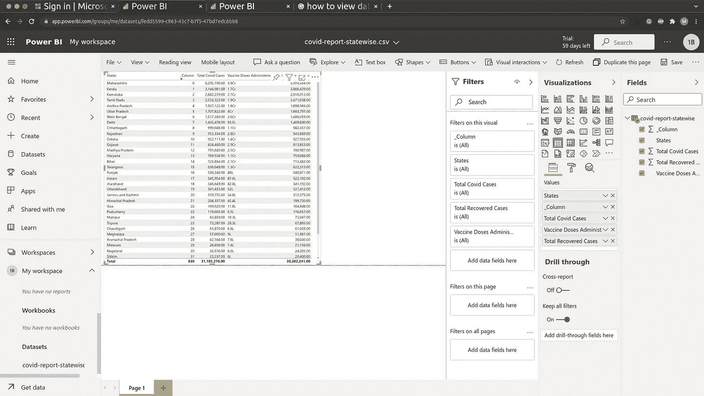
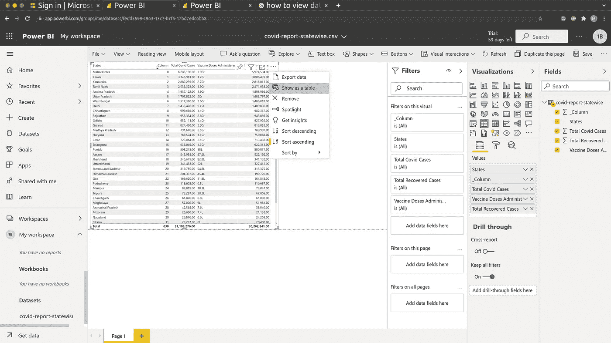
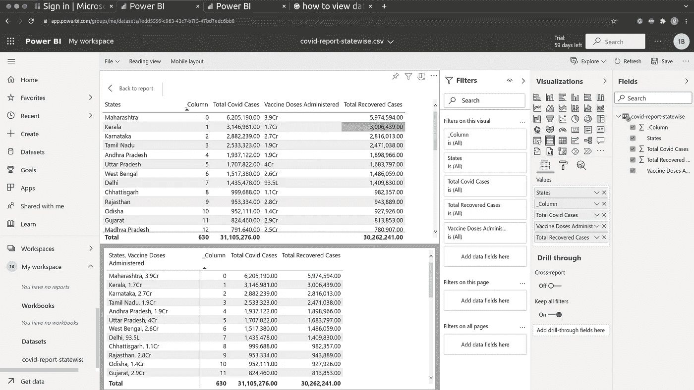

# 数据科学👨‍💻:Power BI 简介和在 Power BI 中导入数据

> 原文：<https://medium.com/geekculture/data-science-introduction-to-power-bi-import-data-in-power-bi-acd6866be027?source=collection_archive---------14----------------------->

**欢迎来到数据科学博客系列。**请点击这里查看我之前的数据科学博客系列 [***的博客。***](https://manthan-bhikadiya.medium.com/)

> 朝着正确的方向迈出一小步比，
> 
> 朝着错误方向迈出的大步
> 
> ~萨扬·比斯瓦斯

> ***异能匕:***

Microsoft Power BI 是应用程序、软件服务和连接器的集合，这些应用程序、软件服务和连接器将无关的数据转化为视觉上令人印象深刻的交互式见解。Power BI 可以处理简单的数据源，如 Microsoft Excel，也可以处理复杂的数据源，如基于云的或本地混合数据仓库。Power BI 能够轻松连接到您的数据源，可视化并与任何人分享和发布您的发现。

由于 Power BI 是微软的产品，并且内置了与 Excel 的连接，因此有许多 Excel 用户熟悉的功能。

> ***部分力量 BI:***

Power BI 由一个名为 Power BI Desktop 的微软 Windows 桌面应用程序、一个名为 Power BI Service 的在线 SaaS(软件即服务)和一个可以从 Windows 手机和平板电脑访问的移动 Power BI 应用程序组成，也可以在苹果 iOS 和谷歌 Android 设备上使用。

这三个元素——**桌面**、**服务**和**移动**应用——是 Power BI 系统的主干，让用户以最有效的方式创建、分享和消费可操作的见解。

学分&阅读更多:-[https://monashdatafluency . github . io/Power _ BI/introduction-to-Power-BI . html](https://monashdatafluency.github.io/Power_BI/introduction-to-power-bi.html)

这里我用 ***电力 BI 服务*** 来解释…

> ***力量 BI 入门:***

Main Workspace Power BI Service

这是你第一次打开电源 BI 时的样子。在工作区中，我们创建所有的仪表板、报告和分析。

Import Data into Power BI

通过单击新选项，我们可以获得许多用于导入数据、创建报告、仪表板、流式数据集等的选项。

要从本地机器导入数据，我们必须选择 ***上传文件*** 选项。

Options for upload a file

如您所见，我们可以从不同来源上传文件，如本地机器、一个驱动器、SharePoint 等。我选择了 ***本地文件*** 选项从我的设备上传 CSV 文件。

Data upload Successfully in Power BI

如您所见，Power BI 自动将我们的 CSV 文件检测为数据集。

现在通过点击***covid-report-state wise . CSV***我们将其转发到工作区。

Simple Pie Chart from Dataset

正如您在右侧看到的*(字段部分)*我们有一个包含所有列详细信息的 CSV 文件。

如能断电 BI 自动检测***(∑符号)**列。*

*现在，通过从字段中选择 States 和 Total Recovered Cases，并从 Visualizations 部分选择饼图，我得到了上面的结果。您还可以尝试不同的可视化效果。*

**

*Tabular View of Dataset*

*在可视化中，选择 ***表格*** ，通过选择字段中的所有列，我们可以将数据集可视化为 ***表格格式。****

*现在，为了清楚地查看该表，我们必须执行以下步骤:*

**

*Click for option Select ‘**Show as a Table**’*

**

*Table View of Dataset*

*这就是我们如何以表格形式导入和可视化数据集。我希望你能理解这一点。自己试试吧。*

*探索力量匕更多 [***这里***](https://monashdatafluency.github.io/Power_BI/introduction-to-power-bi.html) …*

> ****结论:****

*我希望你能对 Power BI 有所了解。*

*还有更多有待探索，点击这里查看。*

***领英:***

* [## 印度古吉拉特邦苏拉特曼丹·比卡第亚-查罗特科技大学|…

### 查看 Manthan Bhikadiya 在世界上最大的职业社区 LinkedIn 上的个人资料。Manthan 有 3 份工作列在…

in.linkedin.com](https://in.linkedin.com/in/manthanbhikadiya) 

**Github:**

 [## manthan89-py -概述

### 对 AI、深度学习、机器学习、计算机视觉、区块链、Flutter 感兴趣😇。做一些竞争性的…

github.com](https://github.com/manthan89-py) 

**感谢阅读！如果你喜欢这篇文章，请点击**👏尽可能多的按按钮。这将意味着很多，并鼓励我继续分享我的知识。如果你喜欢我的内容，请在 medium 上关注我，我会尽可能多地发布博客。*