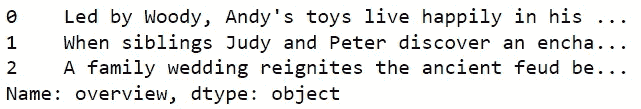
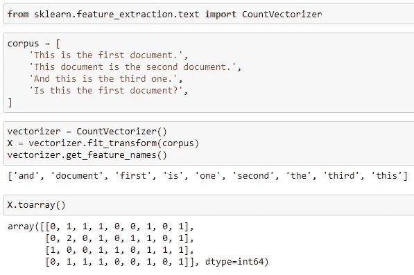

# 数据科学电影推荐系统——理论和简单 Python 实现

> 原文：<https://medium.com/geekculture/data-science-movie-recommendation-system-theory-and-simple-python-implementation-90e591106427?source=collection_archive---------11----------------------->

即使意识不到，我们每天在使用社交媒体时都会遇到推荐系统。使用这种系统的最著名的公司是亚马逊、网飞、YouTube 等。推荐系统在这些公司的业务中扮演着重要的角色。如果你向客户推荐合适的产品，它将作为利润的正回报。

因此，我开始写一系列关于推荐系统的中型博客。在你现在正在阅读的第一部分中，将介绍和解释理论背景和简单的 Python 实现。

希望你会喜欢！

# 介绍

想想你有一个喜欢看动作片的朋友，你会向他求婚动作片还是爱情片？动作片，对吧？简单来说，推荐系统就是这么做的！现在让我们来看看这个系统是如何工作的。

嗯，在第一阶段，应该获得关于用户(朋友)的信息，开发人员应该将关于用户的数据转换成机器可以理解和分析的形式。下一步，必须对产品(电影)进行分类，并将其与客户资料相关联。

由于你不能向你还不认识的人推荐电影，这个系统要和那些以前没有任何活动的新用户打交道。我们将讨论这个任务的解决方案以及推荐系统的结构。

# 推荐系统的类型

有两种主要的推荐系统——协作的和基于内容的。

**协同过滤**获取先前用户-项目交互的数据，并推荐与旧动作中的产品相似的产品。由于新用户还没有任何交互，这将导致“冷启动问题”。

另一方面，**基于内容的过滤**使用关于项目和用户的细节。例如，如果 42 岁的男性观看电影 A，那么该电影将被推荐给接近类别的用户。基于内容的过滤不会遭受“冷启动问题”，这就是为什么它通常被应用于新用户，直到有足够的交互历史用于协同过滤。

关于*的详细信息*你可以参考下面的博客，它解释了推荐系统背后理论的各个方面:

 [## 推荐系统简介

### 几种主要推荐算法综述。

towardsdatascience.com](https://towardsdatascience.com/introduction-to-recommender-systems-6c66cf15ada) 

# 简单推荐系统

作为草稿或初始模型，将使用电影的概述。让我们从导入数据集开始。

**注**:数据集包含 45k 行，接下来的矩阵运算对个人电脑来说会很大。这就是为什么，您可以使用 *iloc* 只获取数据集的一部分。

借助 sklearn 库的 [TF IDF 矢量器，提取概视图矩阵。首先，让我们看看矢量器如何与下面的例子一起工作:](https://scikit-learn.org/stable/modules/generated/sklearn.feature_extraction.text.TfidfVectorizer.html)

矢量器从样本中提取唯一的单词并列出它们。然后为输入的每个句子创建一个长度等于唯一单词数的数组。对于每个单词，如果它在句子中，则赋 1，否则赋 0。上面例子的第一句，没有“和”(0)，有“文档”(1)，有“第一”(1)，以此类推。

在下面的代码中，您可以看到一个额外的参数—停用字词。[停用词](/@saitejaponugoti/stop-words-in-nlp-5b248dadad47)是介词、连词、连接动词等等。这些词没有给出任何关于内容的信息，这就是为什么我们可以删除它们。tfidfvectorizer 的“stop_words”参数提取停用词，目前它仅适用于英语。之后，用空字符串填充 NA 值，并创建矩阵。

余弦相似度是 [NLP](https://en.wikipedia.org/wiki/Natural_language_processing) 中衡量文本间相似度的度量之一。如果相似度值接近 1，则两个文本是相似的，随着文档的接近度降低，该值接近-1。

我强烈推荐观看[这段视频](https://www.youtube.com/watch?v=ieMjGVYw9ag)，了解余弦相似性背后的理论。

这里，我们创建数据帧，其中索引是电影的标题，唯一的列是初始数据集的相应索引。

下面的函数取电影的名字，根据余弦相似矩阵返回 10 条推荐。

# 结论

总之，在博客中，我陈述了推荐系统背后的主要思想，并展示了它在 Python 中的实现。示例数据集不仅包含概述，还包含关于电影的其他信息。因此，在下一篇博客中，我将展示如何利用这些数据构建更复杂的推荐系统。

# 感谢您的阅读。

## 参考

[https://www . data camp . com/community/tutorials/recommender-systems-python](https://www.datacamp.com/community/tutorials/recommender-systems-python)

# 为了交流

[https://www.linkedin.com/in/anar-abiyev-224a45196/](https://www.linkedin.com/in/anar-abiyev-224a45196/)