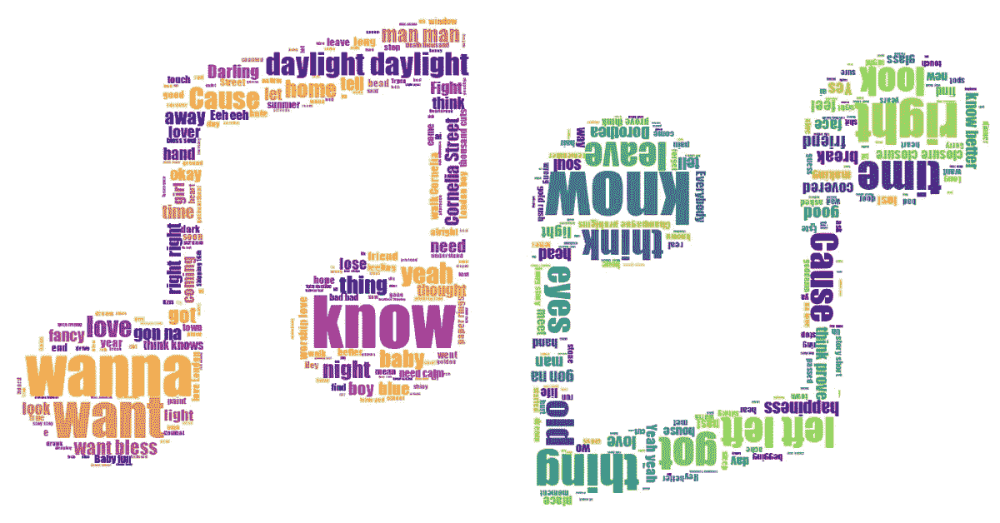

# 数据科学和流行音乐

> 原文：<https://medium.com/geekculture/data-science-pop-music-ae189bb032a5?source=collection_archive---------12----------------------->

## 利用文本挖掘确定歌曲情感

你有没有“同时感到快乐、自由、困惑和孤独？”泰勒·斯威夫特知道。(或者说她在 22 岁的时候做到了。)