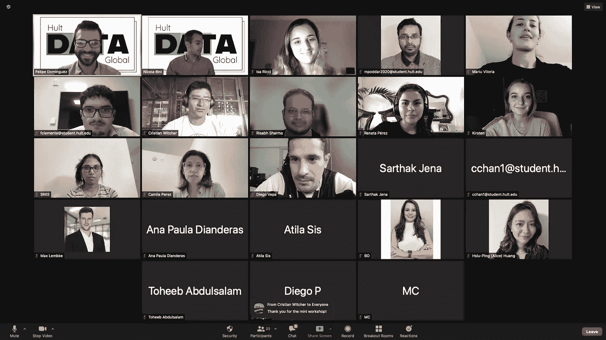
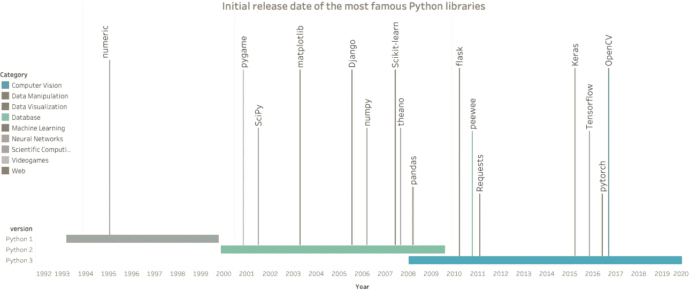

# 数据科学:Python

> 原文：<https://medium.com/geekculture/data-science-python-7856f0d6de62?source=collection_archive---------32----------------------->

10 月 4 日第 3 期

> *“计算机编程基础是一项必须学习的技能”*
> ——*斯蒂芬·霍金*——

## 在这个问题上

活动回顾|即将举办的活动| Python 的真相|时尚与 Python |技巧与诀窍

# *用 Tableau 进行数据可视化*

菲利普·多明格斯

9 月 21 日，我们将举办今年的第二场活动，聚焦数据可视化。俱乐部的 30 多名成员加入我们，开始在 Tableau 上迈出第一步。Tableau 是一款专注于商业智能的交互式数据可视化软件。我们知道一次活动不足以完全学会一种新工具，但我们希望你能看到 Tableau 的潜力！

如果你想了解 Tableau 的基础知识并提高你的技能，你可以开始观看以下视频:

*   [https://bit.ly/3D7yVSD](https://bit.ly/3D7yVSD)
*   [https://bit.ly/3kZ1Py3](https://bit.ly/3kZ1Py3)

# *大太酷工场*

菲利普·多明格斯

霍特数据全球公司很荣幸能够与[数据库](http://www.dataiku.com)一起举办今年的第三届活动。Dataiku 成立于 2013 年，从那时起，它一直是数据民主化和组织范围内协作的领导者。2019 年，通过实现 10 多亿美元的估值，开始成为独角兽公司名单的一部分。

Dataiku DSS 是一个协作数据科学软件平台，供团队更有效地探索、原型化、构建和交付他们自己的数据产品。他们的 DSS 是从数据科学家新手到人工智能和人工智能专家的完美工具。你开始霍特之旅的工具，对吧！

如果你想知道如何使用它 [**请在这里注册**](https://bit.ly/3Fbjmev) 参加我们的下一个活动，并与 [**阿迪提斯·戴利**](https://www.linkedin.com/in/ardithlaverne/) (学术项目)和 [**达连·米切尔-通塔尔**](https://www.linkedin.com/in/darienpmt/) (数据科学家)一起参加我们的研讨会

# *大蟒道*

尼古拉·比尼

让我们深入了解一下最流行的编程语言之一:Python 的历史。

Guido Van Rossum 在 1989 年圣诞节假期写了 Python 的第一行。他选择这个名字是因为他想要一些有趣和有趣的东西，而且，当时他正在阅读“[巨蟒剧团](https://www.netflix.com/title/80236357?source=35)的剧本。

在创建 Python 之前，Van Rossum 正在与 ABC 合作，这是一种优雅而强大的语言，由于其内部结构，无法轻松扩展更多功能。因此，他决定创建一个能够随时间增长和扩展的解释器。自最初发布以来，Python 一直是开源的，其不断增长的社区一直在努力改进它并添加新特性。

**但是 Python 是如何变得如此流行的呢？**

Python 最大的优势是它的简单性、可伸缩性和可读性，这最终导致了可重用性。出于这些原因，许多科技公司决定为不同的任务实施它:2008 年，Dropbox 决定采用 Python 代码库，2010 年，Instagram 的创始人选择 Django(一种 Python web 框架)来部署其 web 服务器。

一个主要的转折点是谷歌在 2007/2008 年决定选择 Python 作为其人工智能项目的编码基础。2015 年，谷歌发布 Keras 和 TensorFlow 的时候，Python 已经超越 R 成为机器学习的编程语言。

除了 Keras 之外，在过去的 20 年中，还开发了大量记录良好的有用的数据科学库，如 [Pandas](https://pandas.pydata.org/docs/user_guide/index.html) 、 [Numpy](https://numpy.org/doc/stable/user/) 、 [Scikit-Learn](https://scikit-learn.org/stable/user_guide.html) 和 [Matplotlib](https://matplotlib.org/stable/users/index.html) ，这使得 Python 成为有抱负的数据科学家的一个有吸引力的选择。

如果 Python 是您的第一门编程语言，请花点时间来欣赏一下社区在过去 30 年中所做的工作，让它变得如此简单易学。

1999 年，Pythoneer Tim Peters 在一本名为《Python 的禅》的 20 句格言集里描述了 Python 的哲学核心。其中 19 个已经写下来了，你可以通过运行命令“import this”来阅读它们。

> “漂亮总比难看好。
> 
> 显性比隐性好。
> 
> 简单比复杂好。
> 
> 特例不足以特殊到打破规则。
> 
> 错误永远不会无声无息地过去。
> 
> 除非明确沉默。
> 
> 面对暧昧，拒绝猜测的诱惑。
> 
> 应该有一种——最好只有一种——显而易见的方法来做这件事。
> 
> 尽管这种方式一开始可能并不明显，除非你是荷兰人。
> 
> 现在总比没有好。
> 
> 如果实现很难解释，这是一个坏主意。
> 
> 如果实现很容易解释，这可能是一个好主意。"

# *数据科学&时尚产业*

艾丽卡·穆莱·瓦格斯

提到数据分析时，我们常常会偏向自己，只想到科技行业。同样，人们在思考时尚产业时可能会说时装秀、草图和潮流。然而，你有没有想过那些时装秀的场景之外还有什么？这就是数据分析和 Python 的用武之地。事实上，由于多种原因，大数据对行业变得至关重要，例如通过分析趋势预测客户行为、确定目标市场或改善交叉销售。做这些实践将使公司获得更好的竞争优势。他们将更好地锁定目标受众，增加目标受众，并降低客户转向另一个品牌的忠诚度。毫不奇怪，公司会投入大量资金来整理这些数据。

# *招数&招数*

伊莎贝拉·奥尼亚特和菲利普·多明戈斯

我们知道从 Python 或任何编程语言开始并不总是那么容易。因此，我们为你设计了一个特殊的备忘单，让你更快地征服 Python。准备好成为伟大的大蟒蛇吧！

[点击这里查看！](https://flowcode.com/p/AWDZSbRMT)

# 增加你的好奇心

艾丽卡·穆莱·瓦格斯

弗洛里安·杜埃多[|](https://twitter.com/fdouetteau)[理查德·索彻](https://twitter.com/RichardSocher) | [克里斯·苏尔达克](https://twitter.com/CSurdak) | [巴斯蒂安·特龙](https://twitter.com/SebastianThrun) | [约翰·迈尔斯·怀特](https://twitter.com/johnmyleswhite)

# 跟着我们！

[insta gram](https://www.instagram.com/hultdata/)|[LinkedIn](https://www.linkedin.com/company/hult-data-global)|[网站](http://hultglobal.tk/)

*感谢您的阅读！*💚