# 数据科学系列 EP 2

> 原文：<https://medium.com/geekculture/data-science-series-ep-2-e5fa1a463654?source=collection_archive---------8----------------------->

# 第 1 章:使用 Scikit learn 进行数据预处理

> ***简介***

简而言之，预处理是指在将数据提供给算法之前，对数据进行转换。在 python 中，scikit-learn 库在 sklearn 下有一个预构建的功能。预处理。我们将探索更多预处理选项。

读完这篇文章后，你将掌握数据预处理的基本技术，并对它们有深入的了解。为了您的方便，我附上了一些深入学习机器学习算法的资源，并设计了一些练习来很好地掌握这些概念。


figure 2.1

> 重要步骤

数据预处理有 4 个主要的重要步骤。

*   在训练集和验证集中拆分数据集
*   关注缺失的值
*   注意分类特征
*   数据集的规范化

让我们看看所有这些要点。

**1。列车试运行**

训练测试分割是机器学习中的重要步骤之一。这非常重要，因为您的模型需要在部署之前进行评估。这种评估需要对看不见的数据进行，因为在部署时，所有传入的数据都是看不见的。


figure 2.2

训练测试分割背后的主要思想是将原始数据集转换成两部分

*   火车
*   试验

其中训练由训练数据和训练标签组成，测试由测试数据和测试标签组成。

最简单的方法是使用 scikit-learn，它有一个内置的函数 train_test_split。我们来编码吧。

```
from sklearn.model_selection import train_test_split

X_train, X_test, y_train, y_test = train_test_split(X, y, test_size = 0.2)
```

在这里，我们将 X 和 y 作为参数传入 train_test_split，它拆分 X 和 y，以便在 X_train、X_test、y_train 和 y_test 之间成功拆分 20%的测试数据和 80%的训练数据。

**2。处理缺失值**

你可能听说过一个著名的机器学习短语

## *垃圾进垃圾出*


figure 2.3

如果您的数据集充满了 nan 和垃圾值，那么您的模型肯定也会执行垃圾处理。因此，关注这些缺失的价值观非常重要。让我们用一个虚拟数据集来看看如何处理垃圾值的问题。你可以在这里得到数据。

让我们看看数据集中缺失的值。

```
df.isna().sum()
```

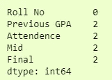

figure 1.1

在这里，我们可以看到 4 列中有 2 个缺失值。填充缺失值的一种方法是用该列的平均值填充，即该列的平均值。例如，我们可以用最后一列中所有学生的平均值来填充该列中缺少的值。

```
from sklearn.impute import SimpleImputer
imputer = SimpleImputer(fill_value=np.nan, startegy='mean')
X = imputer.fit_transform(df)
```

这将使用该列的平均值填充数据帧 df 中所有缺失的值。我们使用 fit_transform 函数来实现这一点。

因为它返回一个 numpy 数组，为了读取它，我们可以将它转换回数据帧。

```
X = pd.DataFrame(X, columns=df.columns)

print(X)
```

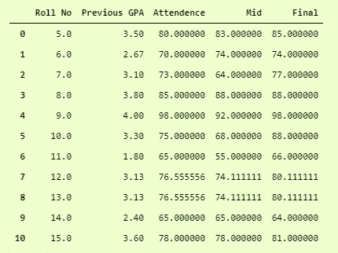

figure 1.2

现在，我们可以看到，我们已经通过所有值填充了所有缺失的值。

我们可以通过以下方式确认

```
X.isna().sum()
```

输出是

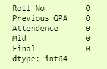

figure 1.3

我们可以使用均值、中值、众数等。在**简单估算器**中。

如果缺少值的行数较少，或者我们的数据不建议填充缺少的值，那么我们可以在 pandas 中使用 dropna 删除缺少的行。

```
dropedDf = df.dropna()
```

在这里，我们删除了数据框中的所有空行，并将它们存储在另一个数据框中。

现在我们有 0 个空行，因为我们已经删除了它们。我们可以确认为

```
dropedD.isna().sum()
```


figure 1.4

**3。关注分类特征**


figure 2.4

我们可以通过将分类特征转换成整数来处理它们。有两种常见的方法可以做到这一点。

1.  标签编码
2.  一个热编码

在**标签编码器**中，我们可以将分类值转换成数字标签。假设这是我们的数据集

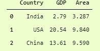

figure 1.5

在国家列上使用标签编码器将把印度转换为 1，美国转换为 2，中国转换为 0。这种技术有一个缺点，它给了美国最高的优先级，因为它的标签是高的，而中国最低的优先级，因为它的标签是 0，但它仍然有很多次帮助。

我们来编码吧。

```
from sklearn.preprocessing import LabelEncoder

l1 = LabelEncoder()

l1.fit(catDf['Country'])

catDf.Country = l1.transform(catDf.Country)

print(catDf)
```

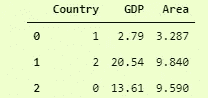

figure 1.6

这里我们实例化了一个 LabelEncoder 对象，然后使用 fit 方法将它放在我们的 categorical 列上，然后使用 transform 方法应用它。

请注意，它并没有到位，因此，为了使更改永久，我们必须将值返回到我们的分类列，即，

```
catDf['Country'] = l1.transform(catDf['Country'])
```

在 **OneHotEncoder** 中，我们为每个唯一分类值创建一个新列，该列的值为 1，如果在实际数据帧中有该值，则为 0。

让我们用同样的例子来看看，只是稍微修改了一下。我们将添加另一个分类列，即“大陆”，其中包含各个国家的大陆名称。我们可以这样做

```
catDf['Continent'] = ['Asia', 'North America', 'Asia']
```

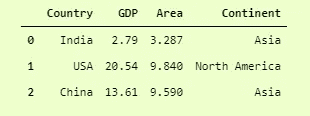

figure 1.7

现在，因为我们有两个分类列，它们是[['Country '，' continental ']]，我们可以对它们进行热编码。

有两种方法可以做到这一点。

**1。DataFrame.get_dummies**

这是一种非常常见的方法，我们使用 pandas 内置函数 get_dummies 将数据框中的分类值转换为一个独热向量。

我们开始吧。

```
pd.get_dummies(data=catDf)
```

这将**返回**一个数据帧，其中所有分类值都以独热向量格式编码。

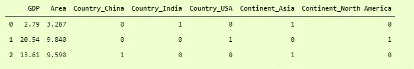

figure 1.8

在这里我们可以看到，它已经将 Country 列的唯一值转换为 3 个不同的列，即 Country_China、Country_India 和 Country_USA。类似地，continental 列的两个唯一值被转换成两个不同的列，分别命名为 Continent _ Asia 和 Continent _ North America。

因为它不在适当的位置，我们必须将它存储在数据帧中，即，

```
catDf = pd.get_dummies(data=catDf)
```

**2。onehotencode**

使用 Sci-Kit Learning 中的 OneHotEncoder 也是一种常见的做法。它确实提供了更多的灵活性和更多的选择，但是使用起来有点困难。让我们看看如何为我们的数据集做到这一点。

```
from sklearn.preprocessing import OneHotEncoder

oh = OneHotEncoder()

s1 = pd.DataFrame(oh.fit_transform(catDf.iloc[:, [0,3]]))

pd.concat([catDf, s1], axis=1)
```

这里，我们已经初始化了 OneHotEncoder 对象，并在数据框中的所需列(列号 0 和列号 3)上使用了它的 fit_transform 方法。

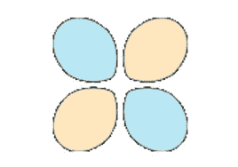

figure 2.5

fit_transform 的返回类型是 numpy.ndarray，所以我们通过 pd 将其转换成一个数据帧。数据帧并将其存储在一个变量中。然后，要将它连接到原始数据帧中，我们可以使用 pd.concat 函数连接两个不同的数据帧。我们使用了 axis=1，这意味着它必须在列而不是行的基础上进行连接。

另外，请记住 pd.concat 并不存在，所以我们必须将返回的数据帧存储在某个地方。

```
catDf = pd.concat([catDf, s1], axis=1)
```

生成的数据帧为

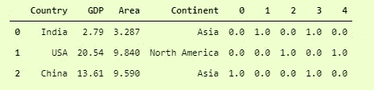

figure 1.9

您可以看到，与 pd.get_dummies 相比，它的可读性不是很好，但是如果您比较我们使用 pd.get_dummies 和 OneHotEncoder 得到的最后 5 列，那么它们都是相等的。

**4。标准化数据集**

这将我们带到数据预处理的最后一部分，即数据集的规范化。某些实验证明，机器学习和深度学习模型在标准化数据集上的表现比未标准化的数据集好得多。

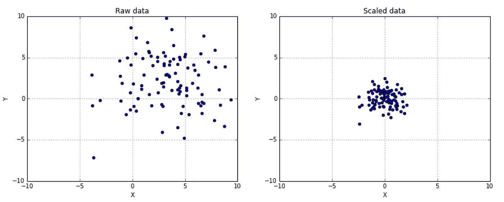

figure 2.6

规范化的目标是将值更改为一个通用范围，而不扭曲值范围之间的差异。

有几种方法可以做到这一点。我将讨论两种规范化数据集的常用方法。

**标准定标器**

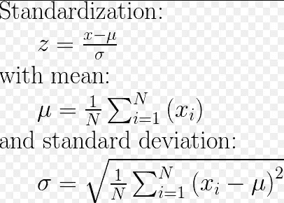

figure 1.10

使用这种技术，我们将在数据集中得到平均值 0 和标准差 1。我们可以通过在 numpy 中组合不同的函数来正常地完成它，即，

```
z = (x.values - np.mean(x.values)) / np.std(x.values)
```

其中 x 是具有所有数字索引的数据帧。如果我们想保留数据框中的值，那么我们可以简单地删除。它前面的值。

**标准定标器前的方差**

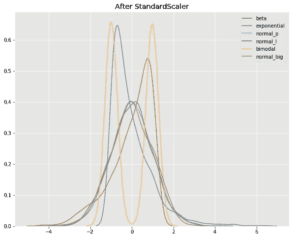

figure 2.7

```
catDf.var(ddof=0)
```

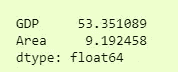

figure 1.11

在这里，我使用了 ddof=0，在熊猫中默认为 1。DataFrame.var()和 numpy.ndarray.var()中的缺省值 0。Ddof 表示自由度增量，即计算中使用的除数 N-ddof，其中 N 表示元素数量。

ddof=0 提供正态分布变量方差的最大似然估计。

**标准缩放器后的方差**

另一个好方法是使用 sklearn 的**标准缩放器**。预处理。先看代码，再看方差。

```
from sklearn.preprocessing import StandardScaler

ss = StandardScaler()

catDf.iloc[:,1:-1] = ss.fit_transform(catDf.iloc[:,1:-1])

print(catDf)
```

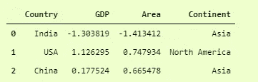

figure 1.12

在这里，我们对所有数字列(第 1 列到最后一列(不包括))应用了 StandardScaler，现在您可以看到 GDP 和 Area 的值。

现在，我们可以通过以下方式检查数据集的方差

```
catDf.var(ddof=0)
```

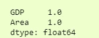

figure 1.13

我们可以看到方差从 80 和 13 大幅减少到 1。在真实世界的数据集中，通常改进是从数千到 1。

**正常化**

根据 sklearn 的官方[文档](https://scikit-learn.org/stable/modules/preprocessing.html#normalization)，归一化是“将单个样本**缩放到具有单位规范的过程。**如果您计划使用点积等二次形式或任何其他内核来量化任何样本对的相似性，此过程可能会很有用。”


figure 2.8

使用它的过程非常简单，类似于 StandaradScaler。

```
from sklearn.preprocessing import Normalizer

norm = Normalizer()

catDf.iloc[:,1:-1] = norm.fit_transform(catDf.iloc[:,1:-1])

catDf
```

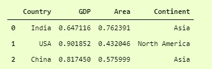

figure 1.14

还有其他几种方法来规范化数据，并且所有这些方法在特定情况下都很有用。你可以在官方文件[这里](https://scikit-learn.org/stable/modules/preprocessing.html#normalization)读到更多关于他们的内容。

**学习成果**

*   分割数据集
*   填充缺失值
*   处理分类数据
*   对数据集进行规范化以改善结果

> ***结论***

数据预处理还有很多，我讨论了一些常用的方法。你可以在 [***文档***](https://scikit-learn.org/stable/modules/preprocessing.html) 中了解更多。

*希望所有这些技术将提高你作为数据科学家或机器学习工程师的一般技能，并将改进你的机器学习模型。*

> ***领英:***

[](https://www.linkedin.com/in/rushi-chudasama-63473819a/) [## 印度古吉拉特邦巴鲁奇史茹楚达萨马-钱杜拜 s .帕特尔理工学院

### 我是一名在 Charotar 科技学院攻读信息技术学士学位第四年的学生。我…

www.linkedin.com](https://www.linkedin.com/in/rushi-chudasama-63473819a/) 

> ***更多项目和博客:***

***项目:***

[](https://github.com/Rushi-45) [## 史茹-45 -概述

### 阻止或报告从 AadityaKhetan/Autograder 分叉-前端一个网络应用程序，以帮助进行实验室会议…

github.com](https://github.com/Rushi-45) 

**博客:**

[](/@rushi-positive) [## 史茹中号

### 网络技术是各种各样的工具和技术，它们被用在…

medium.com](/@rushi-positive) 

> ***最后备注:***

**感谢阅读！如果你喜欢这篇文章，请点击**👏**尽可能多的按按钮。这将意味着很多，并鼓励我继续分享我的知识。如果你喜欢我的内容，请在 medium 上关注我，我会尽可能多地发布博客。**

X_train，X_test，y_train，y_test = train_test_split(X，y，test_size = 0.2)